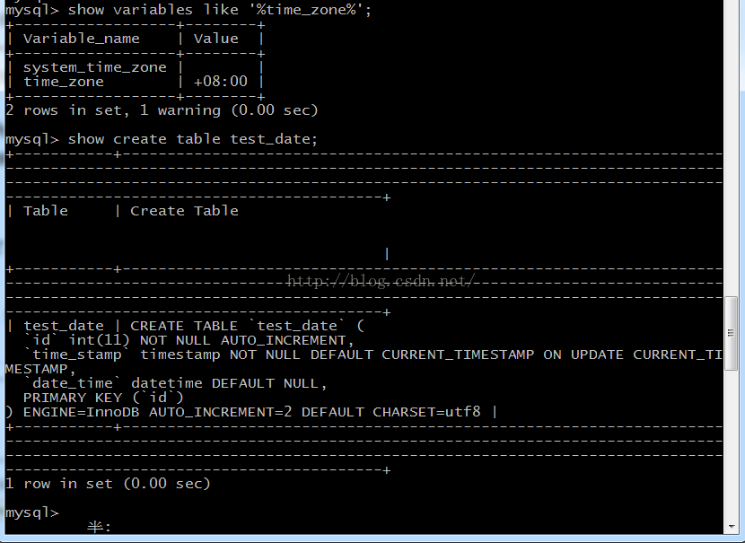
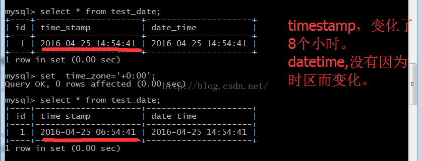

# mysql datetime与timestamp区别

**datetime：** 

**1、保存格式为YYYYMMDDHHMMSS（年月日时分秒）的整数，所以，它与时区无关，存入的是什么值就是什么值，不会根据当前时区进行转换。**

**2、从mysql 5.6.4中，可以存储[小数片段](https://dev.mysql.com/doc/refman/5.7/en/fractional-seconds.html)，最多到小数点后6位，显示时格式为 yyyy-MM-dd HH:mm:ss[.222222]**

   **mysql5.5中，没有小数片段，精确到秒。所以，我再从5.6版本迁移到5.5时，因生成的sql中datetime(6)有小数片段,无法导入。**

**3、存储范围：从1000-01-01 00:00:00 到'9999-12-31 23:59:59'**

**4、长度，8个字节，datetime(n),****n不是存储长度，而是显示的小数位数，即使小数位数是0，存储是也是存储的6位小数，仅仅显示0位而已;要想显示小数，设置datetime(n),n=3显示小数点后3位，毫秒,n=6显示小数点后6位，微秒。**

**timestamp：**

**1、存入的是自1970-01-01午夜(格林尼治标准时间)以来的秒数，它和unix时间戳相同。所以它与时区有关，查询时转为相应的时区时间。比如，存储的是1970-01-01 00:00:00，客户端是北京，那么就加8个时区的小时1970-01-01 08:00:00。**

**2、有[小数片段](https://dev.mysql.com/doc/refman/5.7/en/fractional-seconds.html)，至少从5.5就开始有**

**3、存储范围：`'1970-01-01 00:00:01'` UTC to `'2038-01-19 03:14:07'`** 

**4、可以当做时间戳使用，在更新时，自动更新，这一列只能由系统自动更新，不能由sql更新，这个在乐观锁时有广泛的应用**

**6、长度，4字节，因为存储长度的原因，决定了它支持的范围的比datetime的要小**

**7、显示时，显示日期和时间**

### datetime和timestamp都可以当作时间戳使用

datetime和[timestamp](https://so.csdn.net/so/search?q=timestamp&spm=1001.2101.3001.7020)都可以设置默认值，并且在其他列值更新时更新为当前时间，DEFAULT CURRENT_TIMESTAMP和ON UPDATE CURRENT_TIMESTAMP，这俩子句可以一起使用，顺序无所谓，一起使用的意思是，默认值是当前时间并且在其他列更新值时，此列更新为当前时间。

ALTER TABLE `mytest`.`date_time_test` 
 CHANGE COLUMN `col2` `col2` TIMESTAMP NULL DEFAULT CURRENT_TIMESTAMP ON UPDATE CURRENT_TIMESTAMP ;

**date**

**date，\**时分秒都存储了，但只显示日期\**。对应Java中的java.sql.Date**

**datetime与时区无关、timestamp与时区有关**

**1、查看当前时区，并创建表test_date,一个是timestamp列，一个是datetime列**

****

**2、插入两条数据，相同的时间。修改时区为0时区（格林尼治时区）后，查看时间，发现timestamp改变了，datetime没变。**

****

**总结**

datetime、timestamp精确度都是秒，datetime与时区无关，存储的范围广(1001-9999)，timestamp与时区有关，存储的范围小(1970-2038)。

[MySQL :: MySQL 5.7 Reference Manual :: 11.2.2 The DATE, DATETIME, and TIMESTAMP Types](https://dev.mysql.com/doc/refman/5.7/en/fractional-seconds.html)