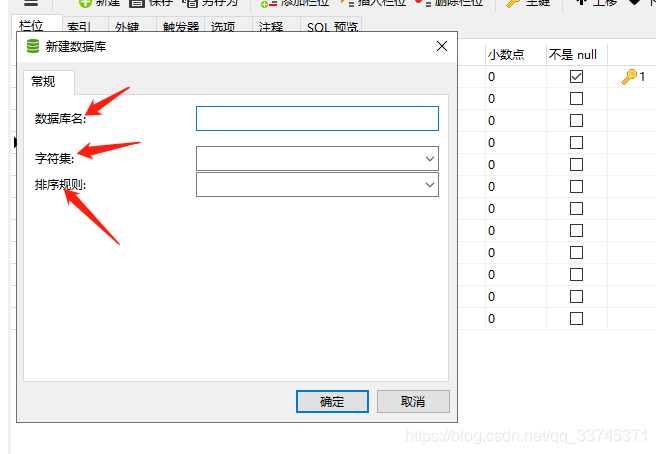
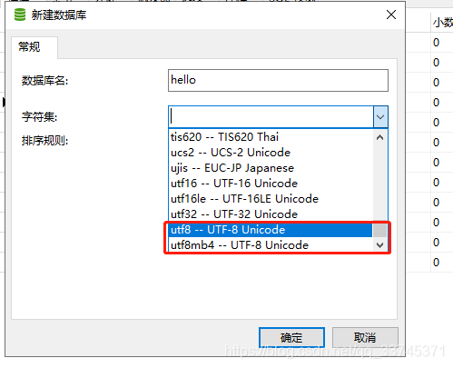
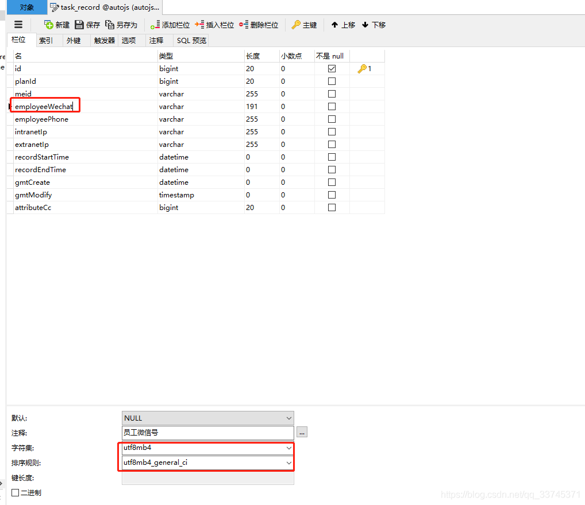

# mysql字符集和排序规则总结

一般我是使用navicat来建库建表的。
**1.给数据库取名
2.选择字符集
3.选择排序规则**

## 字符集

**字符集一般使用utf8或者utf8mb4**

**区别：
utf8是3个字节
utf8mb4是4个字节，是utf8的扩展，如果你要存储表情，记得选择utf8mb4
在一般情况下，我都是选择utf8建库，个别字段需要存储表情再更改字段的字符集即可，这样可以节约空间。**
**讲点题外的，varchar类型的长度，表示的是字符长度，不是字节。我这里字符集是utf8mb4，设置的长度是191，其他varchar的字符集是utf8，设置的长度是255。这就是因为在mysql老版本新建索引时遇到过一个错误**
**Specified key was too long; max key length is 767 bytes**
767/3=255.67-------------------767/4=191.75
所以我varchar的utf8设置为255，utf8mb4设置为191。

## 排序规则

**排序规则一般选择utf8_general_ci，
如果刚刚字符集选择了utf8mb4，选utf8mb4_general_ci**
utf8_general_ci:不区分大小写
utf8_bin:区分大小写

一般主要分两种：utf_bin和utf_general_ci

bin 是二进制, a 和 A 会别区别对待.

general_ci 是不区分不区分大小写，注册用户名和邮箱的时候就要使用。

utf8_general_cs 区分大小写

utf8_unicode_ci和utf8_general_ci对中、英文来说没有实质的差别。

utf8_general_ci校对速度快，但准确度稍差。(准确度够用，一般建库选择这个)

utf8_unicode_ci准确度高，但校对速度稍慢

所以一般排序规则选择是： utf_general_ci

## 总结

if(一般情况下 && **没有表情**)｛
字符集：utf8；
排序规则：utf8_general_ci；
｝else if(一般情况下 && **有表情**){
字符集：utf8mb4；
排序规则：utf8mb4_general_ci；
}