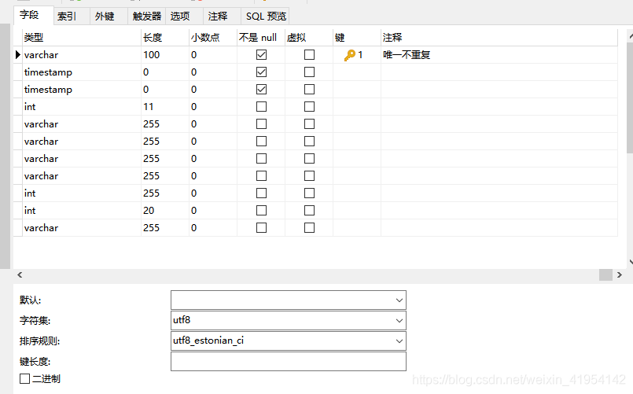
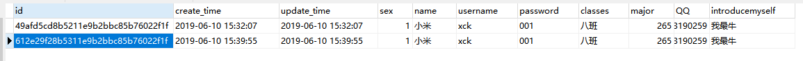
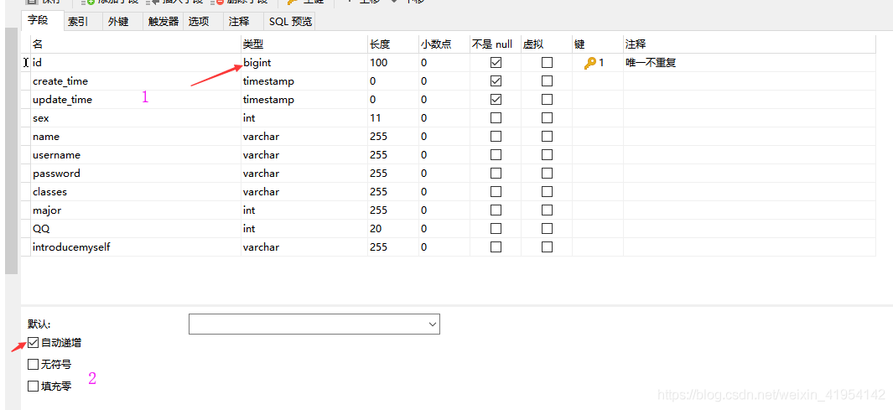

# 建表相关

## 删除表

```
DROP TABLE IF EXISTS tablename;
```

## 时间

### Mysql自动更新当前时间

第一种：建表

```
CREATE TABLE `deviceModifyItem` (
`id` int(11) NOT NULL,
`number` int(11) NULL,
`name` varchar(11) NULL,
`updateTime` timestamp NULL  ON UPDATE CURRENT_TIMESTAMP COMMENT '更新时自动更新时间',
`createTime` TIMESTAMP NOT NULL DEFAULT CURRENT_TIMESTAMP COMMENT '插入时间'
);
```

第二种：利用`now()`函数

第三种：语法

### MySql自动插入当前时间

[MySql自动插入当前时间](https://blog.csdn.net/wangxy799/article/details/50593005)

方法很多，先来三种：

 第一种：创建表的时候将字符设置成默认当前时间


```sql
DROP TABLE IF EXISTS WAYBILL;

CREATE TABLE WAYBILL (
`ID`  int(10) NOT NULL AUTO_INCREMENT ,
`createTime` TIMESTAMP NOT NULL DEFAULT CURRENT_TIMESTAMP COMMENT '数据插入时间' ,
PRIMARY KEY (`ID`)
)
DEFAULT CHARACTER SET=utf8 COLLATE=utf8_general_ci

;
```

第二种：插入时

```sql

insert into WAYBILL (ID ,createTime) values(1,NOW() ) ;
```

第三种：语法生成

## 主键ID 自增、唯一不规则

1、利用[uuid](https://so.csdn.net/so/search?q=uuid&spm=1001.2101.3001.7020)函数生成唯一且不规则的主键id

**sql：**

```sql
CREATE TABLE `test` (
  `id` varchar(100) COLLATE utf8_estonian_ci NOT NULL COMMENT '唯一不重复',
  `create_time` timestamp NOT NULL DEFAULT CURRENT_TIMESTAMP,
  `update_time` timestamp NOT NULL DEFAULT CURRENT_TIMESTAMP ON UPDATE CURRENT_TIMESTAMP,
  `sex` int(11) DEFAULT NULL,
  `name` varchar(255) COLLATE utf8_estonian_ci DEFAULT NULL,
  `username` varchar(255) COLLATE utf8_estonian_ci DEFAULT NULL,
  `password` varchar(255) COLLATE utf8_estonian_ci DEFAULT NULL,
  `classes` varchar(255) COLLATE utf8_estonian_ci DEFAULT NULL,
  `major` int(255) DEFAULT NULL,
  `QQ` int(20) DEFAULT NULL,
  `introducemyself` varchar(255) COLLATE utf8_estonian_ci DEFAULT NULL,
  PRIMARY KEY (`id`)
) ENGINE=InnoDB DEFAULT CHARSET=utf8 COLLATE=utf8_estonian_ci ROW_FORMAT=DYNAMIC;
```

 **表:**



插入语句：

 

```sql
INSERT INTO test(id,sex,name,username,password,classes,major,QQ,introducemyself) VALUE(replace(uuid(), '-', ''),1,"小米","xck","001","八班",265,953190259,"我最牛");
```

执行了俩次，生成了俩个不同id：



2、id实现自动增长

将类型改为整型，下方选择自动增长



 **看DDL：**

```sql
CREATE TABLE `test` (
  `id` bigint(100) NOT NULL AUTO_INCREMENT COMMENT '唯一不重复',
  `create_time` timestamp NOT NULL DEFAULT CURRENT_TIMESTAMP,
  `update_time` timestamp NOT NULL DEFAULT CURRENT_TIMESTAMP ON UPDATE     	       CURRENT_TIMESTAMP,
 `sex` int(11) DEFAULT NULL,
  `name` varchar(255) COLLATE utf8_estonian_ci DEFAULT NULL,
  `username` varchar(255) COLLATE utf8_estonian_ci DEFAULT NULL,
  `password` varchar(255) COLLATE utf8_estonian_ci DEFAULT NULL,
  `classes` varchar(255) COLLATE utf8_estonian_ci DEFAULT NULL,
  `major` int(255) DEFAULT NULL,
  `QQ` int(20) DEFAULT NULL,
  `introducemyself` varchar(255) COLLATE utf8_estonian_ci DEFAULT NULL,
  PRIMARY KEY (`id`)

) ENGINE=InnoDB DEFAULT CHARSET=utf8 COLLATE=utf8_estonian_ci ROW_FORMAT=DYNAMIC;
```

 

插入一条数据，sql：

```sql
INSERT INTO test(sex,name,username,password,classes,major,QQ,introducemyself) VALUE(1,"小米","xck","001","八班",265,953190259,"我最牛");
```

对应数据库变化：


 

 