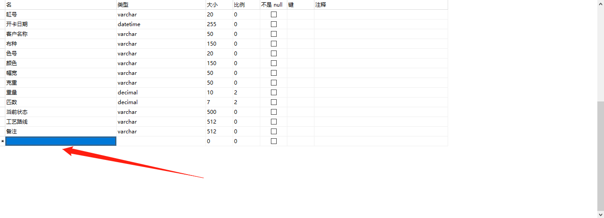
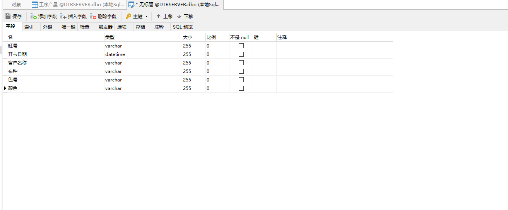

# Navicat

[用户指南](http://www.navicat.com.cn/manual/online_manual/cn/navicat/win_manual/#/cover)

## Navicat导入导出表

 

## Navicat快捷键

[官方文档](http://www.navicat.com.cn/manual/online_manual/cn/navicat/win_manual/#/hot_keys)

### 设计表，插入字段

#### 向下插入：

**方法一：**

选中最后一行，按ESC，让选中的地方变成蓝色，然后再按 ↓

**方法二：**

选中最后一行，按如下三个键：INSERT ↓ ↓

#### 向上插入：INSERT