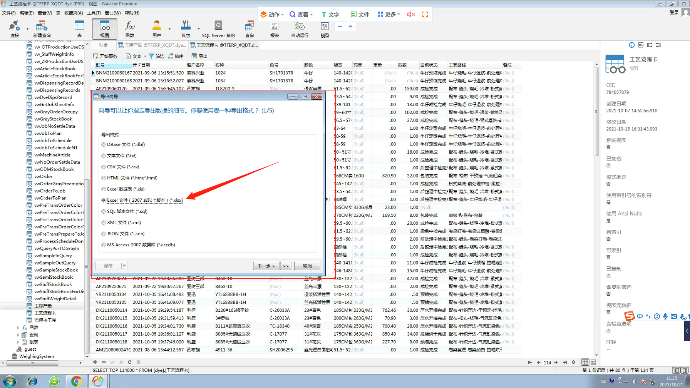

## Navicat导入导出sql server数据表或视图方法

## xls文件的方式

选用xls这种格式是因为，其他的格式，会有各种各样的问题，如：

- 时间格式不对
- 列名，最后一项乱码
- 列名，不全

但是，采用这种方式导入的时候，会丢失表格式，所以要新建表

### 建表相关

如何查看视图的字段格式：

需要在sql server manage studio那里，点击视图左边的加号，查看字段类型，然后一个字段一个字段新建。

### 导出相关

xls有两个，选下面这个

- 生成的小
- 不很多个sheet

勾选上面两个

### 导入相关

导入之前xls，不要打开

