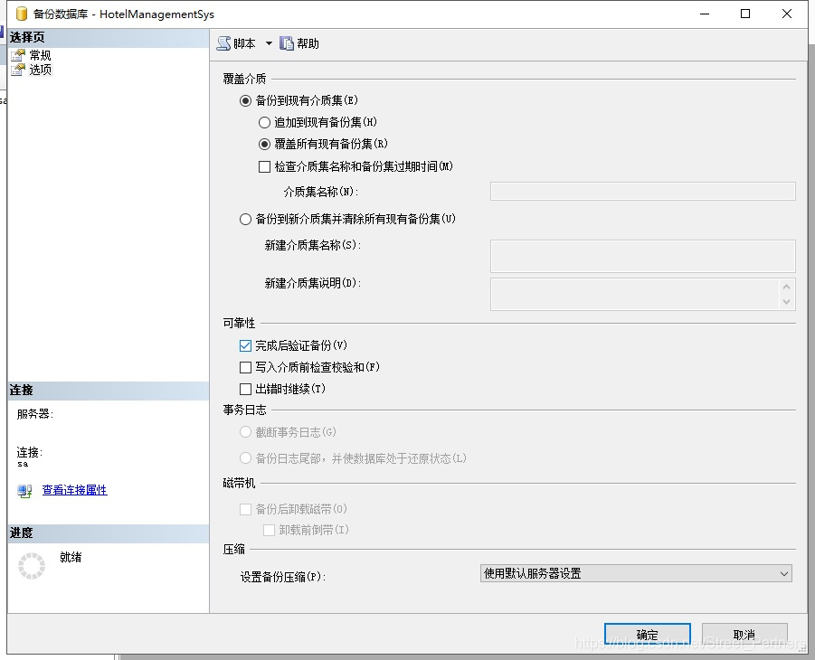

# SQL Server 2008数据库备份与恢复

原文链接：

[数据库备份和恢复](https://blog.csdn.net/Street_Partners/article/details/86666238)

## 一、数据库备份（完整备份与差异备份）

1. 在备份数据库之前，应先创建一个备份设备。备份设备就是用来存储数据库、事务日志或者文件和文件组备份的存储介质。

展开【服务器对象】，右击【备份设备】，在弹出的快捷菜单中选择【新建备份设备】命令。


在打开的窗口中指定备份设备的名称以及保存的文件路径。


点击确定按钮完成创建永久备份设备。

2. 数据库完整备份。下面我们可以备份数据库了，有两种方式，图形向导和sql语句。首先我用图形向导的方式对HotelManagementSys数据库创建完整备份

备份到前面创建的永久备份设备“酒店数据库备份设备”上。

右击HotelManagementSys数据库，选择【任务】——》【备份】


在【目标】区域通过单击【删除】按钮删除已存在的目标。然后单击【添加】按钮打开【选择备份目标】对话框，选中【备份设备】单选按钮后从下拉菜单中选择备份“酒店数据库备份设备”


设置好以后，单击【确定】按钮返回【备份数据库】对话框。打开【选项】页面，选中【覆盖所有现有备份集】单选按钮和【完成后验证备份】复选框。（“覆盖所有现有备份集”用来初始化新的设备或者覆盖现在的设备，“完成后验证备份”用来核对实际数据库与备份副本，并确保在备份完成之后的一致性。）



设置完成后单击确定开始备份，完成备份后将弹出备份完成提示信息框。


展开【服务器对象】中的【备份设备】。右击备份设备“酒店数据库备份设备”，在弹出的快捷菜单中选择【属性】命令，打开【备份设备】对话框。打开【介质内容】页面可以看到刚刚创建的数据库的完整备份。


二、使用BACKUP语句备份数据库。

使用BACKUP语句创建一个HotelManagementSys数据库的完整备份，语句如下：

```
BACKUP DATABAST HotelManagementSys
TO 酒店数据库备份设备
WITH INIT,
NAME='酒店数据库完整备份'
```

执行差异备份当数据量十分庞大时，执行一次完整备份会耗费非常多的时间和空间，因此完整备份不能频繁进行，创建了数据库的完整备份以后，如果数据库从上次备份以来只修改了很少的数据时，比较适合使用差异备份。
差异备份与完整备份使用相同的界面，唯一不同的是需要选择【备份类型】为“差异”，并指定一个差异备份的名称。


创建差异备份与创建完整备份的语法基本相同，只是多了一个WITH DIFFERENTIAL子句，用来指明本次备份是差异备份。

```
BACKUP DATABAST HotelManagementSys
TO 酒店数据库备份设备
WITH NOINIT,
DIFFERENTIAL,
NAME='HotelManagementSys 差异备份'
```

## 二、恢复数据库

1.配置恢复模式

系统数据库的恢复模式不能修改，但是，允许根据实际需求自定义用户数据库的恢复模式。

右击HotelManagementSys数据库，选择【属性】，打开【数据库属性】对话框。打开【选项】界面，从恢复模式下拉列表中选择合适的恢复模式。


点确定，完成恢复模式的配置。

2.使用图形化向导恢复数据库，右击HotelManagementSys数据库，选择【任务】——》【还原】——》【数据库】打开【还原数据库】对话框。


在【还原数据库】对话框中选中【源设备】单选按钮，打开【指定备份】对话框。在备份介质下拉列表中选择【备份设备】选项，然后单击添加按钮选择之前创建的“酒店数据库备份设备”备份设备。


单击确定，完成对数据库的还原操作。还原完成后会弹出还原成功的消息对话框。


3.使用RESTORE语句恢复数据库
（1）还原完整数据库备份，但不恢复数据库，语句如下：

```
RESTORE DATABASE HotelManagementSys
FROM 酒店数据库备份设备
WITH FILE=1, NORECOVERY
```

（2）还原差异备份，并且恢复数据库。语句如下：

```
RESTORE DATABASE HotelManagementSys
FROM 酒店数据库备份设备
WITH FILE=2, RECOVERY
```

