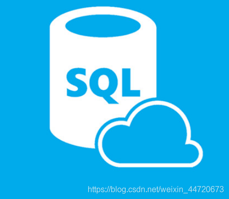

# 主键自增

参考链接：

[sql server的元素类型int identity(1,1)是什么意思？](https://blog.csdn.net/weixin_44720673/article/details/88685921)

​                                            

该列自动增长，由1开始每次增加是1。
 **标识列， identity(a,b)，ab均为正整数，a表示开始数，b表示增幅。**

**PS：之前的行删除之后，依然会在原有的上面新增，比如，插入了两行之后，又把这两行数据删除了，再插入行的时候，序号是3，不是从1开始**

 
 扩展资料：
 结构化查询语言(Structured Query Language)简称SQL(发音：/ˈes kjuː ˈel/ “S-Q-L”)，是一种特殊目的的编程语言，是一种数据库查询和程序设计语言，用于存取数据以及查询、更新和管理[关系数据库](https://so.csdn.net/so/search?q=关系数据库&spm=1001.2101.3001.7020)系统；同时也是数据库脚本文件的扩展名。

结构化查询语言是高级的非过程化编程语言，允许用户在高层数据结构上工作。它不要求用户指定对数据的存放方法，也不需要用户了解具体的数据存放方式，所以具有完全不同底层结构的不同数据库系统, 可以使用相同的结构化查询语言作为数据输入与管理的接口。结构化查询语言语句可以嵌套，这使它具有极大的灵活性和强大的功能。

**比如创建表语句是：**
 **create table table1(id int identity(1,1),t varchar(500))**
 表的第一列是id，它是int型的，并且是自增的，也就是你向表中插入数据的时候，不用给id列赋值，id列会自己复制。

**比如：**
 insert into Table1(t)
 values(‘ok’)
 尽管没有给id列赋值，但执行以后id列会根据原来的插入情况自己填充一个值。下一次再插入数据，id列的值会在这次插入的基础上递增或递减。
 括号（起始值，增量)