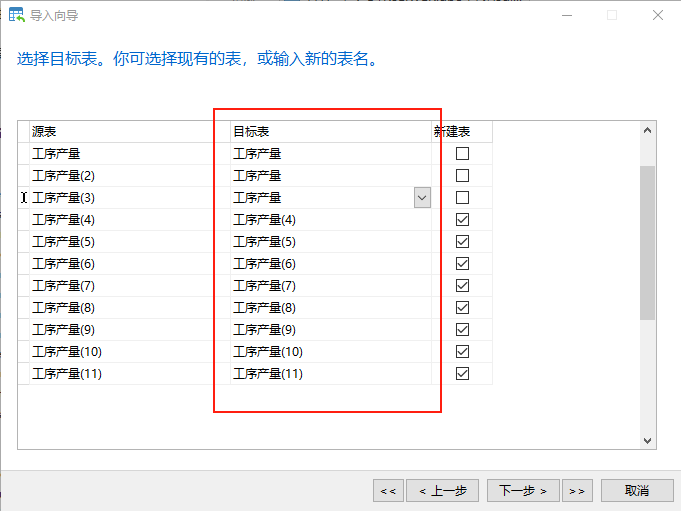
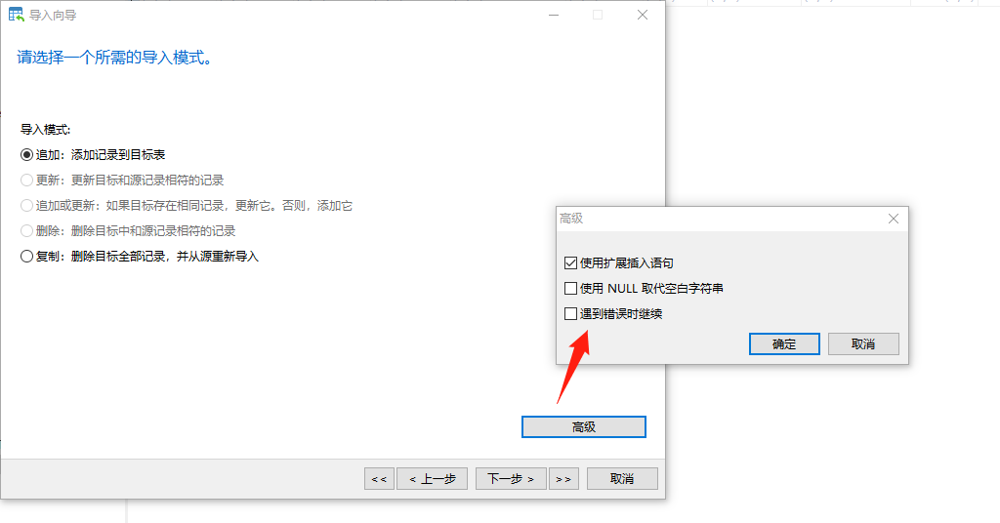

# 导出导入

## 方法一：Navicat导出导入的时候，选择xls数据表（PS：有两个，另外一个xls文件，应该也可以），然后时间没有问题，这样导入的数据是没有格式的

## 方法二： 导出的时候，选择xls格式》包含列的标题》开始

## navicat新建数据表，将表结构填写上去

## 导入 导入xls，一直下一步到最后开始

目标表，要全部修改成新建的表，新建表，全部取消勾选

## PS：sql server视图的数据结构怎么看：要用sql server management studio，视图名，点左边的加号

