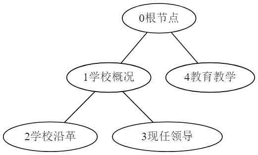
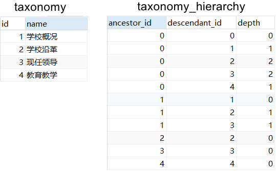
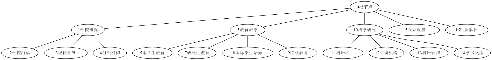

# 使用闭包表的设计在关系型数据库中存储和查询树形结构

参考:

[使用闭包表的设计在关系型数据库中存储和查询树形结构](https://zhoujin7.com/closure-table/)

## 闭包表的存储

之前看了《SQL反模式》，里面介绍了一种在数据库中存储树的比较好的设计模式：闭包表。
实现闭包表需用到两张数据表，一张用来存储树的结点，一张用来存储结点间的关联。
以下面的树形结构为例，数据表taxonomy存储了树的结点，数据表taxonomy_hierarchy存储了结点间的关联。这里0号结点是根结点，没有在数据表taxonomy中体现。
[](https://zhoujin7.com/content/images/2018/08/tree-1.png)
[](https://zhoujin7.com/content/images/2018/08/table-1.png)
由上图可以很直观的感受到，闭包表比较占空间。
数据表taxonomy有两个字段，一个id，一个name。
数据表taxonomy_hierarchy有三个字段ancestor_id、descendant_id和depth。
ancestor_id和descendant_id记录了一对父子关系，depth记录了父和子的距离。
这里的父子关系，不仅仅是父结点到他直接后继结点的关联，还包括父结点到他所有子孙结点的关联，以及到自身的关联。
比如0-1-2构成了一棵树，0是根结点，1是0的直接后继结点，2是1的直接后继结点，那么结点间的关联就有{(0,0),(0,1),(0,2),(1,1),(1,2),(2,2)}，实际上就是集合{0,1,2}上的二元关系。

### 借用数学概念阐述闭包表

闭包表到底是什么？借用离散数学中的概念来讲，就是两个集合，集合A记录了结点元素，集合B记录了集合A上的某个二元关系，即B属于A和A自身做笛卡尔集的子集。
而集合B中包含了集合A上的恒等关系，集合B是集合B的某些子集的自反闭包。
假设集合A为{0,1,2}，集合B为{(0,0),(0,1),(0,2),(1,1),(1,2),(2,2)}，集合B的子集C为{(0,1),(0,2),(1,2)}，集合A上的恒等关系I为{(0,0},(1,1),(2,2)}，集合C的自反闭包就是集合C并上恒等关系I，即集合B是集合C的自反闭包。
我也不知道为什么这种设计叫做闭包表，我这样算是强行扯上关系吧。

## 闭包表的增删改查

以下面这颗树为例
[](https://zhoujin7.com/content/images/2018/08/tree-2.png)

### SQL文件 (实验环境为MySQL)

**taxonomy.sql**

```sql
DROP TABLE IF EXISTS taxonomy;
CREATE TABLE taxonomy
(
    id int(11) PRIMARY KEY NOT NULL COMMENT '主键id' AUTO_INCREMENT,
    name varchar(255) NOT NULL COMMENT '名称'
);
INSERT INTO test.taxonomy (id, name) VALUES (1, '学校概况');
INSERT INTO test.taxonomy (id, name) VALUES (2, '学校沿革');
INSERT INTO test.taxonomy (id, name) VALUES (3, '现任领导');
INSERT INTO test.taxonomy (id, name) VALUES (4, '组织机构');
INSERT INTO test.taxonomy (id, name) VALUES (5, '教育教学');
INSERT INTO test.taxonomy (id, name) VALUES (6, '本科生教育');
INSERT INTO test.taxonomy (id, name) VALUES (7, '研究生教育');
INSERT INTO test.taxonomy (id, name) VALUES (8, '国际学生培养');
INSERT INTO test.taxonomy (id, name) VALUES (9, '继续教育');
INSERT INTO test.taxonomy (id, name) VALUES (10, '科学研究');
INSERT INTO test.taxonomy (id, name) VALUES (11, '科研项目');
INSERT INTO test.taxonomy (id, name) VALUES (12, '科研机构');
INSERT INTO test.taxonomy (id, name) VALUES (13, '科研合作');
INSERT INTO test.taxonomy (id, name) VALUES (14, '学术交流');
INSERT INTO test.taxonomy (id, name) VALUES (15, '院系设置');
INSERT INTO test.taxonomy (id, name) VALUES (16, '师资队伍');
12345678910111213141516171819202122
```

**taxonomy_hierarchy.sql**

```sql
DROP TABLE IF EXISTS taxonomy_hierarchy;
CREATE TABLE taxonomy_hierarchy
(
    ancestor_id int(11) NOT NULL COMMENT '父结点',
    descendant_id int(11) NOT NULL COMMENT '子结点',
    depth int(11) NOT NULL COMMENT '深度',
    CONSTRAINT `PRIMARY` PRIMARY KEY (ancestor_id, descendant_id)
);
INSERT INTO taxonomy_hierarchy (ancestor_id, descendant_id, depth) VALUES (0, 0, 0);
INSERT INTO taxonomy_hierarchy (ancestor_id, descendant_id, depth) VALUES (0, 1, 1);
INSERT INTO taxonomy_hierarchy (ancestor_id, descendant_id, depth) VALUES (0, 2, 2);
INSERT INTO taxonomy_hierarchy (ancestor_id, descendant_id, depth) VALUES (0, 3, 2);
INSERT INTO taxonomy_hierarchy (ancestor_id, descendant_id, depth) VALUES (0, 4, 2);
INSERT INTO taxonomy_hierarchy (ancestor_id, descendant_id, depth) VALUES (0, 5, 1);
INSERT INTO taxonomy_hierarchy (ancestor_id, descendant_id, depth) VALUES (0, 6, 2);
INSERT INTO taxonomy_hierarchy (ancestor_id, descendant_id, depth) VALUES (0, 7, 2);
INSERT INTO taxonomy_hierarchy (ancestor_id, descendant_id, depth) VALUES (0, 8, 2);
INSERT INTO taxonomy_hierarchy (ancestor_id, descendant_id, depth) VALUES (0, 9, 2);
INSERT INTO taxonomy_hierarchy (ancestor_id, descendant_id, depth) VALUES (0, 10, 1);
INSERT INTO taxonomy_hierarchy (ancestor_id, descendant_id, depth) VALUES (0, 11, 2);
INSERT INTO taxonomy_hierarchy (ancestor_id, descendant_id, depth) VALUES (0, 12, 2);
INSERT INTO taxonomy_hierarchy (ancestor_id, descendant_id, depth) VALUES (0, 13, 2);
INSERT INTO taxonomy_hierarchy (ancestor_id, descendant_id, depth) VALUES (0, 14, 2);
INSERT INTO taxonomy_hierarchy (ancestor_id, descendant_id, depth) VALUES (0, 15, 1);
INSERT INTO taxonomy_hierarchy (ancestor_id, descendant_id, depth) VALUES (0, 16, 1);
INSERT INTO taxonomy_hierarchy (ancestor_id, descendant_id, depth) VALUES (1, 1, 0);
INSERT INTO taxonomy_hierarchy (ancestor_id, descendant_id, depth) VALUES (1, 2, 1);
INSERT INTO taxonomy_hierarchy (ancestor_id, descendant_id, depth) VALUES (1, 3, 1);
INSERT INTO taxonomy_hierarchy (ancestor_id, descendant_id, depth) VALUES (1, 4, 1);
INSERT INTO taxonomy_hierarchy (ancestor_id, descendant_id, depth) VALUES (2, 2, 0);
INSERT INTO taxonomy_hierarchy (ancestor_id, descendant_id, depth) VALUES (3, 3, 0);
INSERT INTO taxonomy_hierarchy (ancestor_id, descendant_id, depth) VALUES (4, 4, 0);
INSERT INTO taxonomy_hierarchy (ancestor_id, descendant_id, depth) VALUES (5, 5, 0);
INSERT INTO taxonomy_hierarchy (ancestor_id, descendant_id, depth) VALUES (5, 6, 1);
INSERT INTO taxonomy_hierarchy (ancestor_id, descendant_id, depth) VALUES (5, 7, 1);
INSERT INTO taxonomy_hierarchy (ancestor_id, descendant_id, depth) VALUES (5, 8, 1);
INSERT INTO taxonomy_hierarchy (ancestor_id, descendant_id, depth) VALUES (5, 9, 1);
INSERT INTO taxonomy_hierarchy (ancestor_id, descendant_id, depth) VALUES (6, 6, 0);
INSERT INTO taxonomy_hierarchy (ancestor_id, descendant_id, depth) VALUES (7, 7, 0);
INSERT INTO taxonomy_hierarchy (ancestor_id, descendant_id, depth) VALUES (8, 8, 0);
INSERT INTO taxonomy_hierarchy (ancestor_id, descendant_id, depth) VALUES (9, 9, 0);
INSERT INTO taxonomy_hierarchy (ancestor_id, descendant_id, depth) VALUES (10, 10, 0);
INSERT INTO taxonomy_hierarchy (ancestor_id, descendant_id, depth) VALUES (10, 11, 1);
INSERT INTO taxonomy_hierarchy (ancestor_id, descendant_id, depth) VALUES (10, 12, 1);
INSERT INTO taxonomy_hierarchy (ancestor_id, descendant_id, depth) VALUES (10, 13, 1);
INSERT INTO taxonomy_hierarchy (ancestor_id, descendant_id, depth) VALUES (10, 14, 1);
INSERT INTO taxonomy_hierarchy (ancestor_id, descendant_id, depth) VALUES (11, 11, 0);
INSERT INTO taxonomy_hierarchy (ancestor_id, descendant_id, depth) VALUES (12, 12, 0);
INSERT INTO taxonomy_hierarchy (ancestor_id, descendant_id, depth) VALUES (13, 13, 0);
INSERT INTO taxonomy_hierarchy (ancestor_id, descendant_id, depth) VALUES (14, 14, 0);
INSERT INTO taxonomy_hierarchy (ancestor_id, descendant_id, depth) VALUES (15, 15, 0);
INSERT INTO taxonomy_hierarchy (ancestor_id, descendant_id, depth) VALUES (16, 16, 0);
12345678910111213141516171819202122232425262728293031323334353637383940414243444546474849505152
```

**用存储过程动态生成数据表taxonomy_hierarchy的记录**

```sql
DROP PROCEDURE IF EXISTS addMyNode;
create procedure addMyNode (IN `_ancestorId` int, IN `_descendantId` int)
BEGIN

    IF (NOT exists(SELECT ancestor_id
               FROM taxonomy_hierarchy
               WHERE ancestor_id = `_descendantId` AND descendant_id = `_descendantId`))
    THEN
      INSERT INTO taxonomy_hierarchy (ancestor_id, descendant_id, depth) VALUES (`_descendantId`, `_descendantId`, 0);
    END IF;

    IF (`_ancestorId` != `_descendantId`)
    THEN
      INSERT INTO taxonomy_hierarchy (ancestor_id, descendant_id, depth) SELECT
                                                                         ancestor_id,
                                                                         `_descendantId`,
                                                                         depth + 1
                                                                       FROM taxonomy_hierarchy
                                                                       WHERE descendant_id = `_ancestorId`;
    END IF;

  END;

CALL addMyNode(0,0);

CALL addMyNode(0,1);
CALL addMyNode(0,5);
CALL addMyNode(0,10);
CALL addMyNode(0,15);
CALL addMyNode(0,16);

CALL addMyNode(1, 2);
CALL addMyNode(1, 3);
CALL addMyNode(1, 4);

CALL addMyNode(5, 6);
CALL addMyNode(5, 7);
CALL addMyNode(5, 8);
CALL addMyNode(5, 9);

CALL addMyNode(10, 11);
CALL addMyNode(10, 12);
CALL addMyNode(10, 13);
CALL addMyNode(10, 14);
1234567891011121314151617181920212223242526272829303132333435363738394041424344
```

### 查询

#### 已知父结点id查找直接子结点

```sql
-- 已知父结点id为1
SELECT
  t.id,
  t.name
FROM taxonomy t
WHERE t.id in (SELECT th.descendant_id
              FROM taxonomy_hierarchy th
              WHERE depth = 1 AND th.ancestor_id = 1);
12345678
```

#### 已知子结点id查找直接父结点

```sql
-- 已知子结点id为2
SELECT
  t.id,
  t.name
FROM taxonomy t
WHERE t.id = (SELECT th.ancestor_id
              FROM taxonomy_hierarchy th
              WHERE depth = 1 AND th.descendant_id = 2);
12345678
```

#### 已知父结点id查找其所有子孙结点

```sql
-- 已知父节点id为1
SELECT
	t.id,
	t.NAME 
FROM
	taxonomy t 
WHERE
	t.id IN ( SELECT descendant_id FROM taxonomy_hierarchy WHERE ancestor_id = 1 AND depth > 0 );
12345678
```

#### 已知子结点id查找其所有祖先结点

```sql
-- 已知子节点id为2
SELECT
	t.id,
	t.NAME 
FROM
	taxonomy t 
WHERE
	t.id IN ( SELECT ancestor_id FROM taxonomy_hierarchy WHERE descendant_id = 2 AND depth > 0 );
12345678
```

#### 查询结点在整棵树中所处的层级

```sql
-- 待查询所处层级的结点为2, 整棵树的根节点为0
SELECT
	depth 
FROM
	taxonomy_hierarchy 
WHERE
	descendant_id = 2 
	AND ancestor_id = 0
12345678
```

#### 查询结点在某棵子树中所处的层级

```sql
-- 待查询所处层级的结点为2, 子树的根节点为1
SELECT
	depth 
FROM
	taxonomy_hierarchy 
WHERE
	descendant_id = 2 
	AND ancestor_id = 1
12345678
```

#### 查找所有父结点

- 方法一

```sql
SELECT
  t.id,
  t.name
FROM taxonomy t
WHERE
  t.id NOT IN (
    SELECT descendant_id
    FROM taxonomy_hierarchy th
    WHERE th.depth > 1
  );
12345678910
```

- 方法二

```sql
SELECT
  t.id,
  t.name
FROM taxonomy t
WHERE NOT EXISTS(SELECT 1
                 FROM taxonomy_hierarchy th
                 WHERE th.descendant_id = t.id AND depth > 1);
1234567
```

#### 查找所有父子结点的对应关系

```sql
SELECT
  t.id,
  th.ancestor_id pId,
  t.name
FROM taxonomy_hierarchy th
  JOIN taxonomy t ON th.descendant_id = t.id
WHERE th.depth = 1;
1234567
```

### 增加结点

#### 存储过程addNode

```sql
-- 已知父结点id和要新插入的子结点名
DROP PROCEDURE IF EXISTS addNode;
CREATE PROCEDURE addNode(IN `_ancestorId` INT, IN `_descendantName` VARCHAR(255))
  BEGIN

    DECLARE `_descendantId` INT;

    DECLARE EXIT HANDLER FOR SQLEXCEPTION, SQLWARNING
    BEGIN
      ROLLBACK;
    END;

    START TRANSACTION;
    INSERT INTO taxonomy (name) VALUES (`_descendantName`);
    SET `_descendantId` = (SELECT last_insert_id());
    INSERT INTO
      taxonomy_hierarchy
      (ancestor_id, descendant_id, depth) SELECT
                                          ancestor_id,
                                          `_descendantId`,
                                          depth + 1
                                        FROM taxonomy_hierarchy
                                        WHERE descendant_id = `_ancestorId`
                                        UNION
                                        SELECT
                                          `_descendantId`,
                                          `_descendantId`,
                                          0;
    COMMIT;

  END;
12345678910111213141516171819202122232425262728293031
```

### 移动结点

#### 存储过程moveNode

```sql
-- 已知父结点id和子结点id
DROP PROCEDURE IF EXISTS moveNode;
CREATE PROCEDURE moveNode(IN `_ancestorId` INT, IN `_descendantId` INT)
  BEGIN

    START TRANSACTION;

    IF (`_ancestorId` != `_descendantId`)
    THEN

      DELETE FROM taxonomy_hierarchy
      WHERE ancestor_id IN (SELECT *
                           FROM (SELECT ancestor_id
                                 FROM taxonomy_hierarchy
                                 WHERE descendant_id = `_descendantId` AND ancestor_id != descendant_id) AS x) AND
            descendant_id IN (SELECT *
                             FROM (SELECT descendant_id
                                   FROM taxonomy_hierarchy
                                   WHERE ancestor_id = `_descendantId`) AS y);

      INSERT taxonomy_hierarchy (
        ancestor_id,
        descendant_id,
        depth
      )
        SELECT
          supertree.ancestor_id,
          subtree.descendant_id,
          supertree.depth + subtree.depth + 1
        FROM
          taxonomy_hierarchy AS supertree
          JOIN taxonomy_hierarchy AS subtree
        WHERE subtree.ancestor_id = `_descendantId`
              AND supertree.descendant_id = `_ancestorId`;

      COMMIT;

    END IF;
  END;
123456789101112131415161718192021222324252627282930313233343536373839
```

### 删除结点

#### 存储过程removeSubtree

```sql
-- 已知结点id删除以该结点为根结点的子树
DROP PROCEDURE IF EXISTS removeSubtree;
CREATE PROCEDURE removeSubtree(IN `_nodeId` INT)
  BEGIN

    START TRANSACTION;

    DELETE FROM taxonomy
    WHERE id IN (SELECT descendant_id
                 FROM taxonomy_hierarchy
                 WHERE ancestor_id = `_nodeId`);

    DELETE 
    FROM
    	taxonomy_hierarchy 
    WHERE
    	descendant_id IN ( SELECT * FROM ( SELECT descendant_id FROM taxonomy_hierarchy WHERE ancestor_id = `_nodeId` ) AS x )

    COMMIT;
  END;
1234567891011121314151617181920
```

#### 存储过程removeNode

```sql
-- 已知结点id删除该结点，该结点的子节点的父结点变成该结点的父结点
-- 例如：一颗简单的树：A-B-C，删除结点B，变成：A-C
DROP PROCEDURE IF EXISTS removeNode;
CREATE PROCEDURE removeNode(IN `_nodeId` INT)
  BEGIN

  DECLARE _pid, _id INT(11);
  
  DECLARE done INT DEFAULT 0;
  
  DECLARE cur1 CURSOR FOR 
  SELECT descendant_id FROM taxonomy_hierarchy WHERE ancestor_id = `_nodeId` AND ancestor_id != descendant_id;
  
  DECLARE CONTINUE HANDLER FOR NOT FOUND SET done = 1;
  
  SELECT ancestor_id INTO _pid FROM taxonomy_hierarchy WHERE descendant_id = `_nodeId` AND depth = 1;
    
    START TRANSACTION;
    
    DELETE FROM taxonomy WHERE id = `_nodeId`;

    OPEN cur1;
    
    REPEAT
    FETCH cur1 INTO _id;
    IF NOT done THEN
        CALL moveNode(_pid, _id);
    END IF;
    UNTIL done END REPEAT;

    CLOSE cur1;

    DELETE 
    FROM
      taxonomy_hierarchy 
    WHERE
      ancestor_id = `_nodeId` OR descendant_id = `_nodeId`;

    COMMIT;
  END;
```

## CTE实现树形结构查询

MySQL 8支持CTE了，用一般的id/pid设计，也能很好地实现对树形结构的各种查询了，后续我再研究一下。
[MySQL 8.0.1: [Recursive\] Common Table Expressions in MySQL (CTEs), Part Four – depth-first or breadth-first traversal, transitive closure, cycle avoidance | MySQL Server Blog](https://mysqlserverteam.com/mysql-8-0-1-recursive-common-table-expressions-in-mysql-ctes-part-four-depth-first-or-breadth-first-traversal-transitive-closure-cycle-avoidance/)