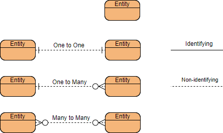
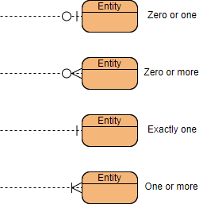
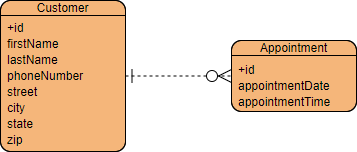
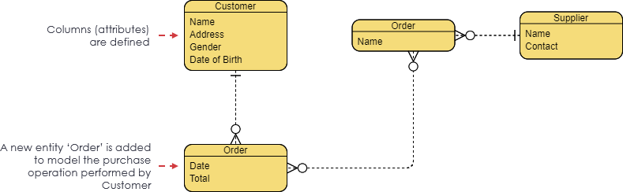
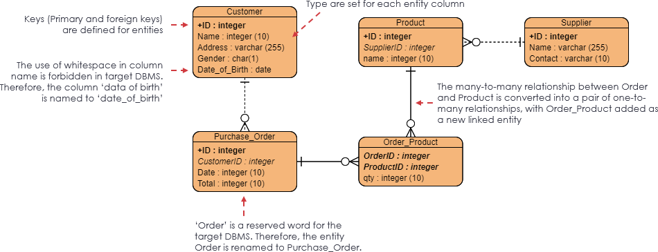

# 数据库模型：概念数据模型 逻辑数据模型 实体数据模型

参考链接：

[数据建模 Database Modeling：概念 (Conceptual) vs 逻辑 (Logical) vs 物理数据 (Physical) 模型](https://blog.csdn.net/chktsang/article/details/121013225)

[概念模型、逻辑模型、物理模型的区别](http://liushaoxing321.github.io/2013/04/conceptual-logical-physical/)

## 关键词

### **什么是实体关系图？**

实体关系图 (ERD) 是可以由数据库捕获的信息的图形表示。这样的“图片”有两个目的。它允许数据库专业人员简洁而准确地描述整体设计。ER 图可以很容易地转换为关系模式。ERD 中包含三个组件：实体、属性和关系。

**实体**

数据库所需的表数量——实体是 ERD 的基本对象。这些是您数据库的表，即学生、课程、书籍、校园、员工、付款、项目。实体的一个特定示例称为实例。每个实例都成为表中的一条记录或一行。

**属性**

您需要描述每个表的属性、事实等信息 - 属性是实体的事实或描述。它们也经常是名词并成为表格的列。例如，对于实体学生，属性可以是名字、姓氏、电子邮件、地址和电话号码。

- **主键**是唯一标识实体实例的一个属性或一组属性。例如，对于学生实体，学号是主键，因为没有两个学生具有相同的学号。一张表中只能有一个主键。它唯一标识每一行，并且不能为空。
- **外键**是用于将两个表链接在一起的键。通常，您从一个表中取出主键字段并将其插入到另一个表中，在那里它成为外键（它仍然是原始表中的主键）。我们可以在一张表中拥有多个外键。

**关系：**表如何链接在一起——关系是实体之间的关联。动词通常描述实体之间的关系。我们将使用鱼尾纹符号来表示这些关系。本实验讨论了三种类型的关系。如果你读到或听到基数比，它也指的是关系的类型。

**基数：**它定义了一个实体中可能出现的次数，该次数与另一个实体中的出现次数相关。例如，一支球队有很多球员。当出现在 ERD 中时，实体 Team 和 Player 以一对多的关系相互连接。

在 ER 图中，基数表示为连接器末端的鱼尾纹。三种常见的基数关系是一对一、一对多和多对多。以下是 ERD 中关系基数的一些示例：

## **ERD 示例 – 客户预约**

假设我们有以下业务场景：

- 一位客户可能会进行一次或多次预约
- 必须由一位且仅一位客户进行一次预约
- 从客户到约会链接的基数是 0 到多

上面使用 Crow's Foot 符号的 ERD：

- 实体显示在一个框中，其属性列在实体名称下方。
- 关系显示为两个实体之间的实线。
- Customer 和 Appointment 之间关联关系的最小和最大基数用直线和井号或鱼尾纹显示，如下图所示。

## **概念、逻辑和物理数据模型**

对这三种数据模型的一般理解是，业务分析师使用概念和逻辑模型对系统中存在的业务对象进行建模，而数据库设计人员或数据库工程师则详细阐述概念和逻辑 ER 模型，以生成呈现物理的物理模型。数据库结构准备好创建数据库。下表显示了三种数据模型之间的差异。ER 模型通常在三个抽象级别上绘制：

- 概念 ERD / 概念数据模型
- 逻辑 ERD / 逻辑数据模型
- 物理 ERD / 物理数据模型

虽然 ER 模型的所有三个级别都包含具有属性和关系的实体，但它们的创建目的和目标受众有所不同。

**概念模型 vs 逻辑模型 vs 数据模型：**

| ERD功能                  | 概念性的 | 逻辑的 | 身体的 |
| :----------------------- | :------- | :----- | :----- |
| 实体 Entity (名称）      | 是的     | 是的   | 是的   |
| 关系 / Relationship      | 是的     | 是的   | 是的   |
| 柱子 / Column            |          | 是的   | 是的   |
| 列的类型 / Coloum type   |          | 可选的 | 是的   |
| 首要的关键 / Primary Key |          |        | 是的   |
| 外键 / Foreigh Key       |          |        | 是的   |

表中总结了三种数据模型的特点：

- 该**概念模型**是建立实体，它们的属性，以及它们之间的关系。
- 所述**逻辑数据模型**定义了数据元素的结构，并设置在它们之间的关系。
- 在**物理数据模型**描述了数据模型的数据库具体实施。

### 概念数据模型

[编辑这个概念性 ERD](https://online.visual-paradigm.com/diagrams.jsp#diagram:proj=0&type=ERDiagram&name=Conceptual ERD&external=https://online.visual-paradigm.com/servlet/editor-content/knowledge/visual-modeling/conceptual-vs-logical-vs-physical-data-model/sites/7/2020/03/conceptual-data-model.png)

概念 ERD 对系统中应该存在的业务对象以及它们之间的关系进行建模。开发概念模型以通过识别所涉及的业务对象来呈现系统的整体图。它定义了哪些实体存在，而不是哪些表。例如，“多对多”表可能存在于逻辑或物理数据模型中，但它们在概念数据模型下仅显示为没有基数的关系。

概念数据模型示例

注意：概念 ERD 支持在建模两个实体之间的“一种”关系时使用泛化，例如，三角形是一种形状。用法类似于 UML 中的泛化。请注意，只有概念 ERD 支持泛化。

### 逻辑数据模型

逻辑 ERD 是概念 ERD 的详细版本。通过明确定义每个实体中的列并引入操作和事务实体，开发了逻辑 ER 模型以丰富概念模型。虽然逻辑数据模型仍然独立于将在其中创建数据库的实际数据库系统，但您仍然可以考虑它是否会影响设计。

逻辑数据模型示例

[编辑此逻辑 ERD 示例](https://online.visual-paradigm.com/diagrams.jsp#diagram:proj=0&type=ERDiagram&name=Logical ERD&external=https%3A%2F%2Feditor.visual-paradigm.com%2Fwp-content%2Fuploads%2Fsites%2F7%2F2020%2F03%2Flogical-data-model.png)

### 物理数据模型

物理 ERD 代表关系数据库的实际设计蓝图。物理数据模型通过为每一列分配类型、长度、可为空等来详细说明逻辑数据模型。由于物理 ERD 表示数据在特定 DBMS 中的结构和关联方式，因此重要的是要考虑将在其中创建数据库的实际数据库系统。确保 DBMS 支持列类型，并且在命名实体和列时未使用保留字。

物理数据模型示例

[编辑此物理 ERD 示例](https://online.visual-paradigm.com/diagrams.jsp#diagram:proj=0&type=ERDiagram&name=Physical ERD&external=https%3A%2F%2Feditor.visual-paradigm.com%2Fwp-content%2Fuploads%2Fsites%2F7%2F2020%2F03%2Fphysical-data-model.png)

## **结论**

设计数据模型的主要目标是确保功能团队提供的数据对象得到准确表示。我们应该首先从概念数据模型开始，随着越来越多的可用信息，我们添加更多细节以将其从概念模型改进为逻辑模型。最后，当我们确切地知道如何实现我们系统的数据库时，我们可以将我们的逻辑模型细化为物理数据模型，该模型可以直接映射到图表和实际数据库系统之间。