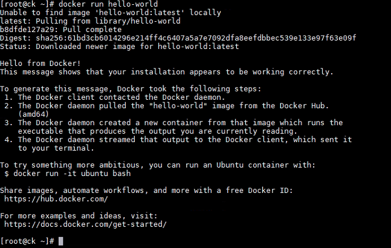
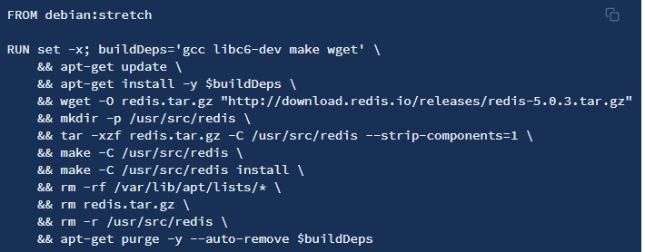
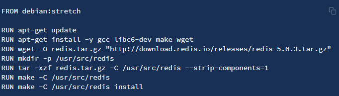

[TOC]

# Docker基本操作

参考链接：

[Docker超详细基础教程](https://blog.csdn.net/lqpf199681/article/details/110518692?ops_request_misc=%257B%2522request%255Fid%2522%253A%2522163175415316780366557218%2522%252C%2522scm%2522%253A%252220140713.130102334.pc%255Fall.%2522%257D&request_id=163175415316780366557218&biz_id=0&utm_medium=distribute.pc_search_result.none-task-blog-2~all~first_rank_ecpm_v1~hot_rank-11-110518692.pc_search_result_hbase_insert&utm_term=docker&spm=1018.2226.3001.4187)

[Docker——从入门到实践](https://yeasy.gitbook.io/docker_practice/install/centos)

[Dokcer入门--很不错](https://blog.csdn.net/m0_46690280/article/details/108742843?ops_request_misc=%257B%2522request%255Fid%2522%253A%2522163178071316780265440704%2522%252C%2522scm%2522%253A%252220140713.130102334..%2522%257D&request_id=163178071316780265440704&biz_id=0&utm_medium=distribute.pc_search_result.none-task-blog-2~all~first_rank_ecpm_v1~rank_v31_ecpm-2-108742843.pc_search_result_hbase_insert&utm_term=docerfile&spm=1018.2226.3001.4187)

## 安装Dokcer

```shell
# 切换到root
# 1.下载关于Docker的依赖环境
yum -y install yum-utils device-mapper-persistent-data lvm2

# 2.设置下载Docker的镜像源
yum-config-manager --add-repo http://mirrors.aliyun.com/docker-ce/linux/centos/docker-ce.repo

# 3.将软件包信息提前在本地缓存一份，用来提高搜索安装软件的速度
yum makecache fast

# 4.安装Docker
yum -y install docker-ce

# 5.启动Docker，并设置为开机自动启动，测试
# 启动Docker服务
systemctl start docker
# 设置开机自动启动
systemctl enable docker
# 测试
docker run hello-world
```

出现这个则是安装成功



## Docker命令

```
# 启动Docker服务
systemctl start docker

# 停止Docker服务
systemctl stop docker

# 重启Docker服务
systemctl restart docker

# 查看Docker服务状态
systemctl status docker

# 开机启动Docker服务
systemctl enable docker

```

## 卸载

```
$ sudo yum remove docker \
                  docker-client \
                  docker-client-latest \
                  docker-common \
                  docker-latest \
                  docker-latest-logrotate \
                  docker-logrotate \
                  docker-selinux \
                  docker-engine-selinux \
                  docker-engine
```

## 修改国内镜像源

[Docker设置国内镜像源](https://blog.csdn.net/whatday/article/details/86770609?ops_request_misc=%257B%2522request%255Fid%2522%253A%2522163175415316780366557218%2522%252C%2522scm%2522%253A%252220140713.130102334.pc%255Fall.%2522%257D&request_id=163175415316780366557218&biz_id=0&utm_medium=distribute.pc_search_result.none-task-blog-2~all~first_rank_ecpm_v1~hot_rank-19-86770609.pc_search_result_hbase_insert&utm_term=docker&spm=1018.2226.3001.4187)

1. `cd /etc/docker`

2. `vim ./daemon.json`

3. ```
   {
       "registry-mirrors": ["http://hub-mirror.c.163.com"]
   }
   ```

4. `systemctl restart docker.service`

## 搭建公司内部的镜像仓库

怎么搭建，百度一下，很简单，也可以使用官方的dockerhub，用`docker login`指令也可以登录，<span style="color:red">很简单</span>

```
# 需要在/etc/docker/daemon.json
{
	"registry-mirrors": ["https://registry.docker-cn.com"],
	"insecure-registries": ["ip:port]
}
# ip:port
公司私服的ip和port
# insecure-registries 这个后面是私有的仓库地址
# 重启两个服务
systemctl daemon-reload
systemctl restart docker                          

```

## 操作镜像

```
# 1. 拉取镜像到本地
docker pull 镜像名称[:tag]
# 举个例子 tomcat
docker pull daocloud.io/library/tomcat:8.5.15-jre8

# 2. 查看全部本地的镜像
docker images

说明：
REPOSITORY：镜像名称
TAG：镜像标签
IMAGE ID：镜像ID
CREATED：镜像的创建日期
SIZE：镜像大小

# 3. 删除本地镜像
docker rmi 镜像的标识  # 删除本地镜像
docker rmi `docker images -q` # 删除所有本地镜像

# 4. 镜像的导入导出(不规范)
# 将本地的镜像导出
docker save -o 导出的路径 镜像id
# 加载本地的镜像文件
docker load -i 镜像文件
# 修改镜像名称
docker tag 镜像id 新镜像名称:版本

# 5.从网络中查找需要的镜像
docker search 镜像名称

说明：
NAME：镜像名称
DESCRIPTION：镜像描述
STARS：用户评价，反应一个镜像的受欢迎程度
OFFICIAL：是否官方
AUTOMATED：自动构建，表示该镜像由Docker Hub自动构建流程创建的


```


## 操作容器

```
# 1. 运行容器
# 简单操作
docker run 镜像的标识|镜像名称[tag]

# 常用的参数
docker run -d -p  宿主机端口:容器端口 --name 容器名称 镜像的标识|镜像名称[tag]
# -d: 代表后台运行容器
# -p: 宿主机端口:容器端口: 为了映射当前Linux的端口和容器的端口
# --name 容器名称: 指定容器的名称

# 2. 查看正在运行的容器
docker ps [OPTIONS]
# OPTIONS说明:
# -a: 代表查看全部的容器，包括没有运行
# -q: 只查看容器的标识
# -f: 根据条件过滤显示的内容
# --format: 指定返回值的模板文件
# -l: 显示最近创建的容器
# -n: 列出最近创建的n个容器
# --no-trunc: 不截断输出
# -s: 显示总的文件大小

# 3. 查看容器的日志
docker logs -f 容器id
# -f: 可以滚动查看日志的最后几行

# 4. 进入到容器内部
docker exec -it 容器id bash

# 5. 删除容器(删除容器前，需要先停止容器)
docker stop 容器id
# 停止指定的容器
docker stop $(docker ps -qa)
# 停止全部容器
docker rm 镜像id
# 删除指定容器
docker rm $(docker ps -qa)
# 删除全部容器

#6. 启动容器
docker start 容器id
```

### 运行容器

参数说明：
• -i：保持容器运行。通常与 -t 同时使用。加入it这两个参数后，容器创建后自动进入容器中，退出容器后，容器自动关闭。

• -t：为容器重新分配一个伪输入终端，通常与 -i 同时使用。

• -d：以守护（后台）模式运行容器。创建一个容器在后台运行，需要使用docker exec 进入容器。退出后，容器不会关闭。

• -it 创建的容器一般称为交互式容器，-id 创建的容器一般称为守护式容器

• --name：为创建的容器命名。

### 1）交互式容器

以**交互式**方式创建并启动容器，启动完成后，直接进入当前容器。使用exit命令退出容器。需要注意的是以此种方式 启动容器，**如果退出容器**，则容器会进入**停止**状态。

```
# 先拉取一个镜像；这一步不是每次启动容器都要做的，而是因为前面我们删除了镜像，无镜像可用所以才再拉取一个 
docker pull centos:7 

#创建并启动名称为 mycentos7 的交互式容器；下面指令中的镜像名称 centos:7 也可以使用镜像id 
docker run -it --name=mycentos7 centos:7 /bin/bash

```

### 2）守护式容器

创建一个守护式容器；如果对于**一个需要长期运行的容器**来说，我们可以创建一个守护式容器。命令如下（容器名称 不能重复）：

```
#创建并启动守护式容器
docker run -di --name=mycentos2 centos:7

#登录进入容器命令为：docker exec -it container_name (或者 container_id) /bin/bash（exit退出 时，容器不会停止）
docker exec -it mycentos2 /bin/bash

```

### 查看容器状态

`docker inspect 容器名称或者容器id`


说明：容器之间在一个局域网内，linux宿主机器可以与容器进行通信；但是外部的物理机笔记本是不能与容器直接通信的，如果需要则需要通过宿主机器端口的代理。

## Dockerfile 制作镜像

弄好Dockerfile之后，在dockerfile文件所在的目录下执行：`docker build -t 镜像名字:版本 .`

- Dockerfile 是一个文本文件
- 包含了一条条的指令
- 每一条指令构建一层，基于基础镜像，最终构建出一个新的镜像
- 对于开发人员：可以为开发团队提供一个完全一致的开发环境
- 对于测试人员：可以直接拿开发时所构建的镜像或者通过Dockerfile文件，构建一个新的镜像开始工作了
- 对于运维人员：在部署时，可以实现应用的无缝移植

| 关键字      | 作用                     | 备注                                                         |
| ----------- | ------------------------ | ------------------------------------------------------------ |
| FROM        | 指定父镜像               | 指定`Dockerfile`基于哪个image构建<br />一个 `Dockerfile` 中 `FROM` 是必备的指令，并且必须是第一条指令。<br />`FROM centos:7` |
| MAINTAINER  | 作者信息                 | 用来标明这个dockerfile谁写的<br />MAINTAINER ck bettermanchenkang@163.com |
| LABEL       | 标签                     | 1. `LABEL` 指令用来给镜像以键值对的形式添加一些元数据（metadata）。<br />`LABEL <key>=<value> <key>=<value> <key>=<value> ...`<br />2. 也可以使用Label代替Maintainer 最终都是在docker image基本信息中可以查看<br />`LABEL org.opencontainers.image.authors="yeasy"`<br />`LABEL org.opencontainers.image.documentation="https://yeasy.gitbooks.io"` |
| RUN         | 执行命令                 | `RUN` 指令是用来执行命令行命令的。<br />格式有两种：<br />*shell* 格式：`RUN <命令>`，就像直接在命令行中输入的命令一样。刚才写的 Dockerfile 中的 `RUN` 指令就是这种格式。<br />`RUN echo '<h1>Hello, Docker!</h1>' > /usr/share/nginx/html/index.html`<br />*exec* 格式：`RUN ["可执行文件", "参数1", "参数2"]`，这更像是函数调用中的格式。<br /><span style="color:red">RUN命令，可以把很多个命令合在一起，因为每个RUN都会新建一层</span><br />正确的RUN：<br /><br />错误的RUN：<br /> |
| CMD         | 容器启动命令             | `CMD` 指令的格式和 `RUN` 相似，也是两种格式：<br />shell` 格式：`CMD <命令><br />exec` 格式：`CMD ["可执行文件", "参数1", "参数2"...]<br />和ENTRYPOINT配合使用：<br />参数列表格式：`CMD ["参数1", "参数2"...]`<br />在指定了 `ENTRYPOINT` 指令后，用 `CMD` 指定具体的参数。 |
| ENTRYPOINT  | 入口                     | 一般在制作一些执行就关闭的容器中会使用<br /><span style="color:red">用**RUN**来给你的initial iamge加层</span><br /><span style="color:red">如果你的image需要有一定要执行的指令，那么使用ENTRYPOINT，别用CMD</span><br /><span style="color:red">CMD可以给ENTRYPOINT提供额外的默认参数</span> |
| COPY        | 复制文件                 | build的时候复制文件到image中                                 |
| ADD         | 添加文件                 | build的时候添加文件到image中 不仅仅局限于当前build上下文 可以来源于远程服务 |
| ENV         | 环境变量                 | 指定build时候的环境变量 可以在启动的容器的时候 通过-e覆盖 格式ENV name=value |
| ARG         | 构建参数                 | 构建参数 只在构建的时候使用的参数 如果有ENV 那么ENV的相同名字的值始终覆盖arg的参数 |
| VOLUME      | 定义外部可以挂载的数据卷 | 指定build的image那些目录可以启动的时候挂载到文件系统中 启动容器的时候使用 -v 绑定 格式 VOLUME [“目录”] |
| EXPOSE      | 暴露端口                 | 定义容器运行的时候监听的端口 启动容器的使用-p来绑定暴露端口 格式: EXPOSE 8080 或者 EXPOSE 8080/udp |
| WORKDIR     | 工作目录                 | 指定容器内部的工作目录 如果没有创建则自动创建 如果指定/ 使用的是绝对地址 如果不是/开头那么是在上一条workdir的路径的相对路径 |
| USER        | 指定执行用户             | 指定build或者启动的时候 用户 在RUN CMD ENTRYPONT执行的时候的用户 |
| HEALTHCHECK | 健康检查                 | 指定监测当前容器的健康监测的命令 基本上没用 因为很多时候 应用本身有健康监测机制 |
| ONBUILD     | 触发器                   | 当存在ONBUILD关键字的镜像作为基础镜像的时候 当执行FROM完成之后 会执行 ONBUILD的命令 但是不影响当前镜像 用处也不怎么大 |
| STOPSIGNAL  | 发送信号量到宿主机       | 该STOPSIGNAL指令设置将发送到容器的系统调用信号以退出。       |
| SHELL       | 指定执行脚本的shell      | 指定RUN CMD ENTRYPOINT 执行命令的时候 使用的shell            |

### Dockerfile案例

#### 制作一个nginx镜像，访问的时候，显示HelloWorld

```
$ mkdir mynginx
$ cd mynginx
$ touch Dockerfile

# 内容为
FROM nginx
RUN echo '<h1>Hello, Docker!</h1>' > /usr/share/nginx/html/index.html

# 执行
$ docker build -t nginx:v3 .
Sending build context to Docker daemon 2.048 kB
Step 1 : FROM nginx
 ---> e43d811ce2f4
Step 2 : RUN echo '<h1>Hello, Docker!</h1>' > /usr/share/nginx/html/index.html
 ---> Running in 9cdc27646c7b
 ---> 44aa4490ce2c
Removing intermediate container 9cdc27646c7b
Successfully built 44aa4490ce2c
```

#### 自定义centos7镜像。要求：1） 默认登录路径为 /usr，2）可以使用vim
```
① 定义父镜像：FROM centos:7

② 定义作者信息：MAINTAINER itheima itheima@itcast.cn

③ 执行安装vim命令： RUN yum install -y vim

④ 定义默认的工作目录：WORKDIR /usr

⑤ 定义容器启动执行的命令：CMD /bin/bash

⑥ 通过dockerfile构建镜像：docker bulid –f dockerfile文件路径 –t 镜像名称:版本
```

#### 定义dockerfile，发布springboot项目

```
 ① 定义父镜像：FROM java:8

​ ② 定义作者信息：MAINTAINER itheima itheima@itcast.cn

​ ③ 将jar包添加到容器： ADD springboot.jar app.jar

​ ④ 定义容器启动执行的命令：CMD java–jar app.jar

​ ⑤ 通过dockerfile构建镜像：docker bulid –f dockerfile文件路径 –t 镜像名称:版本
```

### Dockerfile里RUN、CMD、ENTRYPOINT的区别

CMD放到后台的命令不一定会执行，要从EXE和SHELL两种命令形式去分析：

参考链接：[Docker RUN vs CMD vs ENTRYPOINT](https://goinbigdata.com/docker-run-vs-cmd-vs-entrypoint/)

## 容器转为镜像（了解，不要使用docker commit命令）

1. 使用docker commit命令可以将容器保存为镜像。

   命令形式：docker commit 容器名称 镜像名称

   ```
   eg:
   docker commit 381827f60f70 itheima_tomcat:1.0
   ```

2. 使用docker save命令可以将已有镜像保存为tar 文件。 

   命令形式：docker save –o tar文件名 镜像名

   ```
   docker save -o itheima_tomcat:1.0.tar itheima_tomcat:1.0
   ```

3. 用docker load命令可以根据tar文件恢复为docker镜像。命令形式：docker load -i tar文件名

   ```
   # 加载恢复镜像
   docker load -i itheima_tomcat.tar 
   # 在镜像恢复之后，基于该镜像再次创建启动容器 
   docker run -di --name=new_tomcat -p 8080:8080 itheima_tomcat:1.0
   ```

   **注意：新的镜像制作后，原本容器中挂载的目录将失效， 索引一般在恢复镜像创建容器容器的时候需要重新挂载。**

## 数据管理

### 数据卷

数据卷 是一个可供一个或多个容器使用的特殊目录，它绕过 UFS，可以提供很多有用的特性：

- 数据卷 可以在容器之间共享和重用
- 对 数据卷 的修改会立马生效
- 对 数据卷 的更新，不会影响镜像
- **数据卷 默认会一直存在，即使容器被删除**

#### 创建一个数据卷

```
$ docker volume create my-vol
```

#### 查看数据卷

```
# 查看所有数据卷
$ docker volume ls

DRIVER              VOLUME NAME
local               my-vol

# 查看指定数据卷的信息
$ docker volume inspect my-vol
[
    {
        "Driver": "local",
        "Labels": {},
        "Mountpoint": "/var/lib/docker/volumes/my-vol/_data",
        "Name": "my-vol",
        "Options": {},
        "Scope": "local"
    }
]
```

#### 启动一个挂载数据卷的容器

在用 `docker run` 命令的时候，使用 `--mount` 标记来将 `数据卷` 挂载到容器里。在一次 `docker run` 中可以挂载多个 `数据卷`。

```
$ docker run -d -P \
    --name web \
    # -v my-vol:/usr/share/nginx/html \
    --mount source=my-vol,target=/usr/share/nginx/html \
    nginx:alpine
```

#### 查看数据卷的具体信息

```
# 在主机里执行
$ docker inspect web

"Mounts": [
    {
        "Type": "volume",
        "Name": "my-vol",
        "Source": "/var/lib/docker/volumes/my-vol/_data",
        "Destination": "/usr/share/nginx/html",
        "Driver": "local",
        "Mode": "",
        "RW": true,
        "Propagation": ""
    }
],
```

#### 删除数据卷

```
# 删除指定名称的数据卷
$ docker volume rm my-vol

# 清理无主的数据卷
$ docker volume prune
```

### 挂载主机目录/主机文件

#### 挂载一个主机目录作为数据卷

```
# 使用--mount
$ docker run -d -P \
    --name web \
    # -v /src/webapp:/usr/share/nginx/html \
    --mount type=bind,source=/src/webapp,target=/usr/share/nginx/html \
    nginx:alpine
    
# 加readonly，设置为只读
$ docker run -d -P \
    --name web \
    # -v /src/webapp:/usr/share/nginx/html:ro \
    --mount type=bind,source=/src/webapp,target=/usr/share/nginx/html,readonly \
    nginx:alpine
```

<span style="color:red">使用 `-v` 参数时如果本地目录不存在 Docker 会自动为你创建一个文件夹</span>

<span style="color:red">`--mount` 参数时如果本地目录不存在，Docker 会报错</span>

#### 查看数据卷的具体信息

```
# 查看web的信息
$ docker inspect web

"Mounts": [
    {
        "Type": "bind",
        "Source": "/src/webapp",
        "Destination": "/usr/share/nginx/html",
        "Mode": "",
        "RW": true,
        "Propagation": "rprivate"
    }
],
```

#### 挂载一个本地主机文件作为数据卷

```
$ docker run --rm -it \
   # -v $HOME/.bash_history:/root/.bash_history \
   --mount type=bind,source=$HOME/.bash_history,target=/root/.bash_history \
   ubuntu:18.04 \
   bash

root@2affd44b4667:/# history
1  ls
2  diskutil list
```

## 服务编排

微服务架构的应用系统中一般包含若干个微服务，每个微服务一般都会部署多个实例，如果每个微服务都要手动启停，维护的工作量会很大。

- 要从Dockerfile build image 或者去dockerhub拉取image
- 要创建多个container
- 要管理这些container（启动停止删除）
- 服务编排： 按照一定的业务规则批量管理容器

### Docker Compose

Docker Compose是一个编排多容器分布式部署的工具，提供命令集管理容器化应用的完整开发周期，包括服务构建 ，启动和停止。使用步骤：

1. 利用 Dockerfile 定义运行环境镜像
2. 使用 docker-compose.yml 定义组成应用的各服务
3. 运行 docker-compose up 启动应用

#### 安装Docker Compose

```
# Compose目前已经完全支持Linux、Mac OS和Windows，在我们安装Compose之前，需要先安装Docker。下面我 们以编译好的二进制包方式安装在Linux系统中。 
curl -L https://github.com/docker/compose/releases/download/1.22.0/docker-compose-`uname -s`-`uname -m` -o /usr/local/bin/docker-compose
# 设置文件可执行权限 
chmod +x /usr/local/bin/docker-compose
# 查看版本信息 
docker-compose -version
```

#### 卸载Docker Compose

```
# 二进制包方式安装的，删除二进制文件即可
rm /usr/local/bin/docker-compose
```

#### Docker Compose命令说明

[命令说明](https://yeasy.gitbook.io/docker_practice/compose/commands)

#### Compose 模板文件

[末班文件说明](https://yeasy.gitbook.io/docker_practice/compose/compose_file)

#### 示例：使用docker compose编排nginx+springboot项目

```
# 创建dokcer-compose目录
mkdir ~/docker-compose
cd ~/docker-compose

# 编写 docker-compose.yml 文件
version: '3'
services:
  nginx:
   image: nginx
   ports:
    - 80:80
   links:
    - app
   volumes:
    - ./nginx/conf.d:/etc/nginx/conf.d
  app:
    image: app
    expose:
      - "8080"
      
# 创建./nginx/conf.d目录
mkdir -p ./nginx/conf.d

# 在./nginx/conf.d目录下 编写itheima.conf文件
server {
    listen 80;
    access_log off;

    location / {
        proxy_pass http://app:8080;
    }
   
}

# 在~/docker-compose 目录下 使用docker-compose 启动容器
docker-compose up

# 测试访问
http://192.168.149.135/hello
```

