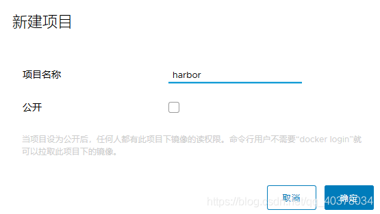
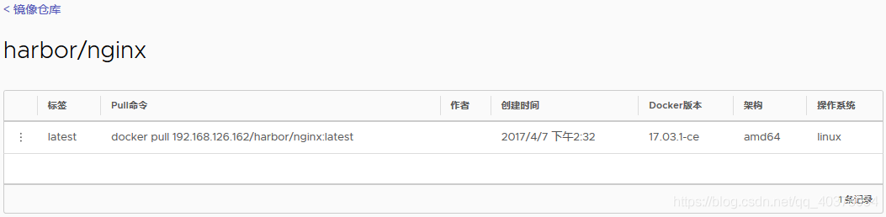
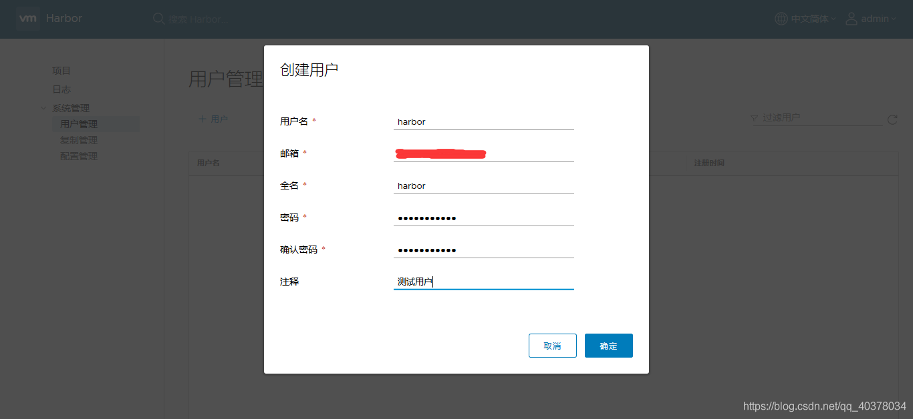
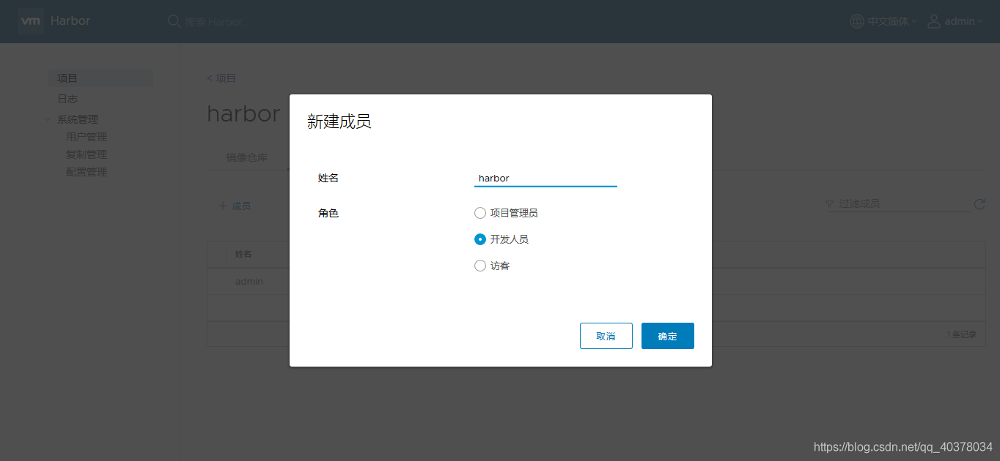
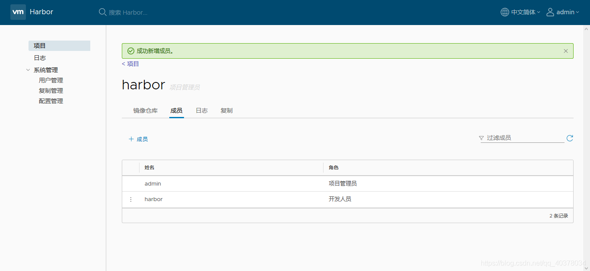

# Harbor安装

参考链接：

[harbor安装](https://blog.csdn.net/qq_40378034/article/details/90752212)

## 一、Harbor介绍

Docker容器应用的开发和运行离不开可靠的镜像管理，虽然Docker官方也提供了公共的镜像仓库，但是从安全和效率等方面考虑，部署私有环境内的Registry也是非常必要的。Harbor是由VMware公司开源的企业级的Docker Registry管理项目，它包括权限管理(RBAC)、LDAP、日志审核、管理界面、自我注册、镜像复制和中文支持等功能

## 二、环境准备

Harbor的所有服务组件都是在Docker中部署的，所以官方安装使用Docker-compose快速部署，所以需要安装Docker、Docker-compose。由于Harbor是基于Docker Registry V2版本，所以就要求Docker版本不小于1.10.0，Docker-compose版本不小于1.6.0

### 1）、安装并启动Docker

参考：[docker安装](./Docker基本操作.md)

### **2）、安装Docker-compose**

下载指定版本的docker-compose

```
curl -L https://get.daocloud.io/docker/compose/releases/download/1.22.0/docker-compose-`uname -s`-`uname -m` > /usr/local/bin/docker-compose
```

对二进制文件赋可执行权限

```
[root@localhost ~]# chmod +x /usr/local/bin/docker-compose
```

测试下docker-compose是否安装成功

```
[root@localhost ~]# docker-compose --version
docker-compose version 1.13.0, build 1719ceb
```

## 三、Harbor服务搭建及启动

从GitHub上https://github.com/goharbor/harbor/releases下载指定版本的安装包

**1）、下载Harbor安装文件**

```
[root@localhost ~]# mkdir -p /harbor
[root@localhost ~]# cd /harbor/
[root@localhost harbor]# yum -y install wget
[root@localhost harbor]# wget https://github.com/vmware/harbor/releases/download/v1.1.2/harbor-online-installer-v1.1.2.tgz
[root@localhost harbor]# ls
harbor-online-installer-v1.1.2.tgz
[root@localhost harbor]# tar -zxf harbor-online-installer-v1.1.2.tgz 
```

**2）、配置Harbor**

```
[root@localhost harbor]# ls
harbor  harbor-online-installer-v1.1.2.tgz
[root@localhost harbor]# cd harbor
[root@localhost harbor]# ls
common  docker-compose.notary.yml  docker-compose.yml  harbor_1_1_0_template  harbor.cfg  install.sh  LICENSE  NOTICE  prepare  upgrade
[root@localhost harbor]# vi harbor.cfg 
```

配置文件harbor.cfg详解：

```
# hostname设置访问地址，可以使用ip、域名，不可以设置为127.0.0.1或localhost
hostname = 192.168.126.162

# 访问协议，默认是http，也可以设置https，如果设置https，则nginx ssl需要设置on
ui_url_protocol = http

# mysql数据库root用户默认密码root123，实际使用时修改下
db_password = 123456

max_job_workers = 3 

customize_crt = on

ssl_cert = /data/cert/server.crt
ssl_cert_key = /data/cert/server.key

secretkey_path = /data

admiral_url = NA
# 邮件设置，发送重置密码邮件时使用
email_identity = 

email_server = smtp.mydomain.com
email_server_port = 25
email_username = sample_admin@mydomain.com
email_password = abc
email_from = admin <sample_admin@mydomain.com>
email_ssl = false

# 启动Harbor后，管理员UI登录的密码，默认是Harbor12345
harbor_admin_password = 123456

# 认证方式，这里支持多种认证方式，如LADP、本次存储、数据库认证。默认是db_auth，mysql数据库认证
auth_mode = db_auth

# LDAP认证时配置项
ldap_url = ldaps://ldap.mydomain.com
#ldap_searchdn = uid=searchuser,ou=people,dc=mydomain,dc=com
#ldap_search_pwd = password
ldap_basedn = ou=people,dc=mydomain,dc=com
#ldap_filter = (objectClass=person)
ldap_uid = uid
ldap_scope = 3
ldap_timeout = 5

# 是否开启自注册
self_registration = on

# token有效时间，默认30分钟
token_expiration = 30

# 用户创建项目权限控制，默认是everyone（所有人），也可以设置为adminonly（只能管理员）
project_creation_restriction = everyone

verify_remote_cert = on
```

**3）、启动Harbor**

修改完配置文件后，在的当前目录执行`./install.sh`，Harbor服务就会根据当期目录下的docker-compose.yml开始下载依赖的镜像，检测并按照顺序依次启动各个服务

```
[root@localhost harbor]# ./install.sh 
```

Harbor依赖的镜像及启动服务如下：

```
[root@localhost harbor]# docker-compose ps
       Name                     Command               State                                Ports                               
------------------------------------------------------------------------------------------------------------------------------
harbor-adminserver   /harbor/harbor_adminserver       Up                                                                       
harbor-db            docker-entrypoint.sh mysqld      Up      3306/tcp                                                         
harbor-jobservice    /harbor/harbor_jobservice        Up                                                                       
harbor-log           /bin/sh -c crond && rm -f  ...   Up      127.0.0.1:1514->514/tcp                                          
harbor-ui            /harbor/harbor_ui                Up                                                                       
nginx                nginx -g daemon off;             Up      0.0.0.0:443->443/tcp, 0.0.0.0:4443->4443/tcp, 0.0.0.0:80->80/tcp 
registry             /entrypoint.sh serve /etc/ ...   Up      5000/tcp    
```

启动完成后，访问刚设置的hostname即可，默认是80端口，如果端口占用，可以去修改docker-compose.yml文件中，对应服务的端口映射

**4）设置开机自启动**

创建`harbor.service`文件

```
vi /lib/systemd/system/harbor.service
```

插入如下内容

```
[Unit]
Description=Harbor
After=docker.service systemd-networkd.service systemd-resolved.service
Requires=docker.service
Documentation=http://github.com/vmware/harbor

[Service]
Type=simple
Restart=on-failure
RestartSec=5
ExecStart=/usr/local/bin/docker-compose -f  /usr/local/harbor/docker-compose.yml up
ExecStop=/usr/local/bin/docker-compose -f /usr/local/harbor/docker-compose.yml down

[Install]
WantedBy=multi-user.target
```

```
systemctl enable harbor
systemctl start harbor
```

## 四、Harbor仓库使用

**1）、登录Web Harbor**

使用admin用户登录，密码为harbor.cfg配置的密码

**2）、上传镜像到Harbor仓库**

我们新建一个名称为harbor的项目，设置不公开。当项目设为公开后，任何人都有此项目下镜像的读权限。命令行用户不需要docker login就可以拉取此项目下的镜像。



新建项目后，使用admin用户提交本地nginx镜像到Harbor仓库

**1）admin登录**

使用docker login出现如下问题：

```
[root@localhost ~]# docker login 192.168.126.162
Username: admin
Password: 
Error response from daemon: Get https://192.168.126.162/v2/: read tcp 192.168.126.162:49654->192.168.126.162:443: read: connection reset by
peer
```

解决方法：

查找docker.service所在的位置

```
[root@localhost ~]# find / -name docker.service -type f
/usr/lib/systemd/system/docker.service

```

修改配置文件，ExecStart之后添加–insecure-registry=http://192.168.126.162

重启Docker服务

再次进行登录

```
[root@localhost ~]# docker login 192.168.126.162
Username: admin
Password: 
WARNING! Your password will be stored unencrypted in /root/.docker/config.json.
Configure a credential helper to remove this warning. See
https://docs.docker.com/engine/reference/commandline/login/#credentials-store

Login Succeeded
```

**2）给镜像打tag**

```
[root@localhost ~]# docker images
REPOSITORY                  TAG                 IMAGE ID            CREATED             SIZE
vmware/harbor-jobservice    v1.1.2              4ef0a7a33734        24 months ago       163MB
vmware/harbor-ui            v1.1.2              4ee8f190f366        24 months ago       183MB
vmware/harbor-adminserver   v1.1.2              cdcf1bed7eb4        24 months ago       142MB
vmware/harbor-db            v1.1.2              fcb8aa7a0640        24 months ago       329MB
vmware/registry             2.6.1-photon        0f6c96580032        2 years ago         150MB
vmware/nginx                1.11.5-patched      8ddadb143133        2 years ago         199MB
vmware/harbor-log           v1.1.2              9c46a7b5e517        2 years ago         192MB
[root@localhost ~]# docker tag vmware/nginx:1.11.5-patched 192.168.126.162/harbor/nginx:latest
[root@localhost ~]# docker images
REPOSITORY                     TAG                 IMAGE ID            CREATED             SIZE
vmware/harbor-jobservice       v1.1.2              4ef0a7a33734        24 months ago       163MB
vmware/harbor-ui               v1.1.2              4ee8f190f366        24 months ago       183MB
vmware/harbor-adminserver      v1.1.2              cdcf1bed7eb4        24 months ago       142MB
vmware/harbor-db               v1.1.2              fcb8aa7a0640        24 months ago       329MB
vmware/registry                2.6.1-photon        0f6c96580032        2 years ago         150MB
192.168.126.162/harbor/nginx   latest              8ddadb143133        2 years ago         199MB
vmware/nginx                   1.11.5-patched      8ddadb143133        2 years ago         199MB
vmware/harbor-log              v1.1.2              9c46a7b5e517        2 years ago         192MB
```

**3）push到仓库**

```
[root@localhost ~]# docker push 192.168.126.162/harbor/nginx:latest
The push refers to repository [192.168.126.162/harbor/nginx]
3569f62067e2: Pushed 
3f117c44afbb: Pushed 
c4a8b7411af4: Pushed 
fe4c16cbf7a4: Pushed 
latest: digest: sha256:3dce35afeadd7195877b17bf1514b9e388ed671afe428441fe5e0b02cdc26eeb size: 1160
```

上传成功后，登录Web Harbor，选择项目harbor，就可以查看刚刚上传的nginx镜像了



**3）、创建用户并分配权限**

点击系统管理下的用户管理，点击创建用户，输入相关信息



将刚刚创建的用户添加到harbor项目成员中，点击项目，选择harbor项目，点击成员，点击添加成员，添加姓名选择角色





使用新建的用户将刚刚上传的nginx镜像拉取下来

先将刚刚nginx镜像删除

```
[root@localhost ~]# docker images
REPOSITORY                     TAG                 IMAGE ID            CREATED             SIZE
vmware/harbor-jobservice       v1.1.2              4ef0a7a33734        24 months ago       163MB
vmware/harbor-ui               v1.1.2              4ee8f190f366        24 months ago       183MB
vmware/harbor-adminserver      v1.1.2              cdcf1bed7eb4        24 months ago       142MB
vmware/harbor-db               v1.1.2              fcb8aa7a0640        24 months ago       329MB
vmware/registry                2.6.1-photon        0f6c96580032        2 years ago         150MB
192.168.126.162/harbor/nginx   latest              8ddadb143133        2 years ago         199MB
vmware/nginx                   1.11.5-patched      8ddadb143133        2 years ago         199MB
vmware/harbor-log              v1.1.2              9c46a7b5e517        2 years ago         192MB
[root@localhost ~]# docker rmi 192.168.126.162/harbor/nginx:latest
Untagged: 192.168.126.162/harbor/nginx:latest
Untagged: 192.168.126.162/harbor/nginx@sha256:3dce35afeadd7195877b17bf1514b9e388ed671afe428441fe5e0b02cdc26eeb

```

退出admin帐号，使用刚刚创建的用户登录

```
[root@localhost ~]# docker logout 192.168.126.162
Removing login credentials for 192.168.126.162
[root@localhost ~]# docker login 192.168.126.162
Username: harbor
Password: 
WARNING! Your password will be stored unencrypted in /root/.docker/config.json.
Configure a credential helper to remove this warning. See
https://docs.docker.com/engine/reference/commandline/login/#credentials-store

Login Succeeded

```

将harbor中的nginx镜像拉取到本地

```
[root@localhost ~]# docker pull 192.168.126.162/harbor/nginx:latest
latest: Pulling from harbor/nginx
Digest: sha256:3dce35afeadd7195877b17bf1514b9e388ed671afe428441fe5e0b02cdc26eeb
Status: Downloaded newer image for 192.168.126.162/harbor/nginx:latest
[root@localhost ~]# docker images
REPOSITORY                     TAG                 IMAGE ID            CREATED             SIZE
vmware/harbor-jobservice       v1.1.2              4ef0a7a33734        24 months ago       163MB
vmware/harbor-ui               v1.1.2              4ee8f190f366        24 months ago       183MB
vmware/harbor-adminserver      v1.1.2              cdcf1bed7eb4        24 months ago       142MB
vmware/harbor-db               v1.1.2              fcb8aa7a0640        24 months ago       329MB
vmware/registry                2.6.1-photon        0f6c96580032        2 years ago         150MB
192.168.126.162/harbor/nginx   latest              8ddadb143133        2 years ago         199MB
vmware/nginx                   1.11.5-patched      8ddadb143133        2 years ago         199MB
vmware/harbor-log              v1.1.2              9c46a7b5e517        2 years ago         192MB

```

## Harbor的停止和启动

切换到harbor安装的位置

1. 停止命令

```
docker-compose stop
```

2. 启动命令

```
docker-compose up -d
```