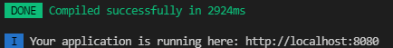
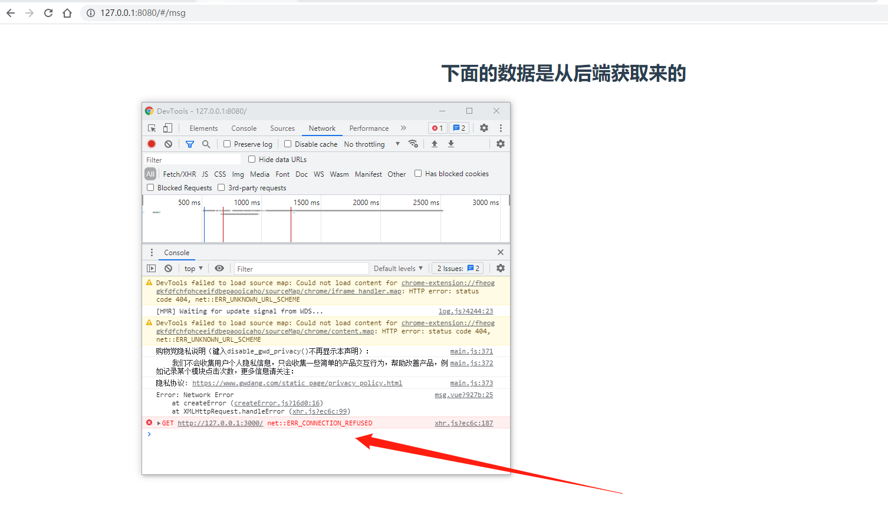
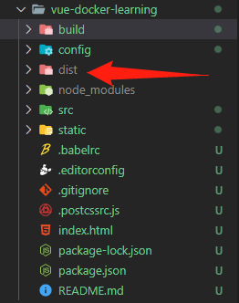
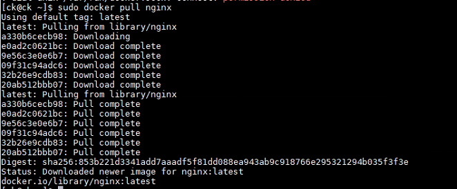
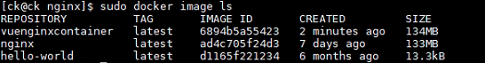
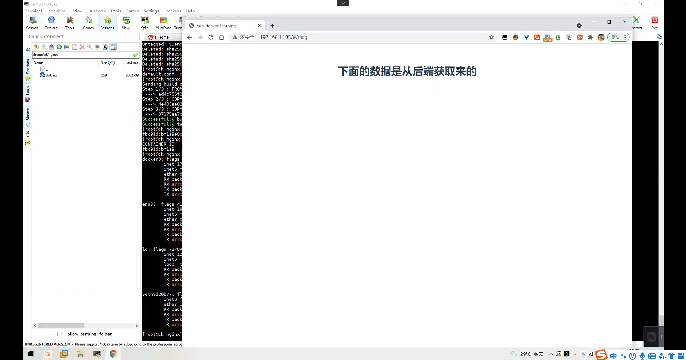
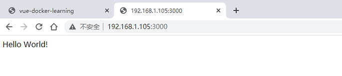
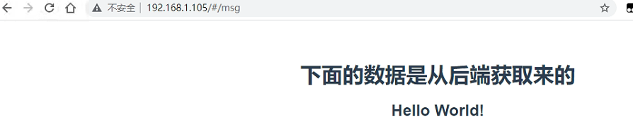

# nginx、express、vue、mysql容器化部署的例子

参考链接：

[手把手教你使用 Docker 部署 Vue.js 项目](http://www.dockone.io/article/8834)

## 准备vue nginx容器

### 准备vue项目

```
# 1. 使用vue webpack初始化一个项目
$ cd ./Docker/src
$ npm init webpack vue-docker-learning

# 2. 启动项目，查看项目是否初始化成功
$ cd vue-docker-learning
$ npm run dev

# 3. 打开浏览器访问 127.0.0.1:8080查看项目启动情况
```



```
# 4. 安装axios
$ npm install axios --save
```

5. 制作工程

修改main.js，引入axios

```
import Axios from 'axios'

Vue.prototype.$axios = Axios
Axios.defaults.baseURL = 'http://127.0.0.1:3000' //这个可以解决axios跨端口访问的问题，不是解决跨域的哦
```

6. 在components目录下新建msg.vue

```vue
<template>
  <div>
    <h1>下面的数据是从后端获取来的</h1>
    <h2>{{ msg }}</h2>
  </div>
</template>

<script>
var _self;

export default {
  data () {
    return {
      msg : ''
    }
  },
  methods:{
  getData(){
    this.$axios.get("/").then(
      (response) => {
        this.msg = response.data;
      }
    ).catch(
      (err) => {
        console.log(err);
      }
    );
  }
  },
  created(){
    _self = this;
  },
  mounted(){
    _self.getData();
  }
}
</script>

<style>
</style>

```

6. 修改router/index.js

```
import msg from '@/components/msg'
Vue.use(Router)

export default new Router({
  routes: [
    {
      path: '/',
      redirect: "/msg"
    },{
      path: '/msg',
      component:msg
    }
  ]
})
```

7. 打开浏览器访问127.0.0.1:8080



<span style="color:red">因为还没有后台，所以http请求失败是正常的</span>

8. 打包vue项目

```
npm run build
```



### 制作vue nginx容器

1. ```
   # 获取nginx镜像
   $ sudo docker pull nginx
   ```



2. ```
   # 切换到家目录
   # 新建nginx目录
   # 新建default.conf文件
   # 填写如下nginx配置
   
   $ cd ~
   $ mkdir nginx
   $ cd nginx
   $ vim default.conf
   
   server {
       listen       80;
       server_name  localhost;
       
       #charset koi8-r;
       access_log  /var/log/nginx/host.access.log  main;
       error_log  /var/log/nginx/error.log  error;
       
       location / {
           root   /usr/share/nginx/html;
           index  index.html index.htm;
       }
       
       #error_page  404              /404.html;
       
       # redirect server error pages to the static page /50x.html
       #
       error_page   500 502 503 504  /50x.html;
       location = /50x.html {
           root   /usr/share/nginx/html;
       }
   }
   ```

3. ````
   # 将dist拷贝到nginx目录下
   ````

4. ```
   # vim Dockerfile
   FROM nginx
   COPY dist/ /usr/share/nginx/html/
   COPY default.conf /etc/nginx/conf.d/default.conf
   ```

5. ```
   # 构建镜像
   docker build -t vuenginxcontainer .
   ```

6. 查看本地镜像``sudo docker image ls`



7. <span style="color:red">这个时候，vue容器就算制作成功了</span>

8. ```
   # 启动容器
   sudo docker run -p 80:80 -d --name vueApp vuenginxcontainer 
   ```

9. 查看结果，可以看到是成功了的

## 准备nodejs express容器

### 准备后端项目

```
# 新建nodejs-express-docker-learning
# 进入nodejs-express-docker-learning目录
# npm init
# npm install express --save
# 新建app.js
```

```js
const express = require('express')
const app = express()
const port = 3000

//express中设置cross访问限制
app.all("*",function(req,res,next){
  //设置允许跨域的域名，*代表允许任意域名跨域
  res.header("Access-Control-Allow-Origin","*");
  //允许的header类型
  res.header("Access-Control-Allow-Headers","content-type");
  //跨域允许的请求方式 
  res.header("Access-Control-Allow-Methods","DELETE,PUT,POST,GET,OPTIONS");
  if (req.method.toLowerCase() == 'options')
      res.send(200);  //让options尝试请求快速结束
  else
      next();
})

app.get('/', (req, res) => {
  res.send('Hello World!')
})

app.listen(port, () => {
  console.log(`Example app listening at http://localhost:${port}`)
})
```

```
# 修改package.json scripts
```

```js
  "scripts": {
    "start": "node app.js"
  }
```

```
先本地启动一下，访问127.0.0.1:3000看看效果
```

### 制作node镜像、并启动容器

```
# 拉取 node镜像
docker pull node

$ cd ~
$ mkdir app
$ cd app
$ vim Dockerfile

FROM node

WORKDIR /usr/src/app

COPY ./app/package*.json ./

RUN npm install

COPY ./app ./

EXPOSE 3000
CMD [ "npm", "start" ]

# 制作镜像
$ docker build -t nodewebserver .

# 启动镜像
$ docker run -p 3000:3000 -d --name nodeserver nodewebserver

# chrome 访问
```



<span style="color:red">vue项目还是访问不到</span>

## 解决 vue项目访问不到的问题

```
# 修改vue项目 main.js
Axios.defaults.baseURL = 'http://127.0.0.1:3000'
修改成
Axios.defaults.baseURL = 'http://192.168.1.105:3000' 

# 重新打包
npm run build 

# 停止vue容器
docker stop 容器id
# 删除vue容器
docker rm 容器id
# 删除vue镜像
docker rmi 镜像id

# 重新构建镜像
docker build -t vuenginxcontainer .

# 重新启动
sudo docker run -p 80:80 -d --name vueApp vuenginxcontainer 
# 观察结果
```




## 准备mysql容器

