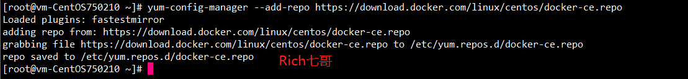
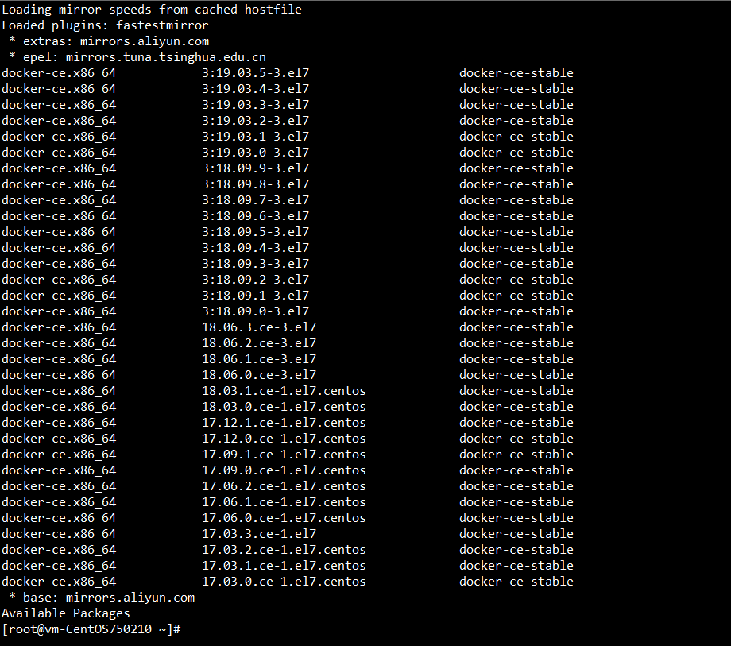
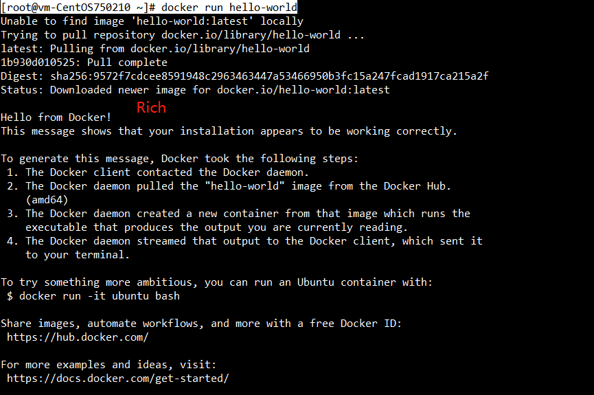

**CentOS7 Linux安装指定版本Docker**

Docker官网安装地址:https://docs.docker.com/install/linux/docker-ce/centos/

 

**Docker版本说明**

centos7默认安装的docker是Enterprise Edition (EE)(企业版)，还是Community Edition (CE)(社区版)，有什么区别？

目前在centos7上yum install docker，默认安装的docker版本号为1.13.1，那么此版本是企业版还是社区版呢，带着这个疑问，我这里追溯下版本发布历史，查了一下docker-1.13.1发布的时间！

docker-1.13.1发布的时间为2017年2月8日，docker正式宣布推出企业版的时间为2017年3月2日。

看到这里大家应该明白了，docker是在1.13.1后正式推出企业版，版本号也从此发生了变化，由原来的1.13.1升级到了17.03（即表示17年3月），从此docker有了docker-ee和docker-ce之分。

总结：centos7默认安装的docker是免费的版本，可以说是社区版

 

 

**本地环境说明**

CentOS 7（Minimal Install）

```
$ cat /etc/redhat-release 
CentOS Linux release 7.6.1810 (Core) 
```

 

卸载旧版本Docker

```
[root@vm-CentOS750210 ~]# systemctl stop docker
[root@vm-CentOS750210 ~]# yum remove docker -y 
```

旧版本的内容在 `/var/lib/docker` 下，目录中的镜像(images), 容器(containers), 存储卷(volumes), 和 网络配置（networks）都可以保留。

 

安装Docker-ce

安装准备-配置docker yum源

```
[root@vm-CentOS750210 ~]# yum-config-manager --add-repo https://download.docker.com/linux/centos/docker-ce.repo
```



 

安装指定版本docker-ce，过程稍慢，耐心等待


sudo yum update
sudo yum install -y yum-utils
sudo yum install docker-ce

\# 查看可安装的版本
[root@vm-CentOS750210 ~]# yum list docker-ce --showduplicates | sort -r

\#安装指定版本
yum install docker-ce-<VERSION STRING>


 

安装成功后启动docker并设置开机启动

```
[root@vm-CentOS750210 ~]# systemctl start docker
[root@vm-CentOS750210 ~]# systemctl enable docker
Created symlink from /etc/systemd/system/multi-user.target.wants/docker.service to /usr/lib/systemd/system/docker.service.
```

 

验证安装

```
[root@vm-CentOS750210 ~]# docker run hello-world
```



 

 至此，安装部分结束。