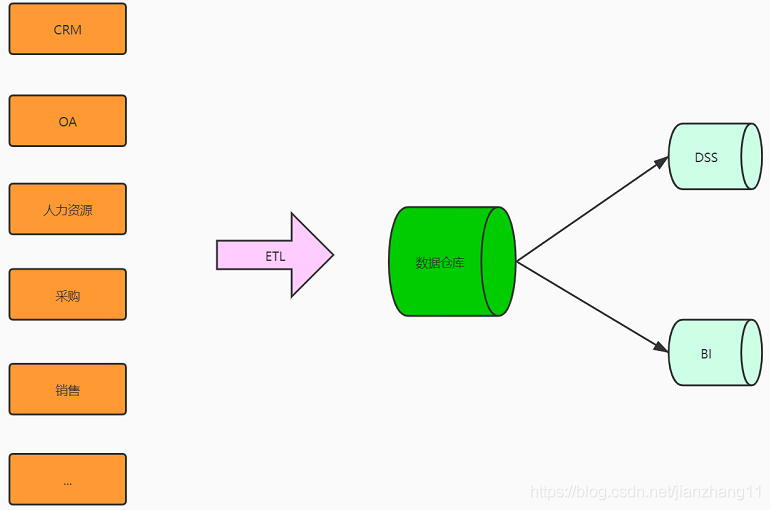

​                                            

## **ETL基础概念** 

### ETL基础概念 - 背景

随着企业的发展，各业务线、产品线、部门都会承建各种信息化系统方便开展自己的业务。随着信息化建设的不断深入，由于业务系统之间各自为政、相互独立造成的数据孤岛”现象尤为普遍，业务不集成、流程不互通、数据不共享。这给企业进行数据的分析利用、报表开发、分析挖掘等带来了巨大困难。
 

在此情况下，为了实现企业全局数据的系统化运作管理（信息孤岛、数据统计、数据分析、数据挖掘） ，为DSS（决策支持系统）、BI（商务智能）、经营分析系统等[深度](https://so.csdn.net/so/search?q=深度&spm=1001.2101.3001.7020)开发应用奠定基础，挖掘数据价值 ，企业会开始着手建立数据仓库，数据中台。将相互分离的业务系统的数据源整合在一起，建立一个统一的数据采集、处理、存储、分发、共享中心。
 

**在BI项目中ETL会花掉整个项目至少1/3的时间，ETL设计的好坏直接关接到BI项目的成败。**

### ETL基础概念-定义

ETL是将业务系统的数据经过抽取（Extract）、清洗转换（Transform）之后加载（Load）到数据仓库的过程，目的是将企业中的分散、零乱、标准不统一的数据整合到一起，为企业的决策提供分析依据。
 

### ETL基础概念-过程

ETL处理分为五大模块，分别是：数据抽取、数据清洗、库内转换、规则检查、数据加载。各模块可灵活进行组合，形成ETL处理流程。简单介绍一下各个模块之间的主要功能。

#### 数据抽取

- 确定数据源，需要确定从哪些源系统进行数据抽取
- 定义数据接口，对每个源文件及系统的每个字段进行详细说明
- 确定数据抽取的方法：是主动抽取还是由源系统推送？是增量抽取还是全量抽取？是按照每日抽取还是按照每月抽取？

#### 数据清洗与转换

- 数据清洗
   主要将不完整数据、错误数据、重复数据进行处理
- 数据转换
  - 空值处理：可捕获字段空值，进行加载或替换为其他含义数据，或数据分流问题库
  - 数据标准：统一元数据、统一标准字段、统一字段类型定义
  - 数据拆分：依据业务需求做数据拆分，如身份证号，拆分区划、出生日期、性别等
  - 数据验证：时间规则、业务规则、自定义规则
  - 数据替换：对于因业务因素，可实现无效数据、缺失数据的替换
  - 数据关联：关联其他数据或数学，保障数据完整性

#### 数据加载

将数据缓冲区的数据直接加载到数据库对应表中，如果是全量方式则采用LOAD方式，如果是增量则根据业务规则MERGE进数据库

### ETL VS ELT

ETL架构按其字面含义理解就是按照E-T-L这个顺序流程进行处理的架构：先抽取、然后转换、完成后加载到目标数据库中。在ETL架构中，数据的流向是从源数据流到ETL工具，ETL工具是一个单独的数据处理引擎，一般会在单独的硬件服务器上，实现所有数据转化的工作，然后将数据加载到目标数据仓库中。如果要增加整个ETL过程的效率，则只能增强ETL工具服务器的配置，优化系统处理流程（一般可调的东西非常少）。
 

ELT架构则把“L”这一步工作提前到“T”之前来完成：先抽取、然后加载到目标数据库中、在目标数据库中完成转换操作。在ELT架构中，ELT只负责提供图形化的界面来设计业务规则，数据的整个加工过程都在目标和源的数据库之间流动，ELT协调相关的数据库系统来执行相关的应用，数据加工过程既可以在源数据库端执行，也可以在目标数据仓库端执行（主要取决于系统的架构设计和数据属性）。当ETL过程需要提高效率，则可以通过对相关数据库进行调优，或者改变执行加工的服务器就可以达到。
 

**大家可以仔细看看上面两种架构图，体会一下他们之间的区别**，下面来分析一下他们各自的优点：

#### ETL架构的优势

- 可以分担数据库系统的负载（采用单独的硬件服务器）
- 相对于ELT架构可以实现更为复杂的数据转换逻辑
- 采用单独的硬件服务器
- 与底层的数据库存储无关

#### ELT架构的优势

- 充分利用数据库引擎来实现的可扩展性
- 可以保持所有的数据始终在数据库当中，避免数据的加载和导出，从而保证效率，提高系统的可监控性
- 可以根据数据的分布情况进行并行处理优化，并可以利用数据库的固有功能优化磁盘I/O
- 通过对相关数据库进行性能调优，ELT过程获得3到4倍的效率提升比较容易

## **ETL 模式介绍** 

ETL有四种主要实现模式：[触发器](https://so.csdn.net/so/search?q=触发器&spm=1001.2101.3001.7020)模式、增量字段、全量同步、日志比对

### 触发器模式

触发器方式是普遍采取的一种增量抽取机制。该方式是根据抽取要求，在要被抽取的源表上建立插入、修改、删除3个触发器，每当源表中的数据发生变化，就被相应的触发器将变化的数据写入一个增量日志表，ETL的增量抽取则是从增量日志表中而不是直接在源表中抽取数据，同时增量日志表中抽取过的数据要及时被标记或删除。
 为了简单起见，增量日志表一般不存储增量数据的所有字段信息，而只是存储源表名称、更新的关键字值和更新操作类型(insert、update或delete)，ETL增量抽取进程首先根据源表名称和更新的关键字值，从源表中提取对应的完整记录，再根据更新操作类型，对目标表进行相应的处理。

```sql
CREATE OR REPLACE TRIGGER TRI_T_ETL_YB
  BEFORE INSERT OR UPDATE OR DELETE ON T_ETL_YB
  FOR EACH ROW
DECLARE
 CZLX VARCHA2(1); -- 定义操作类型
 BEGIN
   -- 插入日志表（ID,操作时间，操作类型）
   IF DELETING THEN INSERT INTO ETL_LOG(ID,CZSJ,CZLX) VALUES (:old.ID,sysdate,'D');
   ELSE IF UPDATING THEN INSERT INTO ETL_LOG(ID,CZSJ,CZLX) VALUES (:old.ID,sysdate,'U');
   ELSE IF INSERTING THEN INSERT INTO ETL_LOG(ID,CZSJ,CZLX) VALUES (:new.ID,sysdate,'I');
   END IF;
END;
123456789101112
```

优点：
 数据抽取的性能高，ETL 加载规则简单，速度快，不需要修改业务系统表结构，可以实现数据的递增加载。

缺点：
 要求业务表建立触发器，对业务系统有一定的影响，容易对源数据库构成威胁。

### 增量字段

增量字段方式来捕获变化数据，原理就是在源系统业务表数据表中增加增量字段，增量字段可以是时间字段，同时也可以是自增长字段（如oracle的序列），设计要求就是源业务系统中数据新增或者被修改时，增量字段就会产生变化，时间戳字段就会被修改为相应的系统时间，自增长字段就会增加。
 每当ETL工具进行增量数据获取时，只需比对最近一次数据抽取的增量字段值，就能判断出来哪些是新增数据，哪些是修改数据。这种数据抽取方式的优点就是抽取性能比较高，判断过程比较简单，最大的局限性就是由于某些数据库在进行设计的时候，未考虑到增量字段，需要对业务系统进行改造，基于数据库其他方面的原因，还有可能出现漏数据的情况。

优点：
 同触发器方式一样，时间戳方式的性能也比较好，ETL 系统设计清晰，源数据抽取相对清楚简单，可以实现数据的递增加载。

缺点：
 时间戳维护需要由业务系统完成，对业务系统也有很大的侵入性（加入额外的时间戳字段），特别是对不支持时间戳的自动更新的数据库，还要求业务系统进行额外的更新时间戳操作；
 另外，无法捕获对时间戳以前数据的delete和update 操作，在数据准确性上受到了一定的限制。

### 全量同步

全量同步又叫全表删除插入方式，是指每次抽取前先删除目标表数据，抽取时全新加载数据。该方式实际上将增量抽取等同于全量抽取。对于数据量不大，全量抽取的时间代价小于执行增量抽取的算法和条件代价时，可以采用该方式。
 同步流程：
 

优点：
 对已有系统表结构不产生影响，不需要修改业务操作程序，所有抽取规则由ETL完成，管理维护统一，可以实现数据的递增加载，没有风险。

缺点：
 ETL 比对较复杂，设计较为复杂，速度较慢。与触发器和时间戳方式中的主动通知不同，全表比对方式是被动的进行全表数据的比对，性能较差。当表中没有主键或唯一列且含有重复记录时，全表比对方式的准确性较差。

### 日志比对

日志比对的方式是通过获取数据库层面的日志来捕获到变化的数据，不需要改变源业务系统数据库相关表结构，数据同步的效率比较高，同步的及时性也比较快，最大的问题就是前面所提到的不同的数据库的数据库日志文件结构存在较大的差异性，实施分析起来难度比较大，同时需要具备访问源业务库日志表文件的权限，存在一定的风险性，所以这种方式有很大的局限性。

日志比对方式中比较成熟的技术是Oracle的CDC(Changed Data Capture)技术，作用同样是能够捕获到上一次抽取之后的产生的相关变化数据，当CDC对源业务表进行新增、更新和删除等相关操作的时就可以捕获到相关变化的数据，相对于增量字段方式，CDC方式能够较好的捕获到删除数据，并写入相关数据库日志表，然后再通过视图或者别的某种可操作的方式将捕获到的变化同步到数据仓库当中去。

优点：
 ETL同步效率较高，不需要修改业务系统表结构，可以实现数据的递增加载。

缺点：
 业务系统数据库版本与产品不统一，难以统一实现，实现过程相对复杂，并且需深入研究方能实现。或者通过第三方工具实现，一般都是商业软件，而且费用较高。

### 模式对比

| 增量机制 | 兼容性                                     | 完备性 | 抽取性能 | 源库压力 | 源库改动量 | 实现难度 |
| :------- | :----------------------------------------- | :----- | :------- | :------- | :--------- | :------- |
| 触发器   | 关系型数据库                               | 高     | 优       | 高       | 高         | 容易     |
| 增量字段 | 关系型数据库．具有”字段”结构的其它数据格式 | 低     | 较优     | 低       | 高         | 容易     |
| 全表同步 | 任何数据格式                               | 高     | 极差     | 中       | 无         | 容易     |
| 日志比对 | 关系型数据库(oracle/mysql)                 | 高     | 较优     | 中       | 中         | 较难     |

## **ETL 工具** 

### 为什么要使用ETL工具

- 当数据来自不同的物理主机，这时候如果使用SQL语句去处理的话就显得比较吃力且开销也更大
- 数据来源可以是各种不同的数据库或者文件，这时候需要先把他们整理成统一的格式后才可以进行数据的处理，这一过程用代码实现显然有些麻烦
- 在数据库中我们当然可以使用存储过程去处理数据，但是处理海量数据的时候存储过程显然比较吃力，而且会占用较多数据库的资源，这可能会导致数据库资源不足，进而影响数据库的性能。

### ETL工具选择依据

- 对平台的支持程度
- 抽取和装载的性能是不是较高，且对业务系统的性能影响大不大，侵入性高不高
- 对数据源的支持程度
- 是否具有良好的集成性和开放性
- 数据转换和加工的功能强不强
- 是否具有管理和调度的功能

### 主流ETL工具推荐

| PDI（KETTLE）                         | DATASTAGE               |
| :------------------------------------ | :---------------------- |
| 免费                                  | IBM商业软件             |
| 开源产品，使用纯JAVA代码编写的ETL工具 | 专业的ETL工具，价格不菲 |
| 跨平台                                | 适合大规模的ETL应用     |
| 扩展性好                              |                         |

好了，各位朋友们，本期的内容到此就全部结束啦，能看到这里的同学都是优秀的同学，下一个升职加薪的就是你了！
 如果觉得这篇文章对你有所帮助的话请扫描下面二维码加个关注，当然也欢迎加我微信，拉你进技术交流群！
 “转发” 加 “在看”，养成好习惯！咱们下期再见！

------

这里为大家准备了一份小小的礼物，关注公众号，输入如下代码，即可获得百度网盘地址，无套路领取！

001：《程序员必读书籍》
 002：《从无到有搭建中小型互联网公司后台服务架构与运维架构》
 003：《互联网企业高并发解决方案》
 004：《互联网架构教学视频》
 006：《SpringBoot实现点餐系统》
 007：《SpringSecurity实战视频》
 008：《Hadoop实战教学视频》
 009：《腾讯2019Techo开发者大会PPT》
 010： 微信交流群

