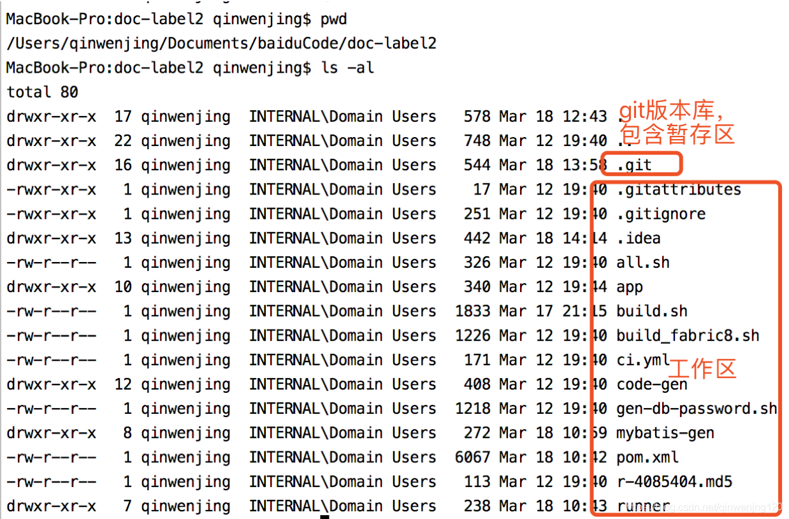

# git reset 

git [reset](https://so.csdn.net/so/search?q=reset&spm=1001.2101.3001.7020)命令有3种方式：

1、git reset --mixed：

此为默认方式，等同于不带任何参数的git reset。

2、git reset --soft：

回退到某个版本，只回退了[commit](https://so.csdn.net/so/search?q=commit&spm=1001.2101.3001.7020)的信息，如果还要提交，直接commit即可（修改内容还在，变成已add的状态），索引（暂存区）和工作目录的内容是不变的，在三个命令中对现有版本库状态改动最小。

3、git reset --hard：

彻底回退到某个版本，本地的源码也会变为上一个版本的内容，所有修改的内容都会丢失， (修改的代码 不会变成未add的状态)。索引（暂存区）内容和工作目录内容都会变给定提交时的状态。

 

|         | git reset产生影响 | 表现           |          |                                              |                                                              |
| ------- | ----------------- | -------------- | -------- | -------------------------------------------- | ------------------------------------------------------------ |
| 选项    | HEAD              | 索引（暂存区） | 工作目录 | 原有文件内容的变更                           | 目录结构的变更（增加或者删除文件）                           |
| --soft  | 是                | 否             | 否       | 修改内容还在，变成未add的状态                | 新增文件：还存在，变成未add的状态(目录结构中文件变成绿色，可以再次执行git commit )； 删除文件：目录结构中还是没有，可以直接执行git commit |
| --mixed | 是                | 是             | 否       | 修改内容还在，变成未add的状态                | 新增文件： 还存在，变成未add的状态(目录结构中文件变成红色，需要执行命令git add . 再执行git commit ) 删除文件：目录结构中还是没有，可以直接执行git commit |
| --hard  | 是                | 是             | 是       | 修改内容丢失，修改的代码 不会变成未add的状态 | 新增文件丢失、删除的文件相当于没删                           |

 

 

如何理解HEAD、索引(暂存区)、工作目录：

Git是什么 : Git是目前世界上最先进的分布式版本控制系统， 工作区中有一个隐藏目录.git时，为Git的版本库。

Git的版本库里存了很多东西，其中最重要的就是称为stage（或者叫index）的暂存区，还有Git为我们自动创建的第一个分支master，以及指向master的一个指针叫HEAD。

工作区（Working Directory）:电脑里能看到的目录

 

以项目为例说明：

 

 

使用情况：

 

1、提交远程仓库时，多次commit都push错了分支，本来该提交到dev， 结果提交到了master， 在想将代码提交到dev时，说同一个commit不能提交到不同的分支

解决方式：版本回退但得保留所有的修改内容，使用git reset --soft

 

 