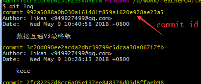

# git查看commit提交记录详

如何使用git查看commit修改了哪些内容，以便后续的代码工作。

与之相关的命令就是: 

**git log 查看所有的commit提交记录** 

**git show 查看提交的详情** 

具体步骤：    

首先，需要通过git log打印所有commit记录,

例如 

   

之后的git show都是基于commit hashID输出的。

 1.查看最新的commit **git show** 

2.查看指定commit hashID的所有修改： **git show commitId** 

3.查看某次commit中具体某个文件的修改： **git show commitId fileName**