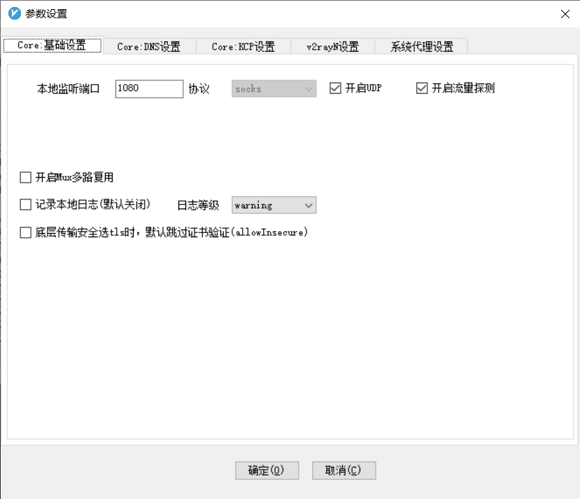

## 设置github sockets代理

v2ray是socks

```
git config --global http.https://github.com.proxy socks5://127.0.0.1:1080
git config –-global https.https://github.com.proxy socks5://127.0.0.1:1080
```



## 设置github http代理

ssr小飞机是http

```
git config –global http.https://github.com.proxy https://127.0.0.1:1081
git config –global https.https://github.com.proxy https://127.0.0.1:1081
```

## 查看、重置代理

```
查看所有配置
git config -l
reset 代理设置
git config –global –unset http.proxy
git config –global –unset https.proxy

如果上面这个不管用，需要用如下命令：
git config --global --unset http.https://github.com.proxy
git config --global --unset https.https://github.com.proxy
```

