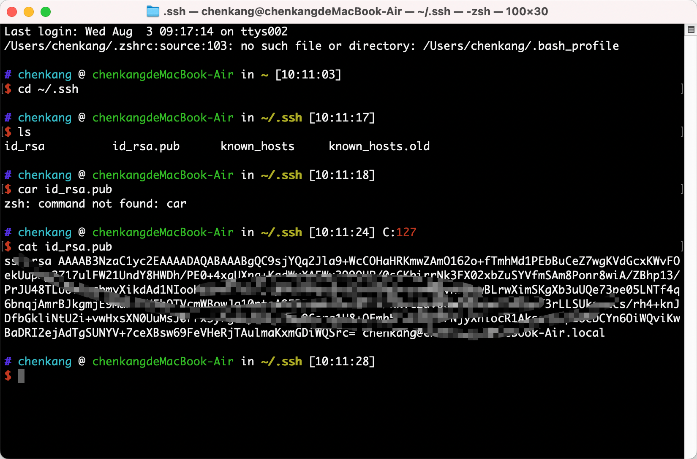
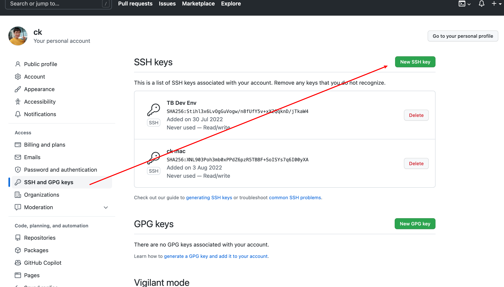
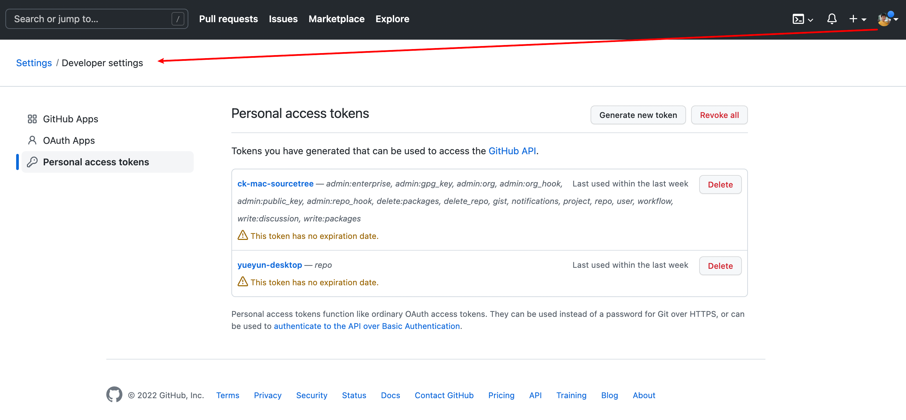
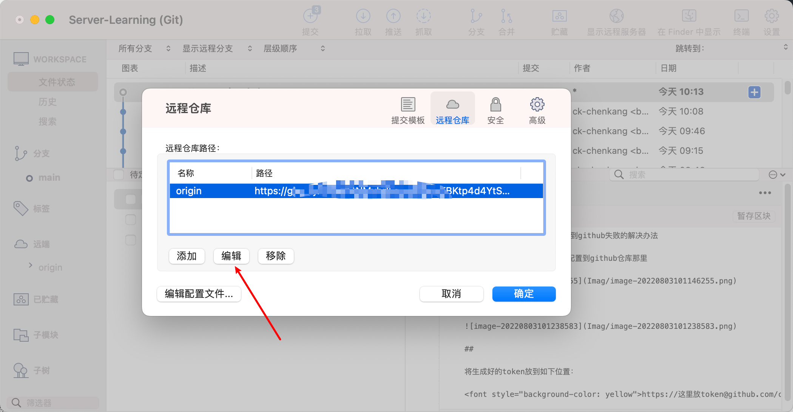

# mac下利用sourcetree推送到github失败的解决办法

## 将本机的ssh public ke配置到github仓库那里





## 设置git代理

```
具体可参考 git设置走v2ray代理
```


## github生成 token



## 

将生成好的token放到如下位置：

<font style="background-color: yellow">https://这里放token@github.com/ck-chenkang/Server-Learning.git</font>



