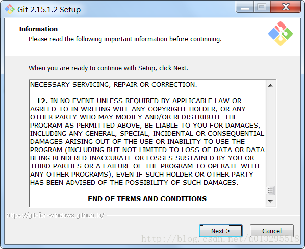
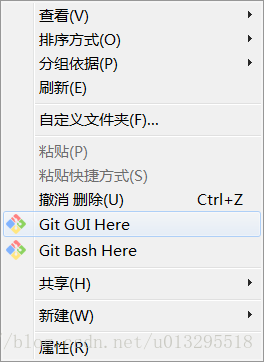
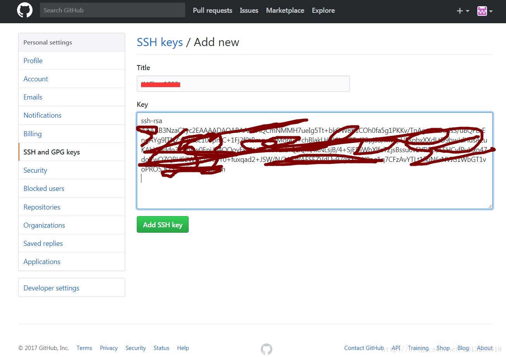

​                                            

- [Git简介](#1git简介)
- [Git工作示意图](#2git工作示意图)
- Windows下安装Git
  - [1 Git下载](#31-git下载)
  - [2 双击安装](#32-双击安装)
- Git配置
  - [1注册Github账号](#41注册github账号)
  - [2 通过Git生成SSH Key](#42-通过git生成ssh-key)
  - [2 添加公钥](#42-添加公钥)
  - [3 配置本地信息](#43-配置本地信息)
  - [4 提交本地文件到GitHub](#44-提交本地文件到github)
  - [5 从GitHub上down工程到本地](#45-从github上down工程到本地)

# 1.Git简介

> Git是一个开源的[分布式](https://so.csdn.net/so/search?q=分布式&spm=1001.2101.3001.7020)版本控制系统，可以有效、高速的处理从很小到非常大的项目版本管理[1](#fn:git)。Git 是 Linus Torvalds 为了帮助管理 Linux 内核开发而开发的一个开放[源码](https://so.csdn.net/so/search?q=源码&spm=1001.2101.3001.7020)的版本控制软件。

# 2.Git工作示意图

# 3.Windows下安装Git

## **3.1 Git下载** 

- 下载地址：https://git-for-windows.github.io/ 
    
- 下载有时候很慢，请耐心等候。

## **3.2 双击安装** 

- 版本：2.15.1.2
- 双击之后一路Next
- 详细情况见下图： 
  - 双击安装文件，打开安装窗口，进入Information界面 
     
  - 点击“next”按钮，进入Select Destination Location界面，可根据自己的需求修改安装路径 
     
  - 点击“next”按钮，进入Select Componets界面，选择要安装的组件，详情见图。 
     
  - 点击“next”，进入Select Start Menu Folder界面，设置开始菜单中快捷方式的目录名称, 
     
  - 点击“Next”选择默认编辑器我选择的“Vim” 
     
  - 点击“next”，进入Adjusting your PATH environment界面，设置环境变量 ：选择使用什么样的命令行工具使用git，我选择了git bash和windows命令行。 
     
  - 点击“Next”选择传输后台使用OpenSSL 
     
  - 点击“next”按钮进入Configuring the line ending conversions界面，选择换行格式，windows上跨平台支持，unix以及非跨平台支持。 
     
  - 点击“next”按钮进入配置终端模拟器（Configuring the terminal emulator to use with Git Bash）界面，默认设置 
     
  - 点击“next”按钮进入额外的配置选项（Configuring extra options），默认设置。允许系统缓存，允许信任证书管理。 
     
  - 点击“Install”开始安装。 
     
  - 安装完成 
     
  - 此时我们在文件管理器中点击右键就可以看到打开git的菜单 
     

# 4.Git配置

## **4.1注册Github账号** 

- 网址:https://github.com/ 
   
- 登录之后界面 
   

## **4.2 通过Git生成SSH Key** 

- Windows下打开Git Bash，创建SSH Key，输入如下：

  > $ ssh-keygen -t rsa -C “注册邮箱” 
  >  

- 打开C:\Users\Administrator.ssh目录，“id_rsa.pub”文件内容就是公钥

## **4.2 添加公钥** 

- 第一步：点击用户名头像,然后选择Settings进入下个页面,如下图: 
   
- 第二步：点击“SSH and GPG keys”，选择“New SSH key”，如图： 
   
- 第三步：将`C:\Users\Administrator\.ssh\id_rsa.pub`文件中的内容（公钥）填入key栏： 
   
- 第四步：点击“Add SSH key”创建成功： 
   
- 测试ssh key是否成功，使用命令`ssh -T git@github.com`，如果出现You’ve successfully authenticated, but GitHub does not provide shell access 。这就表示已成功连上github。如图： 
   

## **4.3 配置本地信息** 

> git config –global user.name ‘账号名’ 
>  git config –global user.email 邮箱 
>  git config –list 查看配置结果

## **4.4 提交本地文件到GitHub** 

- 首先获取远程仓库链接，如：`https://github.com/xxx/MyDemo.git`
- 进入本地需要push到github的项目，“cd”进入根目录。
- 执行`git init`命令，初始化本地仓库，会创建一个.git的隐藏文件夹。
- 执行`git add .`命令，将目录添加入索引
- 执行 `git commit -m "日志"`
- 执行 `git remote add origin github远程仓库的链接`;
- 执行`git pull origin master`从远程仓库获取更新，在2.9.2之后的版本还需要加上`--allow-unrelated-histories`，否则会pull失败。
- 执行 `git push -u origin master`等待结束，提交成功；

## **4.5 从GitHub上down工程到本地** 

- 第一步获取github上工程路径
- 进入存放项目的目录，执行`git clone url`命令等待结束即可。

------

1. [git](https://git-scm.com/) [↩](#fnref:git)