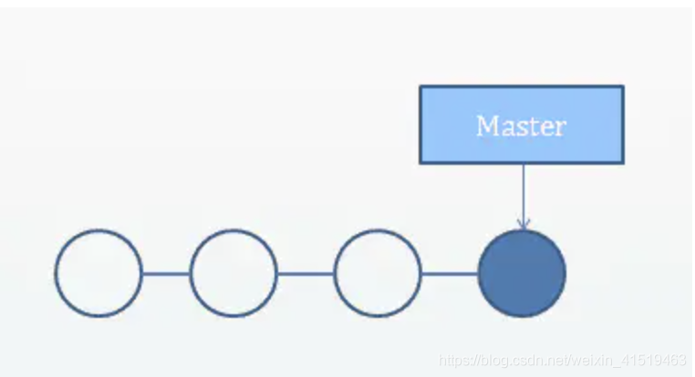
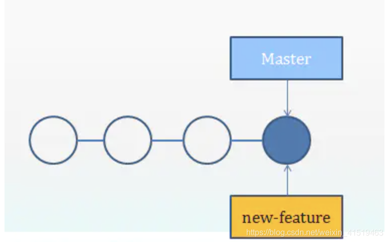
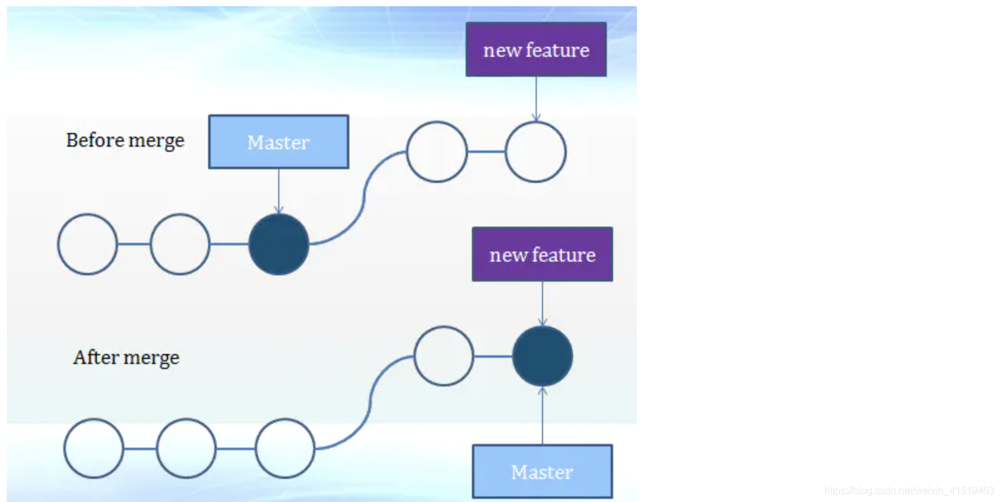
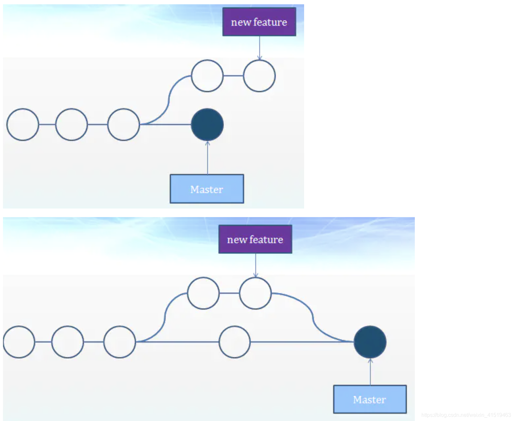
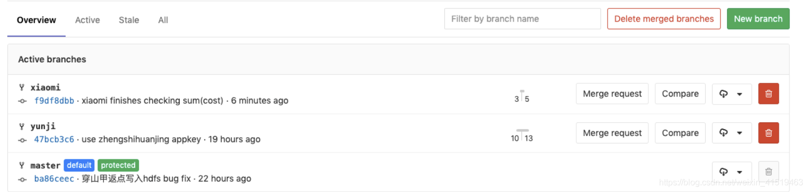

# git分支管理（创建、删除、切换、合并分支）                                 

[熟练使用 git 分支管理](https://juejin.im/post/5a3b14fc6fb9a04514643375)

## **分支** 

在日常开发中，无论是修复一个bug或者添加一个功能，我们都应该新建一个分支来封装我们的修改。这样可以保证我们不稳定的代码永远不会提交到主代码分支上。

git branch命令

```shell
git branch   //列出所有的分支
git branch <branch> //创建名为<branch>的分支，但是不会切换过去
git branch -d <branch>  //删除指定分支，这是一个“安全”操作，git会阻止你删除包含未合并更改的分支。
git branch -D <branch>  //强制删除分支
git branch -m <branch> //重新命名当前分支

```

##   **创建分支** 

分支只是一个指向提交的指针，创建新分支实际上只是创建了一个新的指针，仓库本身不会受到影响，一开始仓库只有一条分支：



然后执行下面的命令创建一个分支，用于加一个新feature：

```
git branch new-feature
1
```



当然执行后，你只是创建了这个分支，还需要执行`git chekcout new-feature`切换到`new-feature`分支，然后再编写代码，然后使用`git add`和`git commit`。

## **删除分支** 

假如已经开发完new-feature并且已经commit代码，那么就可以自由删除这个分支了：

```
git branch -d new-feature
1
```

如果分支还没有合并入master，会报下面的错误：

```
error: The branch 'new feature' is not fully merged.
If you are sure you want to delete it, run 'git branch -D crazy-experiment'.
12
```

一般情况下是应该合并分支入master，但是也可以不合并，用`-D`执行强制删除（不并入master，又要删除，应该是要放弃这个分支的修改了）：

```
git branch -D new-feature
1
```

## **切换分支** 

使用`git checkout` 命令可以切换分支。切换分支会更新当前工作目录中的文件，还可以用`git log`查看当前分支的历史。

```shell
git checkout <existing-branch> //切换到一个已有分支上
git checkout -b <new-branch> // -b 标记 可以方便让你先创建一个新的new-branch,再直接切换过去
git checkout -b <new-branch> <existing-branch> //在已有的分支上创建分支，原来的分支使新分支的基
123
```

一般流程：

先创建分支，然后切换到这个分支上

```shell
git branch new-feature
git checkout new-feature
12
```

改动代码后，提交

```shell
git add <some file>
git commit -m "A new feature"
12
```

`git log`会显示在此分支上的每一次的commit, 当`checkout`到master分支去，再`git log`,会发现`new-feature`分支的提交都不在，这就说明了分支上的提交不影响master分支。 在这之后，可以考虑合并new-feature或者在master分支上开始别的工作。

## **合并分支** 

```shell
git merge <branch>  //将指定分支并入当前分支
1
```

一旦在新分支上完成开发，我们需要把新分支的提交合并到主分支，git会根据目前分支之间的结构信息，选择不同的算法来完成合并：

- 快速向前合并
- 三路合并

### 快速向前合并

当创建新分支并且在新分支上完成代码开发和提交之后，master分支上仍保持原样时，就可以执行快速向前合并，git将当前的HEAD指针快速移到目标分支的顶端，十分简单：



实例

```shell
# 开始新功能
git checkout -b new-feature master

# 编辑文件
git add <file>
git commit -m "开始新功能"

# 编辑文件
git add <file>
git commit -m "完成功能"

# 合并new-feature分支
git checkout master
git merge new-feature
git branch -d new-feature
123456789101112131415
```

对于合作开发的人少的项目，这是一种主要的工作流。合作开发的人多的话，主`master`分支经常都会有新提交，如果你的`new-feature`耗时比较久，再提交时，`master`分支可能已经过去几个版本了，这时候就需要下面的三路合并了。

### 三路合并

如果master分支在new-feature分离后，又有了新的提交，即开始分叉了，git只能执行三路合并，三路合并使用一个专门的提交来合并两个分支的历史。



**解决冲突**

如果两个分支对同一个文件的同一部分均有修改时，git将无法判断应该使用哪个，这时候合并提交会停止，需要你手动解决这些冲突。你可以使用`git status`来查看哪里存在冲突。当修改完所有的冲突后，`git add`所有的冲突文件，运行`git commit`生成一个合并提交，这和提交一个普通快照的流程相同。

实例

```shell
# 开始新功能
git checkout -b new-feature master

# 编辑文件
git add <file>
git commit -m "开始新功能"

# 编辑文件
git add <file>
git commit -m "完成功能"

# 在master分支上开发
git checkout master

# 编辑文件
git add <file>
git commit -m "在master上添加了一些极其稳定的功能"

# 合并new-feature分支
git merge new-feature
git branch -d new-feature #最后可以删除这个分支
123456789101112131415161718192021
```

执行merge命令时会冲突，因为无法将 master 直接移动到 new-feature，所以需要你手动合并冲突后再提交。

## **远程分支** 

创建远程分支并且把本地分支**push**到该远程分支上（记得先用git branch命令本地创建分支）

```shell
git push origin master:[new_remote_branch_name]
1
```

删除远程分支：

```shell
git push origin :heads/[remote_branch_name]
1
```

如果把本地分支提交到gitlab上，打开branch页面即可看到自己新创建的远程分支，此时再点击merge_request申请合并入master分支即可（项目管理员负责合并冲突）
 
 如果此时远程master分支上有别人提交的更新，根据别人修改的文件与我所修改的文件是否相同，会有不同的情况

- 不相同：这种情况没有冲突，可以直接合并。
- 相同：有冲突，在gitlab上无法合并。此时需要把master分支内容pull到本地分支，在本地分支就会有冲突提醒，用`<<<<<<< ======== >>>>>>>`来划分出别人的修改和自己的修改。这个时候解决冲突的权利就到了我自己的手上，我可以任意修改这个文件，只要保证把`<<<<<<< ======== >>>>>>>`这些符号全部消除接口。按照我的意愿修改完代码之后（甚至可以直接把别人的修改删掉），提交，则此时不再有冲突。然后再push到远程分支上，再合并即可（此时远程合并也不会认为有冲突）。