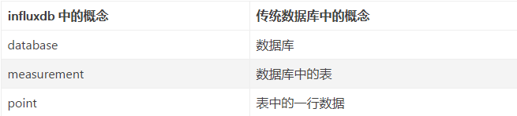

# InfluxDB入门

[InfluxDB中文](https://jasper-zhang1.gitbooks.io/influxdb/content/)

[influxdb函数](https://docs.influxdata.com/influxdb/v1.5/query_language/functions/)

[influxdb笔记](https://blog.csdn.net/vtnews/article/details/80197045)


## InfluxDB简介

一些名词、优点

InfluxDB是目前流行的时间序列数据库（TSDB，常见 TSDB：Influxdb、opentsdb、timeScaladb、Druid 等）。

时间序列数据库最简单的定义是数据格式里包含Timestamp字段的数据，比如某一时间环境的温度，CPU的使用率等，几乎所有的数据都

可以打上一个Timestamp字段。时间序列数据更重要的一个属性是如何去查询它，包括数据的过滤，计算等等。

InfluxDB是一个开源的分布式时序、时间和指标数据库，使用go语言编写，无需外部依赖。其设计目标是实现分布式和水平伸缩扩展，是 

InfluxData 的核心产品。

InfluxDB是一款专门处理**高写入和查询负载**的时序数据库，用于存储大规模的时序数据并进行实时分析，包括来自DevOps监控、应用指

标和IoT传感器上的数据

**主要特点：**

- 专为时间序列数据量身订造高性能数据存储。TSM引擎**提供数据高速读写和压缩等功能**
- 简单高效的**HTTP API写入和查询接口**
- 针对时序数据，量身订造类似SQL的查询语言，轻松查询聚合数据
- 允许对tag建索引，实现快速有效的查询
- 数据保留策略（Retention policies）**能够有效地使旧数据自动失效**
- schemaless(无结构)，可以是**任意数量的列**；
- Built-in Explorer **自带管理工具**
- 支持min, max, sum, count, mean, median 等一系列函数；
- 基于时间序列，支持与时间有关的相关函数（如最大，最小，求和等）；

## 与传统数据库的比较



### 一般来说
InfluxDB用于存储大量的时间序列数据，并对这些数据进行快速的实时分析。SQL数据库也可以提供时序的功能，但时序并不是其目的。

在InfluxDB中，timestamp标识了在任何给定数据series中的单个点。就像关系型数据库中的主键。

InfluxDB考虑到schema可能随时间而改变，因此赋予了其便利的动态能力。比如只需要在新的数据line中加入所需的值，

cpu,host=serverA,region=us_west,newTag=aa value=0.64,newValue=bbb

### 更形象一点

下表是一个叫`foodships`的SQL数据库的例子，并有没有索引的`#_foodships`列和有索引的`park_id`,`planet`和`time`列。

| park_id | planet | time                | _foodships |
| ------- | ------ | ------------------- | ---------- |
| 1       | Earth  | 1429185600000000000 | 0          |
| 1       | Earth  | 1429185601000000000 | 3          |
| 1       | Earth  | 1429185602000000000 | 15         |
| 1       | Earth  | 1429185603000000000 | 15         |
| 2       | Saturn | 1429185600000000000 | 5          |
| 2       | Saturn | 1429185601000000000 | 9          |
| 2       | Saturn | 1429185602000000000 | 10         |
| 2       | Saturn | 1429185603000000000 | 14         |

这些数据在InfluxDB看起来就像这样：

```
name: foodships
tags: park_id=1, planet=Earth
time                           #_foodships
----                           ------------
2015-04-16T12:00:00Z     0
2015-04-16T12:00:01Z     3
2015-04-16T12:00:02Z     15
2015-04-16T12:00:03Z     15

name: foodships
tags: park_id=2, planet=Saturn
time                           #_foodships
----                           ------------
2015-04-16T12:00:00Z     5
2015-04-16T12:00:01Z     9
2015-04-16T12:00:02Z     10
2015-04-16T12:00:03Z     14
```

参考上面的数据，一般可以这么说：

- InfluxDB的measurement(foodships)和SQL数据库里的table类似；
- InfluxDB的tag(park_id和planet)类似于SQL数据库里索引的列；
- InfluxDB中的field(#_foodships)类似于SQL数据库里没有索引的列；
- InfluxDB里面的数据点(例如2015-04-16T12:00:00Z 5)类似于SQL数据库的行；

基于这些数据库术语的比较，InfluxDB的continuous query和retention policy与SQL数据库中的存储过程类似。 它们被指定一次，然后

定期自动执行。

在InfluxDB中InfluxQL是一种类SQL的语言。对于来自其他SQL或类SQL环境的用户来说，它已经被精心设计，而且还提供特定于存储和

分析时间序列数据的功能。

InfluxQL的`select`语句来自于SQL中的`select`形式：

```sql
SELECT <stuff> FROM <measurement_name> WHERE <some_conditions>
```


如果你想看到planet为`Saturn`，并且在UTC时间为2015年4月16号12:00:01之后的数据：

```sql
SELECT * FROM "foodships" WHERE "planet" = 'Saturn' AND time > '2015-04-16 12:00:01'
```

如上例所示，InfluxQL允许您在`WHERE`子句中指定查询的时间范围。您可以使用包含单引号的日期时间字符串，格式为YYYY-MM-DD 

HH：MM：SS.mmm（mmm为毫秒，为可选项，您还可以指定微秒或纳秒。您还可以使用相对时间与`now()`来指代服务器的当前时间

戳：

```sql
SELECT * FROM "foodships" WHERE time > now() - 1h
```

​	该查询输出measurement为`foodships`中的数据，其中时间戳比服务器当前时间减1小时。与now()做计算来决定时间范围的可选单位有：

| 字母 | 意思 |
| ---- | ---- |
| u或µ | 微秒 |
| ms   | 毫秒 |
| s    | 秒   |
| m    | 分钟 |
| h    | 小时 |
| d    | 天   |
| w    | 星期 |

SQL数据库和InfluxDB之间存在一些重大差异。SQL中的JOIN不适用于InfluxDB中的measurement。InfluxQL还支持正则表达式，表达

式中的运算符，SHOW语句和GROUP BY语句。 InfluxQL功能还包括COUNT，MIN，MAX，MEDIAN，DERIVATIVE等。

### 为什么InfluxDB不是CRUD的一个解释

InfluxDB是针对时间序列数据进行了优化的数据库。这些数据通常来自分布式传感器组，来自大型网站的点击数据或金融交易列表等。

这个数据有一个共同之处在于它只看一个点没什么用。一个读者说，在星期二UTC时间为12:38:35时根据他的电脑CPU利用率为12％，这个很难得出什么结论。只有跟其他的series结合并可视化时，它变得更加有用。随着时间的推移开始显现的趋势，是我们从这些数据里真正想要看到的。另外，时间序列数据通常是一次写入，很少更新。

结果是，由于优先考虑create和read数据的性能而不是update和delete，InfluxDB不是一个完整的CRUD数据库，更像是一个CR-ud。

## Influxdb和其他时序数据库比较

从部署、集群、资源占用、存储模型、性能等方面比较influxdb和[opentsdb](https://so.csdn.net/so/search?q=opentsdb&spm=1001.2101.3001.7020)，具体如下：


## 硬件推荐指南

[中文文档-硬件推荐指南](https://jasper-zhang1.gitbooks.io/influxdb/content/Guide/hardware_sizing.html)

## 关键概念

[influxDB中文文档-关键概念篇](https://jasper-zhang1.gitbooks.io/influxdb/content/Concepts/key_concepts.html)

[时序数据库InfluxDB使用详解-几个重要概念](https://blog.csdn.net/rorntuck7/article/details/86571675)

|     **database**     |  **field key**  | **field set** |
| :------------------: | :-------------: | :-----------: |
|   **field value**    | **measurement** |   **point**   |
| **retention policy** |   **series**    |  **tag key**  |
|     **tag set**      |  **tag value**  | **timestamp** |

### 示例数据

下一节将参考下面列出的数据。 虽然数据是伪造的，但在InfluxDB中是一个很通用的场景。 数据展示了在2015年8月18日午夜至2015年8月18日上午6时12分在两个地点`location`（地点`1`和地点`2`）显示两名科学家`scientists`（`langstroth`和`perpetua`）计数的蝴蝶(`butterflies`)和蜜蜂(`honeybees`)数量。 假设数据存在名为`my_database`的数据库中，而且存储策略是`autogen`。

```
ame: census
-————————————
time                                      butterflies     honeybees     location     scientist
2015-08-18T00:00:00Z      12                   23                    1                 langstroth
2015-08-18T00:00:00Z      1                     30                    1                 perpetua
2015-08-18T00:06:00Z      11                   28                    1                 langstroth
2015-08-18T00:06:00Z   3                     28                    1                 perpetua
2015-08-18T05:54:00Z      2                     11                    2                 langstroth
2015-08-18T06:00:00Z      1                     10                    2                 langstroth
2015-08-18T06:06:00Z      8                     23                    2                 perpetua
2015-08-18T06:12:00Z      7                     22                    2                 perpetua
```

其中census是`measurement`，butterflies和honeybees是`field key`，location和scientist是`tag key`。

### 讨论

现在您已经在InfluxDB中看到了一些示例数据，本节将详细分析这些数据。

InfluxDB是一个时间序列数据库，因此我们开始一切的根源就是——时间。在上面的数据中有一列是`time`，在InfluxDB中所有的数据都有这一列。`time`存着时间戳，这个时间戳以[RFC3339](https://www.ietf.org/rfc/rfc3339.txt)格式展示了与特定数据相关联的UTC日期和时间。

接下来两个列叫作`butterflies`和`honeybees`，称为fields。fields由field key和field value组成。field key(`butterflies`和`honeybees`)都是字符串，他们存储元数据；field key `butterflies`告诉我们蝴蝶的计数从12到7；field key `honeybees`告诉我们蜜蜂的计数从23变到22。

field value就是你的数据，它们可以是字符串、浮点数、整数、布尔值，因为InfluxDB是时间序列数据库，所以field value总是和时间戳相关联。

在示例中，field value如下：

```
12   23
1    30
11   28
3    28
2    11
1    10
8    23
7    22
```

在上面的数据中，每组field key和field value的集合组成了`field set`，在示例数据中，有八个`field set`：

```
butterflies = 12 honeybees = 23
butterflies = 1 honeybees = 30
butterflies = 11 honeybees = 28
butterflies = 3 honeybees = 28
butterflies = 2 honeybees = 11
butterflies = 1 honeybees = 10
butterflies = 8 honeybees = 23
butterflies = 7 honeybees = 22
```

field是InfluxDB数据结构所必需的一部分——在InfluxDB中不能没有field。还要注意，field是没有索引的。如果使用field value作为过滤条件来查询，则必须扫描其他条件匹配后的所有值。因此，这些查询相对于tag上的查询（下文会介绍tag的查询）性能会低很多。 一般来说，字段不应包含常用来查询的元数据。

样本数据中的最后两列（`location`和`scientist`）就是tag。 tag由tag key和tag value组成。tag key和tag value都作为字符串存储，并记录在元数据中。示例数据中的tag key是`location`和`scientist`。 `location`有两个tag value：`1`和`2`。`scientist`还有两个tag value：`langstroth`和`perpetua`。

在上面的数据中，tag set是不同的每组tag key和tag value的集合，示例数据里有四个tag set：

```
location = 1, scientist = langstroth
location = 2, scientist = langstroth
location = 1, scientist = perpetua
location = 2, scientist = perpetua
```

tag不是必需的字段，但是在你的数据中使用tag总是大有裨益，因为不同于field， tag是索引起来的。这意味着对tag的查询更快，tag是存储常用元数据的最佳选择。

> #### 不同场景下的数据结构设计
>
> 如果你说你的大部分的查询集中在字段`honeybees`和`butterflies`上：
>
> ```
> SELECT * FROM "census" WHERE "butterflies" = 1
> SELECT * FROM "census" WHERE "honeybees" = 23
> ```
>
> 因为field是没有索引的，在第一个查询里面InfluxDB会扫描所有的`butterflies`的值，第二个查询会扫描所有`honeybees`的值。这样会使请求时间很长，特别在规模很大时。为了优化你的查询，你应该重新设计你的数据结果，把field(`butterflies`和`honeybees`)改为tag，而将tag（`location`和`scientist`）改为field。
>
> ```
> name: census
> -————————————
> time                                      location     scientist      butterflies     honeybees
> 2015-08-18T00:00:00Z      1                 langstroth    12                   23
> 2015-08-18T00:00:00Z      1                 perpetua      1                     30
> 2015-08-18T00:06:00Z      1                 langstroth    11                   28
> 2015-08-18T00:06:00Z   1                 perpetua      3                     28
> 2015-08-18T05:54:00Z      2                 langstroth    2                     11
> 2015-08-18T06:00:00Z      2                 langstroth    1                     10
> 2015-08-18T06:06:00Z      2                 perpetua      8                     23
> 2015-08-18T06:12:00Z      2                 perpetua      7                     22
> ```
>
> 现在`butterflies`和`honeybees`是tag了，当你再用上面的查询语句时，就不会扫描所有的值了，这也意味着查询更快了。

measurement作为tag，fields和time列的容器，measurement的名字是存储在相关fields数据的描述。 measurement的名字是字符串，对于一些SQL用户，measurement在概念上类似于表。样本数据中唯一的测量是`census`。 名称`census`告诉我们，fields值记录了`butterflies`和`honeybees`的数量，而不是不是它们的大小，方向或某种幸福指数。

单个measurement可以有不同的retention policy。 retention policy描述了InfluxDB保存数据的时间（DURATION）以及这些存储在集群中数据的副本数量（REPLICATION）。 如果您有兴趣阅读有关retention policy的更多信息，请查看[数据库管理](https://jasper-zhang1.gitbooks.io/influxdb/content/Concepts/key_concepts.html)章节。

> 注意：在单节点的实例下，Replication系数不管用。

在样本数据中，measurement `census`中的所有内容都属于`autogen`的retention policy。 InfluxDB自动创建该存储策略; 它具有无限的持续时间和复制因子设置为1。

现在你已经熟悉了measurement，tag set和retention policy，那么现在是讨论series的时候了。 在InfluxDB中，series是共同retention policy，measurement和tag set的集合。 以上数据由四个series组成：

| 任意series编号 | retention policy | measurement | tag set                               |
| -------------- | ---------------- | ----------- | ------------------------------------- |
| series 1       | `autogen`        | `census`    | `location = 1,scientist = langstroth` |
| series 2       | `autogen`        | `census`    | `location = 2,scientist = langstroth` |
| series 3       | `autogen`        | `census`    | `location = 1,scientist = perpetua`   |
| series 4       | `autogen`        | `census`    | `location = 2,scientist = perpetua`   |

理解series对于设计数据schema以及对于处理InfluxDB里面的数据都是很有必要的。

最后，point就是具有相同timestamp的相同series的field集合。例如，**这就是一个point：**

```
name: census
-----------------
time                           butterflies     honeybees     location     scientist
2015-08-18T00:00:00Z     1                  30               1               perpetua
```

例子里的series的retention policy为`autogen`，measurement为`census`，tag set为`location = 1, scientist = perpetua`。point的timestamp为`2015-08-18T00:00:00Z`。

我们刚刚涵盖的所有内容都存储在数据库（database）中——示例数据位于数据库`my_database`中。 InfluxDB数据库与传统的关系数据库类似，并作为users，retention policy，continuous以及point的逻辑上的容器。 有关这些主题的更多信息，请参阅[身份验证和授权](https://jasper-zhang1.gitbooks.io/influxdb/content/Concepts/key_concepts.html)和[连续查询(continuous query)](https://jasper-zhang1.gitbooks.io/influxdb/content/Concepts/key_concepts.html)。

数据库可以有多个users，retention policy，continuous和measurement。 InfluxDB是一个无模式数据库，意味着可以随时添加新的measurement，tag和field。 它旨在使时间序列数据的工作变得非常棒。

### 关键概念总结


timestamp：time存着时间戳，这个时间戳以RFC3339格式展示了与特定数据相关联的UTC日期和时间。

field set：每组field key和field value的集合，如butterflies = 3, honeybees = 28

field key/value：在InfluxDB中不能没有field，field没有索引。

tag set：不同的每组tag key和tag value的集合，如location = 1, scientist = langstroth

tag key/value：在InfluxDB中可以没有tag，tag是索引起来的。

measurement: 是一个容器，包含了列time，field和tag。概念上类似表。

**retention policy**：单个measurement可以有不同的retention policy。measurement默认会有一个autogen的保留策略，autogen中的

数据永不删除且备份数replication为1（只有一份数据，在集群中起作用）。

**series**：series是共同retention policy，measurement和tag set的集合。

如下：point：point是具有相同timestamp、相同series（measurement，rp，tag set相同）的field。这个点在此时刻是唯一存在的。 

相反，当你使用与该series中现有点相同的timestamp记将

新point写入同一series时，该field set将成为旧field set和新field set的并集。

| 任意series编号 | retention policy | measurement | tag set                               |
| -------------- | ---------------- | ----------- | ------------------------------------- |
| series 1       | `autogen`        | `census`    | `location = 1,scientist = langstroth` |
| series 2       | `autogen`        | `census`    | `location = 2,scientist = langstroth` |
| series 3       | `autogen`        | `census`    | `location = 1,scientist = perpetua`   |
| series 4       | `autogen`        | `census`    | `location = 2,scientist = perpetua`   |

point：point是具有相同timestamp、相同series（measurement，rp，tag set相同）的field。这个点在此时刻是唯一存在的。 相反，当你使用与该series中现有点相同的timestamp记将新point写入同一series时，该field set将成为旧field set和新field set的并集。

point的数据结构由时间戳（time）、标签（tags）、数据（fields）三部分组成，具体含义如下：


这就是一个point

```
name: census
-----------------
time                           butterflies     honeybees     location     scientist
2015-08-18T00:00:00Z     1                  30               1               perpetua
```

### filed和tag区别

filed是真正存数的，tag是用来给这组数据打个标签，一般来讲，标签是可以枚举的，数却是千变万化的

### 保留策略

- 每个数据库刚开始会自动创建一个默认的存储策略 autogen，数据保留时间为永久，在集群中的副本个数为1，之后用户可以自己设置（查看、新建、修改、删除），例如保留最近2小时的数据。插入和查询数据时如果不指定存储策略，则使用默认存储策略，且默认存储策略可以修改。InfluxDB 会定期清除过期的数据。
- 每个数据库可以有多个过期策略：
  show retention policies on “db_name”
- Shard 在 influxdb中是一个比较重要的概念，它和 retention policy 相关联。每一个存储策略下会存在许多 shard，每一个 shard 存储一个指定时间段内的数据，并且不重复，例如 7点-8点 的数据落入 shard0 中，8点-9点的数据则落入 shard1 中。每一个 shard 都对应一个底层的 tsm 存储引擎，有独立的 cache、wal、tsm file。
  这样做的目的就是为了可以通过时间来快速定位到要查询数据的相关资源，加速查询的过程，并且也让之后的批量删除数据的操作变得非常简单且高效。
- 建议在数据库建立的时候设置存储策略，不建议设置过多且随意切换
  create database testdb2 with duration 30d

### **存储目录**

influxdb的数据存储有三个目录，分别是meta、wal、data：

- meta 用于存储数据库的一些元数据，meta 目录下有一个 meta.db 文件；
- wal 目录存放预写日志文件，以 .wal 结尾；
- data 目录存放实际存储的数据文件，以 .tsm 结尾。

### 存储引擎（Timestamp-Structure Merge Tree）

TSM是在LSM的基础上优化改善的，引入了serieskey的概念，对数据实现了很好的分类组织。TSM主要由四个部分组成： cache、wal、tsm file、compactor：

- cache：插入数据时，先往 cache 中写入再写入wal中，可以认为 cache 是 wal 文件中的数据在内存中的缓存，cache 中的数据并不是无限增长的，有一个 maxSize 参数用于控制当 cache 中的数据占用多少内存后就会将数据写入 tsm 文件。如果不配置的话，默认上限为 25MB
- wal：预写日志，对比MySQL的 binlog，其内容与内存中的 cache 相同，作用就是为了持久化数据，当系统崩溃后可以通过 wal 文件恢复还没有写入到 tsm 文件中的数据，当 InfluxDB 启动时，会遍历所有的 wal 文件，重新构造 cache。
- tsm file：每个 tsm 文件的大小上限是 2GB。当达到 cache-snapshot-memory-size,cache-max-memory-size 的限制时会触发将 cache 写入 tsm 文件。
- compactor：主要进行两种操作，一种是 cache 数据达到阀值后，进行快照，生成一个新的 tsm 文件。另外一种就是合并当前的 tsm 文件，将多个小的 tsm 文件合并成一个，减少文件的数量，并且进行一些数据删除操作。 这些操作都在后台自动完成，一般每隔 1 秒会检查一次是否有需要压缩合并的数据。

### **连续查询**

influxdb 的连续查询是在数据库中自动定时启动的一组语句，语句中必须包含
SELECT 等关键词。influxdb 会将查询结果放在指定的数据表中。
目的：使用连续查询是最优的降低采样率的方式，连续查询和存储策略搭配使用将会大大降低 InfluxDB 的系统占用量。而且使用连续查询后，数据会存放到指定的数据表中，这样就为以后统计不同精度的数据提供了方便。

```sql
CREATE CONTINUOUS QUERY wj_30m ON shhnwangjian 
BEGIN 
    SELECT mean(connected_clients), MEDIAN(connected_clients),       
    MAX(connected_clients), MIN(connected_clients) 
    INTO redis_clients_30m 
    FROM redis_clients 
    GROUP BY ip,port,time(30m) 
END
 /*在shhnwangjian库中新建了一个名为 wj_30m 的连续查询，
每三十分钟取一个connected_clients字段的平均值、中位值、最大值、最小值 redis_clients_30m 表中，
使用的数据保留策略都是 default。*/

```

## 其他专业术语

### batch
用换行符分割的数据点的集合，这批数据可以使用HTTP请求写到数据库中。用这种HTTP接口的方式可以大幅降低HTTP的负载。尽管不同的场景下更小或更大的batch可能有更好地性能，InfluxData建议每个batch的大小在5000~10000个数据点。

### continuous query（CQ）
这个一个在数据库中自动周期运行的InfluxQL的查询。Continuous query在select语句里需要一个函数，并且一定会包含一个GROUP BY time()的语法。

### duration
retention policy中的一个属性，决定InfluxDB中数据保留多长时间。在duration之前的数据会自动从database中删除掉。

### function
包括InfluxQL中的聚合，查询和转换，可以在InfluxQL函数中查看InfluxQL中的完整函数列表。

### identifier
涉及continuous query的名字，database名字，field keys，measurement名字，retention policy名字，subscription 名字，tag keys以及user 名字的一个标记。

### line protocol
写入InfluxDB时的数据点的文本格式。如：cpu,host=serverA,region=us_west value=0.64

### metastore
包含了系统状态的内部信息。metastore包含了用户信息，database，retention policy，shard metadata，continuous query以及subscription。

### node
一个独立的influxd进程。

### now()
本地服务器的当前纳秒级时间戳。

### query
从InfluxDB里面获取数据的一个操作

### replication factor
retention policy的一个参数，决定在集群模式下数据的副本的个数。InfluxDB在N个数据节点上复制数据，其中N就是replication factor。

replication factor在单节点的实例上不起作用

### retention policy(RP)
InfluxDB数据结构的一部分，描述了InfluxDB保存数据的长短(duration)，数据存在集群里面的副本数(replication factor)，以及shard group的时间范围(shard group duration)。RPs在每个database里面是唯一的，连同measurement和tag set定义一个series。

当你创建一个database的时候，InfluxDB会自动创建一个叫做autogen的retention policy，其duration为永远，replication factor为1，shard group的duration设为的七天。

### schema
数据在InfluxDB里面怎么组织。InfluxDB的schema的基础是database，retention policy，series，measurement，tag key，tag value以及field keys。

### series cardinality
在InfluxDB实例上唯一database，measurement和tag set组合的数量。

例如，假设一个InfluxDB实例有一个单独的database，一个measurement。这个measurement有两个tag key：email和status。如果有三个不同的email，并且每个email的地址关联两个不同的status，那么这个measurement的series cardinality就是6(3*2=6)：

email	status
lorr@influxdata.com	start
lorr@influxdata.com	finish
marv@influxdata.com	start
marv@influxdata.com	finish
cliff@influxdata.com	start
cliff@influxdata.com	finish
注意到，因为所依赖的tag的存在，在某些情况下，简单地执行该乘法可能会高估series cardinality。 依赖的tag是由另一个tag限定的tag并不增加series cardinality。 如果我们将tagfirstname添加到上面的示例中，则系列基数不会是18（3 * 2 * 3 = 18）。 它将保持不变为6，因为firstname已经由email覆盖了：

email	status	firstname
lorr@influxdata.com	start	lorraine
lorr@influxdata.com	finish	lorraine
marv@influxdata.com	start	marvin
marv@influxdata.com	finish	marvin
cliff@influxdata.com	start	clifford
cliff@influxdata.com	finish	clifford
### server
一个运行InfluxDB的服务器，可以使虚拟机也可以是物理机。每个server上应该只有一个InfluxDB的进程。

### shard
shard包含实际的编码和压缩数据，并由磁盘上的TSM文件表示。 每个shard都属于唯一的一个shard group。多个shard可能存在于单个shard group中。每个shard包含一组特定的series。给定shard group中的给定series上的所有点将存储在磁盘上的相同shard（TSM文件）中。

### shard duration
shard duration决定了每个shard group跨越多少时间。具体间隔由retention policy中的SHARD DURATION决定。

例如，如果retention policy的SHARD DURATION设置为1w，则每个shard group将跨越一周，并包含时间戳在该周内的所有点。

### shard group
shard group是shard的逻辑组合。shard group由时间和retention policy组织。包含数据的每个retention policy至少包含一个关联的shard group。给定的shard group包含shard group覆盖的间隔的数据的所有shard。每个shard group跨越的间隔是shard的持续时间。

### subscription
subscription允许Kapacitor在push model中接收来自InfluxDB的数据，而不是基于查询数据的pull model。当Kapacitor配置为使用InfluxDB时，subscription将自动将订阅的数据库的每个写入从InfluxDB推送到Kapacitor。subscription可以使用TCP或UDP传输写入。

### tsm(Time Structured Merge tree)
InfluxDB的专用数据存储格式。 TSM可以比现有的B+或LSM树实现更大的压缩和更高的写入和读取吞吐量。

### user
在InfluxDB里有两种类型的用户：

admin用户对所有数据库都有读写权限，并且有管理查询和管理用户的全部权限。
非admin用户有针对database的可读，可写或者二者兼有的权限。
当认证开启之后，InfluxDB只执行使用有效的用户名和密码发送的HTTP请求。

### values per second
对数据持续到InfluxDB的速率的度量，写入速度通常以values per second表示。

要计算每秒速率的值，将每秒写入的点数乘以每点存储的值数。 例如，如果这些点各有四个field，并且每秒写入batch是5000个点，那么values per second是每点4个field x 每batch 5000个点 x 10个batch/秒=每秒200,000个值。

### wal(Write Ahead Log)
最近写的点数的临时缓存。为了减少访问永久存储文件的频率，InfluxDB将最新的数据点缓冲进WAL中，直到其总大小或时间触发然后flush到长久的存储空间。这样可以有效地将写入batch处理到TSM中。

可以查询WAL中的点，并且系统重启后仍然保留。在进程开始时，在系统接受新的写入之前，WAL中的所有点都必须flushed。

## InfluxDB安装

参考官方文档

[1.8版本 安装教程](https://docs.influxdata.com/influxdb/v1.8/introduction/install/)

# 数据库管理

InfluxQL提供了一整套管理命令，包括数据管理和保留策略的管理。

下面的示例使用InfluxDB的命令行界面（CLI）。 您还可以使用HTTP API执行命令; 只需向`/query`发送GET请求，并将该命令包含在URL参数`q`中。

> 注意：如果启用了身份验证，只有管理员可以执行本页上列出的大部分命令。

## 数据管理

### 创建数据库

#### 语法

```
CREATE DATABASE <database_name> [WITH [DURATION <duration>] [REPLICATION <n>] [SHARD DURATION <duration>] [NAME <retention-policy-name>]]
```

#### 语法描述

CREATE DATABASE需要一个数据库名称。

`WITH`，`DURATION`，`REPLICATION`，`SHARD DURATION`和`NAME`子句是可选的用来创建与数据库相关联的单个保留策略。如果您没有在`WITH`之后指定其中一个子句，将默认为`autogen`保留策略。创建的保留策略将自动用作数据库的默认保留策略。

一个成功的`CREATE DATABASE`查询返回一个空的结果。如果您尝试创建已存在的数据库，InfluxDB什么都不做，也不会返回错误。

#### 例子

##### 例一：创建数据库

```
> CREATE DATABASE "NOAA_water_database"
>
```

该语句创建了一个叫做`NOAA_water_database`的数据库，默认InfluxDB也会创建`autogen`保留策略，并和数据库`NOAA_water_database`关联起来。

##### 例二：创建一个有特定保留策略的数据库

```
> CREATE DATABASE "NOAA_water_database" WITH DURATION 3d REPLICATION 1 SHARD DURATION 1h NAME "liquid"
>
```

该语句创建了一个叫做`NOAA_water_database`的数据库，并且创建了`liquid`作为数据库的默认保留策略，其持续时间为3天，副本数是1，shard group的持续时间为一个小时。

### 删除数据库

`DROP DATABASE`从指定数据库删除所有的数据，以及measurement，series，continuous queries, 和retention policies。语法为：

```
DROP DATABASE <database_name>
```

一个成功的`DROP DATABASE`查询返回一个空的结果。如果您尝试删除不存在的数据库，InfluxDB什么都不做，也不会返回错误。

### 用DROP从索引中删除series

`DROP SERIES`删除一个数据库里的一个series的所有数据，并且从索引中删除series。

> `DROP SERIES`不支持`WHERE`中带时间间隔。

该查询采用以下形式，您必须指定`FROM`子句或`WHERE`子句：

```
DROP SERIES FROM <measurement_name[,measurement_name]> WHERE <tag_key>='<tag_value>'
```

从单个measurement删除所有series：

```
> DROP SERIES FROM "h2o_feet"
```

从单个measurement删除指定tag的series：

```
> DROP SERIES FROM "h2o_feet" WHERE "location" = 'santa_monica'
```

从数据库删除有指定tag的所有measurement中的所有数据：

```
> DROP SERIES WHERE "location" = 'santa_monica'
```

### 用DELETE删除series

`DELETE`删除数据库中的measurement中的所有点。与`DROP SERIES`不同，它不会从索引中删除series，并且它支持`WHERE`子句中的时间间隔。

该查询采用以下格式，必须包含`FROM`子句或`WHERE`子句，或两者都有：

```
DELETE FROM <measurement_name> WHERE [<tag_key>='<tag_value>'] | [<time interval>]
```

删除measurement`h2o_feet`的所有相关数据：

```
> DELETE FROM "h2o_feet"
```

删除measurement`h2o_quality`并且tag`randtag`等于3的所有数据：

```
> DELETE FROM "h2o_quality" WHERE "randtag" = '3'
```

删除数据库中2016年一月一号之前的所有数据：

```
> DELETE WHERE time < '2016-01-01'
```

一个成功的`DELETE`返回一个空的结果。 关于DELETE的注意事项：

- 当指定measurement名称时，`DELETE`在`FROM子`句中支持正则表达式，并在指定tag时支持`WHERE`子句中的正则表达式。
- `DELETE`不支持`WHERE`子句中的field。
- 如果你需要删除之后的数据点，则必须指定`DELETE SERIES`的时间间隔，因为其默认运行的时间为`time <now()`。

### 删除measurement

`DROP MEASUREMENT`删除指定measurement的所有数据和series，并且从索引中删除measurement。

该语法格式为：

```
DROP MEASUREMENT <measurement_name>
```

> 注意：`DROP MEASUREMENT`删除measurement中的所有数据和series，但是不会删除相关的continuous queries。

*目前，InfluxDB不支持在`DROP MEASUREMENT`中使用正则表达式，具体在[#4275](https://github.com/influxdb/influxdb/issues/4275)中查看详情。*

### 删除shard

`DORP SHARD`删除一个shard，也会从metastore中删除shard。格式如下：

```
DROP SHARD <shard_id_number>
```

## 保留策略管理

以下部分介绍如何创建，更改和删除保留策略。 请注意，创建数据库时，InfluxDB会自动创建一个名为`autogen`的保留策略，该保留策略保留时间为无限。您可以重命名该保留策略或在配置文件中禁用其自动创建。

### 创建保留策略

#### 语法

```
CREATE RETENTION POLICY <retention_policy_name> ON <database_name> DURATION <duration> REPLICATION <n> [SHARD DURATION <duration>] [DEFAULT]
```

#### 语法描述

```
DURATION
```

`DURATION`子句确定InfluxDB保留数据的时间。 `<duration>`是持续时间字符串或INF（无限）。 保留策略的最短持续时间为1小时，最大持续时间为INF。

```
REPLICATION
```

`REPLICATION`子句确定每个点的多少独立副本存储在集群中，其中`n`是数据节点的数量。该子句不能用于单节点实例。

```
SHARD DURATION
```

`SHARD DURATION`子句确定shard group覆盖的时间范围。 `<duration>`是一个持续时间字符串，不支持INF（无限）持续时间。此设置是可选的。 默认情况下，shard group持续时间由保留策略的`DURATION`决定：

| 保留策略的持续时间 | shard group的持续时间 |
| ------------------ | --------------------- |
| < 2天              | 1小时                 |
| >= 2天并<=6个月    | 1天                   |
| > 6个月            | 7天                   |

最小允许`SHARD GROUP DURATION`为1小时。 如果`CREATE RETENTION POLICY`查询尝试将`SHARD GROUP DURATION`设置为小于1小时且大于0，则InfluxDB会自动将`SHARD GROUP DURATION`设置为1h。 如果`CREATE RETENTION POLICY`查询尝试将`SHARD GROUP DURATION`设置为0，InfluxDB会根据上面列出的默认设置自动设置`SHARD GROUP DURATION`。

```
DEFAULT
```

将新的保留策略设置为数据库的默认保留策略。此设置是可选的。

#### 例子

##### 创建一个保留策略

```
> CREATE RETENTION POLICY "one_day_only" ON "NOAA_water_database" DURATION 1d REPLICATION 1
>
```

该语句给数据库`NOAA_water_database`创建一个保留策略`one_day_only`，持续时间为1天，副本数为1。

##### 创建一个默认的保留策略

```
> CREATE RETENTION POLICY "one_day_only" ON "NOAA_water_database" DURATION 23h60m REPLICATION 1 DEFAULT
>
```

该查询创建与上述示例中相同的保留策略，但将其设置为数据库的默认保留策略。

成功的`CREATE RETENTION POLICY`执行返回为空。如果您尝试创建与已存在的保留策略相同的保留策略，InfluxDB不会返回错误。 如果您尝试创建与现有保留策略名称相同但具有不同属性的保留策略，InfluxDB会返回错误。

> 注意：也可以在`CREATE DATABASE`时指定一个新的保留策略。

### 修改保留策略

`ALTER RETENTION POLICY`形式如下，你必须至少指定一个属性：`DURATION`, `REPLICATION`, `SHARD DURATION`,或者`DEFAULT`:

```
ALTER RETENTION POLICY <retention_policy_name> ON <database_name> DURATION <duration> REPLICATION <n> SHARD DURATION <duration> DEFAULT
```

现在我们来创建一个保留策略`what_is_time`其持续时间为两天：

```
> CREATE RETENTION POLICY "what_is_time" ON "NOAA_water_database" DURATION 2d REPLICATION 1
>
```

修改`what_is_time`的持续时间为3个星期，shard group的持续时间为30分钟，并将其作为数据库`NOAA_water_database`的默认保留策略：

```
> ALTER RETENTION POLICY "what_is_time" ON "NOAA_water_database" DURATION 3w SHARD DURATION 30m DEFAULT
>
```

在这个例子中，`what_is_time`将保留其原始副本数为1。

### 删除保留策略

删除指定保留策略的所有measurement和数据：

```
DROP RETENTION POLICY <retention_policy_name> ON <database_name>
```

成功的`DROP RETENTION POLICY`返回一个空的结果。如果您尝试删除不存在的保留策略，InfluxDB不会返回错误。

# 写入数据：行协议

InfluxDB的行协议是一种写入数据点到InfluxDB的文本格式。必须要是这样的格式的数据点才能被Influxdb解析和写入成功，当然除非你使用一些其他服务插件。

使用虚构的温度数据，本页面介绍了行协议。 它涵盖：

| 语法 | 数据类型 | 引号 | 特殊字符和关键字 |
| :--: | :------: | :--: | :--------------: |
|      |          |      |                  |

最后一节，将数据写入InfluxDB，介绍如何将数据存入InfluxDB，以及InfluxDB如何处理行协议重复问题。

## 语法

一行Line Protocol表示InfluxDB中的一个数据点。它向InfluxDB通知点的measurement，tag set，field set和timestamp。以下代码块显示了行协议的示例，并将其分解为其各个组件：

```
weather,location=us-midwest temperature=82 1465839830100400200
  |    -------------------- --------------  |
  |             |             |             |
  |             |             |             |
+-----------+--------+-+---------+-+---------+
|measurement|,tag_set| |field_set| |timestamp|
+-----------+--------+-+---------+-+---------+
```

### measurement

你想要写入数据的measurement，这在行协议中是必需的，例如这里的measurement是`weather`。

### Tag set

你想要数据点中包含的tag，tag在行协议里是可选的。注意measurement和tag set是用不带空格的逗号分开的。

用不带空格的`=`来分割一组tag的键值：

```
<tag_key>=<tag_value>
```

多组tag直接用不带空格的逗号分开：

```
<tag_key>=<tag_value>,<tag_key>=<tag_value>
```

例如上面的tag set由一个tag组成`location=us-midwest`，现在加另一个tag(`season=summer`)，就变成了这样：

```
weather,location=us-midwest,season=summer temperature=82 1465839830100400200
```

为了获得最佳性能，您应该在将它们发送到数据库之前按键进行排序。排序应该与[Go bytes.Compare function](http://golang.org/pkg/bytes/#Compare)的结果相匹配。

### 空格1

分离measurement和field set，或者如果您使用数据点包含tag set，则使用空格分隔tag set和field set。行协议中空格是必需的。

没有tag set的有效行协议：

```
weather temperature=82 1465839830100400200
```

### Field set

每个数据点在行协议中至少需要一个field。使用无空格的`=`分隔field的键值对：

```
<field_key>=<field_value>
```

多组field直接用不带空格的逗号分开：

```
<field_key>=<field_value>,<field_key>=<field_value>
```

例如上面的field set由一个field组成`temperature=82`，现在加另一个field(`bug_concentration=98`)，就变成了这样：

```
weather,location=us-midwest temperature=82,bug_concentration=98 1465839830100400200
```

### 空格2

使用空格分隔field set和可选的时间戳。如果你包含时间戳，则行协议中需要空格。

### Timestamp

数据点的时间戳记以纳秒精度Unix时间。行协议中的时间戳是可选的。 如果没有为数据点指定时间戳，InfluxDB会使用服务器的本地纳秒时间戳。

在这个例子中，时间戳记是`1465839830100400200`（这就是RFC6393格式的`2016-06-13T17：43：50.1004002Z`）。下面的行协议是相同的数据点，但没有时间戳。当InfluxDB将其写入数据库时，它将使用您的服务器的本地时间戳而不是`2016-06-13T17：43：50.1004002Z`。

```
weather,location=us-midwest temperature=82
```

使用HTTP API来指定精度超过纳秒的时间戳，例如微秒，毫秒或秒。我们建议使用最粗糙的精度，因为这样可以显着提高压缩率。 有关详细信息，请参阅[API参考]。

> 小贴士：
> 使用网络时间协议（NTP）来同步主机之间的时间。InfluxDB使用主机在UTC的本地时间为数据分配时间戳; 如果主机的时钟与NTP不同步，写入InfluxDB的数据的时间戳可能不正确。

## 数据类型

本节介绍行协议的主要组件的数据类型：measurement，tag keys，tag values，field keys，field values和timestamp。

其中measurement，tag keys，tag values，field keys始终是字符串。

> 注意：因为InfluxDB将tag value存储为字符串，所以InfluxDB无法对tag value进行数学运算。此外，InfluxQL函数不接受tag value作为主要参数。 在设计架构时要考虑到这些信息。

Timestamps是UNIX时间戳。 最小有效时间戳为`-9223372036854775806`或`1677-09-21T00：12：43.145224194Z`。最大有效时间戳为`9223372036854775806`或`2262-04-11T23：47：16.854775806Z`。 如上所述，默认情况下，InfluxDB假定时间戳具有纳秒精度。有关如何指定替代精度，请参阅[API参考](https://jasper-zhang1.gitbooks.io/influxdb/content/Write_protocols/line_protocol.html)。

Field value可以是整数、浮点数、字符串和布尔值：

- 浮点数 —— 默认是浮点数，InfluxDB假定收到的所有field value都是浮点数。
  以浮点类型存储上面的`82`：

  ```
  weather,location=us-midwest temperature=82 1465839830100400200
  ```

- 整数 —— 添加一个`i`在field之后，告诉InfluxDB以整数类型存储：
  以整数类型存储上面的`82`：

  ```
  weather,location=us-midwest temperature=82i 1465839830100400200
  ```

- 字符串 —— 双引号把字段值引起来表示字符串:
  以字符串类型存储值`too warm`：

  ```
  weather,location=us-midwest temperature="too warm" 1465839830100400200
  ```

- 布尔型 —— 表示TRUE可以用`t`,`T`,`true`,`True`,`TRUE`;表示FALSE可以用`f`,`F`,`false`,`False`或者`FALSE`：
  以布尔类型存储值`true`：

```
weather,location=us-midwest too_hot=true 1465839830100400200
```

> 注意：数据写入和数据查询可接受的布尔语法不同。 有关详细信息，请参阅[常见问题](https://jasper-zhang1.gitbooks.io/influxdb/content/Write_protocols/line_protocol.html)。

在measurement中，field value的类型在分片内不会有差异，但在分片之间可能会有所不同。例如，如果InfluxDB尝试将整数写入到与浮点数相同的分片中，则写入会失败：

```
> INSERT weather,location=us-midwest temperature=82 1465839830100400200
> INSERT weather,location=us-midwest temperature=81i 1465839830100400300
ERR: {"error":"field type conflict: input field \"temperature\" on measurement \"weather\" is type int64, already exists as type float"}
```

但是，如果InfluxDB将整数写入到一个新的shard中，虽然之前写的是浮点数，那依然可以写成功：

```
> INSERT weather,location=us-midwest temperature=82 1465839830100400200
> INSERT weather,location=us-midwest temperature=81i 1467154750000000000
>
```

有关字段值类型差异如何影响`SELECT *`查询的，请参阅[常见问题](https://jasper-zhang1.gitbooks.io/influxdb/content/Write_protocols/line_protocol.html)。

## 引号

本节涵盖何时不要和何时不要在行协议中使用双（`“`）或单（`'`）引号。

- 时间戳不要双或单引号。下面这是无效的行协议。 例：

```
> INSERT weather,location=us-midwest temperature=82 "1465839830100400200"
ERR: {"error":"unable to parse 'weather,location=us-midwest temperature=82 \"1465839830100400200\"': bad timestamp"}
```

- field value不要单引号,即时是字符串类型。下面这是无效的行协议。 例：

```
> INSERT weather,location=us-midwest temperature='too warm'
ERR: {"error":"unable to parse 'weather,location=us-midwest temperature='too warm'': invalid boolean"}
```

- measurement名称，tag keys，tag value和field key不用单双引号。InfluxDB会假定引号是名称的一部分。例如：

```
> INSERT weather,location=us-midwest temperature=82 1465839830100400200
> INSERT "weather",location=us-midwest temperature=87 1465839830100400200
> SHOW MEASUREMENTS
name: measurements
------------------
name
"weather"
weather
```

查询数据中的`"weather"`，你需要为measurement名称中的引号转义：

```
> SELECT * FROM "\"weather\""
name: "weather"
---------------
time                            location     temperature
2016-06-13T17:43:50.1004002Z    us-midwest   87
```

- 当field value是整数，浮点数或是布尔型时，不要使用双引号，不然InfluxDB会假定值是字符串类型：

```
> INSERT weather,location=us-midwest temperature="82"
> SELECT * FROM weather WHERE temperature >= 70
>
```

- 当Field value是字符串时，使用双引号：

```
> INSERT weather,location=us-midwest temperature="too warm"
> SELECT * FROM weather
name: weather
-------------
time                            location     temperature
2016-06-13T19:10:09.995766248Z  us-midwest   too warm
```

## 特殊字符和关键字

### 特殊字符

对于tag key，tag value和field key，始终使用反斜杠字符\来进行转义：

- 逗号`,`：

```
weather,location=us\,midwest temperature=82 1465839830100400200
```

- 等号`=`：

```
weather,location=us-midwest temp\=rature=82 1465839830100400200
```

- 空格：

```
weather,location\ place=us-midwest temperature=82 1465839830100400200
```

对于measurement，也要反斜杠\来转义。

- 逗号`,`：

```
wea\,ther,location=us-midwest temperature=82 1465839830100400200
```

- 空格：

```
wea\ ther,location=us-midwest temperature=82 1465839830100400200
```

字符串类型的field value，也要反斜杠\来转义。

- 双引号`"`：

```
weather,location=us-midwest temperature="too\"hot\"" 1465839830100400200
```

行协议不要求用户转义反斜杠字符\。所有其他特殊字符也不需要转义。例如，行协议处理emojis没有问题：

```
> INSERT we⛅️ther,location=us-midwest temper🔥ture=82 1465839830100400200
> SELECT * FROM "we⛅️ther"
name: we⛅️ther
------------------
time                          location       temper🔥ture
1465839830100400200     us-midwest     82
```

### 关键字

行协议接受InfluxQL关键字作为标识符名称。一般来说，我们建议避免在schema中使用InfluxQL关键字，因为它可能会在查询数据时引起混淆。

关键字`time`是特殊情况。`time`可以是cq的名称，数据库名称，measurement名称，RP名称，subscription名称和用户名 在这种情况下，查询`time`不需要双引号。`time`不能是field key或tag key; 当把`time`作为field key或是tag key写入时，InfluxDB会拒绝并返回错误。有关详细信息，请参阅[常见问题](https://jasper-zhang1.gitbooks.io/influxdb/content/Write_protocols/line_protocol.html)。

## 写数据到InfluxDB

### 写入数据的方法

现在你知道所有关于行协议的信息，你如何在使用中用行协议写入数据到InfluxDB呢？在这里，我们将给出两个快速示例，然后可以到[工具](https://jasper-zhang1.gitbooks.io/influxdb/content/Write_protocols/line_protocol.html)部分以获取更多信息。

#### HTTP API

使用HTTP API将数据写入InfluxDB。 向`/write`端点发送`POST`请求，并在请求主体中提供您的行协议：

```
curl -i -XPOST "http://localhost:8086/write?db=science_is_cool" --data-binary 'weather,location=us-midwest temperature=82 1465839830100400200'
```

有关查询字符串参数，状态码，响应和更多示例的深入描述，请参阅[API参考](https://jasper-zhang1.gitbooks.io/influxdb/content/Write_protocols/line_protocol.html)。

#### CLI

使用InfluxDB的命令行界面（CLI）将数据写入InfluxDB。启动CLI，使用相关数据库，并将`INSERT`放在行协议之前：

```
INSERT weather,location=us-midwest temperature=82 1465839830100400200
```

你还可以使用CLI从文件导入行协议。

还有几种将数据写入InfluxDB的方式。有关HTTP API，CLI和可用的服务插件（UDP，Graphite，CollectD和OpenTSDB）的更多信息，请参阅[工具](https://jasper-zhang1.gitbooks.io/influxdb/content/Write_protocols/line_protocol.html)部分。

### 重复数据

一个点由measurement名称，tag set和timestamp唯一标识。如果您提交具有相同measurement，tag set和timestamp，但具有不同field set的行协议，则field set将变为旧field set与新field set的合并，并且如果有任何冲突以新field set为准。

有关此行为的完整示例以及如何避免此问题，请参阅[常见问题](https://jasper-zhang1.gitbooks.io/influxdb/content/Write_protocols/line_protocol.html)。

# 数据查询语法

InfluxQL是一种类似SQL的查询语言，用于与InfluxDB中的数据进行交互。 以下部分详细介绍了InfluxQL的`SELECT`语句有关查询语法。

### 示例数据

本文使用国家海洋和大气管理局（NOAA）海洋作业和服务中心的公开数据。请参阅[示例数据](https://docs.influxdata.com/influxdb/v1.3/query_language/data_download/)页面下载数据，并按照以下部分中的示例查询进行跟踪。开始之后，请随时了解`h2o_feet`这个measurement中的数据样本：

```
name: h2o_feet
-———————————–
time            level description      location      water_level   
2015-08-18T00:00:00Z    between 6 and 9 feet       coyote_creek    8.12
2015-08-18T00:00:00Z    below 3 feet        santa_monica       2.064
2015-08-18T00:06:00Z    between 6 and 9 feet      coyote_creek      8.005
2015-08-18T00:06:00Z    below 3 feet        santa_monica       2.116
2015-08-18T00:12:00Z    between 6 and 9 feet       coyote_creek    7.887
2015-08-18T00:12:00Z    below 3 feet        santa_monica       2.028
```

`h2o_feet`这个measurement中的数据以六分钟的时间间隔进行。measurement具有一个tag key(`location`)，它具有两个tag value：`coyote_creek`和`santa_monica`。measurement还有两个field：`level description`用字符串类型和`water_level`浮点型。所有这些数据都在`NOAA_water_database`数据库中。

> 声明：`level description`字段不是原始NOAA数据的一部分——我们将其存储在那里，以便拥有一个带有特殊字符和字符串field value的field key。

## 基本的SELECT语句

`SELECT`语句从特定的measurement中查询数据。 如果厌倦阅读，查看这个InfluxQL短片(*注意：可能看不到，请到原文处查看https://docs.influxdata.com/influxdb/v1.3/query_language/data_exploration/#syntax*)：

<iframe src="https://player.vimeo.com/video/192712451?title=0&amp;byline=0&amp;portrait=0" width="60%" height="250px" frameborder="0" webkitallowfullscreen="" mozallowfullscreen="" allowfullscreen="" style="box-sizing: border-box; -webkit-tap-highlight-color: transparent; text-size-adjust: none; -webkit-font-smoothing: antialiased; font-size: 16px; color: rgb(51, 51, 51); font-family: &quot;Helvetica Neue&quot;, Helvetica, Arial, sans-serif; font-style: normal; font-variant-ligatures: normal; font-variant-caps: normal; font-weight: 400; letter-spacing: 0.2px; orphans: 2; text-align: start; text-indent: 0px; text-transform: none; white-space: normal; widows: 2; word-spacing: 0px; -webkit-text-stroke-width: 0px; background-color: rgb(255, 255, 255); text-decoration-thickness: initial; text-decoration-style: initial; text-decoration-color: initial;"></iframe>


### 语法

```
SELECT <field_key>[,<field_key>,<tag_key>] FROM <measurement_name>[,<measurement_name>]
```

#### 语法描述

`SELECT`语句需要一个`SELECT`和`FROM`子句。

##### `SELECT`子句

`SELECT`支持指定数据的几种格式：

```
SLECT *
```

返回所有的field和tag。

```
SELECT "<field_key>"
```

返回特定的field。

```
SELECT "<field_key>","<field_key>"
```

返回多个field。

```
SELECT "<field_key>","<tag_key>"
```

返回特定的field和tag，`SELECT`在包括一个tag时，必须至少指定一个field。

```
SELECT "<field_key>"::field,"<tag_key>"::tag
```

返回特定的field和tag，`::[field | tag]`语法指定标识符的类型。 使用此语法来区分具有相同名称的field key和tag key。

##### `FROM`子句

`FROM`子句支持几种用于指定measurement的格式：

```
FROM <measurement_name>
```

从单个measurement返回数据。如果使用CLI需要先用`USE`指定数据库，并且使用的`DEFAULT`存储策略。如果您使用HTTP API,需要用`db`参数来指定数据库，也是使用`DEFAULT`存储策略。

```
FROM <measurement_name>,<measurement_name>
```

从多个measurement中返回数据。

```
FROM <database_name>.<retention_policy_name>.<measurement_name>
```

从一个完全指定的measurement中返回数据，这个完全指定是指指定了数据库和存储策略。

```
FROM <database_name>..<measurement_name>
```

从一个用户指定的数据库中返回存储策略为`DEFAULT`的数据。

##### 引号

如果标识符包含除[A-z，0-9，_]之外的字符，如果它们以数字开头，或者如果它们是InfluxQL关键字，那么它们必须用双引号。虽然并不总是需要，我们建议您双引号标识符。

> 注意：查询的语法与行协议是不同的。

#### 例子

##### 例一：从单个measurement查询所有的field和tag

```
> SELECT * FROM "h2o_feet"

name: h2o_feet
--------------
time                   level description      location       water_level
2015-08-18T00:00:00Z   below 3 feet           santa_monica   2.064
2015-08-18T00:00:00Z   between 6 and 9 feet   coyote_creek   8.12
[...]
2015-09-18T21:36:00Z   between 3 and 6 feet   santa_monica   5.066
2015-09-18T21:42:00Z   between 3 and 6 feet   santa_monica   4.938
```

该查询从`h2o_feet`measurement中选择所有field和tag。

如果您使用CLI，请确保在运行查询之前输入`USE NOAA_water_database`。CLI查询`USE`的数据库并且存储策略是`DEFAULT`的数据。如果使用HTTP API，请确保将`db`查询参数设置为`NOAA_water_database`。如果没有设置rp参数，则HTTP API会自动选择数据库的`DEFAULT`存储策略。

##### 例二：从单个measurement中查询特定tag和field

```
 > SELECT "level description","location","water_level" FROM "h2o_feet"

name: h2o_feet
--------------
time                   level description      location       water_level
2015-08-18T00:00:00Z   below 3 feet           santa_monica   2.064
2015-08-18T00:00:00Z   between 6 and 9 feet   coyote_creek   8.12
[...]
2015-09-18T21:36:00Z   between 3 and 6 feet   santa_monica   5.066
2015-09-18T21:42:00Z   between 3 and 6 feet   santa_monica   4.938
```

该查询field `level descriptio`，tag `location`和field `water_leval`。 请注意，`SELECT`子句在包含tag时必须至少指定一个field。

##### 例三：从单个measurement中选择特定的tag和field，并提供其标识符类型

```
> SELECT "level description"::field,"location"::tag,"water_level"::field FROM "h2o_feet"

name: h2o_feet
--------------
time                   level description      location       water_level
2015-08-18T00:00:00Z   below 3 feet           santa_monica   2.064
2015-08-18T00:00:00Z   between 6 and 9 feet   coyote_creek   8.12
[...]
2015-09-18T21:36:00Z   between 3 and 6 feet   santa_monica   5.066
2015-09-18T21:42:00Z   between 3 and 6 feet   santa_monica   4.938
```

查询从measurement `h2o_feet`中选择field `level description`，tag `location`和field `water_leval`。`:: [field | tag]`语法指定标识符是field还是tag。使用`:: [field | tag]`以区分相同的field key和tag key。大多数用例并不需要该语法。

##### 例四：从单个measurement查询所有field

```
> SELECT *::field FROM "h2o_feet"

name: h2o_feet
--------------
time                   level description      water_level
2015-08-18T00:00:00Z   below 3 feet           2.064
2015-08-18T00:00:00Z   between 6 and 9 feet   8.12
[...]
2015-09-18T21:36:00Z   between 3 and 6 feet   5.066
2015-09-18T21:42:00Z   between 3 and 6 feet   4.938
```

该查询从measurement `h2o_feet`中选择所有field。`SELECT`子句支持将`*`语法与`::`语法相结合。

##### 例五：从measurement中选择一个特定的field并执行基本计算

```
> SELECT ("water_level" * 2) + 4 from "h2o_feet"

name: h2o_feet
--------------
time                   water_level
2015-08-18T00:00:00Z   20.24
2015-08-18T00:00:00Z   8.128
[...]
2015-09-18T21:36:00Z   14.132
2015-09-18T21:42:00Z   13.876
```

该查询将`water_level`字段值乘以2，并加上4。请注意，InfluxDB遵循标准操作顺序。

##### 例六：从多个measurement中查询数据

```
> SELECT * FROM "h2o_feet","h2o_pH"

name: h2o_feet
--------------
time                   level description      location       pH   water_level
2015-08-18T00:00:00Z   below 3 feet           santa_monica        2.064
2015-08-18T00:00:00Z   between 6 and 9 feet   coyote_creek        8.12
[...]
2015-09-18T21:36:00Z   between 3 and 6 feet   santa_monica        5.066
2015-09-18T21:42:00Z   between 3 and 6 feet   santa_monica        4.938

name: h2o_pH
------------
time                   level description   location       pH   water_level
2015-08-18T00:00:00Z                       santa_monica   6
2015-08-18T00:00:00Z                       coyote_creek   7
[...]
2015-09-18T21:36:00Z                       santa_monica   8
2015-09-18T21:42:00Z                       santa_monica   7
```

该查询从两个measurement `h2o_feet`和`h2o_pH`中查询所有的field和tag，多个measurement之间用逗号`,`分割。

##### 例七：从完全限定的measurement中选择所有数据

```
> SELECT * FROM "NOAA_water_database"."autogen"."h2o_feet"

name: h2o_feet
--------------
time                   level description      location       water_level
2015-08-18T00:00:00Z   below 3 feet           santa_monica   2.064
2015-08-18T00:00:00Z   between 6 and 9 feet   coyote_creek   8.12
[...]
2015-09-18T21:36:00Z   between 3 and 6 feet   santa_monica   5.066
2015-09-18T21:42:00Z   between 3 and 6 feet   santa_monica   4.938
```

该查询选择数据库`NOAA_water_database`中的数据，`autogen`为存储策略，`h2o_feet`为measurement。

在CLI中，可以直接这样来代替`USE`指定数据库，以及指定`DEFAULT`之外的存储策略。 在HTTP API中，如果需要完全限定使用`db`和`rp`参数来指定。

##### 例八：从特定数据库中查询measurement的所有数据

```
> SELECT * FROM "NOAA_water_database".."h2o_feet"

name: h2o_feet
--------------
time                   level description      location       water_level
2015-08-18T00:00:00Z   below 3 feet           santa_monica   2.064
2015-08-18T00:00:00Z   between 6 and 9 feet   coyote_creek   8.12
[...]
2015-09-18T21:36:00Z   between 3 and 6 feet   santa_monica   5.066
2015-09-18T21:42:00Z   between 3 and 6 feet   santa_monica   4.938
```

该查询选择数据库`NOAA_water_database`中的数据，`DEFAULT`为存储策略和`h2o_feet`为measurement。 ..表示指定数据库的`DEFAULT`存储策略。

#### SELECT语句中常见的问题

##### 问题一：在SELECT语句中查询tag key

一个查询在`SELECT`子句中至少需要一个field key来返回数据。如果`SELECT`子句仅包含单个tag key或多个tag key，则查询返回一个空的结果。这是系统如何存储数据的结果。

例如：

下面的查询不会返回结果，因为在`SELECT`子句中只指定了一个tag key(`location`)：

```
> SELECT "location" FROM "h2o_feet"
>
```

要想有任何有关tag key为`location`的数据，`SELECT`子句中必须至少有一个field(`water_level`)：

```
> SELECT "water_level","location" FROM "h2o_feet" LIMIT 3
name: h2o_feet
time                   water_level  location
----                   -----------  --------
2015-08-18T00:00:00Z   8.12         coyote_creek
2015-08-18T00:00:00Z   2.064        santa_monica
[...]
2015-09-18T21:36:00Z   5.066        santa_monica
2015-09-18T21:42:00Z   4.938        santa_monica
```

### WHERE子句

`WHERE`子句用作field，tag和timestamp的过滤。 如果厌倦阅读，查看这个InfluxQL短片(*注意：可能看不到，请到原文处查看https://docs.influxdata.com/influxdb/v1.3/query_language/data_exploration/#the-where-clause*)：

<iframe src="https://player.vimeo.com/video/195058724?title=0&amp;byline=0&amp;portrait=0" width="60%" height="250px" frameborder="0" webkitallowfullscreen="" mozallowfullscreen="" allowfullscreen="" style="box-sizing: border-box; -webkit-tap-highlight-color: transparent; text-size-adjust: none; -webkit-font-smoothing: antialiased; font-size: 16px; color: rgb(51, 51, 51); font-family: &quot;Helvetica Neue&quot;, Helvetica, Arial, sans-serif; font-style: normal; font-variant-ligatures: normal; font-variant-caps: normal; font-weight: 400; letter-spacing: 0.2px; orphans: 2; text-align: start; text-indent: 0px; text-transform: none; white-space: normal; widows: 2; word-spacing: 0px; -webkit-text-stroke-width: 0px; background-color: rgb(255, 255, 255); text-decoration-thickness: initial; text-decoration-style: initial; text-decoration-color: initial;"></iframe>


#### 语法

```
SELECT_clause FROM_clause WHERE <conditional_expression> [(AND|OR) <conditional_expression> [...]]
```

#### 语法描述

`WHERE`子句在field，tag和timestamp上支持`conditional_expressions`.

##### fields

```
field_key <operator> ['string' | boolean | float | integer]
```

`WHERE`子句支持field value是字符串，布尔型，浮点数和整数这些类型。

在`WHERE`子句中单引号来表示字符串字段值。具有无引号字符串字段值或双引号字符串字段值的查询将不会返回任何数据，并且在大多数情况下也不会返回错误。

支持的操作符：

`=` 等于
`<>` 不等于
`!=` 不等于
`>` 大于
`>=` 大于等于
`<` 小于
`<=` 小于等于

##### tags

```
tag_key <operator> ['tag_value']
```

`WHERE`子句中的用单引号来把tag value引起来。具有未用单引号的tag或双引号的tag查询将不会返回任何数据，并且在大多数情况下不会返回错误。

支持的操作符：

`=` 等于
`<>` 不等于
`!=` 不等于

##### timestamps

对于大多数`SELECT`语句，默认时间范围为UTC的`1677-09-21 00：12：43.145224194`到`2262-04-11T23：47：16.854775806Z`。 对于只有`GROUP BY time()`子句的`SELECT`语句，默认时间范围在UTC的`1677-09-21 00：12：43.145224194`和`now()`之间。

#### 例子

##### 例一：查询有特定field的key value的数据

```
> SELECT * FROM "h2o_feet" WHERE "water_level" > 8

name: h2o_feet
--------------
time                   level description      location       water_level
2015-08-18T00:00:00Z   between 6 and 9 feet   coyote_creek   8.12
2015-08-18T00:06:00Z   between 6 and 9 feet   coyote_creek   8.005
[...]
2015-09-18T00:12:00Z   between 6 and 9 feet   coyote_creek   8.189
2015-09-18T00:18:00Z   between 6 and 9 feet   coyote_creek   8.084
```

这个查询将会返回measurement为`h2o_feet`，字段`water_level`的值大于8的数据。

##### 例二：查询有特定field的key value为字符串的数据

```
> SELECT * FROM "h2o_feet" WHERE "level description" = 'below 3 feet'

name: h2o_feet
--------------
time                   level description   location       water_level
2015-08-18T00:00:00Z   below 3 feet        santa_monica   2.064
2015-08-18T00:06:00Z   below 3 feet        santa_monica   2.116
[...]
2015-09-18T14:06:00Z   below 3 feet        santa_monica   2.999
2015-09-18T14:36:00Z   below 3 feet        santa_monica   2.907
```

该查询从`h2o_feet`返回数据，其中`level description`等于`below 3 feet`。InfluxQL在`WHERE`子句中需要单引号来将字符串field value引起来。

##### 例三：查询有特定field的key value并且带计算的数据

```
> SELECT * FROM "h2o_feet" WHERE "water_level" + 2 > 11.9

name: h2o_feet
--------------
time                   level description           location       water_level
2015-08-29T07:06:00Z   at or greater than 9 feet   coyote_creek   9.902
2015-08-29T07:12:00Z   at or greater than 9 feet   coyote_creek   9.938
2015-08-29T07:18:00Z   at or greater than 9 feet   coyote_creek   9.957
2015-08-29T07:24:00Z   at or greater than 9 feet   coyote_creek   9.964
2015-08-29T07:30:00Z   at or greater than 9 feet   coyote_creek   9.954
2015-08-29T07:36:00Z   at or greater than 9 feet   coyote_creek   9.941
2015-08-29T07:42:00Z   at or greater than 9 feet   coyote_creek   9.925
2015-08-29T07:48:00Z   at or greater than 9 feet   coyote_creek   9.902
2015-09-02T23:30:00Z   at or greater than 9 feet   coyote_creek   9.902
```

该查询从`h2o_feet`返回数据，其字段值为`water_level`加上2大于11.9。

##### 例四：查询有特定tag的key value的数据

```
> SELECT "water_level" FROM "h2o_feet" WHERE "location" = 'santa_monica'

name: h2o_feet
--------------
time                   water_level
2015-08-18T00:00:00Z   2.064
2015-08-18T00:06:00Z   2.116
[...]
2015-09-18T21:36:00Z   5.066
2015-09-18T21:42:00Z   4.938
```

该查询从`h2o_feet`返回数据，其中tag `location`为`santa_monica`。InfluxQL需要`WHERE`子句中tag的过滤带单引号。

##### 例五：查询有特定tag的key value以及特定field的key value的数据

```
> SELECT "water_level" FROM "h2o_feet" WHERE "location" <> 'santa_monica' AND (water_level < -0.59 OR water_level > 9.95)

name: h2o_feet
--------------
time                   water_level
2015-08-29T07:18:00Z   9.957
2015-08-29T07:24:00Z   9.964
2015-08-29T07:30:00Z   9.954
2015-08-29T14:30:00Z   -0.61
2015-08-29T14:36:00Z   -0.591
2015-08-30T15:18:00Z   -0.594
```

该查询从`h2o_feet`中返回数据，其中tag `location`设置为`santa_monica`，并且field `water_level`的值小于-0.59或大于9.95。 `WHERE`子句支持运算符`AND`和`O`R，并支持用括号分隔逻辑。

##### 例六：根据时间戳来过滤数据

```
> SELECT * FROM "h2o_feet" WHERE time > now() - 7d
```

该查询返回来自`h2o_feet`，该measurement在过去七天内的数据。

#### WHERE子句常见的问题

##### 问题一：WHERE子句返回结果为空

在大多数情况下，这个问题是tag value或field value缺少单引号的结果。具有无引号或双引号tag value或field value的查询将不会返回任何数据，并且在大多数情况下不会返回错误。

下面的代码块中的前两个查询尝试指定tag value为`santa_monica`，没有任何引号和双引号。那些查询不会返回结果。 第三个查询单引号`santa_monica`（这是支持的语法），并返回预期的结果。

```
> SELECT "water_level" FROM "h2o_feet" WHERE "location" = santa_monica

> SELECT "water_level" FROM "h2o_feet" WHERE "location" = "santa_monica"

> SELECT "water_level" FROM "h2o_feet" WHERE "location" = 'santa_monica'

name: h2o_feet
--------------
time                   water_level
2015-08-18T00:00:00Z   2.064
[...]
2015-09-18T21:42:00Z   4.938
```

下面的代码块中的前两个查询尝试指定field字符串为`at or greater than 9 feet`，没有任何引号和双引号。第一个查询返回错误，因为field字符串包含空格。 第二个查询不返回结果。 第三个查询单引号`at or greater than 9 feet`（这是支持的语法），并返回预期结果。

```
> SELECT "level description" FROM "h2o_feet" WHERE "level description" = at or greater than 9 feet

ERR: error parsing query: found than, expected ; at line 1, char 86

> SELECT "level description" FROM "h2o_feet" WHERE "level description" = "at or greater than 9 feet"

> SELECT "level description" FROM "h2o_feet" WHERE "level description" = 'at or greater than 9 feet'

name: h2o_feet
--------------
time                   level description
2015-08-26T04:00:00Z   at or greater than 9 feet
[...]
2015-09-15T22:42:00Z   at or greater than 9 feet
```

## GROUP BY子句

`GROUP BY`子句后面可以跟用户指定的tags或者是一个时间间隔。

### GROUP BY tags

`GROUP BY <tag>`后面跟用户指定的tags。如果厌倦阅读，查看这个InfluxQL短片(*注意：可能看不到，请到原文处查看https://docs.influxdata.com/influxdb/v1.3/query_language/data_exploration/#group-by-tags*)：

<iframe src="https://player.vimeo.com/video/200898048?title=0&amp;byline=0&amp;portrait=0" width="60%" height="250px" frameborder="0" webkitallowfullscreen="" mozallowfullscreen="" allowfullscreen="" style="box-sizing: border-box; -webkit-tap-highlight-color: transparent; text-size-adjust: none; -webkit-font-smoothing: antialiased; font-size: 16px; color: rgb(51, 51, 51); font-family: &quot;Helvetica Neue&quot;, Helvetica, Arial, sans-serif; font-style: normal; font-variant-ligatures: normal; font-variant-caps: normal; font-weight: 400; letter-spacing: 0.2px; orphans: 2; text-align: start; text-indent: 0px; text-transform: none; white-space: normal; widows: 2; word-spacing: 0px; -webkit-text-stroke-width: 0px; background-color: rgb(255, 255, 255); text-decoration-thickness: initial; text-decoration-style: initial; text-decoration-color: initial;"></iframe>


#### 语法

```
SELECT_clause FROM_clause [WHERE_clause] GROUP BY [* | <tag_key>[,<tag_key]]
```

#### 语法描述

`GROUP BY *`
对结果中的所有tag作group by。

`GROUP BY <tag_key>`
对结果按指定的tag作group by。

`GROUP BY <tag_key>,<tag_key>`
对结果数据按多个tag作group by，其中tag key的顺序没所谓。

#### 例子

##### 例一：对单个tag作group by

```
> SELECT MEAN("water_level") FROM "h2o_feet" GROUP BY "location"

name: h2o_feet
tags: location=coyote_creek
time                           mean
----                           ----
1970-01-01T00:00:00Z     5.359342451341401


name: h2o_feet
tags: location=santa_monica
time                           mean
----                           ----
1970-01-01T00:00:00Z     3.530863470081006
```

上面的查询中用到了InfluxQL中的函数来计算measurement `h2o_feet`的每`location`的`water_level`的平均值。InfluxDB返回了两个series：分别是`location`的两个值。

> 说明：在InfluxDB中，epoch 0(`1970-01-01T00:00:00Z`)通常用作等效的空时间戳。如果要求查询不返回时间戳，例如无限时间范围的聚合函数，InfluxDB将返回epoch 0作为时间戳。

##### 例二：对多个tag作group by

```
> SELECT MEAN("index") FROM "h2o_quality" GROUP BY location,randtag

name: h2o_quality
tags: location=coyote_creek, randtag=1
time                  mean
----                  ----
1970-01-01T00:00:00Z  50.69033760186263

name: h2o_quality
tags: location=coyote_creek, randtag=2
time                   mean
----                   ----
1970-01-01T00:00:00Z   49.661867544220485

name: h2o_quality
tags: location=coyote_creek, randtag=3
time                   mean
----                   ----
1970-01-01T00:00:00Z   49.360939907550076

name: h2o_quality
tags: location=santa_monica, randtag=1
time                   mean
----                   ----
1970-01-01T00:00:00Z   49.132712456344585

name: h2o_quality
tags: location=santa_monica, randtag=2
time                   mean
----                   ----
1970-01-01T00:00:00Z   50.2937984496124

name: h2o_quality
tags: location=santa_monica, randtag=3
time                   mean
----                   ----
1970-01-01T00:00:00Z   49.99919903884662
```

上面的查询中用到了InfluxQL中的函数来计算measurement `h2o_quality`的每个`location`和`randtag`的`Index`的平均值。在`GROUP BY`子句中用逗号来分割多个tag。

##### 例三：对所有tag作group by

```
> SELECT MEAN("index") FROM "h2o_quality" GROUP BY *

name: h2o_quality
tags: location=coyote_creek, randtag=1
time                           mean
----                           ----
1970-01-01T00:00:00Z     50.55405446521169


name: h2o_quality
tags: location=coyote_creek, randtag=2
time                           mean
----                           ----
1970-01-01T00:00:00Z     50.49958856271162


name: h2o_quality
tags: location=coyote_creek, randtag=3
time                           mean
----                           ----
1970-01-01T00:00:00Z     49.5164137518956


name: h2o_quality
tags: location=santa_monica, randtag=1
time                           mean
----                           ----
1970-01-01T00:00:00Z     50.43829082296367


name: h2o_quality
tags: location=santa_monica, randtag=2
time                           mean
----                           ----
1970-01-01T00:00:00Z     52.0688508894012


name: h2o_quality
tags: location=santa_monica, randtag=3
time                           mean
----                           ----
1970-01-01T00:00:00Z     49.29386362086556
```

上面的查询中用到了InfluxQL中的函数来计算measurement `h2o_quality`的每个tag的`Index`的平均值。

请注意，查询结果与例二中的查询结果相同，其中我们明确指定了tag key `location`和`randtag`。 这是因为measurement `h2o_quality`中只有这两个tag key。

### GROUP BY时间间隔

`GROUP BY time()`返回结果按指定的时间间隔group by。

#### 基本的GROUP BY time()语法

##### 语法

```
SELECT <function>(<field_key>) FROM_clause WHERE <time_range> GROUP BY time(<time_interval>),[tag_key] [fill(<fill_option>)]
```

##### 基本语法描述

基本`GROUP BY time()`查询需要`SELECT`子句中的InfluxQL函数和`WHERE`子句中的时间范围。请注意，`GROUP BY`子句必须在`WHERE`子句之后。

`time(time_interval)`
`GROUP BY time()`语句中的`time_interval`是一个时间duration。决定了InfluxDB按什么时间间隔group by。例如：`time_interval`为`5m`则在`WHERE`子句中指定的时间范围内将查询结果分到五分钟时间组里。

`fill(<fill_option>)`
`fill（<fill_option>）`是可选的。它会更改不含数据的时间间隔的返回值。

覆盖范围：基本`GROUP BY time()`查询依赖于`time_interval`和InfluxDB的预设时间边界来确定每个时间间隔中包含的原始数据以及查询返回的时间戳。

##### 基本语法示例

下面的例子用到的示例数据如下：

```
> SELECT "water_level","location" FROM "h2o_feet" WHERE time >= '2015-08-18T00:00:00Z' AND time <= '2015-08-18T00:30:00Z'

name: h2o_feet
--------------
time                   water_level   location
2015-08-18T00:00:00Z   8.12          coyote_creek
2015-08-18T00:00:00Z   2.064         santa_monica
2015-08-18T00:06:00Z   8.005         coyote_creek
2015-08-18T00:06:00Z   2.116         santa_monica
2015-08-18T00:12:00Z   7.887         coyote_creek
2015-08-18T00:12:00Z   2.028         santa_monica
2015-08-18T00:18:00Z   7.762         coyote_creek
2015-08-18T00:18:00Z   2.126         santa_monica
2015-08-18T00:24:00Z   7.635         coyote_creek
2015-08-18T00:24:00Z   2.041         santa_monica
2015-08-18T00:30:00Z   7.5           coyote_creek
2015-08-18T00:30:00Z   2.051         santa_monica
```

##### 例一：时间间隔为12分钟的group by

```
> SELECT COUNT("water_level") FROM "h2o_feet" WHERE "location"='coyote_creek' AND time >= '2015-08-18T00:00:00Z' AND time <= '2015-08-18T00:30:00Z' GROUP BY time(12m)

name: h2o_feet
--------------
time                   count
2015-08-18T00:00:00Z   2
2015-08-18T00:12:00Z   2
2015-08-18T00:24:00Z   2
```

该查询使用InfluxQL函数来计算`location=coyote_creek`的`water_level`数，并将其分组结果分为12分钟间隔。每个时间戳的结果代表一个12分钟的间隔。 第一个时间戳记的计数涵盖大于`2015-08-18T00：00：00Z`的原始数据，但小于且不包括`2015-08-18T00：12：00Z`。第二时间戳的计数涵盖大于`2015-08-18T00：12：00Z`的原始数据，但小于且不包括`2015-08-18T00：24：00Z`。

##### 例二：时间间隔为12分钟并且还对tag key作group by

```
> SELECT COUNT("water_level") FROM "h2o_feet" WHERE time >= '2015-08-18T00:00:00Z' AND time <= '2015-08-18T00:30:00Z' GROUP BY time(12m),"location"

name: h2o_feet
tags: location=coyote_creek
time                   count
----                   -----
2015-08-18T00:00:00Z   2
2015-08-18T00:12:00Z   2
2015-08-18T00:24:00Z   2

name: h2o_feet
tags: location=santa_monica
time                   count
----                   -----
2015-08-18T00:00:00Z   2
2015-08-18T00:12:00Z   2
2015-08-18T00:24:00Z   2
```

该查询使用InfluxQL函数来计算`water_leval`的数量。它将结果按`location`分组并分隔12分钟。请注意，时间间隔和tag key在`GROUP BY`子句中以逗号分隔。查询返回两个measurement的结果：针对tag `location`的每个值。每个时间戳的结果代表一个12分钟的间隔。第一个时间戳记的计数涵盖大于`2015-08-18T00：00：00Z`的原始数据，但小于且不包括`2015-08-18T00：12：00Z`。第二时间戳的计数涵盖大于`2015-08-18T00：12：00Z`原始数据，但小于且不包括`2015-08-18T00：24：00Z`。

##### 基本语法的共同问题

##### 在查询结果中出现意想不到的时间戳和值

使用基本语法，InfluxDB依赖于`GROUP BY time()`间隔和系统预设时间边界来确定每个时间间隔中包含的原始数据以及查询返回的时间戳。 在某些情况下，这可能会导致意想不到的结果。

原始值：

```
> SELECT "water_level" FROM "h2o_feet" WHERE "location"='coyote_creek' AND time >= '2015-08-18T00:00:00Z' AND time <= '2015-08-18T00:18:00Z'
name: h2o_feet
--------------
time                   water_level
2015-08-18T00:00:00Z   8.12
2015-08-18T00:06:00Z   8.005
2015-08-18T00:12:00Z   7.887
2015-08-18T00:18:00Z   7.762
```

查询和结果：

以下查询涵盖12分钟的时间范围，并将结果分组为12分钟的时间间隔，但返回两个结果：

```
> SELECT COUNT("water_level") FROM "h2o_feet" WHERE "location"='coyote_creek' AND time >= '2015-08-18T00:06:00Z' AND time < '2015-08-18T00:18:00Z' GROUP BY time(12m)

name: h2o_feet
time                   count
----                   -----
2015-08-18T00:00:00Z   1        <----- 请注意，此时间戳记的发生在查询时间范围最小值之前
2015-08-18T00:12:00Z   1
```

解释：

InfluxDB使用独立于`WHERE`子句中任何时间条件的`GROUP BY`间隔的预设的四舍五入时间边界。当计算结果时，所有返回的数据必须在查询的显式时间范围内发生，但`GROUP BY`间隔将基于预设的时间边界。

下表显示了结果中预设时间边界，相关`GROUP BY time()`间隔，包含的点以及每个`GROUP BY time()`间隔的返回时间戳。

| 时间间隔序号 | 预设的时间边界                                               | `GROUP BY time()`间隔                                        | 包含的数据点 | 返回的时间戳           |
| ------------ | ------------------------------------------------------------ | ------------------------------------------------------------ | ------------ | ---------------------- |
| 1            | `time >= 2015-08-18T00:00:00Z AND time < 2015-08-18T00:12:00Z` | `time >= 2015-08-18T00:06:00Z AND time < 2015-08-18T00:12:00Z` | `8.005`      | `2015-08-18T00:00:00Z` |
| 2            | `time >= 2015-08-12T00:12:00Z AND time < 2015-08-18T00:24:00Z` | `time >= 2015-08-12T00:12:00Z AND time < 2015-08-18T00:18:00Z` | `7.887`      | `2015-08-18T00:12:00Z` |

第一个预设的12分钟时间边界从0`0:00`开始，在`00:12`之前结束。只有一个数据点（`8.005`）落在查询的第一个`GROUP BY time()`间隔内，并且在第一个时间边界。请注意，虽然返回的时间戳在查询的时间范围开始之前发生，但查询结果排除了查询时间范围之前发生的数据。

第二个预设的12分钟时间边界从`00:12`开始，在`00:24`之前结束。 只有一个原点（`7.887`）都在查询的第二个`GROUP BY time()`间隔内，在该第二个时间边界内。

高级`GROUP BY time()`语法允许用户移动InfluxDB预设时间边界的开始时间。高级语法部分中的例三将继续显示此处的查询; 它将预设时间边界向前移动六分钟，以便InfluxDB返回：

```
name: h2o_feet
time                   count
----                   -----
2015-08-18T00:06:00Z   2
```

#### 高级`GROUP BY time()`语法

##### 语法

```
SELECT <function>(<field_key>) FROM_clause WHERE <time_range> GROUP BY time(<time_interval>,<offset_interval>),[tag_key] [fill(<fill_option>)]
```

##### 高级语法描述

高级`GROUP BY time()`查询需要`SELECT`子句中的InfluxQL函数和`WHERE`子句中的时间范围。 请注意，`GROUP BY`子句必须在`WHERE`子句之后。

```
time(time_interval,offset_interval)
```

`offset_interval`是一个持续时间。它向前或向后移动InfluxDB的预设时间界限。`offset_interval`可以为正或负。

```
fill(<fill_option>)
```

`fill(<fill_option>)`是可选的。它会更改不含数据的时间间隔的返回值。

范围

高级`GROUP BY time()`查询依赖于`time_interval`，`offset_interval`和InfluxDB的预设时间边界，以确定每个时间间隔中包含的原始数据以及查询返回的时间戳。

##### 高级语法的例子

下面例子都使用这份示例数据：

```
> SELECT "water_level" FROM "h2o_feet" WHERE "location"='coyote_creek' AND time >= '2015-08-18T00:00:00Z' AND time <= '2015-08-18T00:54:00Z'

name: h2o_feet
--------------
time                   water_level
2015-08-18T00:00:00Z   8.12
2015-08-18T00:06:00Z   8.005
2015-08-18T00:12:00Z   7.887
2015-08-18T00:18:00Z   7.762
2015-08-18T00:24:00Z   7.635
2015-08-18T00:30:00Z   7.5
2015-08-18T00:36:00Z   7.372
2015-08-18T00:42:00Z   7.234
2015-08-18T00:48:00Z   7.11
2015-08-18T00:54:00Z   6.982
```

##### 例一：查询结果间隔按18分钟group by，并将预设时间边界向前移动

```
> SELECT MEAN("water_level") FROM "h2o_feet" WHERE "location"='coyote_creek' AND time >= '2015-08-18T00:06:00Z' AND time <= '2015-08-18T00:54:00Z' GROUP BY time(18m,6m)

name: h2o_feet
time                   mean
----                   ----
2015-08-18T00:06:00Z   7.884666666666667
2015-08-18T00:24:00Z   7.502333333333333
2015-08-18T00:42:00Z   7.108666666666667
```

该查询使用InfluxQL函数来计算平均`water_level`，将结果分组为18分钟的时间间隔，并将预设时间边界偏移六分钟。

没有`offset_interval`的查询的时间边界和返回的时间戳符合InfluxDB的预设时间边界。我们先来看看没有`offset_interval`的结果：

```
> SELECT MEAN("water_level") FROM "h2o_feet" WHERE "location"='coyote_creek' AND time >= '2015-08-18T00:06:00Z' AND time <= '2015-08-18T00:54:00Z' GROUP BY time(18m)

name: h2o_feet
time                   mean
----                   ----
2015-08-18T00:00:00Z   7.946
2015-08-18T00:18:00Z   7.6323333333333325
2015-08-18T00:36:00Z   7.238666666666667
2015-08-18T00:54:00Z   6.982
```

没有`offset_interval`的查询的时间边界和返回的时间戳符合InfluxDB的预设时间界限：

| 时间间隔序号 | 预设的时间边界                                               | `GROUP BY time()`间隔                                        | 包含的数据点       | 返回的时间戳           |
| ------------ | ------------------------------------------------------------ | ------------------------------------------------------------ | ------------------ | ---------------------- |
| 1            | `time >= 2015-08-18T00:00:00Z AND time < 2015-08-18T00:18:00Z` | `time >= 2015-08-18T00:06:00Z AND time < 2015-08-18T00:18:00Z` | `8.005,7.887`      | `2015-08-18T00:00:00Z` |
| 2            | `time >= 2015-08-18T00:18:00Z AND time < 2015-08-18T00:36:00Z` | `同坐`                                                       | `7.762,7.635,7.5`  | `2015-08-18T00:18:00Z` |
| 3            | `time >= 2015-08-18T00:36:00Z AND time < 2015-08-18T00:54:00Z` | `同左`                                                       | `7.372,7.234,7.11` | `2015-08-18T00:36:00Z` |
| 4            | `time >= 2015-08-18T00:54:00Z AND time < 2015-08-18T01:12:00Z` | `time = 2015-08-18T00:54:00Z`                                | `6.982`            | `2015-08-18T00:54:00Z` |

第一个预设的18分钟时间边界从`00:00`开始，在`00:18`之前结束。 两个点（`8.005和7.887`）都落在第一个`GROUP BY time()`间隔内，并且在第一个时间边界。请注意，虽然返回的时间戳在查询的时间范围开始之前发生，但查询结果排除了查询时间范围之前发生的数据。

第二个预设的18分钟时间边界从`00:18`开始，在`00:36`之前结束。 三个点（`7.762和7.635和7.5`）都落在第二个`GROUP BY time()`间隔内，在第二个时间边界。 在这种情况下，边界时间范围和间隔时间范围是相同的。

第四个预设的18分钟时间边界从`00:54`开始，在`1:12:00`之前结束。 一个点（`6.982`）落在第四个`GROUP BY time()`间隔内，在第四个时间边界。

具有`offset_interval`的查询的时间边界和返回的时间戳符合偏移时间边界：

| 时间间隔序号 | 预设的时间边界                                               | `GROUP BY time()`间隔 | 包含的数据点        | 返回的时间戳           |
| ------------ | ------------------------------------------------------------ | --------------------- | ------------------- | ---------------------- |
| 1            | `time >= 2015-08-18T00:06:00Z AND time < 2015-08-18T00:24:00Z` | `同左`                | `8.005,7.887,7.762` | `2015-08-18T00:06:00Z` |
| 2            | `time >= 2015-08-18T00:24:00Z AND time < 2015-08-18T00:42:00Z` | `同坐`                | `7.635,7.5,7.372`   | `2015-08-18T00:24:00Z` |
| 3            | `time >= 2015-08-18T00:42:00Z AND time < 2015-08-18T01:00:00Z` | `同左`                | `7.234,7.11,6.982`  | `2015-08-18T00:42:00Z` |
| 4            | `time >= 2015-08-18T01:00:00Z AND time < 2015-08-18T01:18:00Z` | `无`                  | `无`                | `无`                   |

六分钟偏移间隔向前移动预设边界的时间范围，使得边界时间范围和相关`GROUP BY time()`间隔时间范围始终相同。使用偏移量，每个间隔对三个点执行计算，返回的时间戳与边界时间范围的开始和`GROUP BY time()`间隔时间范围的开始匹配。

请注意，`offset_interval`强制第四个时间边界超出查询的时间范围，因此查询不会返回该最后一个间隔的结果。

##### 例二：查询结果按12分钟间隔group by，并将预设时间界限向后移动

```
> SELECT MEAN("water_level") FROM "h2o_feet" WHERE "location"='coyote_creek' AND time >= '2015-08-18T00:06:00Z' AND time <= '2015-08-18T00:54:00Z' GROUP BY time(18m,-12m)

name: h2o_feet
time                   mean
----                   ----
2015-08-18T00:06:00Z   7.884666666666667
2015-08-18T00:24:00Z   7.502333333333333
2015-08-18T00:42:00Z   7.108666666666667
```

该查询使用InfluxQL函数来计算平均`water_level`，将结果分组为18分钟的时间间隔，并将预设时间边界偏移-12分钟。

> 注意：例二中的查询返回与例一中的查询相同的结果，但例二中的查询使用负的`offset_interval`而不是正的`offset_interval`。 两个查询之间没有性能差异; 在确定正负`offset_intervel`之间时，请任意选择最直观的选项。

没有`offset_interval`的查询的时间边界和返回的时间戳符合InfluxDB的预设时间边界。 我们首先检查没有偏移量的结果：

```
> SELECT MEAN("water_level") FROM "h2o_feet" WHERE "location"='coyote_creek' AND time >= '2015-08-18T00:06:00Z' AND time <= '2015-08-18T00:54:00Z' GROUP BY time(18m)

name: h2o_feet
time                    mean
----                    ----
2015-08-18T00:00:00Z    7.946
2015-08-18T00:18:00Z    7.6323333333333325
2015-08-18T00:36:00Z    7.238666666666667
2015-08-18T00:54:00Z    6.982
```

没有`offset_interval`的查询的时间边界和返回的时间戳符合InfluxDB的预设时间界限：

| 时间间隔序号 | 预设的时间边界                                               | `GROUP BY time()`间隔                                        | 包含的数据点       | 返回的时间戳           |
| ------------ | ------------------------------------------------------------ | ------------------------------------------------------------ | ------------------ | ---------------------- |
| 1            | `time >= 2015-08-18T00:00:00Z AND time < 2015-08-18T00:18:00Z` | `time >= 2015-08-18T00:06:00Z AND time < 2015-08-18T00:18:00Z` | `8.005,7.887`      | `2015-08-18T00:00:00Z` |
| 2            | `time >= 2015-08-18T00:18:00Z AND time < 2015-08-18T00:36:00Z` | `同坐`                                                       | `7.762,7.635,7.5`  | `2015-08-18T00:18:00Z` |
| 3            | `time >= 2015-08-18T00:36:00Z AND time < 2015-08-18T00:54:00Z` | `同左`                                                       | `7.372,7.234,7.11` | `2015-08-18T00:36:00Z` |
| 4            | `time >= 2015-08-18T00:54:00Z AND time < 2015-08-18T01:12:00Z` | `time = 2015-08-18T00:54:00Z`                                | `6.982`            | `2015-08-18T00:54:00Z` |

第一个预设的18分钟时间边界从`00:00`开始，在`00:18`之前结束。 两个点（`8.005和7.887`）都落在第一个`GROUP BY time()`间隔内，并且在第一个时间边界。请注意，虽然返回的时间戳在查询的时间范围开始之前发生，但查询结果排除了查询时间范围之前发生的数据。

第二个预设的18分钟时间边界从`00:18`开始，在`00:36`之前结束。 三个点（`7.762和7.635和7.5`）都落在第二个`GROUP BY time()`间隔内，在第二个时间边界。 在这种情况下，边界时间范围和间隔时间范围是相同的。

第四个预设的18分钟时间边界从`00:54`开始，在`1:12:00`之前结束。 一个点（`6.982`）落在第四个`GROUP BY time()`间隔内，在第四个时间边界。

具有`offset_interval`的查询的时间边界和返回的时间戳符合偏移时间边界：

| 时间间隔序号 | 预设的时间边界                                               | `GROUP BY time()`间隔 | 包含的数据点        | 返回的时间戳           |
| ------------ | ------------------------------------------------------------ | --------------------- | ------------------- | ---------------------- |
| 1            | `time >= 2015-08-17T23:48:00Z AND time < 2015-08-18T00:06:00Z` | `无`                  | `无`                | `无`                   |
| 2            | `time >= 2015-08-18T00:06:00Z AND time < 2015-08-18T00:24:00Z` | `同左`                | `8.005,7.887,7.762` | `2015-08-18T00:06:00Z` |
| 3            | `time >= 2015-08-18T00:24:00Z AND time < 2015-08-18T00:42:00Z` | `同坐`                | `7.635,7.5,7.372`   | `2015-08-18T00:24:00Z` |
| 4            | `time >= 2015-08-18T00:42:00Z AND time < 2015-08-18T01:00:00Z` | `同左`                | `7.234,7.11,6.982`  | `2015-08-18T00:42:00Z` |

负十二分钟偏移间隔向后移动预设边界的时间范围，使得边界时间范围和相关`GROUP BY time()`间隔时间范围始终相同。使用偏移量，每个间隔对三个点执行计算，返回的时间戳与边界时间范围的开始和`GROUP BY time()`间隔时间范围的开始匹配。

请注意，`offset_interval`强制第一个时间边界超出查询的时间范围，因此查询不会返回该最后一个间隔的结果。

##### 例三：查询结果按12分钟间隔group by，并将预设时间边界向前移动

这个例子是上面*基本语法的问题*的继续

```
> SELECT COUNT("water_level") FROM "h2o_feet" WHERE "location"='coyote_creek' AND time >= '2015-08-18T00:06:00Z' AND time < '2015-08-18T00:18:00Z' GROUP BY time(12m,6m)

name: h2o_feet
time                   count
----                   -----
2015-08-18T00:06:00Z   2
```

该查询使用InfluxQL函数来计算平均`water_level`，将结果分组为12分钟的时间间隔，并将预设时间边界偏移六分钟。

没有`offset_interval`的查询的时间边界和返回的时间戳符合InfluxDB的预设时间边界。我们先来看看没有`offset_interval`的结果：

```
> SELECT COUNT("water_level") FROM "h2o_feet" WHERE "location"='coyote_creek' AND time >= '2015-08-18T00:06:00Z' AND time < '2015-08-18T00:18:00Z' GROUP BY time(12m)

name: h2o_feet
time                   count
----                   -----
2015-08-18T00:00:00Z   1
2015-08-18T00:12:00Z   1
```

没有`offset_interval`的查询的时间边界和返回的时间戳符合InfluxDB的预设时间界限：

| 时间间隔序号 | 预设的时间边界                                               | `GROUP BY time()`间隔                                        | 包含的数据点 | 返回的时间戳           |
| ------------ | ------------------------------------------------------------ | ------------------------------------------------------------ | ------------ | ---------------------- |
| 1            | `time >= 2015-08-18T00:00:00Z AND time < 2015-08-18T00:12:00Z` | `time >= 2015-08-18T00:06:00Z AND time < 2015-08-18T00:12:00Z` | `8.005`      | `2015-08-18T00:00:00Z` |
| 2            | `time >= 2015-08-12T00:12:00Z AND time < 2015-08-18T00:24:00Z` | `time >= 2015-08-12T00:12:00Z AND time < 2015-08-18T00:18:00Z` | `7.887`      | `2015-08-18T00:12:00Z` |

第一个预设的12分钟时间边界从0`0:00`开始，在`00:12`之前结束。只有一个数据点（`8.005`）落在查询的第一个`GROUP BY time()`间隔内，并且在第一个时间边界。请注意，虽然返回的时间戳在查询的时间范围开始之前发生，但查询结果排除了查询时间范围之前发生的数据。

第二个预设的12分钟时间边界从`00:12`开始，在`00:24`之前结束。 只有一个原点（`7.887`）都在查询的第二个`GROUP BY time()`间隔内，在该第二个时间边界内。

具有`offset_interval`的查询的时间边界和返回的时间戳符合偏移时间边界：

| 时间间隔序号 | 预设的时间边界                                               | `GROUP BY time()`间隔 | 包含的数据点   | 返回的时间戳           |
| ------------ | ------------------------------------------------------------ | --------------------- | -------------- | ---------------------- |
| 1            | `time >= 2015-08-18T00:06:00Z AND time < 2015-08-18T00:18:00Z` | `同左`                | `8.005，7.887` | `2015-08-18T00:06:00Z` |
| 2            | `time >= 2015-08-18T00:18:00Z AND time < 2015-08-18T00:30:00Z` | `无`                  | `无`           | `无`                   |

六分钟偏移间隔向前移动预设边界的时间范围，使得边界时间范围和相关`GROUP BY time()`间隔时间范围始终相同。使用偏移量，每个间隔对三个点执行计算，返回的时间戳与边界时间范围的开始和`GROUP BY time()`间隔时间范围的开始匹配。

请注意，`offset_interval`强制第二个时间边界超出查询的时间范围，因此查询不会返回该最后一个间隔的结果。

#### GROUP BY time()加fill()

`fill()`更改不含数据的时间间隔的返回值。

##### 语法

```
SELECT <function>(<field_key>) FROM_clause WHERE <time_range> GROUP BY time(time_interval,[<offset_interval])[,tag_key] [fill(<fill_option>)]
```

##### 语法描述

默认情况下，没有数据的`GROUP BY time()`间隔返回为null作为输出列中的值。`fill()`更改不含数据的时间间隔返回的值。请注意，如果`GROUP(ing)BY`多个对象（例如，tag和时间间隔），那么`fill()`必须位于`GROUP BY`子句的末尾。

fill的参数

- 任一数值：用这个数字返回没有数据点的时间间隔
- linear：返回没有数据的时间间隔的[线性插值](https://en.wikipedia.org/wiki/Linear_interpolation)结果。
- none: 不返回在时间间隔里没有点的数据
- previous：返回时间隔间的前一个间隔的数据

##### 例子：

##### 例一：fill(100)

不带`fill(100)`:

```
> SELECT MAX("water_level") FROM "h2o_feet" WHERE "location"='coyote_creek' AND time >= '2015-09-18T16:00:00Z' AND time <= '2015-09-18T16:42:00Z' GROUP BY time(12m)

name: h2o_feet
--------------
time                   max
2015-09-18T16:00:00Z   3.599
2015-09-18T16:12:00Z   3.402
2015-09-18T16:24:00Z   3.235
2015-09-18T16:36:00Z
```

带`fill(100)`:

```
> SELECT MAX("water_level") FROM "h2o_feet" WHERE "location"='coyote_creek' AND time >= '2015-09-18T16:00:00Z' AND time <= '2015-09-18T16:42:00Z' GROUP BY time(12m) fill(100)

name: h2o_feet
--------------
time                   max
2015-09-18T16:00:00Z   3.599
2015-09-18T16:12:00Z   3.402
2015-09-18T16:24:00Z   3.235
2015-09-18T16:36:00Z   100
```

##### 例二：fill(linear)

不带`fill(linear)`:

```
> SELECT MEAN("tadpoles") FROM "pond" WHERE time >= '2016-11-11T21:00:00Z' AND time <= '2016-11-11T22:06:00Z' GROUP BY time(12m)

name: pond
time                   mean
----                   ----
2016-11-11T21:00:00Z   1
2016-11-11T21:12:00Z
2016-11-11T21:24:00Z   3
2016-11-11T21:36:00Z
2016-11-11T21:48:00Z
2016-11-11T22:00:00Z   6
```

带`fill(linear)`:

```
> SELECT MEAN("tadpoles") FROM "pond" WHERE time >= '2016-11-11T21:00:00Z' AND time <= '2016-11-11T22:06:00Z' GROUP BY time(12m) fill(linear)

name: pond
time                   mean
----                   ----
2016-11-11T21:00:00Z   1
2016-11-11T21:12:00Z   2
2016-11-11T21:24:00Z   3
2016-11-11T21:36:00Z   4
2016-11-11T21:48:00Z   5
2016-11-11T22:00:00Z   6
```

##### 例三：fill(none)

不带`fill(none)`:

```
> SELECT MAX("water_level") FROM "h2o_feet" WHERE "location"='coyote_creek' AND time >= '2015-09-18T16:00:00Z' AND time <= '2015-09-18T16:42:00Z' GROUP BY time(12m)

name: h2o_feet
--------------
time                   max
2015-09-18T16:00:00Z   3.599
2015-09-18T16:12:00Z   3.402
2015-09-18T16:24:00Z   3.235
2015-09-18T16:36:00Z
```

带`fill(none)`:

```
> SELECT MAX("water_level") FROM "h2o_feet" WHERE "location"='coyote_creek' AND time >= '2015-09-18T16:00:00Z' AND time <= '2015-09-18T16:42:00Z' GROUP BY time(12m) fill(none)

name: h2o_feet
--------------
time                   max
2015-09-18T16:00:00Z   3.599
2015-09-18T16:12:00Z   3.402
2015-09-18T16:24:00Z   3.235
```

##### 例四：fill(null)

不带`fill(null)`:

```
> SELECT MAX("water_level") FROM "h2o_feet" WHERE "location"='coyote_creek' AND time >= '2015-09-18T16:00:00Z' AND time <= '2015-09-18T16:42:00Z' GROUP BY time(12m)

name: h2o_feet
--------------
time                   max
2015-09-18T16:00:00Z   3.599
2015-09-18T16:12:00Z   3.402
2015-09-18T16:24:00Z   3.235
2015-09-18T16:36:00Z
```

带`fill(null)`:

```
> SELECT MAX("water_level") FROM "h2o_feet" WHERE "location"='coyote_creek' AND time >= '2015-09-18T16:00:00Z' AND time <= '2015-09-18T16:42:00Z' GROUP BY time(12m) fill(null)

name: h2o_feet
--------------
time                   max
2015-09-18T16:00:00Z   3.599
2015-09-18T16:12:00Z   3.402
2015-09-18T16:24:00Z   3.235
2015-09-18T16:36:00Z
```

##### 例五：fill(previous)

不带`fill(previous)`:

```
> SELECT MAX("water_level") FROM "h2o_feet" WHERE "location"='coyote_creek' AND time >= '2015-09-18T16:00:00Z' AND time <= '2015-09-18T16:42:00Z' GROUP BY time(12m)

name: h2o_feet
--------------
time                   max
2015-09-18T16:00:00Z   3.599
2015-09-18T16:12:00Z   3.402
2015-09-18T16:24:00Z   3.235
2015-09-18T16:36:00Z
```

带`fill(previous)`:

```
> SELECT MAX("water_level") FROM "h2o_feet" WHERE "location"='coyote_creek' AND time >= '2015-09-18T16:00:00Z' AND time <= '2015-09-18T16:42:00Z' GROUP BY time(12m) fill(previous)

name: h2o_feet
--------------
time                   max
2015-09-18T16:00:00Z   3.599
2015-09-18T16:12:00Z   3.402
2015-09-18T16:24:00Z   3.235
2015-09-18T16:36:00Z   3.235
```

##### `fill()`的问题

##### 问题一：`fill()`当没有数据在查询时间范围内时

目前，如果查询的时间范围内没有任何数据，查询会忽略`fill()`。 这是预期的行为。GitHub上的一个开放[feature request](https://github.com/influxdata/influxdb/issues/6967)建议，即使查询的时间范围不包含数据，`fill()`也会强制返回值。

例子：

以下查询不返回数据，因为`water_level`在查询的时间范围内没有任何点。 请注意，`fill(800)`对查询结果没有影响。

```
> SELECT MEAN("water_level") FROM "h2o_feet" WHERE "location" = 'coyote_creek' AND time >= '2015-09-18T22:00:00Z' AND time <= '2015-09-18T22:18:00Z' GROUP BY time(12m) fill(800)
>
```

##### 问题二：`fill(previous)`当前一个结果超出查询时间范围

当前一个结果超出查询时间范围，`fill(previous)`不会填充这个时间间隔。

例子：

以下查询涵盖`2015-09-18T16：24：00Z`和`2015-09-18T16：54：00Z`之间的时间范围。 请注意，`fill(previos)`用`2015-09-18T16：24：00Z`的结果填写到了`2015-09-18T16：36：00Z`中。

```
> SELECT MAX("water_level") FROM "h2o_feet" WHERE location = 'coyote_creek' AND time >= '2015-09-18T16:24:00Z' AND time <= '2015-09-18T16:54:00Z' GROUP BY time(12m) fill(previous)

name: h2o_feet
--------------
time                   max
2015-09-18T16:24:00Z   3.235
2015-09-18T16:36:00Z   3.235
2015-09-18T16:48:00Z   4
```

下一个查询会缩短上一个查询的时间范围。 它现在涵盖`2015-09-18T16：36：00Z`和`2015-09-18T16：54：00Z`之间的时间。请注意，`fill(previos)`不会用`2015-09-18T16：24：00Z`的结果填写到`2015-09-18T16：36：00Z`中。因为`2015-09-18T16：24：00Z`的结果在查询的较短时间范围之外。

```
> SELECT MAX("water_level") FROM "h2o_feet" WHERE location = 'coyote_creek' AND time >= '2015-09-18T16:36:00Z' AND time <= '2015-09-18T16:54:00Z' GROUP BY time(12m) fill(previous)

name: h2o_feet
--------------
time                   max
2015-09-18T16:36:00Z
2015-09-18T16:48:00Z   4
```

##### 问题三：`fill(linear)`当前一个结果超出查询时间范围

当前一个结果超出查询时间范围，`fill(linear)`不会填充这个时间间隔。

例子：

以下查询涵盖`2016-11-11T21:24:00Z`和`2016-11-11T22:06:00Z`之间的时间范围。请注意，`fill(linear)`使用`2016-11-11T21：24：00Z`到`2016-11-11T22：00：00Z`时间间隔的值，填充到`2016-11-11T21：36：00Z`到`2016-11-11T21：48：00Z`时间间隔中。

```
> SELECT MEAN("tadpoles") FROM "pond" WHERE time > '2016-11-11T21:24:00Z' AND time <= '2016-11-11T22:06:00Z' GROUP BY time(12m) fill(linear)

name: pond
time                   mean
----                   ----
2016-11-11T21:24:00Z   3
2016-11-11T21:36:00Z   4
2016-11-11T21:48:00Z   5
2016-11-11T22:00:00Z   6
```

下一个查询会缩短上一个查询的时间范围。 它现在涵盖`2016-11-11T21:36:00Z`和`2016-11-11T22:06:00Z`之间的时间。请注意，`fill()`不会使用`2016-11-11T21：24：00Z`到`2016-11-11T22：00：00Z`时间间隔的值，填充到`2016-11-11T21：36：00Z`到`2016-11-11T21：48：00Z`时间间隔中。因为`2015-09-18T16：24：00Z`的结果在查询的较短时间范围之外。

```
> SELECT MEAN("tadpoles") FROM "pond" WHERE time >= '2016-11-11T21:36:00Z' AND time <= '2016-11-11T22:06:00Z' GROUP BY time(12m) fill(linear)
name: pond
time                   mean
----                   ----
2016-11-11T21:36:00Z
2016-11-11T21:48:00Z
2016-11-11T22:00:00Z   6
```

## INTO子句

`INTO`子句将查询的结果写入到用户自定义的measurement中。

### 语法

```
SELECT_clause INTO <measurement_name> FROM_clause [WHERE_clause] [GROUP_BY_clause]
```

### 语法描述

`INTO`支持多种格式的measurement。

```
INTO <measurement_name>
```

写入到特定measurement中，用CLI时，写入到用`USE`指定的数据库，保留策略为`DEFAULT`，用HTTP API时，写入到`db`参数指定的数据库，保留策略为`DEFAULT`。

```
INTO <database_name>.<retention_policy_name>.<measurement_name>
```

写入到完整指定的measurement中。

```
INTO <database_name>..<measurement_name>
```

写入到指定数据库保留策略为`DEFAULT`。

```
INTO <database_name>.<retention_policy_name>.:MEASUREMENT FROM /<regular_expression>/
```

将数据写入与`FROM`子句中正则表达式匹配的用户指定数据库和保留策略的所有measurement。 `:MEASUREMENT`是对`FROM`子句中匹配的每个measurement的反向引用。

### 例子

#### 例一：重命名数据库

```
> SELECT * INTO "copy_NOAA_water_database"."autogen".:MEASUREMENT FROM "NOAA_water_database"."autogen"./.*/ GROUP BY *

name: result
time written
---- -------
0    76290
```

在InfluxDB中直接重命名数据库是不可能的，因此`INTO`子句的常见用途是将数据从一个数据库移动到另一个数据库。 上述查询将`NOAA_water_database`和`autogen`保留策略中的所有数据写入`copy_NOAA_water_database`数据库和`autogen`保留策略中。

反向引用语法（`:MEASUREMENT`）维护目标数据库中的源measurement名称。 请注意，在运行`INTO`查询之前，`copy_NOAA_water_database`数据库及其`autogen`保留策略都必须存在。

`GROUP BY *`子句将源数据库中的tag留在目标数据库中的tag中。以下查询不为tag维护series的上下文;tag将作为field存储在目标数据库（`copy_NOAA_water_database`）中：

```
SELECT * INTO "copy_NOAA_water_database"."autogen".:MEASUREMENT FROM "NOAA_water_database"."autogen"./.*/
```

当移动大量数据时，我们建议在`WHERE`子句中顺序运行不同measurement的`INTO`查询并使用时间边界。这样可以防止系统内存不足。下面的代码块提供了这些查询的示例语法：

```
SELECT * 
INTO <destination_database>.<retention_policy_name>.<measurement_name> 
FROM <source_database>.<retention_policy_name>.<measurement_name>
WHERE time > now() - 100w and time < now() - 90w GROUP BY *

SELECT * 
INTO <destination_database>.<retention_policy_name>.<measurement_name> 
FROM <source_database>.<retention_policy_name>.<measurement_name>} 
WHERE time > now() - 90w  and time < now() - 80w GROUP BY *

SELECT * 
INTO <destination_database>.<retention_policy_name>.<measurement_name> 
FROM <source_database>.<retention_policy_name>.<measurement_name>
WHERE time > now() - 80w  and time < now() - 70w GROUP BY *
```

#### 例二：将查询结果写入到一个measurement

```
> SELECT "water_level" INTO "h2o_feet_copy_1" FROM "h2o_feet" WHERE "location" = 'coyote_creek'

name: result
------------
time                   written
1970-01-01T00:00:00Z   7604

> SELECT * FROM "h2o_feet_copy_1"

name: h2o_feet_copy_1
---------------------
time                   water_level
2015-08-18T00:00:00Z   8.12
[...]
2015-09-18T16:48:00Z   4
```

该查询将其结果写入新的measurement：`h2o_feet_copy_1`。如果使用CLI，InfluxDB会将数据写入`USE`d数据库和`DEFAULT`保留策略。 如果您使用HTTP API，InfluxDB会将数据写入参数`db`指定的数据库和`rp`指定的保留策略。如果您没有设置`rp`参数，HTTP API将自动将数据写入数据库的`DEFAULT`保留策略。

响应显示InfluxDB写入`h2o_feet_copy_1`的点数（7605）。 响应中的时间戳是无意义的; InfluxDB使用epoch 0（`1970-01-01T00：00：00Z`）作为空时间戳等价物。

#### 例三：将查询结果写入到一个完全指定的measurement中

```
> SELECT "water_level" INTO "where_else"."autogen"."h2o_feet_copy_2" FROM "h2o_feet" WHERE "location" = 'coyote_creek'

name: result
------------
time                   written
1970-01-01T00:00:00Z   7604

> SELECT * FROM "where_else"."autogen"."h2o_feet_copy_2"

name: h2o_feet_copy_2
---------------------
time                   water_level
2015-08-18T00:00:00Z   8.12
[...]
2015-09-18T16:48:00Z   4
```

#### 例四：将聚合结果写入到一个measurement中(采样)

```
> SELECT MEAN("water_level") INTO "all_my_averages" FROM "h2o_feet" WHERE "location" = 'coyote_creek' AND time >= '2015-08-18T00:00:00Z' AND time <= '2015-08-18T00:30:00Z' GROUP BY time(12m)

name: result
------------
time                   written
1970-01-01T00:00:00Z   3

> SELECT * FROM "all_my_averages"

name: all_my_averages
---------------------
time                   mean
2015-08-18T00:00:00Z   8.0625
2015-08-18T00:12:00Z   7.8245
2015-08-18T00:24:00Z   7.5675
```

查询使用InfluxQL函数和`GROUP BY time()`子句聚合数据。它也将其结果写入`all_my_averages`measurement。

该查询是采样的示例：采用更高精度的数据，将这些数据聚合到较低的精度，并将较低精度数据存储在数据库中。 采样是`INTO`子句的常见用例。

#### 例五：将多个measurement的聚合结果写入到一个不同的数据库中(逆向引用采样)

```
> SELECT MEAN(*) INTO "where_else"."autogen".:MEASUREMENT FROM /.*/ WHERE time >= '2015-08-18T00:00:00Z' AND time <= '2015-08-18T00:06:00Z' GROUP BY time(12m)

name: result
time                   written
----                   -------
1970-01-01T00:00:00Z   5

> SELECT * FROM "where_else"."autogen"./.*/

name: average_temperature
time                   mean_degrees   mean_index   mean_pH   mean_water_level
----                   ------------   ----------   -------   ----------------
2015-08-18T00:00:00Z   78.5

name: h2o_feet
time                   mean_degrees   mean_index   mean_pH   mean_water_level
----                   ------------   ----------   -------   ----------------
2015-08-18T00:00:00Z                                         5.07625

name: h2o_pH
time                   mean_degrees   mean_index   mean_pH   mean_water_level
----                   ------------   ----------   -------   ----------------
2015-08-18T00:00:00Z                               6.75

name: h2o_quality
time                   mean_degrees   mean_index   mean_pH   mean_water_level
----                   ------------   ----------   -------   ----------------
2015-08-18T00:00:00Z                  51.75

name: h2o_temperature
time                   mean_degrees   mean_index   mean_pH   mean_water_level
----                   ------------   ----------   -------   ----------------
2015-08-18T00:00:00Z   63.75
```

查询使用InfluxQL函数和`GROUP BY time()`子句聚合数据。它会在与`FROM`子句中的正则表达式匹配的每个measurement中聚合数据，并将结果写入`where_else`数据库和`autogen`保留策略中具有相同名称的measurement中。请注意，在运行`INTO`查询之前，`where_else`和`autogen`都必须存在。

该查询是使用反向引用进行下采样的示例。它从多个measurement中获取更高精度的数据，将这些数据聚合到较低的精度，并将较低精度数据存储在数据库中。使用反向引用进行下采样是`INTO`子句的常见用例。

### INTO子句的共同问题

#### 问题一：丢数据

如果`INTO`查询在`SELECT`子句中包含tag key，则查询将当前measurement中的tag转换为目标measurement中的字段。这可能会导致InfluxDB覆盖以前由tag value区分的点。请注意，此行为不适用于使用`TOP()`或`BOTTOM()`函数的查询。

要将当前measurement的tag保留在目标measurement中的tag中，`GROUP BY`相关tag key或`INTO`查询中的`GROUP BY *`。

#### 问题二：使用INTO子句自动查询

本文档中的`INTO`子句部分显示了如何使用`INTO`子句手动实现查询。 有关如何自动执行`INTO`子句查询实时数据，请参阅Continous Queries文档。除了其他用途之外，Continous Queries使采样过程自动化。

## ORDER BY TIME DESC

默认情况下，InfluxDB以升序的顺序返回结果; 返回的第一个点具有最早的时间戳，返回的最后一个点具有最新的时间戳。 `ORDER BY time DESC`反转该顺序，使得InfluxDB首先返回具有最新时间戳的点。

#### 语法

```
SELECT_clause [INTO_clause] FROM_clause [WHERE_clause] [GROUP_BY_clause] ORDER BY time DESC
```

#### 语法描述

如果查询包含`GROUP BY`子句,`ORDER by time DESC`必须出现在`GROUP BY`子句之后。如果查询包含一个`WHERE`子句并没有`GROUP BY`子句，`ORDER by time DESC`必须出现在`WHERE`子句之后。

#### 例子

##### 例一：首先返回最新的点

```
> SELECT "water_level" FROM "h2o_feet" WHERE "location" = 'santa_monica' ORDER BY time DESC

name: h2o_feet
time                   water_level
----                   -----------
2015-09-18T21:42:00Z   4.938
2015-09-18T21:36:00Z   5.066
[...]
2015-08-18T00:06:00Z   2.116
2015-08-18T00:00:00Z   2.064
```

该查询首先从`h2o_feet`measurement返回具有最新时间戳的点。没有`ORDER by time DESC`，查询将首先返回`2015-08-18T00：00：00Z`最后返回`2015-09-18T21：42：00Z`。

##### 例二：首先返回最新的点并包括GROUP BY time()子句

```
> SELECT MEAN("water_level") FROM "h2o_feet" WHERE time >= '2015-08-18T00:00:00Z' AND time <= '2015-08-18T00:42:00Z' GROUP BY time(12m) ORDER BY time DESC

name: h2o_feet
time                   mean
----                   ----
2015-08-18T00:36:00Z   4.6825
2015-08-18T00:24:00Z   4.80675
2015-08-18T00:12:00Z   4.950749999999999
2015-08-18T00:00:00Z   5.07625
```

该查询在`GROUP BY`子句中使用InfluxQL函数和时间间隔来计算查询时间范围内每十二分钟间隔的平均`water_level`。`ORDER BY time DESC`返回最近12分钟的时间间隔。

## LIMIT和SLIMIT子句

`LIMIT <N>`从指定的measurement中返回前`N`个数据点。

### 语法

```
SELECT_clause [INTO_clause] FROM_clause [WHERE_clause] [GROUP_BY_clause] [ORDER_BY_clause] LIMIT <N>
```

### 语法描述

`N`指定从指定measurement返回的点数。如果`N`大于measurement的点总数，InfluxDB返回该measurement中的所有点。请注意，`LIMIT`子句必须以上述语法中列出的顺序显示。

### 例子

#### 例一：限制返回的点数

```
> SELECT "water_level","location" FROM "h2o_feet" LIMIT 3

name: h2o_feet
time                   water_level   location
----                   -----------   --------
2015-08-18T00:00:00Z   8.12          coyote_creek
2015-08-18T00:00:00Z   2.064         santa_monica
2015-08-18T00:06:00Z   8.005         coyote_creek
```

这个查询从measurement`h2o_feet`中返回最旧的三个点。

#### 例二：限制返回的点数并包含一个GROUP BY子句

```
> SELECT MEAN("water_level") FROM "h2o_feet" WHERE time >= '2015-08-18T00:00:00Z' AND time <= '2015-08-18T00:42:00Z' GROUP BY *,time(12m) LIMIT 2

name: h2o_feet
tags: location=coyote_creek
time                   mean
----                   ----
2015-08-18T00:00:00Z   8.0625
2015-08-18T00:12:00Z   7.8245

name: h2o_feet
tags: location=santa_monica
time                   mean
----                   ----
2015-08-18T00:00:00Z   2.09
2015-08-18T00:12:00Z   2.077
```

该查询使用InfluxQL函数和GROUP BY子句来计算每个tag以及查询时间内每隔十二分钟的间隔的平均`water_level`。 `LIMIT 2`请求两个最旧的十二分钟平均值。

请注意，没有`LIMIT 2`，查询将返回每个series四个点; 在查询的时间范围内每隔十二分钟的时间间隔一个点。

## SLIMIT子句

`SLIMIT <N>`返回指定measurement的前个series中的每一个点。

### 语法

```
SELECT_clause [INTO_clause] FROM_clause [WHERE_clause] GROUP BY *[,time(<time_interval>)] [ORDER_BY_clause] SLIMIT <N>
```

### 语法描述

`N`表示从指定measurement返回的序列数。如果`N`大于measurement中的series数，InfluxDB将从该measurement中返回所有series。

有一个[issue](https://github.com/influxdata/influxdb/issues/7571)，要求使用`SLIMIT`来查询`GROUP BY *`。 请注意，`SLIMIT`子句必须按照上述语法中的顺序显示。

### 例子

#### 例一：限制返回的series的数目

```
> SELECT "water_level" FROM "h2o_feet" GROUP BY * SLIMIT 1

name: h2o_feet
tags: location=coyote_creek
time                   water_level
----                   -----
2015-08-18T00:00:00Z   8.12
2015-08-18T00:06:00Z   8.005
2015-08-18T00:12:00Z   7.887
[...]
2015-09-18T16:12:00Z   3.402
2015-09-18T16:18:00Z   3.314
2015-09-18T16:24:00Z   3.235
```

该查询从measurement`h2o_feet`中返回一个series的所有点。

#### 例二：限制返回的series的数目并且包括一个GROUP BY time()子句

```
> SELECT MEAN("water_level") FROM "h2o_feet" WHERE time >= '2015-08-18T00:00:00Z' AND time <= '2015-08-18T00:42:00Z' GROUP BY *,time(12m) SLIMIT 1

name: h2o_feet
tags: location=coyote_creek
time                   mean
----                   ----
2015-08-18T00:00:00Z   8.0625
2015-08-18T00:12:00Z   7.8245
2015-08-18T00:24:00Z   7.5675
2015-08-18T00:36:00Z   7.303
```

该查询在GROUP BY子句中使用InfluxQL函数和时间间隔来计算查询时间范围内每十二分钟间隔的平均`water_level`。`SLIMIT 1`要求返回与measurement`h2o_feet`相关联的一个series。

请注意，如果没有`SLIMIT 1`，查询将返回与`h2o_feet`相关联的两个series的结果：`location = coyote_creek`和`location = santa_monica`。

## LIMIT和SLIMIT一起使用

`SLIMIT <N>`后面跟着`LIMIT <N>`返回指定measurement的个series中的个数据点。

### 语法

```
SELECT_clause [INTO_clause] FROM_clause [WHERE_clause] GROUP BY *[,time(<time_interval>)] [ORDER_BY_clause] LIMIT <N1> SLIMIT <N2>
```

### 语法描述

`N1`指定每次measurement返回的点数。如果`N1`大于measurement的点数，InfluxDB将从该测量中返回所有点。

`N2`指定从指定measurement返回的series数。如果`N2`大于measurement中series联数，InfluxDB将从该measurement中返回所有series。

有一个[issue](https://github.com/influxdata/influxdb/issues/7571)，要求需要`LIMIT`和`SLIMIT`的查询才能包含`GROUP BY *`。

### 例子

#### 例一：限制数据点数和series数的返回

```
> SELECT "water_level" FROM "h2o_feet" GROUP BY * LIMIT 3 SLIMIT 1

name: h2o_feet
tags: location=coyote_creek
time                   water_level
----                   -----------
2015-08-18T00:00:00Z   8.12
2015-08-18T00:06:00Z   8.005
2015-08-18T00:12:00Z   7.887
```

该查询从measurement`h2o_feet`中的一个series钟返回最老的三个点。

#### 例二：限制数据点数和series数并且包括一个GROUP BY time()子句

```
> SELECT MEAN("water_level") FROM "h2o_feet" WHERE time >= '2015-08-18T00:00:00Z' AND time <= '2015-08-18T00:42:00Z' GROUP BY *,time(12m) LIMIT 2 SLIMIT 1

name: h2o_feet
tags: location=coyote_creek
time                   mean
----                   ----
2015-08-18T00:00:00Z   8.0625
2015-08-18T00:12:00Z   7.8245
```

该查询在`GROUP BY`子句中使用InfluxQL函数和时间间隔来计算查询时间范围内每十二分钟间隔的平均`water_level`。`LIMIT 2`请求两个最早的十二分钟平均值，`SLIMIT 1`请求与measurement`h2o_feet`相关联的一个series。

请注意，如果没有`LIMIT 2` `SLIMIT 1`，查询将返回与`h2o_feet`相关联的两个series中的每一个的四个点。

## OFFSET和SOFFSET子句

`OFFSET`和`SOFFSET`分页和series返回。

### OFFSET子句

`OFFSET <N>`从查询结果中返回分页的N个数据点

#### 语法

```
SELECT_clause [INTO_clause] FROM_clause [WHERE_clause] [GROUP_BY_clause] [ORDER_BY_clause] LIMIT_clause OFFSET <N> [SLIMIT_clause]
```

#### 语法描述

`N`指定分页数。`OFFSET`子句需要一个`LIMIT`子句。使用没有`LIMIT`子句的`OFFSET`子句可能会导致不一致的查询结果。

### 例子

#### 例一：分页数据点

```
> SELECT "water_level","location" FROM "h2o_feet" LIMIT 3 OFFSET 3

name: h2o_feet
time                   water_level   location
----                   -----------   --------
2015-08-18T00:06:00Z   2.116         santa_monica
2015-08-18T00:12:00Z   7.887         coyote_creek
2015-08-18T00:12:00Z   2.028         santa_monica
```

该查询从measurement`h2o_feet`中返回第4，5，6个数据点，如果查询语句中不包括`OFFSET 3`，则会返回measurement中的第1，2，3个数据点。

#### 例二：分页数据点并包括多个子句

```
> SELECT MEAN("water_level") FROM "h2o_feet" WHERE time >= '2015-08-18T00:00:00Z' AND time <= '2015-08-18T00:42:00Z' GROUP BY *,time(12m) ORDER BY time DESC LIMIT 2 OFFSET 2 SLIMIT 1

name: h2o_feet
tags: location=coyote_creek
time                   mean
----                   ----
2015-08-18T00:12:00Z   7.8245
2015-08-18T00:00:00Z   8.0625
```

这个例子包含的东西很多，我们一个一个来看：

- `SELECT`指明InfluxQL的函数；
- `FROM`指明单个measurement；
- `WHERE`指明查询的时间范围；
- `GROUP BY`将结果对所有tag作group by；
- `GROUP BY time DESC`按照时间戳的降序返回结果；
- `LIMIT 2`限制返回的点数为2；
- `OFFSET 2`查询结果中不包括最开始的两个值；
- `SLIMIT 1`限制返回的series数目为1；

如果没有`OFFSET 2`，查询将会返回最先的两个点：

```
name: h2o_feet
tags: location=coyote_creek
time                   mean
----                   ----
2015-08-18T00:36:00Z   7.303
2015-08-18T00:24:00Z   7.5675
```

### SOFFSET子句

`SOFFSET <N>`从查询结果中返回分页的N个series

#### 语法

```
SELECT_clause [INTO_clause] FROM_clause [WHERE_clause] GROUP BY *[,time(time_interval)] [ORDER_BY_clause] [LIMIT_clause] [OFFSET_clause] SLIMIT_clause SOFFSET <N>
```

#### 语法描述

`N`指定series的分页数。`SOFFSET`子句需要一个`SLIMIT`子句。使用没有`SLIMIT`子句的`SOFFSET`子句可能会导致不一致的查询结果。

> 注意：如果`SOFFSET`指定的大于series的数目，则InfluxDB返回空值。

### 例子

#### 例一：分页series

```
> SELECT "water_level" FROM "h2o_feet" GROUP BY * SLIMIT 1 SOFFSET 1

name: h2o_feet
tags: location=santa_monica
time                   water_level
----                   -----------
2015-08-18T00:00:00Z   2.064
2015-08-18T00:06:00Z   2.116
[...]
2015-09-18T21:36:00Z   5.066
2015-09-18T21:42:00Z   4.938
```

查询返回与`h2o_feet`相关的series数据，并返回tag`location = santa_monica`。没有`SOFFSET 1`，查询返回与`h2o_feet`和`location = coyote_creek`相关的series的所有数据。

#### 例二：分页series并包括多个子句

```
> SELECT MEAN("water_level") FROM "h2o_feet" WHERE time >= '2015-08-18T00:00:00Z' AND time <= '2015-08-18T00:42:00Z' GROUP BY *,time(12m) ORDER BY time DESC LIMIT 2 OFFSET 2 SLIMIT 1 SOFFSET 1

name: h2o_feet
tags: location=santa_monica
time                   mean
----                   ----
2015-08-18T00:12:00Z   2.077
2015-08-18T00:00:00Z   2.09
```

这个例子包含的东西很多，我们一个一个来看：

- `SELECT`指明InfluxQL的函数；
- `FROM`指明单个measurement；
- `WHERE`指明查询的时间范围；
- `GROUP BY`将结果对所有tag作group by；
- `GROUP BY time DESC`按照时间戳的降序返回结果；
- `LIMIT 2`限制返回的点数为2；
- `OFFSET 2`查询结果中不包括最开始的两个值；
- `SLIMIT 1`限制返回的series数目为1；
- `SOFFSET 1`分页返回的series；

如果没有`SOFFSET 2`，查询将会返回不同的series：

```
name: h2o_feet
tags: location=coyote_creek
time                   mean
----                   ----
2015-08-18T00:12:00Z   7.8245
2015-08-18T00:00:00Z   8.0625
```

## Time Zone子句

`tz()`子句返回指定时区的UTC偏移量。

### 语法

```
SELECT_clause [INTO_clause] FROM_clause [WHERE_clause] [GROUP_BY_clause] [ORDER_BY_clause] [LIMIT_clause] [OFFSET_clause] [SLIMIT_clause] [SOFFSET_clause] tz('<time_zone>')
```

### 语法描述

默认情况下，InfluxDB以UTC为单位存储并返回时间戳。 `tz()`子句包含UTC偏移量，或UTC夏令时（DST）偏移量到查询返回的时间戳中。 返回的时间戳必须是RFC3339格式，用于UTC偏移量或UTC DST才能显示。`time_zone`参数遵循[Internet Assigned Numbers Authority时区数据库](https://en.wikipedia.org/wiki/List_of_tz_database_time_zones#List)中的TZ语法，它需要单引号。

### 例子

#### 例一：返回从UTC偏移到芝加哥时区的数据

```
> SELECT "water_level" FROM "h2o_feet" WHERE "location" = 'santa_monica' AND time >= '2015-08-18T00:00:00Z' AND time <= '2015-08-18T00:18:00Z' tz('America/Chicago')

name: h2o_feet
time                       water_level
----                       -----------
2015-08-17T19:00:00-05:00  2.064
2015-08-17T19:06:00-05:00  2.116
2015-08-17T19:12:00-05:00  2.028
2015-08-17T19:18:00-05:00  2.126
```

查询的结果包括UTC偏移-5个小时的美国芝加哥时区的时间戳。

## 时间语法

对于大多数`SELECT`语句，默认时间范围为UTC的`1677-09-21 00：12：43.145224194`到`2262-04-11T23：47：16.854775806Z`。 对于具有`GROUP BY time()`子句的`SELECT`语句，默认时间范围在UTC的`1677-09-21 00：12：43.145224194`和now()之间。以下部分详细说明了如何在`SELECT`语句的`WHERE`子句中指定替代时间范围。

### 绝对时间

用时间字符串或是epoch时间来指定绝对时间

#### 语法

```
SELECT_clause FROM_clause WHERE time <operator> ['<rfc3339_date_time_string>' | '<rfc3339_like_date_time_string>' | <epoch_time>] [AND ['<rfc3339_date_time_string>' | '<rfc3339_like_date_time_string>' | <epoch_time>] [...]]
```

#### 语法描述

##### 支持的操作符

`=` 等于
`<>` 不等于
`!=` 不等于
`>` 大于
`>=` 大于等于
`<` 小于
`<=` 小于等于

最近，InfluxDB不再支持在`WHERE`的绝对时间里面使用`OR`了。

##### rfc3399时间字符串

```
'YYYY-MM-DDTHH:MM:SS.nnnnnnnnnZ'
```

`.nnnnnnnnn`是可选的，如果没有的话，默认是`.00000000`,rfc3399格式的时间字符串要用单引号引起来。

##### epoch_time

Epoch时间是1970年1月1日星期四00:00:00（UTC）以来所经过的时间。默认情况下，InfluxDB假定所有epoch时间戳都是纳秒。也可以在epoch时间戳的末尾包括一个表示时间精度的字符，以表示除纳秒以外的精度。

##### 基本算术

所有时间戳格式都支持基本算术。用表示时间精度的字符添加（+）或减去（-）一个时间。请注意，InfluxQL需要+或-和表示时间精度的字符之间用空格隔开。

#### 例子

##### 例一：指定一个RFC3339格式的时间间隔

```
> SELECT "water_level" FROM "h2o_feet" WHERE "location" = 'santa_monica' AND time >= '2015-08-18T00:00:00.000000000Z' AND time <= '2015-08-18T00:12:00Z'

name: h2o_feet
time                   water_level
----                   -----------
2015-08-18T00:00:00Z   2.064
2015-08-18T00:06:00Z   2.116
2015-08-18T00:12:00Z   2.028
```

该查询会返回时间戳在2015年8月18日00：00：00.000000000和2015年8月18日00:12:00之间的数据。 第一个时间戳（.000000000）中的纳秒是可选的。

请注意，RFC3339日期时间字符串必须用单引号引起来。

##### 例二：指定一个类似于RFC3339格式的时间间隔

```
> SELECT "water_level" FROM "h2o_feet" WHERE "location" = 'santa_monica' AND time >= '2015-08-18' AND time <= '2015-08-18 00:12:00'

name: h2o_feet
time                   water_level
----                   -----------
2015-08-18T00:00:00Z   2.064
2015-08-18T00:06:00Z   2.116
2015-08-18T00:12:00Z   2.028
```

该查询会返回时间戳在2015年8月18日00:00:00和2015年8月18日00:12:00之间的数据。 第一个日期时间字符串不包含时间; InfluxDB会假设时间是00:00:00。

##### 例三：指定epoch格式的时间间隔

```
> SELECT "water_level" FROM "h2o_feet" WHERE "location" = 'santa_monica' AND time >= 1439856000000000000 AND time <= 1439856720000000000

name: h2o_feet
time                   water_level
----                   -----------
2015-08-18T00:00:00Z   2.064
2015-08-18T00:06:00Z   2.116
2015-08-18T00:12:00Z   2.028
```

该查询返回的数据的时间戳为2015年8月18日00:00:00和2015年8月18日00:12:00之间。默认情况下，InfluxDB处理epoch格式下时间戳为纳秒。

##### 例四：指定epoch以秒为精度的时间间隔

```
> SELECT "water_level" FROM "h2o_feet" WHERE "location" = 'santa_monica' AND time >= 1439856000s AND time <= 1439856720s

name: h2o_feet
time                   water_level
----                   -----------
2015-08-18T00:00:00Z   2.064
2015-08-18T00:06:00Z   2.116
2015-08-18T00:12:00Z   2.028
```

该查询返回的数据的时间戳为2015年8月18日00:00:00和2015年8月18日00:12:00之间。在epoch时间戳结尾处的`s`表示时间戳以秒为单位。

##### 例五：对RFC3339格式的时间戳的基本计算

```
> SELECT "water_level" FROM "h2o_feet" WHERE time > '2015-09-18T21:24:00Z' + 6m

name: h2o_feet
time                   water_level
----                   -----------
2015-09-18T21:36:00Z   5.066
2015-09-18T21:42:00Z   4.938
```

该查询返回数据，其时间戳在2015年9月18日21时24分后六分钟。请注意，`+`和`6m`之间的空格是必需的。

##### 例六：对epoch时间戳的基本计算

```
> SELECT "water_level" FROM "h2o_feet" WHERE time > 24043524m - 6m

name: h2o_feet
time                   water_level
----                   -----------
2015-09-18T21:24:00Z   5.013
2015-09-18T21:30:00Z   5.01
2015-09-18T21:36:00Z   5.066
2015-09-18T21:42:00Z   4.938
```

该查询返回数据，其时间戳在2015年9月18日21:24:00之前六分钟。请注意，`-`和`6m`之间的空格是必需的。

### 相对时间

使用`now()`查询时间戳相对于服务器当前时间戳的的数据。

#### 语法

```
SELECT_clause FROM_clause WHERE time <operator> now() [[ - | + ] <duration_literal>] [(AND|OR) now() [...]]
```

#### 语法描述

`now()`是在该服务器上执行查询时服务器的Unix时间。`-`或`+`和时间字符串之间需要空格。

##### 支持的操作符

`=` 等于
`<>` 不等于
`!=` 不等于
`>` 大于
`>=` 大于等于
`<` 小于
`<=` 小于等于

##### 时间字符串

`u`或`µ` 微秒
`ms` 毫秒
`s` 秒
`m` 分钟
`h` 小时
`d` 天
`w` 星期

#### 例子

##### 例一：用相对时间指定时间间隔

```
> SELECT "water_level" FROM "h2o_feet" WHERE time > now() - 1h
```

该查询返回过去一个小时的数据。

##### 例二：用绝对和相对时间指定时间间隔

```
> SELECT "level description" FROM "h2o_feet" WHERE time > '2015-09-18T21:18:00Z' AND time < now() + 1000d

name: h2o_feet
time                   level description
----                   -----------------
2015-09-18T21:24:00Z   between 3 and 6 feet
2015-09-18T21:30:00Z   between 3 and 6 feet
2015-09-18T21:36:00Z   between 3 and 6 feet
2015-09-18T21:42:00Z   between 3 and 6 feet
```

该查询返回的数据的时间戳在2015年9月18日的21:18:00到从现在之后1000天之间。

### 时间语法的一些常见问题

#### 问题一：在绝对时间中使用OR

当前，InfluxDB不支持在绝对时间的`WHERE`子句中使用`OR`。

#### 问题二：在有GROUP BY time()中查询发生在now()之后的数据

大多数`SELECT`语句的默认时间范围为UTC的`1677-09-21 00：12：43.145224194`到`2262-04-11T23：47：16.854775806Z`。对于具有`GROUP BY time()`子句的`SELECT`语句，默认时间范围在UTC的`1677-09-21 00：12：43.145224194`和`now()`之间。

要查询`now()`之后发生的时间戳的数据，具有`GROUP BY time()`子句的`SELECT`语句必须在`WHERE`子句中提供一个时间的上限。

##### 例子

使用CLI写入数据库`NOAA_water_database`,且发生在`now()`之后的数据点。

```
> INSERT h2o_feet,location=santa_monica water_level=3.1 1587074400000000000
```

运行`GROUP BY time()`查询，涵盖`2015-09-18T21：30：00Z`和`now()`之间的时间戳的数据：

```
> SELECT MEAN("water_level") FROM "h2o_feet" WHERE "location"='santa_monica' AND time >= '2015-09-18T21:30:00Z' GROUP BY time(12m) fill(none)

name: h2o_feet
time                   mean
----                   ----
2015-09-18T21:24:00Z   5.01
2015-09-18T21:36:00Z   5.002
```

运行`GROUP BY time()`查询，涵盖`2015-09-18T21：30：00Z`和`now()`之后180星期之间的时间戳的数据：

```
 > SELECT MEAN("water_level") FROM "h2o_feet" WHERE "location"='santa_monica' AND time >= '2015-09-18T21:30:00Z' AND time <= now() + 180w GROUP BY time(12m) fill(none)

name: h2o_feet
time                   mean
----                   ----
2015-09-18T21:24:00Z   5.01
2015-09-18T21:36:00Z   5.002
2020-04-16T22:00:00Z   3.1
```

  请注意，`WHERE`子句必须提供替代上限来覆盖默认的`now()`上限。 以下查询仅将下限重置为`now()`，这样查询的时间范围在`now()`和`now()`之间：

```
> SELECT MEAN("water_level") FROM "h2o_feet" WHERE "location"='santa_monica' AND time >= now() GROUP BY time(12m) fill(none)
>
```

#### 问题三：配置返回的时间戳

默认情况下，CLI以纳秒时间格式返回时间戳。使用`precision <format>`命令指定替代格式。默认情况下，HTTP API返回RFC3339格式的时间戳。使用`epoch`查询参数指定替代格式。

## 正则表达式

InluxDB支持在以下场景使用正则表达式：

- 在`SELECT`中的field key和tag key；
- 在`FROM`中的measurement
- 在`WHERE`中的tag value和字符串类型的field value
- 在`GROUP BY`中的tag key

目前，InfluxQL不支持在`WHERE`中使用正则表达式去匹配不是字符串的field value，以及数据库名和retention policy。

> 注意：正则表达式比精确的字符串更加耗费计算资源; 具有正则表达式的查询比那些没有的性能要低一些。

### 语法

```
SELECT /<regular_expression_field_key>/ FROM /<regular_expression_measurement>/ WHERE [<tag_key> <operator> /<regular_expression_tag_value>/ | <field_key> <operator> /<regular_expression_field_value>/] GROUP BY /<regular_expression_tag_key>/
```

### 语法描述

正则表达式前后使用斜杠`/`，并且使用[Golang的正则表达式语法](http://golang.org/pkg/regexp/syntax/)。

支持的操作符：

`=~` 匹配
`!~` 不匹配

### 例子：

#### 例一：在SELECT中使用正则表达式指定field key和tag key

```
> SELECT /l/ FROM "h2o_feet" LIMIT 1

name: h2o_feet
time                   level description      location       water_level
----                   -----------------      --------       -----------
2015-08-18T00:00:00Z   between 6 and 9 feet   coyote_creek   8.12
```

查询选择所有包含`l`的tag key和field key。请注意，`SELECT`子句中的正则表达式必须至少匹配一个field key，以便返回与正则表达式匹配的tag key。

目前，没有语法来区分`SELECT`子句中field key的正则表达式和tag key的正则表达式。不支持语法`/<regular_expression>/::[field | tag]`。

#### 例二：在SELECT中使用正则表达式指定函数里面的field key

```
> SELECT DISTINCT(/level/) FROM "h2o_feet" WHERE "location" = 'santa_monica' AND time >= '2015-08-18T00:00:00.000000000Z' AND time <= '2015-08-18T00:12:00Z'

name: h2o_feet
time                   distinct_level description   distinct_water_level
----                   --------------------------   --------------------
2015-08-18T00:00:00Z   below 3 feet                 2.064
2015-08-18T00:00:00Z                                2.116
2015-08-18T00:00:00Z                                2.028
```

该查询使用InfluxQL函数返回每个包含`level`的field key的去重后的field value。

#### 例三：在FROM中使用正则表达式指定measurement

```
> SELECT MEAN("degrees") FROM /temperature/

name: average_temperature
time            mean
----            ----
1970-01-01T00:00:00Z   79.98472932232272

name: h2o_temperature
time            mean
----            ----
1970-01-01T00:00:00Z   64.98872722506226
```

该查询使用InfluxQL函数计算在数据库`NOAA_water_database`中包含`temperature`的每个measurement的平均`degrees`。

#### 例四：在WHERE中使用正则表达式指定tag value

```
> SELECT MEAN(water_level) FROM "h2o_feet" WHERE "location" =~ /[m]/ AND "water_level" > 3

name: h2o_feet
time                   mean
----                   ----
1970-01-01T00:00:00Z   4.47155532049926
```

该查询使用InfluxQL函数来计算平均水位，其中`location`的tag value包括`m`并且`water_level`大于3。

#### 例五：在WHERE中使用正则表达式指定无值的tag

```
> SELECT * FROM "h2o_feet" WHERE "location" !~ /./
>
```

该查询从measurement`h2o_feet`中选择所有数据，其中tag `location`没有值。`NOAA_water_database`中的每个数据点都具有`location`这个tag。

#### 例六：在WHERE中使用正则表达式指定有值的tag

```
> SELECT MEAN("water_level") FROM "h2o_feet" WHERE "location" =~ /./

name: h2o_feet
time                   mean
----                   ----
1970-01-01T00:00:00Z   4.442107025822523
```

该查询使用InfluxQL函数计算所有`location`这个tag的数据点的平均`water_level`。

#### 例七：在WHERE中使用正则表达式指定一个field value

```
> SELECT MEAN("water_level") FROM "h2o_feet" WHERE "location" = 'santa_monica' AND "level description" =~ /between/

name: h2o_feet
time                   mean
----                   ----
1970-01-01T00:00:00Z   4.47155532049926
```

该查询使用InfluxQL函数计算所有字段`level description`的值含有`between`的数据点的平均`water_level`。

#### 例八：在GROUP BY中使用正则表达式指定tag key

```
> SELECT FIRST("index") FROM "h2o_quality" GROUP BY /l/

name: h2o_quality
tags: location=coyote_creek
time                   first
----                   -----
2015-08-18T00:00:00Z   41

name: h2o_quality
tags: location=santa_monica
time                   first
----                   -----
2015-08-18T00:00:00Z   99
```

该查询使用InfluxQL函数查询每个tag key包含字母`l`的tag的第一个`index`值。

## 数据类型和转换

在`SELECT`中支持指定field的类型，以及使用`::`完成基本的类型转换。

### 数据类型

field的value支持浮点，整数，字符串和布尔型。`::`语法允许用户在查询中指定field的类型。

> 注意：一般来说，没有必要在SELECT子句中指定字段值类型。 在大多数情况下，InfluxDB拒绝尝试将字段值写入以前接受的不同类型的字段值的字段的任何数据。字段值类型可能在分片组之间不同。在这些情况下，可能需要在SELECT子句中指定字段值类型。

#### 语法

```
SELECT_clause <field_key>::<type> FROM_clause
```

#### 语法描述

`type`可以是`float`，`integer`，`string`和`boolean`。在大多数情况下，如果`field_key`没有存储指定`type`的数据，那么InfluxDB将不会返回数据。

#### 例子

```
> SELECT "water_level"::float FROM "h2o_feet" LIMIT 4

name: h2o_feet
--------------
time                   water_level
2015-08-18T00:00:00Z   8.12
2015-08-18T00:00:00Z   2.064
2015-08-18T00:06:00Z   8.005
2015-08-18T00:06:00Z   2.116
```

该查询返回field key`water_level`为浮点型的数据。

### 类型转换

`::`语法允许用户在查询中做基本的数据类型转换。目前，InfluxDB支持冲整数转到浮点，或者从浮点转到整数。

#### 语法

```
SELECT_clause <field_key>::<type> FROM_clause
```

#### 语法描述

`type`可以是`float`或者`integer`。

如果查询试图把整数或者浮点数转换成字符串或者布尔型，InfluxDB将不会返回数据。

#### 例子

##### 例一：浮点数转换成整型

```
> SELECT "water_level"::integer FROM "h2o_feet" LIMIT 4

name: h2o_feet
--------------
time                   water_level
2015-08-18T00:00:00Z   8
2015-08-18T00:00:00Z   2
2015-08-18T00:06:00Z   8
2015-08-18T00:06:00Z   2
```

##### 例一：浮点数转换成字符串(目前不支持)

```
> SELECT "water_level"::string FROM "h2o_feet" LIMIT 4
>
```

所有返回为空。

## 多语句

用分号`;`分割多个`SELECT`语句。

### 例子

#### CLI:

```
> SELECT MEAN("water_level") FROM "h2o_feet"; SELECT "water_level" FROM "h2o_feet" LIMIT 2

name: h2o_feet
time                   mean
----                   ----
1970-01-01T00:00:00Z   4.442107025822522

name: h2o_feet
time                   water_level
----                   -----------
2015-08-18T00:00:00Z   8.12
2015-08-18T00:00:00Z   2.064
```

#### HTTP API

```
{
    "results": [
        {
            "statement_id": 0,
            "series": [
                {
                    "name": "h2o_feet",
                    "columns": [
                        "time",
                        "mean"
                    ],
                    "values": [
                        [
                            "1970-01-01T00:00:00Z",
                            4.442107025822522
                        ]
                    ]
                }
            ]
        },
        {
            "statement_id": 1,
            "series": [
                {
                    "name": "h2o_feet",
                    "columns": [
                        "time",
                        "water_level"
                    ],
                    "values": [
                        [
                            "2015-08-18T00:00:00Z",
                            8.12
                        ],
                        [
                            "2015-08-18T00:00:00Z",
                            2.064
                        ]
                    ]
                }
            ]
        }
    ]
}
```

## 子查询

子查询是嵌套在另一个查询的`FROM`子句中的查询。使用子查询将查询作为条件应用于其他查询。子查询提供与嵌套函数和SQL`HAVING`子句类似的功能。

### 语法

```
SELECT_clause FROM ( SELECT_statement ) [...]
```

### 语法描述

InfluxDB首先执行子查询，再次执行主查询。

主查询围绕子查询，至少需要`SELECT`和`FROM`子句。主查询支持本文档中列出的所有子句。

子查询显示在主查询的`FROM`子句中，它需要附加的括号。 子查询支持本文档中列出的所有子句。

InfluxQL每个主要查询支持多个嵌套子查询。 多个子查询的示例语法：

```
SELECT_clause FROM ( SELECT_clause FROM ( SELECT_statement ) [...] ) [...]
```

### 例子

#### 例一：计算多个`MAX()`值的`SUM()`

```
> SELECT SUM("max") FROM (SELECT MAX("water_level") FROM "h2o_feet" GROUP BY "location")

name: h2o_feet
time                   sum
----                   ---
1970-01-01T00:00:00Z   17.169
```

该查询返回`location`的每个tag值之间的最大`water_level`的总和。

InfluxDB首先执行子查询; 它计算每个tag值的`water_level`的最大值：

```
> SELECT MAX("water_level") FROM "h2o_feet" GROUP BY "location"
name: h2o_feet

tags: location=coyote_creek
time                   max
----                   ---
2015-08-29T07:24:00Z   9.964

name: h2o_feet
tags: location=santa_monica
time                   max
----                   ---
2015-08-29T03:54:00Z   7.205
```

接下来，InfluxDB执行主查询并计算这些最大值的总和：9.964 + 7.205 = 17.169。 请注意，主查询将`max`(而不是`water_level`)指定为`SUM()`函数中的字段键。

#### 例二：计算两个field的差值的`MEAN()`

```
> SELECT MEAN("difference") FROM (SELECT "cats" - "dogs" AS "difference" FROM "pet_daycare")

name: pet_daycare
time                   mean
----                   ----
1970-01-01T00:00:00Z   1.75
```

查询返回measurement`pet_daycare``cats`和`dogs`数量之间的差异的平均值。

InfluxDB首先执行子查询。 子查询计算`cats`字段中的值和`dogs`字段中的值之间的差值，并命名输出列`difference`：

```
> SELECT "cats" - "dogs" AS "difference" FROM "pet_daycare"

name: pet_daycare
time                   difference
----                   ----------
2017-01-20T00:55:56Z   -1
2017-01-21T00:55:56Z   -49
2017-01-22T00:55:56Z   66
2017-01-23T00:55:56Z   -9
```

接下来，InfluxDB执行主要查询并计算这些差的平均值。请注意，主查询指定`difference`作为`MEAN()`函数中的字段键。

#### 例三：计算`MEAN()`然后将这些平均值作为条件

```
> SELECT "all_the_means" FROM (SELECT MEAN("water_level") AS "all_the_means" FROM "h2o_feet" WHERE time >= '2015-08-18T00:00:00Z' AND time <= '2015-08-18T00:30:00Z' GROUP BY time(12m) ) WHERE "all_the_means" > 5

name: h2o_feet
time                   all_the_means
----                   -------------
2015-08-18T00:00:00Z   5.07625
```

该查询返回`water_level`的平均值大于5的所有平均值。

InfluxDB首先执行子查询。子查询从2015-08-18T00：00：00Z到2015-08-18T00：30：00Z计算`water_level`的`MEAN()`值，并将结果分组为12分钟。它也命名输出列`all_the_means`：

```
> SELECT MEAN("water_level") AS "all_the_means" FROM "h2o_feet" WHERE time >= '2015-08-18T00:00:00Z' AND time <= '2015-08-18T00:30:00Z' GROUP BY time(12m)

name: h2o_feet
time                   all_the_means
----                   -------------
2015-08-18T00:00:00Z   5.07625
2015-08-18T00:12:00Z   4.950749999999999
2015-08-18T00:24:00Z   4.80675
```

接下来，InfluxDB执行主查询，只返回大于5的平均值。请注意，主查询将`all_the_means`指定为`SELECT`子句中的字段键。

#### 例四：计算多个`DERIVATIVE()`值得`SUM()`

```
> SELECT SUM("water_level_derivative") AS "sum_derivative" FROM (SELECT DERIVATIVE(MEAN("water_level")) AS "water_level_derivative" FROM "h2o_feet" WHERE time >= '2015-08-18T00:00:00Z' AND time <= '2015-08-18T00:30:00Z' GROUP BY time(12m),"location") GROUP BY "location"

name: h2o_feet
tags: location=coyote_creek
time                   sum_derivative
----                   --------------
1970-01-01T00:00:00Z   -0.4950000000000001

name: h2o_feet
tags: location=santa_monica
time                   sum_derivative
----                   --------------
1970-01-01T00:00:00Z   -0.043999999999999595
```

查询返回每个tag `location`的平均`water_level`的导数之和。

InfluxDB首先执行子查询。子查询计算以12分钟间隔获取的平均`water_level`的导数。它对`location`的每个tag value进行计算，并将输出列命名为`water_level_derivative`：

```
> SELECT DERIVATIVE(MEAN("water_level")) AS "water_level_derivative" FROM "h2o_feet" WHERE time >= '2015-08-18T00:00:00Z' AND time <= '2015-08-18T00:30:00Z' GROUP BY time(12m),"location"

name: h2o_feet
tags: location=coyote_creek
time                   water_level_derivative
----                   ----------------------
2015-08-18T00:12:00Z   -0.23800000000000043
2015-08-18T00:24:00Z   -0.2569999999999997

name: h2o_feet
tags: location=santa_monica
time                   water_level_derivative
----                   ----------------------
2015-08-18T00:12:00Z   -0.0129999999999999
2015-08-18T00:24:00Z   -0.030999999999999694
```

接下来，InfluxDB执行主查询，并计算`location`的`water_level_derivative`值的总和。请注意，主要查询指定了`water_level_derivative`，而不是`water_level`或者`derivative`，作为`SUM()`函数中的字段键。

### 子查询的常见问题

#### 子查询中多个`SELECT`语句

InfluxQL支持在每个主查询中嵌套多个子查询：

```
SELECT_clause FROM ( SELECT_clause FROM ( SELECT_statement ) [...] ) [...]
                     ------------------   ----------------
                         Subquery 1          Subquery 2
```

InfluxQL不支持每个子查询中多个`SELECT`语句：

```
SELECT_clause FROM (SELECT_statement; SELECT_statement) [...]
```

如果一个子查询中多个`SELECT`语句，系统会返回一个解析错误。

# 数据查询语法

InfluxQL是一种类似SQL的查询语言，用于与InfluxDB中的数据进行交互。 以下部分详细介绍了InfluxQL的`SELECT`语句有关查询语法。

### 示例数据

本文使用国家海洋和大气管理局（NOAA）海洋作业和服务中心的公开数据。请参阅[示例数据](https://docs.influxdata.com/influxdb/v1.3/query_language/data_download/)页面下载数据，并按照以下部分中的示例查询进行跟踪。开始之后，请随时了解`h2o_feet`这个measurement中的数据样本：

```
name: h2o_feet
-———————————–
time            level description      location      water_level   
2015-08-18T00:00:00Z    between 6 and 9 feet       coyote_creek    8.12
2015-08-18T00:00:00Z    below 3 feet        santa_monica       2.064
2015-08-18T00:06:00Z    between 6 and 9 feet      coyote_creek      8.005
2015-08-18T00:06:00Z    below 3 feet        santa_monica       2.116
2015-08-18T00:12:00Z    between 6 and 9 feet       coyote_creek    7.887
2015-08-18T00:12:00Z    below 3 feet        santa_monica       2.028
```

`h2o_feet`这个measurement中的数据以六分钟的时间间隔进行。measurement具有一个tag key(`location`)，它具有两个tag value：`coyote_creek`和`santa_monica`。measurement还有两个field：`level description`用字符串类型和`water_level`浮点型。所有这些数据都在`NOAA_water_database`数据库中。

> 声明：`level description`字段不是原始NOAA数据的一部分——我们将其存储在那里，以便拥有一个带有特殊字符和字符串field value的field key。

## 基本的SELECT语句

`SELECT`语句从特定的measurement中查询数据。 如果厌倦阅读，查看这个InfluxQL短片(*注意：可能看不到，请到原文处查看https://docs.influxdata.com/influxdb/v1.3/query_language/data_exploration/#syntax*)：

<iframe src="https://player.vimeo.com/video/192712451?title=0&amp;byline=0&amp;portrait=0" width="60%" height="250px" frameborder="0" webkitallowfullscreen="" mozallowfullscreen="" allowfullscreen="" style="box-sizing: border-box; -webkit-tap-highlight-color: transparent; text-size-adjust: none; -webkit-font-smoothing: antialiased; font-size: 16px; color: rgb(51, 51, 51); font-family: &quot;Helvetica Neue&quot;, Helvetica, Arial, sans-serif; font-style: normal; font-variant-ligatures: normal; font-variant-caps: normal; font-weight: 400; letter-spacing: 0.2px; orphans: 2; text-align: start; text-indent: 0px; text-transform: none; white-space: normal; widows: 2; word-spacing: 0px; -webkit-text-stroke-width: 0px; background-color: rgb(255, 255, 255); text-decoration-thickness: initial; text-decoration-style: initial; text-decoration-color: initial;"></iframe>


### 语法

```
SELECT <field_key>[,<field_key>,<tag_key>] FROM <measurement_name>[,<measurement_name>]
```

#### 语法描述

`SELECT`语句需要一个`SELECT`和`FROM`子句。

##### `SELECT`子句

`SELECT`支持指定数据的几种格式：

```
SLECT *
```

返回所有的field和tag。

```
SELECT "<field_key>"
```

返回特定的field。

```
SELECT "<field_key>","<field_key>"
```

返回多个field。

```
SELECT "<field_key>","<tag_key>"
```

返回特定的field和tag，`SELECT`在包括一个tag时，必须至少指定一个field。

```
SELECT "<field_key>"::field,"<tag_key>"::tag
```

返回特定的field和tag，`::[field | tag]`语法指定标识符的类型。 使用此语法来区分具有相同名称的field key和tag key。

##### `FROM`子句

`FROM`子句支持几种用于指定measurement的格式：

```
FROM <measurement_name>
```

从单个measurement返回数据。如果使用CLI需要先用`USE`指定数据库，并且使用的`DEFAULT`存储策略。如果您使用HTTP API,需要用`db`参数来指定数据库，也是使用`DEFAULT`存储策略。

```
FROM <measurement_name>,<measurement_name>
```

从多个measurement中返回数据。

```
FROM <database_name>.<retention_policy_name>.<measurement_name>
```

从一个完全指定的measurement中返回数据，这个完全指定是指指定了数据库和存储策略。

```
FROM <database_name>..<measurement_name>
```

从一个用户指定的数据库中返回存储策略为`DEFAULT`的数据。

##### 引号

如果标识符包含除[A-z，0-9，_]之外的字符，如果它们以数字开头，或者如果它们是InfluxQL关键字，那么它们必须用双引号。虽然并不总是需要，我们建议您双引号标识符。

> 注意：查询的语法与行协议是不同的。

#### 例子

##### 例一：从单个measurement查询所有的field和tag

```
> SELECT * FROM "h2o_feet"

name: h2o_feet
--------------
time                   level description      location       water_level
2015-08-18T00:00:00Z   below 3 feet           santa_monica   2.064
2015-08-18T00:00:00Z   between 6 and 9 feet   coyote_creek   8.12
[...]
2015-09-18T21:36:00Z   between 3 and 6 feet   santa_monica   5.066
2015-09-18T21:42:00Z   between 3 and 6 feet   santa_monica   4.938
```

该查询从`h2o_feet`measurement中选择所有field和tag。

如果您使用CLI，请确保在运行查询之前输入`USE NOAA_water_database`。CLI查询`USE`的数据库并且存储策略是`DEFAULT`的数据。如果使用HTTP API，请确保将`db`查询参数设置为`NOAA_water_database`。如果没有设置rp参数，则HTTP API会自动选择数据库的`DEFAULT`存储策略。

##### 例二：从单个measurement中查询特定tag和field

```
 > SELECT "level description","location","water_level" FROM "h2o_feet"

name: h2o_feet
--------------
time                   level description      location       water_level
2015-08-18T00:00:00Z   below 3 feet           santa_monica   2.064
2015-08-18T00:00:00Z   between 6 and 9 feet   coyote_creek   8.12
[...]
2015-09-18T21:36:00Z   between 3 and 6 feet   santa_monica   5.066
2015-09-18T21:42:00Z   between 3 and 6 feet   santa_monica   4.938
```

该查询field `level descriptio`，tag `location`和field `water_leval`。 请注意，`SELECT`子句在包含tag时必须至少指定一个field。

##### 例三：从单个measurement中选择特定的tag和field，并提供其标识符类型

```
> SELECT "level description"::field,"location"::tag,"water_level"::field FROM "h2o_feet"

name: h2o_feet
--------------
time                   level description      location       water_level
2015-08-18T00:00:00Z   below 3 feet           santa_monica   2.064
2015-08-18T00:00:00Z   between 6 and 9 feet   coyote_creek   8.12
[...]
2015-09-18T21:36:00Z   between 3 and 6 feet   santa_monica   5.066
2015-09-18T21:42:00Z   between 3 and 6 feet   santa_monica   4.938
```

查询从measurement `h2o_feet`中选择field `level description`，tag `location`和field `water_leval`。`:: [field | tag]`语法指定标识符是field还是tag。使用`:: [field | tag]`以区分相同的field key和tag key。大多数用例并不需要该语法。

##### 例四：从单个measurement查询所有field

```
> SELECT *::field FROM "h2o_feet"

name: h2o_feet
--------------
time                   level description      water_level
2015-08-18T00:00:00Z   below 3 feet           2.064
2015-08-18T00:00:00Z   between 6 and 9 feet   8.12
[...]
2015-09-18T21:36:00Z   between 3 and 6 feet   5.066
2015-09-18T21:42:00Z   between 3 and 6 feet   4.938
```

该查询从measurement `h2o_feet`中选择所有field。`SELECT`子句支持将`*`语法与`::`语法相结合。

##### 例五：从measurement中选择一个特定的field并执行基本计算

```
> SELECT ("water_level" * 2) + 4 from "h2o_feet"

name: h2o_feet
--------------
time                   water_level
2015-08-18T00:00:00Z   20.24
2015-08-18T00:00:00Z   8.128
[...]
2015-09-18T21:36:00Z   14.132
2015-09-18T21:42:00Z   13.876
```

该查询将`water_level`字段值乘以2，并加上4。请注意，InfluxDB遵循标准操作顺序。

##### 例六：从多个measurement中查询数据

```
> SELECT * FROM "h2o_feet","h2o_pH"

name: h2o_feet
--------------
time                   level description      location       pH   water_level
2015-08-18T00:00:00Z   below 3 feet           santa_monica        2.064
2015-08-18T00:00:00Z   between 6 and 9 feet   coyote_creek        8.12
[...]
2015-09-18T21:36:00Z   between 3 and 6 feet   santa_monica        5.066
2015-09-18T21:42:00Z   between 3 and 6 feet   santa_monica        4.938

name: h2o_pH
------------
time                   level description   location       pH   water_level
2015-08-18T00:00:00Z                       santa_monica   6
2015-08-18T00:00:00Z                       coyote_creek   7
[...]
2015-09-18T21:36:00Z                       santa_monica   8
2015-09-18T21:42:00Z                       santa_monica   7
```

该查询从两个measurement `h2o_feet`和`h2o_pH`中查询所有的field和tag，多个measurement之间用逗号`,`分割。

##### 例七：从完全限定的measurement中选择所有数据

```
> SELECT * FROM "NOAA_water_database"."autogen"."h2o_feet"

name: h2o_feet
--------------
time                   level description      location       water_level
2015-08-18T00:00:00Z   below 3 feet           santa_monica   2.064
2015-08-18T00:00:00Z   between 6 and 9 feet   coyote_creek   8.12
[...]
2015-09-18T21:36:00Z   between 3 and 6 feet   santa_monica   5.066
2015-09-18T21:42:00Z   between 3 and 6 feet   santa_monica   4.938
```

该查询选择数据库`NOAA_water_database`中的数据，`autogen`为存储策略，`h2o_feet`为measurement。

在CLI中，可以直接这样来代替`USE`指定数据库，以及指定`DEFAULT`之外的存储策略。 在HTTP API中，如果需要完全限定使用`db`和`rp`参数来指定。

##### 例八：从特定数据库中查询measurement的所有数据

```
> SELECT * FROM "NOAA_water_database".."h2o_feet"

name: h2o_feet
--------------
time                   level description      location       water_level
2015-08-18T00:00:00Z   below 3 feet           santa_monica   2.064
2015-08-18T00:00:00Z   between 6 and 9 feet   coyote_creek   8.12
[...]
2015-09-18T21:36:00Z   between 3 and 6 feet   santa_monica   5.066
2015-09-18T21:42:00Z   between 3 and 6 feet   santa_monica   4.938
```

该查询选择数据库`NOAA_water_database`中的数据，`DEFAULT`为存储策略和`h2o_feet`为measurement。 ..表示指定数据库的`DEFAULT`存储策略。

#### SELECT语句中常见的问题

##### 问题一：在SELECT语句中查询tag key

一个查询在`SELECT`子句中至少需要一个field key来返回数据。如果`SELECT`子句仅包含单个tag key或多个tag key，则查询返回一个空的结果。这是系统如何存储数据的结果。

例如：

下面的查询不会返回结果，因为在`SELECT`子句中只指定了一个tag key(`location`)：

```
> SELECT "location" FROM "h2o_feet"
>
```

要想有任何有关tag key为`location`的数据，`SELECT`子句中必须至少有一个field(`water_level`)：

```
> SELECT "water_level","location" FROM "h2o_feet" LIMIT 3
name: h2o_feet
time                   water_level  location
----                   -----------  --------
2015-08-18T00:00:00Z   8.12         coyote_creek
2015-08-18T00:00:00Z   2.064        santa_monica
[...]
2015-09-18T21:36:00Z   5.066        santa_monica
2015-09-18T21:42:00Z   4.938        santa_monica
```

### WHERE子句

`WHERE`子句用作field，tag和timestamp的过滤。 如果厌倦阅读，查看这个InfluxQL短片(*注意：可能看不到，请到原文处查看https://docs.influxdata.com/influxdb/v1.3/query_language/data_exploration/#the-where-clause*)：

<iframe src="https://player.vimeo.com/video/195058724?title=0&amp;byline=0&amp;portrait=0" width="60%" height="250px" frameborder="0" webkitallowfullscreen="" mozallowfullscreen="" allowfullscreen="" style="box-sizing: border-box; -webkit-tap-highlight-color: transparent; text-size-adjust: none; -webkit-font-smoothing: antialiased; font-size: 16px; color: rgb(51, 51, 51); font-family: &quot;Helvetica Neue&quot;, Helvetica, Arial, sans-serif; font-style: normal; font-variant-ligatures: normal; font-variant-caps: normal; font-weight: 400; letter-spacing: 0.2px; orphans: 2; text-align: start; text-indent: 0px; text-transform: none; white-space: normal; widows: 2; word-spacing: 0px; -webkit-text-stroke-width: 0px; background-color: rgb(255, 255, 255); text-decoration-thickness: initial; text-decoration-style: initial; text-decoration-color: initial;"></iframe>


#### 语法

```
SELECT_clause FROM_clause WHERE <conditional_expression> [(AND|OR) <conditional_expression> [...]]
```

#### 语法描述

`WHERE`子句在field，tag和timestamp上支持`conditional_expressions`.

##### fields

```
field_key <operator> ['string' | boolean | float | integer]
```

`WHERE`子句支持field value是字符串，布尔型，浮点数和整数这些类型。

在`WHERE`子句中单引号来表示字符串字段值。具有无引号字符串字段值或双引号字符串字段值的查询将不会返回任何数据，并且在大多数情况下也不会返回错误。

支持的操作符：

`=` 等于
`<>` 不等于
`!=` 不等于
`>` 大于
`>=` 大于等于
`<` 小于
`<=` 小于等于

##### tags

```
tag_key <operator> ['tag_value']
```

`WHERE`子句中的用单引号来把tag value引起来。具有未用单引号的tag或双引号的tag查询将不会返回任何数据，并且在大多数情况下不会返回错误。

支持的操作符：

`=` 等于
`<>` 不等于
`!=` 不等于

##### timestamps

对于大多数`SELECT`语句，默认时间范围为UTC的`1677-09-21 00：12：43.145224194`到`2262-04-11T23：47：16.854775806Z`。 对于只有`GROUP BY time()`子句的`SELECT`语句，默认时间范围在UTC的`1677-09-21 00：12：43.145224194`和`now()`之间。

#### 例子

##### 例一：查询有特定field的key value的数据

```
> SELECT * FROM "h2o_feet" WHERE "water_level" > 8

name: h2o_feet
--------------
time                   level description      location       water_level
2015-08-18T00:00:00Z   between 6 and 9 feet   coyote_creek   8.12
2015-08-18T00:06:00Z   between 6 and 9 feet   coyote_creek   8.005
[...]
2015-09-18T00:12:00Z   between 6 and 9 feet   coyote_creek   8.189
2015-09-18T00:18:00Z   between 6 and 9 feet   coyote_creek   8.084
```

这个查询将会返回measurement为`h2o_feet`，字段`water_level`的值大于8的数据。

##### 例二：查询有特定field的key value为字符串的数据

```
> SELECT * FROM "h2o_feet" WHERE "level description" = 'below 3 feet'

name: h2o_feet
--------------
time                   level description   location       water_level
2015-08-18T00:00:00Z   below 3 feet        santa_monica   2.064
2015-08-18T00:06:00Z   below 3 feet        santa_monica   2.116
[...]
2015-09-18T14:06:00Z   below 3 feet        santa_monica   2.999
2015-09-18T14:36:00Z   below 3 feet        santa_monica   2.907
```

该查询从`h2o_feet`返回数据，其中`level description`等于`below 3 feet`。InfluxQL在`WHERE`子句中需要单引号来将字符串field value引起来。

##### 例三：查询有特定field的key value并且带计算的数据

```
> SELECT * FROM "h2o_feet" WHERE "water_level" + 2 > 11.9

name: h2o_feet
--------------
time                   level description           location       water_level
2015-08-29T07:06:00Z   at or greater than 9 feet   coyote_creek   9.902
2015-08-29T07:12:00Z   at or greater than 9 feet   coyote_creek   9.938
2015-08-29T07:18:00Z   at or greater than 9 feet   coyote_creek   9.957
2015-08-29T07:24:00Z   at or greater than 9 feet   coyote_creek   9.964
2015-08-29T07:30:00Z   at or greater than 9 feet   coyote_creek   9.954
2015-08-29T07:36:00Z   at or greater than 9 feet   coyote_creek   9.941
2015-08-29T07:42:00Z   at or greater than 9 feet   coyote_creek   9.925
2015-08-29T07:48:00Z   at or greater than 9 feet   coyote_creek   9.902
2015-09-02T23:30:00Z   at or greater than 9 feet   coyote_creek   9.902
```

该查询从`h2o_feet`返回数据，其字段值为`water_level`加上2大于11.9。

##### 例四：查询有特定tag的key value的数据

```
> SELECT "water_level" FROM "h2o_feet" WHERE "location" = 'santa_monica'

name: h2o_feet
--------------
time                   water_level
2015-08-18T00:00:00Z   2.064
2015-08-18T00:06:00Z   2.116
[...]
2015-09-18T21:36:00Z   5.066
2015-09-18T21:42:00Z   4.938
```

该查询从`h2o_feet`返回数据，其中tag `location`为`santa_monica`。InfluxQL需要`WHERE`子句中tag的过滤带单引号。

##### 例五：查询有特定tag的key value以及特定field的key value的数据

```
> SELECT "water_level" FROM "h2o_feet" WHERE "location" <> 'santa_monica' AND (water_level < -0.59 OR water_level > 9.95)

name: h2o_feet
--------------
time                   water_level
2015-08-29T07:18:00Z   9.957
2015-08-29T07:24:00Z   9.964
2015-08-29T07:30:00Z   9.954
2015-08-29T14:30:00Z   -0.61
2015-08-29T14:36:00Z   -0.591
2015-08-30T15:18:00Z   -0.594
```

该查询从`h2o_feet`中返回数据，其中tag `location`设置为`santa_monica`，并且field `water_level`的值小于-0.59或大于9.95。 `WHERE`子句支持运算符`AND`和`O`R，并支持用括号分隔逻辑。

##### 例六：根据时间戳来过滤数据

```
> SELECT * FROM "h2o_feet" WHERE time > now() - 7d
```

该查询返回来自`h2o_feet`，该measurement在过去七天内的数据。

#### WHERE子句常见的问题

##### 问题一：WHERE子句返回结果为空

在大多数情况下，这个问题是tag value或field value缺少单引号的结果。具有无引号或双引号tag value或field value的查询将不会返回任何数据，并且在大多数情况下不会返回错误。

下面的代码块中的前两个查询尝试指定tag value为`santa_monica`，没有任何引号和双引号。那些查询不会返回结果。 第三个查询单引号`santa_monica`（这是支持的语法），并返回预期的结果。

```
> SELECT "water_level" FROM "h2o_feet" WHERE "location" = santa_monica

> SELECT "water_level" FROM "h2o_feet" WHERE "location" = "santa_monica"

> SELECT "water_level" FROM "h2o_feet" WHERE "location" = 'santa_monica'

name: h2o_feet
--------------
time                   water_level
2015-08-18T00:00:00Z   2.064
[...]
2015-09-18T21:42:00Z   4.938
```

下面的代码块中的前两个查询尝试指定field字符串为`at or greater than 9 feet`，没有任何引号和双引号。第一个查询返回错误，因为field字符串包含空格。 第二个查询不返回结果。 第三个查询单引号`at or greater than 9 feet`（这是支持的语法），并返回预期结果。

```
> SELECT "level description" FROM "h2o_feet" WHERE "level description" = at or greater than 9 feet

ERR: error parsing query: found than, expected ; at line 1, char 86

> SELECT "level description" FROM "h2o_feet" WHERE "level description" = "at or greater than 9 feet"

> SELECT "level description" FROM "h2o_feet" WHERE "level description" = 'at or greater than 9 feet'

name: h2o_feet
--------------
time                   level description
2015-08-26T04:00:00Z   at or greater than 9 feet
[...]
2015-09-15T22:42:00Z   at or greater than 9 feet
```

## GROUP BY子句

`GROUP BY`子句后面可以跟用户指定的tags或者是一个时间间隔。

### GROUP BY tags

`GROUP BY <tag>`后面跟用户指定的tags。如果厌倦阅读，查看这个InfluxQL短片(*注意：可能看不到，请到原文处查看https://docs.influxdata.com/influxdb/v1.3/query_language/data_exploration/#group-by-tags*)：

<iframe src="https://player.vimeo.com/video/200898048?title=0&amp;byline=0&amp;portrait=0" width="60%" height="250px" frameborder="0" webkitallowfullscreen="" mozallowfullscreen="" allowfullscreen="" style="box-sizing: border-box; -webkit-tap-highlight-color: transparent; text-size-adjust: none; -webkit-font-smoothing: antialiased; font-size: 16px; color: rgb(51, 51, 51); font-family: &quot;Helvetica Neue&quot;, Helvetica, Arial, sans-serif; font-style: normal; font-variant-ligatures: normal; font-variant-caps: normal; font-weight: 400; letter-spacing: 0.2px; orphans: 2; text-align: start; text-indent: 0px; text-transform: none; white-space: normal; widows: 2; word-spacing: 0px; -webkit-text-stroke-width: 0px; background-color: rgb(255, 255, 255); text-decoration-thickness: initial; text-decoration-style: initial; text-decoration-color: initial;"></iframe>


#### 语法

```
SELECT_clause FROM_clause [WHERE_clause] GROUP BY [* | <tag_key>[,<tag_key]]
```

#### 语法描述

`GROUP BY *`
对结果中的所有tag作group by。

`GROUP BY <tag_key>`
对结果按指定的tag作group by。

`GROUP BY <tag_key>,<tag_key>`
对结果数据按多个tag作group by，其中tag key的顺序没所谓。

#### 例子

##### 例一：对单个tag作group by

```
> SELECT MEAN("water_level") FROM "h2o_feet" GROUP BY "location"

name: h2o_feet
tags: location=coyote_creek
time                           mean
----                           ----
1970-01-01T00:00:00Z     5.359342451341401


name: h2o_feet
tags: location=santa_monica
time                           mean
----                           ----
1970-01-01T00:00:00Z     3.530863470081006
```

上面的查询中用到了InfluxQL中的函数来计算measurement `h2o_feet`的每`location`的`water_level`的平均值。InfluxDB返回了两个series：分别是`location`的两个值。

> 说明：在InfluxDB中，epoch 0(`1970-01-01T00:00:00Z`)通常用作等效的空时间戳。如果要求查询不返回时间戳，例如无限时间范围的聚合函数，InfluxDB将返回epoch 0作为时间戳。

##### 例二：对多个tag作group by

```
> SELECT MEAN("index") FROM "h2o_quality" GROUP BY location,randtag

name: h2o_quality
tags: location=coyote_creek, randtag=1
time                  mean
----                  ----
1970-01-01T00:00:00Z  50.69033760186263

name: h2o_quality
tags: location=coyote_creek, randtag=2
time                   mean
----                   ----
1970-01-01T00:00:00Z   49.661867544220485

name: h2o_quality
tags: location=coyote_creek, randtag=3
time                   mean
----                   ----
1970-01-01T00:00:00Z   49.360939907550076

name: h2o_quality
tags: location=santa_monica, randtag=1
time                   mean
----                   ----
1970-01-01T00:00:00Z   49.132712456344585

name: h2o_quality
tags: location=santa_monica, randtag=2
time                   mean
----                   ----
1970-01-01T00:00:00Z   50.2937984496124

name: h2o_quality
tags: location=santa_monica, randtag=3
time                   mean
----                   ----
1970-01-01T00:00:00Z   49.99919903884662
```

上面的查询中用到了InfluxQL中的函数来计算measurement `h2o_quality`的每个`location`和`randtag`的`Index`的平均值。在`GROUP BY`子句中用逗号来分割多个tag。

##### 例三：对所有tag作group by

```
> SELECT MEAN("index") FROM "h2o_quality" GROUP BY *

name: h2o_quality
tags: location=coyote_creek, randtag=1
time                           mean
----                           ----
1970-01-01T00:00:00Z     50.55405446521169


name: h2o_quality
tags: location=coyote_creek, randtag=2
time                           mean
----                           ----
1970-01-01T00:00:00Z     50.49958856271162


name: h2o_quality
tags: location=coyote_creek, randtag=3
time                           mean
----                           ----
1970-01-01T00:00:00Z     49.5164137518956


name: h2o_quality
tags: location=santa_monica, randtag=1
time                           mean
----                           ----
1970-01-01T00:00:00Z     50.43829082296367


name: h2o_quality
tags: location=santa_monica, randtag=2
time                           mean
----                           ----
1970-01-01T00:00:00Z     52.0688508894012


name: h2o_quality
tags: location=santa_monica, randtag=3
time                           mean
----                           ----
1970-01-01T00:00:00Z     49.29386362086556
```

上面的查询中用到了InfluxQL中的函数来计算measurement `h2o_quality`的每个tag的`Index`的平均值。

请注意，查询结果与例二中的查询结果相同，其中我们明确指定了tag key `location`和`randtag`。 这是因为measurement `h2o_quality`中只有这两个tag key。

### GROUP BY时间间隔

`GROUP BY time()`返回结果按指定的时间间隔group by。

#### 基本的GROUP BY time()语法

##### 语法

```
SELECT <function>(<field_key>) FROM_clause WHERE <time_range> GROUP BY time(<time_interval>),[tag_key] [fill(<fill_option>)]
```

##### 基本语法描述

基本`GROUP BY time()`查询需要`SELECT`子句中的InfluxQL函数和`WHERE`子句中的时间范围。请注意，`GROUP BY`子句必须在`WHERE`子句之后。

`time(time_interval)`
`GROUP BY time()`语句中的`time_interval`是一个时间duration。决定了InfluxDB按什么时间间隔group by。例如：`time_interval`为`5m`则在`WHERE`子句中指定的时间范围内将查询结果分到五分钟时间组里。

`fill(<fill_option>)`
`fill（<fill_option>）`是可选的。它会更改不含数据的时间间隔的返回值。

覆盖范围：基本`GROUP BY time()`查询依赖于`time_interval`和InfluxDB的预设时间边界来确定每个时间间隔中包含的原始数据以及查询返回的时间戳。

##### 基本语法示例

下面的例子用到的示例数据如下：

```
> SELECT "water_level","location" FROM "h2o_feet" WHERE time >= '2015-08-18T00:00:00Z' AND time <= '2015-08-18T00:30:00Z'

name: h2o_feet
--------------
time                   water_level   location
2015-08-18T00:00:00Z   8.12          coyote_creek
2015-08-18T00:00:00Z   2.064         santa_monica
2015-08-18T00:06:00Z   8.005         coyote_creek
2015-08-18T00:06:00Z   2.116         santa_monica
2015-08-18T00:12:00Z   7.887         coyote_creek
2015-08-18T00:12:00Z   2.028         santa_monica
2015-08-18T00:18:00Z   7.762         coyote_creek
2015-08-18T00:18:00Z   2.126         santa_monica
2015-08-18T00:24:00Z   7.635         coyote_creek
2015-08-18T00:24:00Z   2.041         santa_monica
2015-08-18T00:30:00Z   7.5           coyote_creek
2015-08-18T00:30:00Z   2.051         santa_monica
```

##### 例一：时间间隔为12分钟的group by

```
> SELECT COUNT("water_level") FROM "h2o_feet" WHERE "location"='coyote_creek' AND time >= '2015-08-18T00:00:00Z' AND time <= '2015-08-18T00:30:00Z' GROUP BY time(12m)

name: h2o_feet
--------------
time                   count
2015-08-18T00:00:00Z   2
2015-08-18T00:12:00Z   2
2015-08-18T00:24:00Z   2
```

该查询使用InfluxQL函数来计算`location=coyote_creek`的`water_level`数，并将其分组结果分为12分钟间隔。每个时间戳的结果代表一个12分钟的间隔。 第一个时间戳记的计数涵盖大于`2015-08-18T00：00：00Z`的原始数据，但小于且不包括`2015-08-18T00：12：00Z`。第二时间戳的计数涵盖大于`2015-08-18T00：12：00Z`的原始数据，但小于且不包括`2015-08-18T00：24：00Z`。

##### 例二：时间间隔为12分钟并且还对tag key作group by

```
> SELECT COUNT("water_level") FROM "h2o_feet" WHERE time >= '2015-08-18T00:00:00Z' AND time <= '2015-08-18T00:30:00Z' GROUP BY time(12m),"location"

name: h2o_feet
tags: location=coyote_creek
time                   count
----                   -----
2015-08-18T00:00:00Z   2
2015-08-18T00:12:00Z   2
2015-08-18T00:24:00Z   2

name: h2o_feet
tags: location=santa_monica
time                   count
----                   -----
2015-08-18T00:00:00Z   2
2015-08-18T00:12:00Z   2
2015-08-18T00:24:00Z   2
```

该查询使用InfluxQL函数来计算`water_leval`的数量。它将结果按`location`分组并分隔12分钟。请注意，时间间隔和tag key在`GROUP BY`子句中以逗号分隔。查询返回两个measurement的结果：针对tag `location`的每个值。每个时间戳的结果代表一个12分钟的间隔。第一个时间戳记的计数涵盖大于`2015-08-18T00：00：00Z`的原始数据，但小于且不包括`2015-08-18T00：12：00Z`。第二时间戳的计数涵盖大于`2015-08-18T00：12：00Z`原始数据，但小于且不包括`2015-08-18T00：24：00Z`。

##### 基本语法的共同问题

##### 在查询结果中出现意想不到的时间戳和值

使用基本语法，InfluxDB依赖于`GROUP BY time()`间隔和系统预设时间边界来确定每个时间间隔中包含的原始数据以及查询返回的时间戳。 在某些情况下，这可能会导致意想不到的结果。

原始值：

```
> SELECT "water_level" FROM "h2o_feet" WHERE "location"='coyote_creek' AND time >= '2015-08-18T00:00:00Z' AND time <= '2015-08-18T00:18:00Z'
name: h2o_feet
--------------
time                   water_level
2015-08-18T00:00:00Z   8.12
2015-08-18T00:06:00Z   8.005
2015-08-18T00:12:00Z   7.887
2015-08-18T00:18:00Z   7.762
```

查询和结果：

以下查询涵盖12分钟的时间范围，并将结果分组为12分钟的时间间隔，但返回两个结果：

```
> SELECT COUNT("water_level") FROM "h2o_feet" WHERE "location"='coyote_creek' AND time >= '2015-08-18T00:06:00Z' AND time < '2015-08-18T00:18:00Z' GROUP BY time(12m)

name: h2o_feet
time                   count
----                   -----
2015-08-18T00:00:00Z   1        <----- 请注意，此时间戳记的发生在查询时间范围最小值之前
2015-08-18T00:12:00Z   1
```

解释：

InfluxDB使用独立于`WHERE`子句中任何时间条件的`GROUP BY`间隔的预设的四舍五入时间边界。当计算结果时，所有返回的数据必须在查询的显式时间范围内发生，但`GROUP BY`间隔将基于预设的时间边界。

下表显示了结果中预设时间边界，相关`GROUP BY time()`间隔，包含的点以及每个`GROUP BY time()`间隔的返回时间戳。

| 时间间隔序号 | 预设的时间边界                                               | `GROUP BY time()`间隔                                        | 包含的数据点 | 返回的时间戳           |
| ------------ | ------------------------------------------------------------ | ------------------------------------------------------------ | ------------ | ---------------------- |
| 1            | `time >= 2015-08-18T00:00:00Z AND time < 2015-08-18T00:12:00Z` | `time >= 2015-08-18T00:06:00Z AND time < 2015-08-18T00:12:00Z` | `8.005`      | `2015-08-18T00:00:00Z` |
| 2            | `time >= 2015-08-12T00:12:00Z AND time < 2015-08-18T00:24:00Z` | `time >= 2015-08-12T00:12:00Z AND time < 2015-08-18T00:18:00Z` | `7.887`      | `2015-08-18T00:12:00Z` |

第一个预设的12分钟时间边界从0`0:00`开始，在`00:12`之前结束。只有一个数据点（`8.005`）落在查询的第一个`GROUP BY time()`间隔内，并且在第一个时间边界。请注意，虽然返回的时间戳在查询的时间范围开始之前发生，但查询结果排除了查询时间范围之前发生的数据。

第二个预设的12分钟时间边界从`00:12`开始，在`00:24`之前结束。 只有一个原点（`7.887`）都在查询的第二个`GROUP BY time()`间隔内，在该第二个时间边界内。

高级`GROUP BY time()`语法允许用户移动InfluxDB预设时间边界的开始时间。高级语法部分中的例三将继续显示此处的查询; 它将预设时间边界向前移动六分钟，以便InfluxDB返回：

```
name: h2o_feet
time                   count
----                   -----
2015-08-18T00:06:00Z   2
```

#### 高级`GROUP BY time()`语法

##### 语法

```
SELECT <function>(<field_key>) FROM_clause WHERE <time_range> GROUP BY time(<time_interval>,<offset_interval>),[tag_key] [fill(<fill_option>)]
```

##### 高级语法描述

高级`GROUP BY time()`查询需要`SELECT`子句中的InfluxQL函数和`WHERE`子句中的时间范围。 请注意，`GROUP BY`子句必须在`WHERE`子句之后。

```
time(time_interval,offset_interval)
```

`offset_interval`是一个持续时间。它向前或向后移动InfluxDB的预设时间界限。`offset_interval`可以为正或负。

```
fill(<fill_option>)
```

`fill(<fill_option>)`是可选的。它会更改不含数据的时间间隔的返回值。

范围

高级`GROUP BY time()`查询依赖于`time_interval`，`offset_interval`和InfluxDB的预设时间边界，以确定每个时间间隔中包含的原始数据以及查询返回的时间戳。

##### 高级语法的例子

下面例子都使用这份示例数据：

```
> SELECT "water_level" FROM "h2o_feet" WHERE "location"='coyote_creek' AND time >= '2015-08-18T00:00:00Z' AND time <= '2015-08-18T00:54:00Z'

name: h2o_feet
--------------
time                   water_level
2015-08-18T00:00:00Z   8.12
2015-08-18T00:06:00Z   8.005
2015-08-18T00:12:00Z   7.887
2015-08-18T00:18:00Z   7.762
2015-08-18T00:24:00Z   7.635
2015-08-18T00:30:00Z   7.5
2015-08-18T00:36:00Z   7.372
2015-08-18T00:42:00Z   7.234
2015-08-18T00:48:00Z   7.11
2015-08-18T00:54:00Z   6.982
```

##### 例一：查询结果间隔按18分钟group by，并将预设时间边界向前移动

```
> SELECT MEAN("water_level") FROM "h2o_feet" WHERE "location"='coyote_creek' AND time >= '2015-08-18T00:06:00Z' AND time <= '2015-08-18T00:54:00Z' GROUP BY time(18m,6m)

name: h2o_feet
time                   mean
----                   ----
2015-08-18T00:06:00Z   7.884666666666667
2015-08-18T00:24:00Z   7.502333333333333
2015-08-18T00:42:00Z   7.108666666666667
```

该查询使用InfluxQL函数来计算平均`water_level`，将结果分组为18分钟的时间间隔，并将预设时间边界偏移六分钟。

没有`offset_interval`的查询的时间边界和返回的时间戳符合InfluxDB的预设时间边界。我们先来看看没有`offset_interval`的结果：

```
> SELECT MEAN("water_level") FROM "h2o_feet" WHERE "location"='coyote_creek' AND time >= '2015-08-18T00:06:00Z' AND time <= '2015-08-18T00:54:00Z' GROUP BY time(18m)

name: h2o_feet
time                   mean
----                   ----
2015-08-18T00:00:00Z   7.946
2015-08-18T00:18:00Z   7.6323333333333325
2015-08-18T00:36:00Z   7.238666666666667
2015-08-18T00:54:00Z   6.982
```

没有`offset_interval`的查询的时间边界和返回的时间戳符合InfluxDB的预设时间界限：

| 时间间隔序号 | 预设的时间边界                                               | `GROUP BY time()`间隔                                        | 包含的数据点       | 返回的时间戳           |
| ------------ | ------------------------------------------------------------ | ------------------------------------------------------------ | ------------------ | ---------------------- |
| 1            | `time >= 2015-08-18T00:00:00Z AND time < 2015-08-18T00:18:00Z` | `time >= 2015-08-18T00:06:00Z AND time < 2015-08-18T00:18:00Z` | `8.005,7.887`      | `2015-08-18T00:00:00Z` |
| 2            | `time >= 2015-08-18T00:18:00Z AND time < 2015-08-18T00:36:00Z` | `同坐`                                                       | `7.762,7.635,7.5`  | `2015-08-18T00:18:00Z` |
| 3            | `time >= 2015-08-18T00:36:00Z AND time < 2015-08-18T00:54:00Z` | `同左`                                                       | `7.372,7.234,7.11` | `2015-08-18T00:36:00Z` |
| 4            | `time >= 2015-08-18T00:54:00Z AND time < 2015-08-18T01:12:00Z` | `time = 2015-08-18T00:54:00Z`                                | `6.982`            | `2015-08-18T00:54:00Z` |

第一个预设的18分钟时间边界从`00:00`开始，在`00:18`之前结束。 两个点（`8.005和7.887`）都落在第一个`GROUP BY time()`间隔内，并且在第一个时间边界。请注意，虽然返回的时间戳在查询的时间范围开始之前发生，但查询结果排除了查询时间范围之前发生的数据。

第二个预设的18分钟时间边界从`00:18`开始，在`00:36`之前结束。 三个点（`7.762和7.635和7.5`）都落在第二个`GROUP BY time()`间隔内，在第二个时间边界。 在这种情况下，边界时间范围和间隔时间范围是相同的。

第四个预设的18分钟时间边界从`00:54`开始，在`1:12:00`之前结束。 一个点（`6.982`）落在第四个`GROUP BY time()`间隔内，在第四个时间边界。

具有`offset_interval`的查询的时间边界和返回的时间戳符合偏移时间边界：

| 时间间隔序号 | 预设的时间边界                                               | `GROUP BY time()`间隔 | 包含的数据点        | 返回的时间戳           |
| ------------ | ------------------------------------------------------------ | --------------------- | ------------------- | ---------------------- |
| 1            | `time >= 2015-08-18T00:06:00Z AND time < 2015-08-18T00:24:00Z` | `同左`                | `8.005,7.887,7.762` | `2015-08-18T00:06:00Z` |
| 2            | `time >= 2015-08-18T00:24:00Z AND time < 2015-08-18T00:42:00Z` | `同坐`                | `7.635,7.5,7.372`   | `2015-08-18T00:24:00Z` |
| 3            | `time >= 2015-08-18T00:42:00Z AND time < 2015-08-18T01:00:00Z` | `同左`                | `7.234,7.11,6.982`  | `2015-08-18T00:42:00Z` |
| 4            | `time >= 2015-08-18T01:00:00Z AND time < 2015-08-18T01:18:00Z` | `无`                  | `无`                | `无`                   |

六分钟偏移间隔向前移动预设边界的时间范围，使得边界时间范围和相关`GROUP BY time()`间隔时间范围始终相同。使用偏移量，每个间隔对三个点执行计算，返回的时间戳与边界时间范围的开始和`GROUP BY time()`间隔时间范围的开始匹配。

请注意，`offset_interval`强制第四个时间边界超出查询的时间范围，因此查询不会返回该最后一个间隔的结果。

##### 例二：查询结果按12分钟间隔group by，并将预设时间界限向后移动

```
> SELECT MEAN("water_level") FROM "h2o_feet" WHERE "location"='coyote_creek' AND time >= '2015-08-18T00:06:00Z' AND time <= '2015-08-18T00:54:00Z' GROUP BY time(18m,-12m)

name: h2o_feet
time                   mean
----                   ----
2015-08-18T00:06:00Z   7.884666666666667
2015-08-18T00:24:00Z   7.502333333333333
2015-08-18T00:42:00Z   7.108666666666667
```

该查询使用InfluxQL函数来计算平均`water_level`，将结果分组为18分钟的时间间隔，并将预设时间边界偏移-12分钟。

> 注意：例二中的查询返回与例一中的查询相同的结果，但例二中的查询使用负的`offset_interval`而不是正的`offset_interval`。 两个查询之间没有性能差异; 在确定正负`offset_intervel`之间时，请任意选择最直观的选项。

没有`offset_interval`的查询的时间边界和返回的时间戳符合InfluxDB的预设时间边界。 我们首先检查没有偏移量的结果：

```
> SELECT MEAN("water_level") FROM "h2o_feet" WHERE "location"='coyote_creek' AND time >= '2015-08-18T00:06:00Z' AND time <= '2015-08-18T00:54:00Z' GROUP BY time(18m)

name: h2o_feet
time                    mean
----                    ----
2015-08-18T00:00:00Z    7.946
2015-08-18T00:18:00Z    7.6323333333333325
2015-08-18T00:36:00Z    7.238666666666667
2015-08-18T00:54:00Z    6.982
```

没有`offset_interval`的查询的时间边界和返回的时间戳符合InfluxDB的预设时间界限：

| 时间间隔序号 | 预设的时间边界                                               | `GROUP BY time()`间隔                                        | 包含的数据点       | 返回的时间戳           |
| ------------ | ------------------------------------------------------------ | ------------------------------------------------------------ | ------------------ | ---------------------- |
| 1            | `time >= 2015-08-18T00:00:00Z AND time < 2015-08-18T00:18:00Z` | `time >= 2015-08-18T00:06:00Z AND time < 2015-08-18T00:18:00Z` | `8.005,7.887`      | `2015-08-18T00:00:00Z` |
| 2            | `time >= 2015-08-18T00:18:00Z AND time < 2015-08-18T00:36:00Z` | `同坐`                                                       | `7.762,7.635,7.5`  | `2015-08-18T00:18:00Z` |
| 3            | `time >= 2015-08-18T00:36:00Z AND time < 2015-08-18T00:54:00Z` | `同左`                                                       | `7.372,7.234,7.11` | `2015-08-18T00:36:00Z` |
| 4            | `time >= 2015-08-18T00:54:00Z AND time < 2015-08-18T01:12:00Z` | `time = 2015-08-18T00:54:00Z`                                | `6.982`            | `2015-08-18T00:54:00Z` |

第一个预设的18分钟时间边界从`00:00`开始，在`00:18`之前结束。 两个点（`8.005和7.887`）都落在第一个`GROUP BY time()`间隔内，并且在第一个时间边界。请注意，虽然返回的时间戳在查询的时间范围开始之前发生，但查询结果排除了查询时间范围之前发生的数据。

第二个预设的18分钟时间边界从`00:18`开始，在`00:36`之前结束。 三个点（`7.762和7.635和7.5`）都落在第二个`GROUP BY time()`间隔内，在第二个时间边界。 在这种情况下，边界时间范围和间隔时间范围是相同的。

第四个预设的18分钟时间边界从`00:54`开始，在`1:12:00`之前结束。 一个点（`6.982`）落在第四个`GROUP BY time()`间隔内，在第四个时间边界。

具有`offset_interval`的查询的时间边界和返回的时间戳符合偏移时间边界：

| 时间间隔序号 | 预设的时间边界                                               | `GROUP BY time()`间隔 | 包含的数据点        | 返回的时间戳           |
| ------------ | ------------------------------------------------------------ | --------------------- | ------------------- | ---------------------- |
| 1            | `time >= 2015-08-17T23:48:00Z AND time < 2015-08-18T00:06:00Z` | `无`                  | `无`                | `无`                   |
| 2            | `time >= 2015-08-18T00:06:00Z AND time < 2015-08-18T00:24:00Z` | `同左`                | `8.005,7.887,7.762` | `2015-08-18T00:06:00Z` |
| 3            | `time >= 2015-08-18T00:24:00Z AND time < 2015-08-18T00:42:00Z` | `同坐`                | `7.635,7.5,7.372`   | `2015-08-18T00:24:00Z` |
| 4            | `time >= 2015-08-18T00:42:00Z AND time < 2015-08-18T01:00:00Z` | `同左`                | `7.234,7.11,6.982`  | `2015-08-18T00:42:00Z` |

负十二分钟偏移间隔向后移动预设边界的时间范围，使得边界时间范围和相关`GROUP BY time()`间隔时间范围始终相同。使用偏移量，每个间隔对三个点执行计算，返回的时间戳与边界时间范围的开始和`GROUP BY time()`间隔时间范围的开始匹配。

请注意，`offset_interval`强制第一个时间边界超出查询的时间范围，因此查询不会返回该最后一个间隔的结果。

##### 例三：查询结果按12分钟间隔group by，并将预设时间边界向前移动

这个例子是上面*基本语法的问题*的继续

```
> SELECT COUNT("water_level") FROM "h2o_feet" WHERE "location"='coyote_creek' AND time >= '2015-08-18T00:06:00Z' AND time < '2015-08-18T00:18:00Z' GROUP BY time(12m,6m)

name: h2o_feet
time                   count
----                   -----
2015-08-18T00:06:00Z   2
```

该查询使用InfluxQL函数来计算平均`water_level`，将结果分组为12分钟的时间间隔，并将预设时间边界偏移六分钟。

没有`offset_interval`的查询的时间边界和返回的时间戳符合InfluxDB的预设时间边界。我们先来看看没有`offset_interval`的结果：

```
> SELECT COUNT("water_level") FROM "h2o_feet" WHERE "location"='coyote_creek' AND time >= '2015-08-18T00:06:00Z' AND time < '2015-08-18T00:18:00Z' GROUP BY time(12m)

name: h2o_feet
time                   count
----                   -----
2015-08-18T00:00:00Z   1
2015-08-18T00:12:00Z   1
```

没有`offset_interval`的查询的时间边界和返回的时间戳符合InfluxDB的预设时间界限：

| 时间间隔序号 | 预设的时间边界                                               | `GROUP BY time()`间隔                                        | 包含的数据点 | 返回的时间戳           |
| ------------ | ------------------------------------------------------------ | ------------------------------------------------------------ | ------------ | ---------------------- |
| 1            | `time >= 2015-08-18T00:00:00Z AND time < 2015-08-18T00:12:00Z` | `time >= 2015-08-18T00:06:00Z AND time < 2015-08-18T00:12:00Z` | `8.005`      | `2015-08-18T00:00:00Z` |
| 2            | `time >= 2015-08-12T00:12:00Z AND time < 2015-08-18T00:24:00Z` | `time >= 2015-08-12T00:12:00Z AND time < 2015-08-18T00:18:00Z` | `7.887`      | `2015-08-18T00:12:00Z` |

第一个预设的12分钟时间边界从0`0:00`开始，在`00:12`之前结束。只有一个数据点（`8.005`）落在查询的第一个`GROUP BY time()`间隔内，并且在第一个时间边界。请注意，虽然返回的时间戳在查询的时间范围开始之前发生，但查询结果排除了查询时间范围之前发生的数据。

第二个预设的12分钟时间边界从`00:12`开始，在`00:24`之前结束。 只有一个原点（`7.887`）都在查询的第二个`GROUP BY time()`间隔内，在该第二个时间边界内。

具有`offset_interval`的查询的时间边界和返回的时间戳符合偏移时间边界：

| 时间间隔序号 | 预设的时间边界                                               | `GROUP BY time()`间隔 | 包含的数据点   | 返回的时间戳           |
| ------------ | ------------------------------------------------------------ | --------------------- | -------------- | ---------------------- |
| 1            | `time >= 2015-08-18T00:06:00Z AND time < 2015-08-18T00:18:00Z` | `同左`                | `8.005，7.887` | `2015-08-18T00:06:00Z` |
| 2            | `time >= 2015-08-18T00:18:00Z AND time < 2015-08-18T00:30:00Z` | `无`                  | `无`           | `无`                   |

六分钟偏移间隔向前移动预设边界的时间范围，使得边界时间范围和相关`GROUP BY time()`间隔时间范围始终相同。使用偏移量，每个间隔对三个点执行计算，返回的时间戳与边界时间范围的开始和`GROUP BY time()`间隔时间范围的开始匹配。

请注意，`offset_interval`强制第二个时间边界超出查询的时间范围，因此查询不会返回该最后一个间隔的结果。

#### GROUP BY time()加fill()

`fill()`更改不含数据的时间间隔的返回值。

##### 语法

```
SELECT <function>(<field_key>) FROM_clause WHERE <time_range> GROUP BY time(time_interval,[<offset_interval])[,tag_key] [fill(<fill_option>)]
```

##### 语法描述

默认情况下，没有数据的`GROUP BY time()`间隔返回为null作为输出列中的值。`fill()`更改不含数据的时间间隔返回的值。请注意，如果`GROUP(ing)BY`多个对象（例如，tag和时间间隔），那么`fill()`必须位于`GROUP BY`子句的末尾。

fill的参数

- 任一数值：用这个数字返回没有数据点的时间间隔
- linear：返回没有数据的时间间隔的[线性插值](https://en.wikipedia.org/wiki/Linear_interpolation)结果。
- none: 不返回在时间间隔里没有点的数据
- previous：返回时间隔间的前一个间隔的数据

##### 例子：

##### 例一：fill(100)

不带`fill(100)`:

```
> SELECT MAX("water_level") FROM "h2o_feet" WHERE "location"='coyote_creek' AND time >= '2015-09-18T16:00:00Z' AND time <= '2015-09-18T16:42:00Z' GROUP BY time(12m)

name: h2o_feet
--------------
time                   max
2015-09-18T16:00:00Z   3.599
2015-09-18T16:12:00Z   3.402
2015-09-18T16:24:00Z   3.235
2015-09-18T16:36:00Z
```

带`fill(100)`:

```
> SELECT MAX("water_level") FROM "h2o_feet" WHERE "location"='coyote_creek' AND time >= '2015-09-18T16:00:00Z' AND time <= '2015-09-18T16:42:00Z' GROUP BY time(12m) fill(100)

name: h2o_feet
--------------
time                   max
2015-09-18T16:00:00Z   3.599
2015-09-18T16:12:00Z   3.402
2015-09-18T16:24:00Z   3.235
2015-09-18T16:36:00Z   100
```

##### 例二：fill(linear)

不带`fill(linear)`:

```
> SELECT MEAN("tadpoles") FROM "pond" WHERE time >= '2016-11-11T21:00:00Z' AND time <= '2016-11-11T22:06:00Z' GROUP BY time(12m)

name: pond
time                   mean
----                   ----
2016-11-11T21:00:00Z   1
2016-11-11T21:12:00Z
2016-11-11T21:24:00Z   3
2016-11-11T21:36:00Z
2016-11-11T21:48:00Z
2016-11-11T22:00:00Z   6
```

带`fill(linear)`:

```
> SELECT MEAN("tadpoles") FROM "pond" WHERE time >= '2016-11-11T21:00:00Z' AND time <= '2016-11-11T22:06:00Z' GROUP BY time(12m) fill(linear)

name: pond
time                   mean
----                   ----
2016-11-11T21:00:00Z   1
2016-11-11T21:12:00Z   2
2016-11-11T21:24:00Z   3
2016-11-11T21:36:00Z   4
2016-11-11T21:48:00Z   5
2016-11-11T22:00:00Z   6
```

##### 例三：fill(none)

不带`fill(none)`:

```
> SELECT MAX("water_level") FROM "h2o_feet" WHERE "location"='coyote_creek' AND time >= '2015-09-18T16:00:00Z' AND time <= '2015-09-18T16:42:00Z' GROUP BY time(12m)

name: h2o_feet
--------------
time                   max
2015-09-18T16:00:00Z   3.599
2015-09-18T16:12:00Z   3.402
2015-09-18T16:24:00Z   3.235
2015-09-18T16:36:00Z
```

带`fill(none)`:

```
> SELECT MAX("water_level") FROM "h2o_feet" WHERE "location"='coyote_creek' AND time >= '2015-09-18T16:00:00Z' AND time <= '2015-09-18T16:42:00Z' GROUP BY time(12m) fill(none)

name: h2o_feet
--------------
time                   max
2015-09-18T16:00:00Z   3.599
2015-09-18T16:12:00Z   3.402
2015-09-18T16:24:00Z   3.235
```

##### 例四：fill(null)

不带`fill(null)`:

```
> SELECT MAX("water_level") FROM "h2o_feet" WHERE "location"='coyote_creek' AND time >= '2015-09-18T16:00:00Z' AND time <= '2015-09-18T16:42:00Z' GROUP BY time(12m)

name: h2o_feet
--------------
time                   max
2015-09-18T16:00:00Z   3.599
2015-09-18T16:12:00Z   3.402
2015-09-18T16:24:00Z   3.235
2015-09-18T16:36:00Z
```

带`fill(null)`:

```
> SELECT MAX("water_level") FROM "h2o_feet" WHERE "location"='coyote_creek' AND time >= '2015-09-18T16:00:00Z' AND time <= '2015-09-18T16:42:00Z' GROUP BY time(12m) fill(null)

name: h2o_feet
--------------
time                   max
2015-09-18T16:00:00Z   3.599
2015-09-18T16:12:00Z   3.402
2015-09-18T16:24:00Z   3.235
2015-09-18T16:36:00Z
```

##### 例五：fill(previous)

不带`fill(previous)`:

```
> SELECT MAX("water_level") FROM "h2o_feet" WHERE "location"='coyote_creek' AND time >= '2015-09-18T16:00:00Z' AND time <= '2015-09-18T16:42:00Z' GROUP BY time(12m)

name: h2o_feet
--------------
time                   max
2015-09-18T16:00:00Z   3.599
2015-09-18T16:12:00Z   3.402
2015-09-18T16:24:00Z   3.235
2015-09-18T16:36:00Z
```

带`fill(previous)`:

```
> SELECT MAX("water_level") FROM "h2o_feet" WHERE "location"='coyote_creek' AND time >= '2015-09-18T16:00:00Z' AND time <= '2015-09-18T16:42:00Z' GROUP BY time(12m) fill(previous)

name: h2o_feet
--------------
time                   max
2015-09-18T16:00:00Z   3.599
2015-09-18T16:12:00Z   3.402
2015-09-18T16:24:00Z   3.235
2015-09-18T16:36:00Z   3.235
```

##### `fill()`的问题

##### 问题一：`fill()`当没有数据在查询时间范围内时

目前，如果查询的时间范围内没有任何数据，查询会忽略`fill()`。 这是预期的行为。GitHub上的一个开放[feature request](https://github.com/influxdata/influxdb/issues/6967)建议，即使查询的时间范围不包含数据，`fill()`也会强制返回值。

例子：

以下查询不返回数据，因为`water_level`在查询的时间范围内没有任何点。 请注意，`fill(800)`对查询结果没有影响。

```
> SELECT MEAN("water_level") FROM "h2o_feet" WHERE "location" = 'coyote_creek' AND time >= '2015-09-18T22:00:00Z' AND time <= '2015-09-18T22:18:00Z' GROUP BY time(12m) fill(800)
>
```

##### 问题二：`fill(previous)`当前一个结果超出查询时间范围

当前一个结果超出查询时间范围，`fill(previous)`不会填充这个时间间隔。

例子：

以下查询涵盖`2015-09-18T16：24：00Z`和`2015-09-18T16：54：00Z`之间的时间范围。 请注意，`fill(previos)`用`2015-09-18T16：24：00Z`的结果填写到了`2015-09-18T16：36：00Z`中。

```
> SELECT MAX("water_level") FROM "h2o_feet" WHERE location = 'coyote_creek' AND time >= '2015-09-18T16:24:00Z' AND time <= '2015-09-18T16:54:00Z' GROUP BY time(12m) fill(previous)

name: h2o_feet
--------------
time                   max
2015-09-18T16:24:00Z   3.235
2015-09-18T16:36:00Z   3.235
2015-09-18T16:48:00Z   4
```

下一个查询会缩短上一个查询的时间范围。 它现在涵盖`2015-09-18T16：36：00Z`和`2015-09-18T16：54：00Z`之间的时间。请注意，`fill(previos)`不会用`2015-09-18T16：24：00Z`的结果填写到`2015-09-18T16：36：00Z`中。因为`2015-09-18T16：24：00Z`的结果在查询的较短时间范围之外。

```
> SELECT MAX("water_level") FROM "h2o_feet" WHERE location = 'coyote_creek' AND time >= '2015-09-18T16:36:00Z' AND time <= '2015-09-18T16:54:00Z' GROUP BY time(12m) fill(previous)

name: h2o_feet
--------------
time                   max
2015-09-18T16:36:00Z
2015-09-18T16:48:00Z   4
```

##### 问题三：`fill(linear)`当前一个结果超出查询时间范围

当前一个结果超出查询时间范围，`fill(linear)`不会填充这个时间间隔。

例子：

以下查询涵盖`2016-11-11T21:24:00Z`和`2016-11-11T22:06:00Z`之间的时间范围。请注意，`fill(linear)`使用`2016-11-11T21：24：00Z`到`2016-11-11T22：00：00Z`时间间隔的值，填充到`2016-11-11T21：36：00Z`到`2016-11-11T21：48：00Z`时间间隔中。

```
> SELECT MEAN("tadpoles") FROM "pond" WHERE time > '2016-11-11T21:24:00Z' AND time <= '2016-11-11T22:06:00Z' GROUP BY time(12m) fill(linear)

name: pond
time                   mean
----                   ----
2016-11-11T21:24:00Z   3
2016-11-11T21:36:00Z   4
2016-11-11T21:48:00Z   5
2016-11-11T22:00:00Z   6
```

下一个查询会缩短上一个查询的时间范围。 它现在涵盖`2016-11-11T21:36:00Z`和`2016-11-11T22:06:00Z`之间的时间。请注意，`fill()`不会使用`2016-11-11T21：24：00Z`到`2016-11-11T22：00：00Z`时间间隔的值，填充到`2016-11-11T21：36：00Z`到`2016-11-11T21：48：00Z`时间间隔中。因为`2015-09-18T16：24：00Z`的结果在查询的较短时间范围之外。

```
> SELECT MEAN("tadpoles") FROM "pond" WHERE time >= '2016-11-11T21:36:00Z' AND time <= '2016-11-11T22:06:00Z' GROUP BY time(12m) fill(linear)
name: pond
time                   mean
----                   ----
2016-11-11T21:36:00Z
2016-11-11T21:48:00Z
2016-11-11T22:00:00Z   6
```

## INTO子句

`INTO`子句将查询的结果写入到用户自定义的measurement中。

### 语法

```
SELECT_clause INTO <measurement_name> FROM_clause [WHERE_clause] [GROUP_BY_clause]
```

### 语法描述

`INTO`支持多种格式的measurement。

```
INTO <measurement_name>
```

写入到特定measurement中，用CLI时，写入到用`USE`指定的数据库，保留策略为`DEFAULT`，用HTTP API时，写入到`db`参数指定的数据库，保留策略为`DEFAULT`。

```
INTO <database_name>.<retention_policy_name>.<measurement_name>
```

写入到完整指定的measurement中。

```
INTO <database_name>..<measurement_name>
```

写入到指定数据库保留策略为`DEFAULT`。

```
INTO <database_name>.<retention_policy_name>.:MEASUREMENT FROM /<regular_expression>/
```

将数据写入与`FROM`子句中正则表达式匹配的用户指定数据库和保留策略的所有measurement。 `:MEASUREMENT`是对`FROM`子句中匹配的每个measurement的反向引用。

### 例子

#### 例一：重命名数据库

```
> SELECT * INTO "copy_NOAA_water_database"."autogen".:MEASUREMENT FROM "NOAA_water_database"."autogen"./.*/ GROUP BY *

name: result
time written
---- -------
0    76290
```

在InfluxDB中直接重命名数据库是不可能的，因此`INTO`子句的常见用途是将数据从一个数据库移动到另一个数据库。 上述查询将`NOAA_water_database`和`autogen`保留策略中的所有数据写入`copy_NOAA_water_database`数据库和`autogen`保留策略中。

反向引用语法（`:MEASUREMENT`）维护目标数据库中的源measurement名称。 请注意，在运行`INTO`查询之前，`copy_NOAA_water_database`数据库及其`autogen`保留策略都必须存在。

`GROUP BY *`子句将源数据库中的tag留在目标数据库中的tag中。以下查询不为tag维护series的上下文;tag将作为field存储在目标数据库（`copy_NOAA_water_database`）中：

```
SELECT * INTO "copy_NOAA_water_database"."autogen".:MEASUREMENT FROM "NOAA_water_database"."autogen"./.*/
```

当移动大量数据时，我们建议在`WHERE`子句中顺序运行不同measurement的`INTO`查询并使用时间边界。这样可以防止系统内存不足。下面的代码块提供了这些查询的示例语法：

```
SELECT * 
INTO <destination_database>.<retention_policy_name>.<measurement_name> 
FROM <source_database>.<retention_policy_name>.<measurement_name>
WHERE time > now() - 100w and time < now() - 90w GROUP BY *

SELECT * 
INTO <destination_database>.<retention_policy_name>.<measurement_name> 
FROM <source_database>.<retention_policy_name>.<measurement_name>} 
WHERE time > now() - 90w  and time < now() - 80w GROUP BY *

SELECT * 
INTO <destination_database>.<retention_policy_name>.<measurement_name> 
FROM <source_database>.<retention_policy_name>.<measurement_name>
WHERE time > now() - 80w  and time < now() - 70w GROUP BY *
```

#### 例二：将查询结果写入到一个measurement

```
> SELECT "water_level" INTO "h2o_feet_copy_1" FROM "h2o_feet" WHERE "location" = 'coyote_creek'

name: result
------------
time                   written
1970-01-01T00:00:00Z   7604

> SELECT * FROM "h2o_feet_copy_1"

name: h2o_feet_copy_1
---------------------
time                   water_level
2015-08-18T00:00:00Z   8.12
[...]
2015-09-18T16:48:00Z   4
```

该查询将其结果写入新的measurement：`h2o_feet_copy_1`。如果使用CLI，InfluxDB会将数据写入`USE`d数据库和`DEFAULT`保留策略。 如果您使用HTTP API，InfluxDB会将数据写入参数`db`指定的数据库和`rp`指定的保留策略。如果您没有设置`rp`参数，HTTP API将自动将数据写入数据库的`DEFAULT`保留策略。

响应显示InfluxDB写入`h2o_feet_copy_1`的点数（7605）。 响应中的时间戳是无意义的; InfluxDB使用epoch 0（`1970-01-01T00：00：00Z`）作为空时间戳等价物。

#### 例三：将查询结果写入到一个完全指定的measurement中

```
> SELECT "water_level" INTO "where_else"."autogen"."h2o_feet_copy_2" FROM "h2o_feet" WHERE "location" = 'coyote_creek'

name: result
------------
time                   written
1970-01-01T00:00:00Z   7604

> SELECT * FROM "where_else"."autogen"."h2o_feet_copy_2"

name: h2o_feet_copy_2
---------------------
time                   water_level
2015-08-18T00:00:00Z   8.12
[...]
2015-09-18T16:48:00Z   4
```

#### 例四：将聚合结果写入到一个measurement中(采样)

```
> SELECT MEAN("water_level") INTO "all_my_averages" FROM "h2o_feet" WHERE "location" = 'coyote_creek' AND time >= '2015-08-18T00:00:00Z' AND time <= '2015-08-18T00:30:00Z' GROUP BY time(12m)

name: result
------------
time                   written
1970-01-01T00:00:00Z   3

> SELECT * FROM "all_my_averages"

name: all_my_averages
---------------------
time                   mean
2015-08-18T00:00:00Z   8.0625
2015-08-18T00:12:00Z   7.8245
2015-08-18T00:24:00Z   7.5675
```

查询使用InfluxQL函数和`GROUP BY time()`子句聚合数据。它也将其结果写入`all_my_averages`measurement。

该查询是采样的示例：采用更高精度的数据，将这些数据聚合到较低的精度，并将较低精度数据存储在数据库中。 采样是`INTO`子句的常见用例。

#### 例五：将多个measurement的聚合结果写入到一个不同的数据库中(逆向引用采样)

```
> SELECT MEAN(*) INTO "where_else"."autogen".:MEASUREMENT FROM /.*/ WHERE time >= '2015-08-18T00:00:00Z' AND time <= '2015-08-18T00:06:00Z' GROUP BY time(12m)

name: result
time                   written
----                   -------
1970-01-01T00:00:00Z   5

> SELECT * FROM "where_else"."autogen"./.*/

name: average_temperature
time                   mean_degrees   mean_index   mean_pH   mean_water_level
----                   ------------   ----------   -------   ----------------
2015-08-18T00:00:00Z   78.5

name: h2o_feet
time                   mean_degrees   mean_index   mean_pH   mean_water_level
----                   ------------   ----------   -------   ----------------
2015-08-18T00:00:00Z                                         5.07625

name: h2o_pH
time                   mean_degrees   mean_index   mean_pH   mean_water_level
----                   ------------   ----------   -------   ----------------
2015-08-18T00:00:00Z                               6.75

name: h2o_quality
time                   mean_degrees   mean_index   mean_pH   mean_water_level
----                   ------------   ----------   -------   ----------------
2015-08-18T00:00:00Z                  51.75

name: h2o_temperature
time                   mean_degrees   mean_index   mean_pH   mean_water_level
----                   ------------   ----------   -------   ----------------
2015-08-18T00:00:00Z   63.75
```

查询使用InfluxQL函数和`GROUP BY time()`子句聚合数据。它会在与`FROM`子句中的正则表达式匹配的每个measurement中聚合数据，并将结果写入`where_else`数据库和`autogen`保留策略中具有相同名称的measurement中。请注意，在运行`INTO`查询之前，`where_else`和`autogen`都必须存在。

该查询是使用反向引用进行下采样的示例。它从多个measurement中获取更高精度的数据，将这些数据聚合到较低的精度，并将较低精度数据存储在数据库中。使用反向引用进行下采样是`INTO`子句的常见用例。

### INTO子句的共同问题

#### 问题一：丢数据

如果`INTO`查询在`SELECT`子句中包含tag key，则查询将当前measurement中的tag转换为目标measurement中的字段。这可能会导致InfluxDB覆盖以前由tag value区分的点。请注意，此行为不适用于使用`TOP()`或`BOTTOM()`函数的查询。

要将当前measurement的tag保留在目标measurement中的tag中，`GROUP BY`相关tag key或`INTO`查询中的`GROUP BY *`。

#### 问题二：使用INTO子句自动查询

本文档中的`INTO`子句部分显示了如何使用`INTO`子句手动实现查询。 有关如何自动执行`INTO`子句查询实时数据，请参阅Continous Queries文档。除了其他用途之外，Continous Queries使采样过程自动化。

## ORDER BY TIME DESC

默认情况下，InfluxDB以升序的顺序返回结果; 返回的第一个点具有最早的时间戳，返回的最后一个点具有最新的时间戳。 `ORDER BY time DESC`反转该顺序，使得InfluxDB首先返回具有最新时间戳的点。

#### 语法

```
SELECT_clause [INTO_clause] FROM_clause [WHERE_clause] [GROUP_BY_clause] ORDER BY time DESC
```

#### 语法描述

如果查询包含`GROUP BY`子句,`ORDER by time DESC`必须出现在`GROUP BY`子句之后。如果查询包含一个`WHERE`子句并没有`GROUP BY`子句，`ORDER by time DESC`必须出现在`WHERE`子句之后。

#### 例子

##### 例一：首先返回最新的点

```
> SELECT "water_level" FROM "h2o_feet" WHERE "location" = 'santa_monica' ORDER BY time DESC

name: h2o_feet
time                   water_level
----                   -----------
2015-09-18T21:42:00Z   4.938
2015-09-18T21:36:00Z   5.066
[...]
2015-08-18T00:06:00Z   2.116
2015-08-18T00:00:00Z   2.064
```

该查询首先从`h2o_feet`measurement返回具有最新时间戳的点。没有`ORDER by time DESC`，查询将首先返回`2015-08-18T00：00：00Z`最后返回`2015-09-18T21：42：00Z`。

##### 例二：首先返回最新的点并包括GROUP BY time()子句

```
> SELECT MEAN("water_level") FROM "h2o_feet" WHERE time >= '2015-08-18T00:00:00Z' AND time <= '2015-08-18T00:42:00Z' GROUP BY time(12m) ORDER BY time DESC

name: h2o_feet
time                   mean
----                   ----
2015-08-18T00:36:00Z   4.6825
2015-08-18T00:24:00Z   4.80675
2015-08-18T00:12:00Z   4.950749999999999
2015-08-18T00:00:00Z   5.07625
```

该查询在`GROUP BY`子句中使用InfluxQL函数和时间间隔来计算查询时间范围内每十二分钟间隔的平均`water_level`。`ORDER BY time DESC`返回最近12分钟的时间间隔。

## LIMIT和SLIMIT子句

`LIMIT <N>`从指定的measurement中返回前`N`个数据点。

### 语法

```
SELECT_clause [INTO_clause] FROM_clause [WHERE_clause] [GROUP_BY_clause] [ORDER_BY_clause] LIMIT <N>
```

### 语法描述

`N`指定从指定measurement返回的点数。如果`N`大于measurement的点总数，InfluxDB返回该measurement中的所有点。请注意，`LIMIT`子句必须以上述语法中列出的顺序显示。

### 例子

#### 例一：限制返回的点数

```
> SELECT "water_level","location" FROM "h2o_feet" LIMIT 3

name: h2o_feet
time                   water_level   location
----                   -----------   --------
2015-08-18T00:00:00Z   8.12          coyote_creek
2015-08-18T00:00:00Z   2.064         santa_monica
2015-08-18T00:06:00Z   8.005         coyote_creek
```

这个查询从measurement`h2o_feet`中返回最旧的三个点。

#### 例二：限制返回的点数并包含一个GROUP BY子句

```
> SELECT MEAN("water_level") FROM "h2o_feet" WHERE time >= '2015-08-18T00:00:00Z' AND time <= '2015-08-18T00:42:00Z' GROUP BY *,time(12m) LIMIT 2

name: h2o_feet
tags: location=coyote_creek
time                   mean
----                   ----
2015-08-18T00:00:00Z   8.0625
2015-08-18T00:12:00Z   7.8245

name: h2o_feet
tags: location=santa_monica
time                   mean
----                   ----
2015-08-18T00:00:00Z   2.09
2015-08-18T00:12:00Z   2.077
```

该查询使用InfluxQL函数和GROUP BY子句来计算每个tag以及查询时间内每隔十二分钟的间隔的平均`water_level`。 `LIMIT 2`请求两个最旧的十二分钟平均值。

请注意，没有`LIMIT 2`，查询将返回每个series四个点; 在查询的时间范围内每隔十二分钟的时间间隔一个点。

## SLIMIT子句

`SLIMIT <N>`返回指定measurement的前个series中的每一个点。

### 语法

```
SELECT_clause [INTO_clause] FROM_clause [WHERE_clause] GROUP BY *[,time(<time_interval>)] [ORDER_BY_clause] SLIMIT <N>
```

### 语法描述

`N`表示从指定measurement返回的序列数。如果`N`大于measurement中的series数，InfluxDB将从该measurement中返回所有series。

有一个[issue](https://github.com/influxdata/influxdb/issues/7571)，要求使用`SLIMIT`来查询`GROUP BY *`。 请注意，`SLIMIT`子句必须按照上述语法中的顺序显示。

### 例子

#### 例一：限制返回的series的数目

```
> SELECT "water_level" FROM "h2o_feet" GROUP BY * SLIMIT 1

name: h2o_feet
tags: location=coyote_creek
time                   water_level
----                   -----
2015-08-18T00:00:00Z   8.12
2015-08-18T00:06:00Z   8.005
2015-08-18T00:12:00Z   7.887
[...]
2015-09-18T16:12:00Z   3.402
2015-09-18T16:18:00Z   3.314
2015-09-18T16:24:00Z   3.235
```

该查询从measurement`h2o_feet`中返回一个series的所有点。

#### 例二：限制返回的series的数目并且包括一个GROUP BY time()子句

```
> SELECT MEAN("water_level") FROM "h2o_feet" WHERE time >= '2015-08-18T00:00:00Z' AND time <= '2015-08-18T00:42:00Z' GROUP BY *,time(12m) SLIMIT 1

name: h2o_feet
tags: location=coyote_creek
time                   mean
----                   ----
2015-08-18T00:00:00Z   8.0625
2015-08-18T00:12:00Z   7.8245
2015-08-18T00:24:00Z   7.5675
2015-08-18T00:36:00Z   7.303
```

该查询在GROUP BY子句中使用InfluxQL函数和时间间隔来计算查询时间范围内每十二分钟间隔的平均`water_level`。`SLIMIT 1`要求返回与measurement`h2o_feet`相关联的一个series。

请注意，如果没有`SLIMIT 1`，查询将返回与`h2o_feet`相关联的两个series的结果：`location = coyote_creek`和`location = santa_monica`。

## LIMIT和SLIMIT一起使用

`SLIMIT <N>`后面跟着`LIMIT <N>`返回指定measurement的个series中的个数据点。

### 语法

```
SELECT_clause [INTO_clause] FROM_clause [WHERE_clause] GROUP BY *[,time(<time_interval>)] [ORDER_BY_clause] LIMIT <N1> SLIMIT <N2>
```

### 语法描述

`N1`指定每次measurement返回的点数。如果`N1`大于measurement的点数，InfluxDB将从该测量中返回所有点。

`N2`指定从指定measurement返回的series数。如果`N2`大于measurement中series联数，InfluxDB将从该measurement中返回所有series。

有一个[issue](https://github.com/influxdata/influxdb/issues/7571)，要求需要`LIMIT`和`SLIMIT`的查询才能包含`GROUP BY *`。

### 例子

#### 例一：限制数据点数和series数的返回

```
> SELECT "water_level" FROM "h2o_feet" GROUP BY * LIMIT 3 SLIMIT 1

name: h2o_feet
tags: location=coyote_creek
time                   water_level
----                   -----------
2015-08-18T00:00:00Z   8.12
2015-08-18T00:06:00Z   8.005
2015-08-18T00:12:00Z   7.887
```

该查询从measurement`h2o_feet`中的一个series钟返回最老的三个点。

#### 例二：限制数据点数和series数并且包括一个GROUP BY time()子句

```
> SELECT MEAN("water_level") FROM "h2o_feet" WHERE time >= '2015-08-18T00:00:00Z' AND time <= '2015-08-18T00:42:00Z' GROUP BY *,time(12m) LIMIT 2 SLIMIT 1

name: h2o_feet
tags: location=coyote_creek
time                   mean
----                   ----
2015-08-18T00:00:00Z   8.0625
2015-08-18T00:12:00Z   7.8245
```

该查询在`GROUP BY`子句中使用InfluxQL函数和时间间隔来计算查询时间范围内每十二分钟间隔的平均`water_level`。`LIMIT 2`请求两个最早的十二分钟平均值，`SLIMIT 1`请求与measurement`h2o_feet`相关联的一个series。

请注意，如果没有`LIMIT 2` `SLIMIT 1`，查询将返回与`h2o_feet`相关联的两个series中的每一个的四个点。

## OFFSET和SOFFSET子句

`OFFSET`和`SOFFSET`分页和series返回。

### OFFSET子句

`OFFSET <N>`从查询结果中返回分页的N个数据点

#### 语法

```
SELECT_clause [INTO_clause] FROM_clause [WHERE_clause] [GROUP_BY_clause] [ORDER_BY_clause] LIMIT_clause OFFSET <N> [SLIMIT_clause]
```

#### 语法描述

`N`指定分页数。`OFFSET`子句需要一个`LIMIT`子句。使用没有`LIMIT`子句的`OFFSET`子句可能会导致不一致的查询结果。

### 例子

#### 例一：分页数据点

```
> SELECT "water_level","location" FROM "h2o_feet" LIMIT 3 OFFSET 3

name: h2o_feet
time                   water_level   location
----                   -----------   --------
2015-08-18T00:06:00Z   2.116         santa_monica
2015-08-18T00:12:00Z   7.887         coyote_creek
2015-08-18T00:12:00Z   2.028         santa_monica
```

该查询从measurement`h2o_feet`中返回第4，5，6个数据点，如果查询语句中不包括`OFFSET 3`，则会返回measurement中的第1，2，3个数据点。

#### 例二：分页数据点并包括多个子句

```
> SELECT MEAN("water_level") FROM "h2o_feet" WHERE time >= '2015-08-18T00:00:00Z' AND time <= '2015-08-18T00:42:00Z' GROUP BY *,time(12m) ORDER BY time DESC LIMIT 2 OFFSET 2 SLIMIT 1

name: h2o_feet
tags: location=coyote_creek
time                   mean
----                   ----
2015-08-18T00:12:00Z   7.8245
2015-08-18T00:00:00Z   8.0625
```

这个例子包含的东西很多，我们一个一个来看：

- `SELECT`指明InfluxQL的函数；
- `FROM`指明单个measurement；
- `WHERE`指明查询的时间范围；
- `GROUP BY`将结果对所有tag作group by；
- `GROUP BY time DESC`按照时间戳的降序返回结果；
- `LIMIT 2`限制返回的点数为2；
- `OFFSET 2`查询结果中不包括最开始的两个值；
- `SLIMIT 1`限制返回的series数目为1；

如果没有`OFFSET 2`，查询将会返回最先的两个点：

```
name: h2o_feet
tags: location=coyote_creek
time                   mean
----                   ----
2015-08-18T00:36:00Z   7.303
2015-08-18T00:24:00Z   7.5675
```

### SOFFSET子句

`SOFFSET <N>`从查询结果中返回分页的N个series

#### 语法

```
SELECT_clause [INTO_clause] FROM_clause [WHERE_clause] GROUP BY *[,time(time_interval)] [ORDER_BY_clause] [LIMIT_clause] [OFFSET_clause] SLIMIT_clause SOFFSET <N>
```

#### 语法描述

`N`指定series的分页数。`SOFFSET`子句需要一个`SLIMIT`子句。使用没有`SLIMIT`子句的`SOFFSET`子句可能会导致不一致的查询结果。

> 注意：如果`SOFFSET`指定的大于series的数目，则InfluxDB返回空值。

### 例子

#### 例一：分页series

```
> SELECT "water_level" FROM "h2o_feet" GROUP BY * SLIMIT 1 SOFFSET 1

name: h2o_feet
tags: location=santa_monica
time                   water_level
----                   -----------
2015-08-18T00:00:00Z   2.064
2015-08-18T00:06:00Z   2.116
[...]
2015-09-18T21:36:00Z   5.066
2015-09-18T21:42:00Z   4.938
```

查询返回与`h2o_feet`相关的series数据，并返回tag`location = santa_monica`。没有`SOFFSET 1`，查询返回与`h2o_feet`和`location = coyote_creek`相关的series的所有数据。

#### 例二：分页series并包括多个子句

```
> SELECT MEAN("water_level") FROM "h2o_feet" WHERE time >= '2015-08-18T00:00:00Z' AND time <= '2015-08-18T00:42:00Z' GROUP BY *,time(12m) ORDER BY time DESC LIMIT 2 OFFSET 2 SLIMIT 1 SOFFSET 1

name: h2o_feet
tags: location=santa_monica
time                   mean
----                   ----
2015-08-18T00:12:00Z   2.077
2015-08-18T00:00:00Z   2.09
```

这个例子包含的东西很多，我们一个一个来看：

- `SELECT`指明InfluxQL的函数；
- `FROM`指明单个measurement；
- `WHERE`指明查询的时间范围；
- `GROUP BY`将结果对所有tag作group by；
- `GROUP BY time DESC`按照时间戳的降序返回结果；
- `LIMIT 2`限制返回的点数为2；
- `OFFSET 2`查询结果中不包括最开始的两个值；
- `SLIMIT 1`限制返回的series数目为1；
- `SOFFSET 1`分页返回的series；

如果没有`SOFFSET 2`，查询将会返回不同的series：

```
name: h2o_feet
tags: location=coyote_creek
time                   mean
----                   ----
2015-08-18T00:12:00Z   7.8245
2015-08-18T00:00:00Z   8.0625
```

## Time Zone子句

`tz()`子句返回指定时区的UTC偏移量。

### 语法

```
SELECT_clause [INTO_clause] FROM_clause [WHERE_clause] [GROUP_BY_clause] [ORDER_BY_clause] [LIMIT_clause] [OFFSET_clause] [SLIMIT_clause] [SOFFSET_clause] tz('<time_zone>')
```

### 语法描述

默认情况下，InfluxDB以UTC为单位存储并返回时间戳。 `tz()`子句包含UTC偏移量，或UTC夏令时（DST）偏移量到查询返回的时间戳中。 返回的时间戳必须是RFC3339格式，用于UTC偏移量或UTC DST才能显示。`time_zone`参数遵循[Internet Assigned Numbers Authority时区数据库](https://en.wikipedia.org/wiki/List_of_tz_database_time_zones#List)中的TZ语法，它需要单引号。

### 例子

#### 例一：返回从UTC偏移到芝加哥时区的数据

```
> SELECT "water_level" FROM "h2o_feet" WHERE "location" = 'santa_monica' AND time >= '2015-08-18T00:00:00Z' AND time <= '2015-08-18T00:18:00Z' tz('America/Chicago')

name: h2o_feet
time                       water_level
----                       -----------
2015-08-17T19:00:00-05:00  2.064
2015-08-17T19:06:00-05:00  2.116
2015-08-17T19:12:00-05:00  2.028
2015-08-17T19:18:00-05:00  2.126
```

查询的结果包括UTC偏移-5个小时的美国芝加哥时区的时间戳。

## 时间语法

对于大多数`SELECT`语句，默认时间范围为UTC的`1677-09-21 00：12：43.145224194`到`2262-04-11T23：47：16.854775806Z`。 对于具有`GROUP BY time()`子句的`SELECT`语句，默认时间范围在UTC的`1677-09-21 00：12：43.145224194`和now()之间。以下部分详细说明了如何在`SELECT`语句的`WHERE`子句中指定替代时间范围。

### 绝对时间

用时间字符串或是epoch时间来指定绝对时间

#### 语法

```
SELECT_clause FROM_clause WHERE time <operator> ['<rfc3339_date_time_string>' | '<rfc3339_like_date_time_string>' | <epoch_time>] [AND ['<rfc3339_date_time_string>' | '<rfc3339_like_date_time_string>' | <epoch_time>] [...]]
```

#### 语法描述

##### 支持的操作符

`=` 等于
`<>` 不等于
`!=` 不等于
`>` 大于
`>=` 大于等于
`<` 小于
`<=` 小于等于

最近，InfluxDB不再支持在`WHERE`的绝对时间里面使用`OR`了。

##### rfc3399时间字符串

```
'YYYY-MM-DDTHH:MM:SS.nnnnnnnnnZ'
```

`.nnnnnnnnn`是可选的，如果没有的话，默认是`.00000000`,rfc3399格式的时间字符串要用单引号引起来。

##### epoch_time

Epoch时间是1970年1月1日星期四00:00:00（UTC）以来所经过的时间。默认情况下，InfluxDB假定所有epoch时间戳都是纳秒。也可以在epoch时间戳的末尾包括一个表示时间精度的字符，以表示除纳秒以外的精度。

##### 基本算术

所有时间戳格式都支持基本算术。用表示时间精度的字符添加（+）或减去（-）一个时间。请注意，InfluxQL需要+或-和表示时间精度的字符之间用空格隔开。

#### 例子

##### 例一：指定一个RFC3339格式的时间间隔

```
> SELECT "water_level" FROM "h2o_feet" WHERE "location" = 'santa_monica' AND time >= '2015-08-18T00:00:00.000000000Z' AND time <= '2015-08-18T00:12:00Z'

name: h2o_feet
time                   water_level
----                   -----------
2015-08-18T00:00:00Z   2.064
2015-08-18T00:06:00Z   2.116
2015-08-18T00:12:00Z   2.028
```

该查询会返回时间戳在2015年8月18日00：00：00.000000000和2015年8月18日00:12:00之间的数据。 第一个时间戳（.000000000）中的纳秒是可选的。

请注意，RFC3339日期时间字符串必须用单引号引起来。

##### 例二：指定一个类似于RFC3339格式的时间间隔

```
> SELECT "water_level" FROM "h2o_feet" WHERE "location" = 'santa_monica' AND time >= '2015-08-18' AND time <= '2015-08-18 00:12:00'

name: h2o_feet
time                   water_level
----                   -----------
2015-08-18T00:00:00Z   2.064
2015-08-18T00:06:00Z   2.116
2015-08-18T00:12:00Z   2.028
```

该查询会返回时间戳在2015年8月18日00:00:00和2015年8月18日00:12:00之间的数据。 第一个日期时间字符串不包含时间; InfluxDB会假设时间是00:00:00。

##### 例三：指定epoch格式的时间间隔

```
> SELECT "water_level" FROM "h2o_feet" WHERE "location" = 'santa_monica' AND time >= 1439856000000000000 AND time <= 1439856720000000000

name: h2o_feet
time                   water_level
----                   -----------
2015-08-18T00:00:00Z   2.064
2015-08-18T00:06:00Z   2.116
2015-08-18T00:12:00Z   2.028
```

该查询返回的数据的时间戳为2015年8月18日00:00:00和2015年8月18日00:12:00之间。默认情况下，InfluxDB处理epoch格式下时间戳为纳秒。

##### 例四：指定epoch以秒为精度的时间间隔

```
> SELECT "water_level" FROM "h2o_feet" WHERE "location" = 'santa_monica' AND time >= 1439856000s AND time <= 1439856720s

name: h2o_feet
time                   water_level
----                   -----------
2015-08-18T00:00:00Z   2.064
2015-08-18T00:06:00Z   2.116
2015-08-18T00:12:00Z   2.028
```

该查询返回的数据的时间戳为2015年8月18日00:00:00和2015年8月18日00:12:00之间。在epoch时间戳结尾处的`s`表示时间戳以秒为单位。

##### 例五：对RFC3339格式的时间戳的基本计算

```
> SELECT "water_level" FROM "h2o_feet" WHERE time > '2015-09-18T21:24:00Z' + 6m

name: h2o_feet
time                   water_level
----                   -----------
2015-09-18T21:36:00Z   5.066
2015-09-18T21:42:00Z   4.938
```

该查询返回数据，其时间戳在2015年9月18日21时24分后六分钟。请注意，`+`和`6m`之间的空格是必需的。

##### 例六：对epoch时间戳的基本计算

```
> SELECT "water_level" FROM "h2o_feet" WHERE time > 24043524m - 6m

name: h2o_feet
time                   water_level
----                   -----------
2015-09-18T21:24:00Z   5.013
2015-09-18T21:30:00Z   5.01
2015-09-18T21:36:00Z   5.066
2015-09-18T21:42:00Z   4.938
```

该查询返回数据，其时间戳在2015年9月18日21:24:00之前六分钟。请注意，`-`和`6m`之间的空格是必需的。

### 相对时间

使用`now()`查询时间戳相对于服务器当前时间戳的的数据。

#### 语法

```
SELECT_clause FROM_clause WHERE time <operator> now() [[ - | + ] <duration_literal>] [(AND|OR) now() [...]]
```

#### 语法描述

`now()`是在该服务器上执行查询时服务器的Unix时间。`-`或`+`和时间字符串之间需要空格。

##### 支持的操作符

`=` 等于
`<>` 不等于
`!=` 不等于
`>` 大于
`>=` 大于等于
`<` 小于
`<=` 小于等于

##### 时间字符串

`u`或`µ` 微秒
`ms` 毫秒
`s` 秒
`m` 分钟
`h` 小时
`d` 天
`w` 星期

#### 例子

##### 例一：用相对时间指定时间间隔

```
> SELECT "water_level" FROM "h2o_feet" WHERE time > now() - 1h
```

该查询返回过去一个小时的数据。

##### 例二：用绝对和相对时间指定时间间隔

```
> SELECT "level description" FROM "h2o_feet" WHERE time > '2015-09-18T21:18:00Z' AND time < now() + 1000d

name: h2o_feet
time                   level description
----                   -----------------
2015-09-18T21:24:00Z   between 3 and 6 feet
2015-09-18T21:30:00Z   between 3 and 6 feet
2015-09-18T21:36:00Z   between 3 and 6 feet
2015-09-18T21:42:00Z   between 3 and 6 feet
```

该查询返回的数据的时间戳在2015年9月18日的21:18:00到从现在之后1000天之间。

### 时间语法的一些常见问题

#### 问题一：在绝对时间中使用OR

当前，InfluxDB不支持在绝对时间的`WHERE`子句中使用`OR`。

#### 问题二：在有GROUP BY time()中查询发生在now()之后的数据

大多数`SELECT`语句的默认时间范围为UTC的`1677-09-21 00：12：43.145224194`到`2262-04-11T23：47：16.854775806Z`。对于具有`GROUP BY time()`子句的`SELECT`语句，默认时间范围在UTC的`1677-09-21 00：12：43.145224194`和`now()`之间。

要查询`now()`之后发生的时间戳的数据，具有`GROUP BY time()`子句的`SELECT`语句必须在`WHERE`子句中提供一个时间的上限。

##### 例子

使用CLI写入数据库`NOAA_water_database`,且发生在`now()`之后的数据点。

```
> INSERT h2o_feet,location=santa_monica water_level=3.1 1587074400000000000
```

运行`GROUP BY time()`查询，涵盖`2015-09-18T21：30：00Z`和`now()`之间的时间戳的数据：

```
> SELECT MEAN("water_level") FROM "h2o_feet" WHERE "location"='santa_monica' AND time >= '2015-09-18T21:30:00Z' GROUP BY time(12m) fill(none)

name: h2o_feet
time                   mean
----                   ----
2015-09-18T21:24:00Z   5.01
2015-09-18T21:36:00Z   5.002
```

运行`GROUP BY time()`查询，涵盖`2015-09-18T21：30：00Z`和`now()`之后180星期之间的时间戳的数据：

```
 > SELECT MEAN("water_level") FROM "h2o_feet" WHERE "location"='santa_monica' AND time >= '2015-09-18T21:30:00Z' AND time <= now() + 180w GROUP BY time(12m) fill(none)

name: h2o_feet
time                   mean
----                   ----
2015-09-18T21:24:00Z   5.01
2015-09-18T21:36:00Z   5.002
2020-04-16T22:00:00Z   3.1
```

  请注意，`WHERE`子句必须提供替代上限来覆盖默认的`now()`上限。 以下查询仅将下限重置为`now()`，这样查询的时间范围在`now()`和`now()`之间：

```
> SELECT MEAN("water_level") FROM "h2o_feet" WHERE "location"='santa_monica' AND time >= now() GROUP BY time(12m) fill(none)
>
```

#### 问题三：配置返回的时间戳

默认情况下，CLI以纳秒时间格式返回时间戳。使用`precision <format>`命令指定替代格式。默认情况下，HTTP API返回RFC3339格式的时间戳。使用`epoch`查询参数指定替代格式。

## 正则表达式

InluxDB支持在以下场景使用正则表达式：

- 在`SELECT`中的field key和tag key；
- 在`FROM`中的measurement
- 在`WHERE`中的tag value和字符串类型的field value
- 在`GROUP BY`中的tag key

目前，InfluxQL不支持在`WHERE`中使用正则表达式去匹配不是字符串的field value，以及数据库名和retention policy。

> 注意：正则表达式比精确的字符串更加耗费计算资源; 具有正则表达式的查询比那些没有的性能要低一些。

### 语法

```
SELECT /<regular_expression_field_key>/ FROM /<regular_expression_measurement>/ WHERE [<tag_key> <operator> /<regular_expression_tag_value>/ | <field_key> <operator> /<regular_expression_field_value>/] GROUP BY /<regular_expression_tag_key>/
```

### 语法描述

正则表达式前后使用斜杠`/`，并且使用[Golang的正则表达式语法](http://golang.org/pkg/regexp/syntax/)。

支持的操作符：

`=~` 匹配
`!~` 不匹配

### 例子：

#### 例一：在SELECT中使用正则表达式指定field key和tag key

```
> SELECT /l/ FROM "h2o_feet" LIMIT 1

name: h2o_feet
time                   level description      location       water_level
----                   -----------------      --------       -----------
2015-08-18T00:00:00Z   between 6 and 9 feet   coyote_creek   8.12
```

查询选择所有包含`l`的tag key和field key。请注意，`SELECT`子句中的正则表达式必须至少匹配一个field key，以便返回与正则表达式匹配的tag key。

目前，没有语法来区分`SELECT`子句中field key的正则表达式和tag key的正则表达式。不支持语法`/<regular_expression>/::[field | tag]`。

#### 例二：在SELECT中使用正则表达式指定函数里面的field key

```
> SELECT DISTINCT(/level/) FROM "h2o_feet" WHERE "location" = 'santa_monica' AND time >= '2015-08-18T00:00:00.000000000Z' AND time <= '2015-08-18T00:12:00Z'

name: h2o_feet
time                   distinct_level description   distinct_water_level
----                   --------------------------   --------------------
2015-08-18T00:00:00Z   below 3 feet                 2.064
2015-08-18T00:00:00Z                                2.116
2015-08-18T00:00:00Z                                2.028
```

该查询使用InfluxQL函数返回每个包含`level`的field key的去重后的field value。

#### 例三：在FROM中使用正则表达式指定measurement

```
> SELECT MEAN("degrees") FROM /temperature/

name: average_temperature
time            mean
----            ----
1970-01-01T00:00:00Z   79.98472932232272

name: h2o_temperature
time            mean
----            ----
1970-01-01T00:00:00Z   64.98872722506226
```

该查询使用InfluxQL函数计算在数据库`NOAA_water_database`中包含`temperature`的每个measurement的平均`degrees`。

#### 例四：在WHERE中使用正则表达式指定tag value

```
> SELECT MEAN(water_level) FROM "h2o_feet" WHERE "location" =~ /[m]/ AND "water_level" > 3

name: h2o_feet
time                   mean
----                   ----
1970-01-01T00:00:00Z   4.47155532049926
```

该查询使用InfluxQL函数来计算平均水位，其中`location`的tag value包括`m`并且`water_level`大于3。

#### 例五：在WHERE中使用正则表达式指定无值的tag

```
> SELECT * FROM "h2o_feet" WHERE "location" !~ /./
>
```

该查询从measurement`h2o_feet`中选择所有数据，其中tag `location`没有值。`NOAA_water_database`中的每个数据点都具有`location`这个tag。

#### 例六：在WHERE中使用正则表达式指定有值的tag

```
> SELECT MEAN("water_level") FROM "h2o_feet" WHERE "location" =~ /./

name: h2o_feet
time                   mean
----                   ----
1970-01-01T00:00:00Z   4.442107025822523
```

该查询使用InfluxQL函数计算所有`location`这个tag的数据点的平均`water_level`。

#### 例七：在WHERE中使用正则表达式指定一个field value

```
> SELECT MEAN("water_level") FROM "h2o_feet" WHERE "location" = 'santa_monica' AND "level description" =~ /between/

name: h2o_feet
time                   mean
----                   ----
1970-01-01T00:00:00Z   4.47155532049926
```

该查询使用InfluxQL函数计算所有字段`level description`的值含有`between`的数据点的平均`water_level`。

#### 例八：在GROUP BY中使用正则表达式指定tag key

```
> SELECT FIRST("index") FROM "h2o_quality" GROUP BY /l/

name: h2o_quality
tags: location=coyote_creek
time                   first
----                   -----
2015-08-18T00:00:00Z   41

name: h2o_quality
tags: location=santa_monica
time                   first
----                   -----
2015-08-18T00:00:00Z   99
```

该查询使用InfluxQL函数查询每个tag key包含字母`l`的tag的第一个`index`值。

## 数据类型和转换

在`SELECT`中支持指定field的类型，以及使用`::`完成基本的类型转换。

### 数据类型

field的value支持浮点，整数，字符串和布尔型。`::`语法允许用户在查询中指定field的类型。

> 注意：一般来说，没有必要在SELECT子句中指定字段值类型。 在大多数情况下，InfluxDB拒绝尝试将字段值写入以前接受的不同类型的字段值的字段的任何数据。字段值类型可能在分片组之间不同。在这些情况下，可能需要在SELECT子句中指定字段值类型。

#### 语法

```
SELECT_clause <field_key>::<type> FROM_clause
```

#### 语法描述

`type`可以是`float`，`integer`，`string`和`boolean`。在大多数情况下，如果`field_key`没有存储指定`type`的数据，那么InfluxDB将不会返回数据。

#### 例子

```
> SELECT "water_level"::float FROM "h2o_feet" LIMIT 4

name: h2o_feet
--------------
time                   water_level
2015-08-18T00:00:00Z   8.12
2015-08-18T00:00:00Z   2.064
2015-08-18T00:06:00Z   8.005
2015-08-18T00:06:00Z   2.116
```

该查询返回field key`water_level`为浮点型的数据。

### 类型转换

`::`语法允许用户在查询中做基本的数据类型转换。目前，InfluxDB支持冲整数转到浮点，或者从浮点转到整数。

#### 语法

```
SELECT_clause <field_key>::<type> FROM_clause
```

#### 语法描述

`type`可以是`float`或者`integer`。

如果查询试图把整数或者浮点数转换成字符串或者布尔型，InfluxDB将不会返回数据。

#### 例子

##### 例一：浮点数转换成整型

```
> SELECT "water_level"::integer FROM "h2o_feet" LIMIT 4

name: h2o_feet
--------------
time                   water_level
2015-08-18T00:00:00Z   8
2015-08-18T00:00:00Z   2
2015-08-18T00:06:00Z   8
2015-08-18T00:06:00Z   2
```

##### 例一：浮点数转换成字符串(目前不支持)

```
> SELECT "water_level"::string FROM "h2o_feet" LIMIT 4
>
```

所有返回为空。

## 多语句

用分号`;`分割多个`SELECT`语句。

### 例子

#### CLI:

```
> SELECT MEAN("water_level") FROM "h2o_feet"; SELECT "water_level" FROM "h2o_feet" LIMIT 2

name: h2o_feet
time                   mean
----                   ----
1970-01-01T00:00:00Z   4.442107025822522

name: h2o_feet
time                   water_level
----                   -----------
2015-08-18T00:00:00Z   8.12
2015-08-18T00:00:00Z   2.064
```

#### HTTP API

```
{
    "results": [
        {
            "statement_id": 0,
            "series": [
                {
                    "name": "h2o_feet",
                    "columns": [
                        "time",
                        "mean"
                    ],
                    "values": [
                        [
                            "1970-01-01T00:00:00Z",
                            4.442107025822522
                        ]
                    ]
                }
            ]
        },
        {
            "statement_id": 1,
            "series": [
                {
                    "name": "h2o_feet",
                    "columns": [
                        "time",
                        "water_level"
                    ],
                    "values": [
                        [
                            "2015-08-18T00:00:00Z",
                            8.12
                        ],
                        [
                            "2015-08-18T00:00:00Z",
                            2.064
                        ]
                    ]
                }
            ]
        }
    ]
}
```

## 子查询

子查询是嵌套在另一个查询的`FROM`子句中的查询。使用子查询将查询作为条件应用于其他查询。子查询提供与嵌套函数和SQL`HAVING`子句类似的功能。

### 语法

```
SELECT_clause FROM ( SELECT_statement ) [...]
```

### 语法描述

InfluxDB首先执行子查询，再次执行主查询。

主查询围绕子查询，至少需要`SELECT`和`FROM`子句。主查询支持本文档中列出的所有子句。

子查询显示在主查询的`FROM`子句中，它需要附加的括号。 子查询支持本文档中列出的所有子句。

InfluxQL每个主要查询支持多个嵌套子查询。 多个子查询的示例语法：

```
SELECT_clause FROM ( SELECT_clause FROM ( SELECT_statement ) [...] ) [...]
```

### 例子

#### 例一：计算多个`MAX()`值的`SUM()`

```
> SELECT SUM("max") FROM (SELECT MAX("water_level") FROM "h2o_feet" GROUP BY "location")

name: h2o_feet
time                   sum
----                   ---
1970-01-01T00:00:00Z   17.169
```

该查询返回`location`的每个tag值之间的最大`water_level`的总和。

InfluxDB首先执行子查询; 它计算每个tag值的`water_level`的最大值：

```
> SELECT MAX("water_level") FROM "h2o_feet" GROUP BY "location"
name: h2o_feet

tags: location=coyote_creek
time                   max
----                   ---
2015-08-29T07:24:00Z   9.964

name: h2o_feet
tags: location=santa_monica
time                   max
----                   ---
2015-08-29T03:54:00Z   7.205
```

接下来，InfluxDB执行主查询并计算这些最大值的总和：9.964 + 7.205 = 17.169。 请注意，主查询将`max`(而不是`water_level`)指定为`SUM()`函数中的字段键。

#### 例二：计算两个field的差值的`MEAN()`

```
> SELECT MEAN("difference") FROM (SELECT "cats" - "dogs" AS "difference" FROM "pet_daycare")

name: pet_daycare
time                   mean
----                   ----
1970-01-01T00:00:00Z   1.75
```

查询返回measurement`pet_daycare``cats`和`dogs`数量之间的差异的平均值。

InfluxDB首先执行子查询。 子查询计算`cats`字段中的值和`dogs`字段中的值之间的差值，并命名输出列`difference`：

```
> SELECT "cats" - "dogs" AS "difference" FROM "pet_daycare"

name: pet_daycare
time                   difference
----                   ----------
2017-01-20T00:55:56Z   -1
2017-01-21T00:55:56Z   -49
2017-01-22T00:55:56Z   66
2017-01-23T00:55:56Z   -9
```

接下来，InfluxDB执行主要查询并计算这些差的平均值。请注意，主查询指定`difference`作为`MEAN()`函数中的字段键。

#### 例三：计算`MEAN()`然后将这些平均值作为条件

```
> SELECT "all_the_means" FROM (SELECT MEAN("water_level") AS "all_the_means" FROM "h2o_feet" WHERE time >= '2015-08-18T00:00:00Z' AND time <= '2015-08-18T00:30:00Z' GROUP BY time(12m) ) WHERE "all_the_means" > 5

name: h2o_feet
time                   all_the_means
----                   -------------
2015-08-18T00:00:00Z   5.07625
```

该查询返回`water_level`的平均值大于5的所有平均值。

InfluxDB首先执行子查询。子查询从2015-08-18T00：00：00Z到2015-08-18T00：30：00Z计算`water_level`的`MEAN()`值，并将结果分组为12分钟。它也命名输出列`all_the_means`：

```
> SELECT MEAN("water_level") AS "all_the_means" FROM "h2o_feet" WHERE time >= '2015-08-18T00:00:00Z' AND time <= '2015-08-18T00:30:00Z' GROUP BY time(12m)

name: h2o_feet
time                   all_the_means
----                   -------------
2015-08-18T00:00:00Z   5.07625
2015-08-18T00:12:00Z   4.950749999999999
2015-08-18T00:24:00Z   4.80675
```

接下来，InfluxDB执行主查询，只返回大于5的平均值。请注意，主查询将`all_the_means`指定为`SELECT`子句中的字段键。

#### 例四：计算多个`DERIVATIVE()`值得`SUM()`

```
> SELECT SUM("water_level_derivative") AS "sum_derivative" FROM (SELECT DERIVATIVE(MEAN("water_level")) AS "water_level_derivative" FROM "h2o_feet" WHERE time >= '2015-08-18T00:00:00Z' AND time <= '2015-08-18T00:30:00Z' GROUP BY time(12m),"location") GROUP BY "location"

name: h2o_feet
tags: location=coyote_creek
time                   sum_derivative
----                   --------------
1970-01-01T00:00:00Z   -0.4950000000000001

name: h2o_feet
tags: location=santa_monica
time                   sum_derivative
----                   --------------
1970-01-01T00:00:00Z   -0.043999999999999595
```

查询返回每个tag `location`的平均`water_level`的导数之和。

InfluxDB首先执行子查询。子查询计算以12分钟间隔获取的平均`water_level`的导数。它对`location`的每个tag value进行计算，并将输出列命名为`water_level_derivative`：

```
> SELECT DERIVATIVE(MEAN("water_level")) AS "water_level_derivative" FROM "h2o_feet" WHERE time >= '2015-08-18T00:00:00Z' AND time <= '2015-08-18T00:30:00Z' GROUP BY time(12m),"location"

name: h2o_feet
tags: location=coyote_creek
time                   water_level_derivative
----                   ----------------------
2015-08-18T00:12:00Z   -0.23800000000000043
2015-08-18T00:24:00Z   -0.2569999999999997

name: h2o_feet
tags: location=santa_monica
time                   water_level_derivative
----                   ----------------------
2015-08-18T00:12:00Z   -0.0129999999999999
2015-08-18T00:24:00Z   -0.030999999999999694
```

接下来，InfluxDB执行主查询，并计算`location`的`water_level_derivative`值的总和。请注意，主要查询指定了`water_level_derivative`，而不是`water_level`或者`derivative`，作为`SUM()`函数中的字段键。

### 子查询的常见问题

#### 子查询中多个`SELECT`语句

InfluxQL支持在每个主查询中嵌套多个子查询：

```
SELECT_clause FROM ( SELECT_clause FROM ( SELECT_statement ) [...] ) [...]
                     ------------------   ----------------
                         Subquery 1          Subquery 2
```

InfluxQL不支持每个子查询中多个`SELECT`语句：

```
SELECT_clause FROM (SELECT_statement; SELECT_statement) [...]
```

如果一个子查询中多个`SELECT`语句，系统会返回一个解析错误。

# 函数

InfluxDB的函数可以分成Aggregate，select和predict类型。

## Aggregations

### COUNT()

返回非空字段值得数目

#### 语法

```
SELECT COUNT( [ * | <field_key> | /<regular_expression>/ ] ) [INTO_clause] FROM_clause [WHERE_clause] [GROUP_BY_clause] [ORDER_BY_clause] [LIMIT_clause] [OFFSET_clause] [SLIMIT_clause] [SOFFSET_clause]
```

#### 嵌套语法

```
SELECT COUNT(DISTINCT( [ * | <field_key> | /<regular_expression>/ ] )) [...]
```

#### 语法描述

```
COUNT(field_key)
```

返回field key对应的field values的数目。

```
COUNT(/regular_expression/)
```

返回匹配正则表达式的field key对应的field values的数目。

```
COUNT(*)
```

返回measurement中的每个field key对应的field value的数目。

`COUNT()`支持所有数据类型的field value，InfluxQL支持`COUNT()`嵌套`DISTINCT()`。

#### 例子

##### 例一：计数指定field key的field value的数目

```
> SELECT COUNT("water_level") FROM "h2o_feet"

name: h2o_feet
time                   count
----                   -----
1970-01-01T00:00:00Z   15258
```

该查询返回measurement`h2o_feet`中的`water_level`的非空字段值的数量。

##### 例二：计数measurement中每个field key关联的field value的数量

```
> SELECT COUNT(*) FROM "h2o_feet"

name: h2o_feet
time                   count_level description   count_water_level
----                   -----------------------   -----------------
1970-01-01T00:00:00Z   15258                     15258
```

该查询返回与measurement`h2o_feet`相关联的每个字段键的非空字段值的数量。`h2o_feet`有两个字段键：`level_description`和`water_level`。

##### 例三：计数匹配一个正则表达式的每个field key关联的field value的数目

```
> SELECT COUNT(/water/) FROM "h2o_feet"

name: h2o_feet
time                   count_water_level
----                   -----------------
1970-01-01T00:00:00Z   15258
```

该查询返回measurement`h2o_feet`中包含`water`单词的每个field key的非空字段值的数量。

##### 例四：计数包括多个子句的field key的field value的数目

```
> SELECT COUNT("water_level") FROM "h2o_feet" WHERE time >= '2015-08-17T23:48:00Z' AND time <= '2015-08-18T00:54:00Z' GROUP BY time(12m),* fill(200) LIMIT 7 SLIMIT 1

name: h2o_feet
tags: location=coyote_creek
time                   count
----                   -----
2015-08-17T23:48:00Z   200
2015-08-18T00:00:00Z   2
2015-08-18T00:12:00Z   2
2015-08-18T00:24:00Z   2
2015-08-18T00:36:00Z   2
2015-08-18T00:48:00Z   2
```

该查询返回`water_level`字段键中的非空字段值的数量。它涵盖`2015-08-17T23：48：00Z`和`2015-08-18T00：54：00Z`之间的时间段，并将结果分组为12分钟的时间间隔和每个tag。并用`200`填充空的时间间隔，并将点数返回7measurement返回1。

##### 例五：计数一个field key的distinct的field value的数量

```
> SELECT COUNT(DISTINCT("level description")) FROM "h2o_feet"

name: h2o_feet
time                   count
----                   -----
1970-01-01T00:00:00Z   4
```

查询返回measurement为`h2o_feet`field key为`level description`的唯一field value的数量。

#### COUNT()的常见问题

##### 问题一：COUNT()和fill()

大多数InfluxQL函数对于没有数据的时间间隔返回`null`值，`fill(<fill_option>)`将该`null`值替换为`fill_option`。 `COUNT()`针对没有数据的时间间隔返回`0`，`fill(<fill_option>)`用`fill_option`替换0值。

例如

下面的代码块中的第一个查询不包括`fill()`。最后一个时间间隔没有数据，因此该时间间隔的值返回为零。第二个查询包括`fill(800000)`; 它将最后一个间隔中的零替换为800000。

```
> SELECT COUNT("water_level") FROM "h2o_feet" WHERE time >= '2015-09-18T21:24:00Z' AND time <= '2015-09-18T21:54:00Z' GROUP BY time(12m)

name: h2o_feet
time                   count
----                   -----
2015-09-18T21:24:00Z   2
2015-09-18T21:36:00Z   2
2015-09-18T21:48:00Z   0

> SELECT COUNT("water_level") FROM "h2o_feet" WHERE time >= '2015-09-18T21:24:00Z' AND time <= '2015-09-18T21:54:00Z' GROUP BY time(12m) fill(800000)

name: h2o_feet
time                   count
----                   -----
2015-09-18T21:24:00Z   2
2015-09-18T21:36:00Z   2
2015-09-18T21:48:00Z   800000
```

### DISTINCT()

返回field value的不同值列表。

#### 语法

```
SELECT DISTINCT( [ * | <field_key> | /<regular_expression>/ ] ) FROM_clause [WHERE_clause] [GROUP_BY_clause] [ORDER_BY_clause] [LIMIT_clause] [OFFSET_clause] [SLIMIT_clause] [SOFFSET_clause]
```

#### 嵌套语法

```
SELECT COUNT(DISTINCT( [ * | <field_key> | /<regular_expression>/ ] )) [...]
```

#### 语法描述

```
DISTINCT(field_key)
```

返回field key对应的不同field values。

```
DISTINCT(/regular_expression/)
```

返回匹配正则表达式的field key对应的不同field values。

```
DISTINCT(*)
```

返回measurement中的每个field key对应的不同field value。

`DISTINCT()`支持所有数据类型的field value，InfluxQL支持`COUNT()`嵌套`DISTINCT()`。

#### 例子

##### 例一：列出一个field key的不同的field value

```
> SELECT DISTINCT("level description") FROM "h2o_feet"

name: h2o_feet
time                   distinct
----                   --------
1970-01-01T00:00:00Z   between 6 and 9 feet
1970-01-01T00:00:00Z   below 3 feet
1970-01-01T00:00:00Z   between 3 and 6 feet
1970-01-01T00:00:00Z   at or greater than 9 feet
```

查询返回`level description`的所有的不同的值。

##### 例二：列出一个measurement中每个field key的不同值

```
> SELECT DISTINCT(*) FROM "h2o_feet"

name: h2o_feet
time                   distinct_level description   distinct_water_level
----                   --------------------------   --------------------
1970-01-01T00:00:00Z   between 6 and 9 feet         8.12
1970-01-01T00:00:00Z   between 3 and 6 feet         8.005
1970-01-01T00:00:00Z   at or greater than 9 feet    7.887
1970-01-01T00:00:00Z   below 3 feet                 7.762
[...]
```

查询返回`h2o_feet`中每个字段的唯一字段值的列表。`h2o_feet`有两个字段：`description`和`water_level`。

##### 例三：列出匹配正则表达式的field的不同field value

```
> SELECT DISTINCT(/description/) FROM "h2o_feet"

name: h2o_feet
time                   distinct_level description
----                   --------------------------
1970-01-01T00:00:00Z   below 3 feet
1970-01-01T00:00:00Z   between 6 and 9 feet
1970-01-01T00:00:00Z   between 3 and 6 feet
1970-01-01T00:00:00Z   at or greater than 9 feet
```

查询返回`h2o_feet`中含有`description`的字段的唯一字段值的列表。

##### 例四：列出包含多个子句的field key关联的不同值得列表

```
>  SELECT DISTINCT("level description") FROM "h2o_feet" WHERE time >= '2015-08-17T23:48:00Z' AND time <= '2015-08-18T00:54:00Z' GROUP BY time(12m),* SLIMIT 1

name: h2o_feet
tags: location=coyote_creek
time                   distinct
----                   --------
2015-08-18T00:00:00Z   between 6 and 9 feet
2015-08-18T00:12:00Z   between 6 and 9 feet
2015-08-18T00:24:00Z   between 6 and 9 feet
2015-08-18T00:36:00Z   between 6 and 9 feet
2015-08-18T00:48:00Z   between 6 and 9 feet
```

该查询返回`level description`字段键中不同字段值的列表。它涵盖`2015-08-17T23：48：00Z`和`2015-08-18T00：54：00Z`之间的时间段，并将结果按12分钟的时间间隔和每个tag分组。查询限制返回一个series。

##### 例五：对一个字段的不同值作计数

```
> SELECT COUNT(DISTINCT("level description")) FROM "h2o_feet"

name: h2o_feet
time                   count
----                   -----
1970-01-01T00:00:00Z   4
```

查询返回`h2o_feet`这个measurement中字段`level description`的不同值的数目。

#### DISTINCT()的常见问题

##### 问题一：DISTINCT()和INTO子句

使用`DISTINCT()`与`INTO`子句可能导致InfluxDB覆盖目标measurement中的点。`DISTINCT()`通常返回多个具有相同时间戳的结果; InfluxDB假设具有相同series的点，时间戳是重复的点，并且仅覆盖目的measurement中最近一个点的任何重复点。

例如

下面的代码中的第一个查询使用`DISTINCT()`函数，返回四个结果。请注意，每个结果具有相同的时间戳。第二个查询将`INTO`子句添加到初始查询中，并将查询结果写入measurement`distincts`中。代码中的最后一个查询选择`distincts`中的所有数据。最后一个查询返回一个点，因为四个初始结果是重复点; 它们属于同一series，具有相同的时间戳。 当系统遇到重复点时，它会用最近一个点覆盖上一个点。

```
>  SELECT DISTINCT("level description") FROM "h2o_feet"

name: h2o_feet
time                   distinct
----                   --------
1970-01-01T00:00:00Z   below 3 feet
1970-01-01T00:00:00Z   between 6 and 9 feet
1970-01-01T00:00:00Z   between 3 and 6 feet
1970-01-01T00:00:00Z   at or greater than 9 feet

>  SELECT DISTINCT("level description") INTO "distincts" FROM "h2o_feet"

name: result
time                   written
----                   -------
1970-01-01T00:00:00Z   4

> SELECT * FROM "distincts"

name: distincts
time                   distinct
----                   --------
1970-01-01T00:00:00Z   at or greater than 9 feet
```

### INTEGRAL()

返回字段曲线下的面积，即是积分。

#### 语法

```
SELECT INTEGRAL( [ * | <field_key> | /<regular_expression>/ ] [ , <unit> ]  ) [INTO_clause] FROM_clause [WHERE_clause] [GROUP_BY_clause] [ORDER_BY_clause] [LIMIT_clause] [OFFSET_clause] [SLIMIT_clause] [SOFFSET_clause]
```

#### 语法描述

InfluxDB计算字段曲线下的面积，并将这些结果转换为每`unit`的总和面积。`unit`参数是一个整数，后跟一个时间字符串，它是可选的。如果查询未指定单位，则单位默认为1秒（`1s`）。

```
INTEGRAL(field_key)
```

返回field key关联的值之下的面积。

```
INTEGRAL(/regular_expression/)
```

返回满足正则表达式的每个field key关联的值之下的面积。

```
INTEGRAL(*)
```

返回measurement中每个field key关联的值之下的面积。

`INTEGRAL()`不支持`fill()`，`INTEGRAL()`支持int64和float64两个数据类型。

#### 例子

下面的五个例子，使用数据库`NOAA_water_database`中的数据：

```
> SELECT "water_level" FROM "h2o_feet" WHERE "location" = 'santa_monica' AND time >= '2015-08-18T00:00:00Z' AND time <= '2015-08-18T00:30:00Z'

name: h2o_feet
time                   water_level
----                   -----------
2015-08-18T00:00:00Z   2.064
2015-08-18T00:06:00Z   2.116
2015-08-18T00:12:00Z   2.028
2015-08-18T00:18:00Z   2.126
2015-08-18T00:24:00Z   2.041
2015-08-18T00:30:00Z   2.051
```

##### 例一：计算指定的field key的值得积分

```
> SELECT INTEGRAL("water_level") FROM "h2o_feet" WHERE "location" = 'santa_monica' AND time >= '2015-08-18T00:00:00Z' AND time <= '2015-08-18T00:30:00Z'

name: h2o_feet
time                 integral
----                 --------
1970-01-01T00:00:00Z 3732.66
```

该查询返回`h2o_feet`中的字段`water_level`的曲线下的面积（以秒为单位）。

##### 例二：计算指定的field key和时间单位的值得积分

```
> SELECT INTEGRAL("water_level",1m) FROM "h2o_feet" WHERE "location" = 'santa_monica' AND time >= '2015-08-18T00:00:00Z' AND time <= '2015-08-18T00:30:00Z'

name: h2o_feet
time                 integral
----                 --------
1970-01-01T00:00:00Z 62.211
```

该查询返回`h2o_feet`中的字段`water_level`的曲线下的面积（以分钟为单位）。

##### 例三：计算measurement中每个field key在指定时间单位的值得积分

```
> SELECT INTEGRAL(*,1m) FROM "h2o_feet" WHERE "location" = 'santa_monica' AND time >= '2015-08-18T00:00:00Z' AND time <= '2015-08-18T00:30:00Z'

name: h2o_feet
time                 integral_water_level
----                 --------------------
1970-01-01T00:00:00Z 62.211
```

查询返回measurement`h2o_feet`中存储的每个数值字段相关的字段值的曲线下面积（以分钟为单位）。 `h2o_feet`的数值字段为`water_level`。

##### 例四：计算measurement中匹配正则表达式的field key在指定时间单位的值得积分

```
> SELECT INTEGRAL(/water/,1m) FROM "h2o_feet" WHERE "location" = 'santa_monica' AND time >= '2015-08-18T00:00:00Z' AND time <= '2015-08-18T00:30:00Z'

name: h2o_feet
time                 integral_water_level
----                 --------------------
1970-01-0
```

查询返回field key包括单词`water`的每个数值类型的字段相关联的字段值的曲线下的区域（以分钟为单位）。

##### 例五：在含有多个子句中计算指定字段的积分

```
> SELECT INTEGRAL("water_level",1m) FROM "h2o_feet" WHERE "location" = 'santa_monica' AND time >= '2015-08-18T00:00:00Z' AND time <= '2015-08-18T00:30:00Z' GROUP BY time(12m) LIMIT 1

name: h2o_feet
time                 integral
----                 --------
2015-08-18T00:00:00Z 24.972
```

查询返回与字段`water_level`相关联的字段值的曲线下面积（以分钟为单位）。 它涵盖`2015-08-18T00：00：00Z`和`2015-08-18T00：30：00Z`之间的时间段，分组结果间隔12分钟，并将结果数量限制为1。

### MEAN()

返回字段的平均值

#### 语法

```
SELECT MEAN( [ * | <field_key> | /<regular_expression>/ ] ) [INTO_clause] FROM_clause [WHERE_clause] [GROUP_BY_clause] [ORDER_BY_clause] [LIMIT_clause] [OFFSET_clause] [SLIMIT_clause] [SOFFSET_clause]
```

#### 语法描述

```
MEAN(field_key)
```

返回field key关联的值的平均值。

```
MEAN(/regular_expression/)
```

返回满足正则表达式的每个field key关联的值的平均值。

```
MEAN(*)
```

返回measurement中每个field key关联的值的平均值。

`MEAN()`支持int64和float64两个数据类型。

#### 例子

##### 例一：计算指定字段的平均值

```
> SELECT MEAN("water_level") FROM "h2o_feet"

name: h2o_feet
time                   mean
----                   ----
1970-01-01T00:00:00Z   4.442107025822522
```

该查询返回measurement`h2o_feet`的字段`water_level`的平均值。

##### 例二：计算measurement中每个字段的平均值

```
> SELECT MEAN(*) FROM "h2o_feet"

name: h2o_feet
time                   mean_water_level
----                   ----------------
1970-01-01T00:00:00Z   4.442107025822522
```

查询返回在`h2o_feet`中数值类型的每个字段的平均值。`h2o_feet`有一个数值字段：`water_level`。

##### 例三：计算满足正则表达式的字段的平均值

```
> SELECT MEAN(/water/) FROM "h2o_feet"

name: h2o_feet
time                   mean_water_level
----                   ----------------
1970-01-01T00:00:00Z   4.442107025822523
```

查询返回在`h2o_feet`中字段中含有`water`的数值类型字段的平均值。

##### 例四：计算含有多个子句字段的平均值

```
> SELECT MEAN("water_level") FROM "h2o_feet" WHERE time >= '2015-08-17T23:48:00Z' AND time <= '2015-08-18T00:54:00Z' GROUP BY time(12m),* fill(9.01) LIMIT 7 SLIMIT 1

name: h2o_feet
tags: location=coyote_creek
time                   mean
----                   ----
2015-08-17T23:48:00Z   9.01
2015-08-18T00:00:00Z   8.0625
2015-08-18T00:12:00Z   7.8245
2015-08-18T00:24:00Z   7.5675
2015-08-18T00:36:00Z   7.303
2015-08-18T00:48:00Z   7.046
```

查询返回字段`water_level`中的值的平均值。它涵盖`2015-08-17T23：48：00Z`和`2015-08-18T00：54：00Z`之间的时间段，并将结果按12分钟的时间间隔和每个tag分组。该查询用`9.01`填充空时间间隔，并将点数和series分别限制到7和1。

### MEDIAN()

返回排好序的字段的中位数。

#### 语法

```
SELECT MEDIAN( [ * | <field_key> | /<regular_expression>/ ] ) [INTO_clause] FROM_clause [WHERE_clause] [GROUP_BY_clause] [ORDER_BY_clause] [LIMIT_clause] [OFFSET_clause] [SLIMIT_clause] [SOFFSET_clause]
```

#### 语法描述

```
MEDIAN(field_key)
```

返回field key关联的值的中位数。

```
MEDIAN(/regular_expression/)
```

返回满足正则表达式的每个field key关联的值的中位数。

```
MEDIAN(*)
```

返回measurement中每个field key关联的值的中位数。

`MEDIAN()`支持int64和float64两个数据类型。

> 注意：`MEDIAN()`近似于`PERCENTILE（field_key，50）`，除了如果该字段包含偶数个值，`MEDIAN()`返回两个中间字段值的平均值之外。

#### 例子

##### 例一：计算指定字段的中位数

```
> SELECT MEDIAN("water_level") FROM "h2o_feet"

name: h2o_feet
time                   median
----                   ------
1970-01-01T00:00:00Z   4.124
```

该查询返回measurement`h2o_feet`的字段`water_level`的中位数。

##### 例二：计算measurement中每个字段的中位数

```
> SELECT MEDIAN(*) FROM "h2o_feet"

name: h2o_feet
time                   median_water_level
----                   ------------------
1970-01-01T00:00:00Z   4.124
```

查询返回在`h2o_feet`中数值类型的每个字段的中位数。`h2o_feet`有一个数值字段：`water_level`。

##### 例三：计算满足正则表达式的字段的中位数

```
> SELECT MEDIAN(/water/) FROM "h2o_feet"

name: h2o_feet
time                   median_water_level
----                   ------------------
1970-01-01T00:00:00Z   4.124
```

查询返回在`h2o_feet`中字段中含有`water`的数值类型字段的中位数。

##### 例四：计算含有多个子句字段的中位数

```
> SELECT MEDIAN("water_level") FROM "h2o_feet" WHERE time >= '2015-08-17T23:48:00Z' AND time <= '2015-08-18T00:54:00Z' GROUP BY time(12m),* fill(700) LIMIT 7 SLIMIT 1 SOFFSET 1

name: h2o_feet
tags: location=santa_monica
time                   median
----                   ------
2015-08-17T23:48:00Z   700
2015-08-18T00:00:00Z   2.09
2015-08-18T00:12:00Z   2.077
2015-08-18T00:24:00Z   2.0460000000000003
2015-08-18T00:36:00Z   2.0620000000000003
2015-08-18T00:48:00Z   700
```

查询返回字段`water_level`中的值的中位数。它涵盖`2015-08-17T23：48：00Z`和`2015-08-18T00：54：00Z`之间的时间段，并将结果按12分钟的时间间隔和每个tag分组。该查询用`700`填充空时间间隔，并将点数和series分别限制到7和1，并将series的返回偏移1。

### MODE()

返回字段中出现频率最高的值。

#### 语法

```
SELECT MODE( [ * | <field_key> | /<regular_expression>/ ] ) [INTO_clause] FROM_clause [WHERE_clause] [GROUP_BY_clause] [ORDER_BY_clause] [LIMIT_clause] [OFFSET_clause] [SLIMIT_clause] [SOFFSET_clause]
```

#### 语法描述

```
MODE(field_key)
```

返回field key关联的值的出现频率最高的值。

```
MODE(/regular_expression/)
```

返回满足正则表达式的每个field key关联的值的出现频率最高的值。

```
MODE(*)
```

返回measurement中每个field key关联的值的出现频率最高的值。

`MODE()`支持所有数据类型。

> 注意：`MODE()`如果最多出现次数有两个或多个值，则返回具有最早时间戳的字段值。

#### 例子

##### 例一：计算指定字段的最常出现的值

```
> SELECT MODE("level description") FROM "h2o_feet"

name: h2o_feet
time                   mode
----                   ----
1970-01-01T00:00:00Z   between 3 and 6 feet
```

该查询返回measurement`h2o_feet`的字段`level description`的最常出现的值。

##### 例二：计算measurement中每个字段最常出现的值

```
> SELECT MODE(*) FROM "h2o_feet"

name: h2o_feet
time                   mode_level description   mode_water_level
----                   ----------------------   ----------------
1970-01-01T00:00:00Z   between 3 and 6 feet     2.69
```

查询返回在`h2o_feet`中数值类型的每个字段的最常出现的值。`h2o_feet`有两个字段：`water_level`和`level description`。

##### 例三：计算满足正则表达式的字段的最常出现的值

```
> SELECT MODE(/water/) FROM "h2o_feet"

name: h2o_feet
time                   mode_water_level
----                   ----------------
1970-01-01T00:00:00Z   2.69
```

查询返回在`h2o_feet`中字段中含有`water`的字段的最常出现的值。

##### 例四：计算含有多个子句字段的最常出现的值

```
> SELECT MODE("level description") FROM "h2o_feet" WHERE time >= '2015-08-17T23:48:00Z' AND time <= '2015-08-18T00:54:00Z' GROUP BY time(12m),* LIMIT 3 SLIMIT 1 SOFFSET 1

name: h2o_feet
tags: location=santa_monica
time                   mode
----                   ----
2015-08-17T23:48:00Z
2015-08-18T00:00:00Z   below 3 feet
2015-08-18T00:12:00Z   below 3 feet
```

查询返回字段`water_level`中的值的最常出现的值。它涵盖`2015-08-17T23：48：00Z`和`2015-08-18T00：54：00Z`之间的时间段，并将结果按12分钟的时间间隔和每个tag分组。，并将点数和series分别限制到3和1，并将series的返回偏移1。

### SPREAD()

返回字段中最大和最小值的差值。

#### 语法

```
SELECT SPREAD( [ * | <field_key> | /<regular_expression>/ ] ) [INTO_clause] FROM_clause [WHERE_clause] [GROUP_BY_clause] [ORDER_BY_clause] [LIMIT_clause] [OFFSET_clause] [SLIMIT_clause] [SOFFSET_clause]
```

#### 语法描述

```
SPREAD(field_key)
```

返回field key最大和最小值的差值。

```
SPREAD(/regular_expression/)
```

返回满足正则表达式的每个field key最大和最小值的差值。

```
SPREAD(*)
```

返回measurement中每个field key最大和最小值的差值。

`SPREAD()`支持所有的数值类型的field。

#### 例子

##### 例一：计算指定字段最大和最小值的差值

```
> SELECT SPREAD("water_level") FROM "h2o_feet"

name: h2o_feet
time                   spread
----                   ------
1970-01-01T00:00:00Z   10.574
```

该查询返回measurement`h2o_feet`的字段`water_level`的最大和最小值的差值。

##### 例二：计算measurement中每个字段最大和最小值的差值

```
> SELECT SPREAD(*) FROM "h2o_feet"

name: h2o_feet
time                   spread_water_level
----                   ------------------
1970-01-01T00:00:00Z   10.574
```

查询返回在`h2o_feet`中数值类型的每个数值字段的最大和最小值的差值。`h2o_feet`有一个数值字段：`water_level`。

##### 例三：计算满足正则表达式的字段最大和最小值的差值

```
> SELECT SPREAD(/water/) FROM "h2o_feet"

name: h2o_feet
time                   spread_water_level
----                   ------------------
1970-01-01T00:00:00Z   10.574
```

查询返回在`h2o_feet`中字段中含有`water`的所有数值字段的最大和最小值的差值。

##### 例四：计算含有多个子句字段最大和最小值的差值

```
> SELECT SPREAD("water_level") FROM "h2o_feet" WHERE time >= '2015-08-17T23:48:00Z' AND time <= '2015-08-18T00:54:00Z' GROUP BY time(12m),* fill(18) LIMIT 3 SLIMIT 1 SOFFSET 1

name: h2o_feet
tags: location=santa_monica
time                   spread
----                   ------
2015-08-17T23:48:00Z   18
2015-08-18T00:00:00Z   0.052000000000000046
2015-08-18T00:12:00Z   0.09799999999999986
```

查询返回字段`water_level`中的最大和最小值的差值。它涵盖`2015-08-17T23：48：00Z`和`2015-08-18T00：54：00Z`之间的时间段，并将结果按12分钟的时间间隔和每个tag分组，空值用18来填充，并将点数和series分别限制到3和1，并将series的返回偏移1。

### STDDEV()

返回字段的标准差。

#### 语法

```
SELECT STDDEV( [ * | <field_key> | /<regular_expression>/ ] ) [INTO_clause] FROM_clause [WHERE_clause] [GROUP_BY_clause] [ORDER_BY_clause] [LIMIT_clause] [OFFSET_clause] [SLIMIT_clause] [SOFFSET_clause]
```

#### 语法描述

```
STDDEV(field_key)
```

返回field key的标准差。

```
STDDEV(/regular_expression/)
```

返回满足正则表达式的每个field key的标准差。

```
STDDEV(*)
```

返回measurement中每个field key的标准差。

`STDDEV()`支持所有的数值类型的field。

#### 例子

##### 例一：计算指定字段的标准差

```
> SELECT STDDEV("water_level") FROM "h2o_feet"

name: h2o_feet
time                   stddev
----                   ------
1970-01-01T00:00:00Z   2.279144584196141
```

该查询返回measurement`h2o_feet`的字段`water_level`的标准差。

##### 例二：计算measurement中每个字段的标准差

```
> SELECT STDDEV(*) FROM "h2o_feet"

name: h2o_feet
time                   stddev_water_level
----                   ------------------
1970-01-01T00:00:00Z   2.279144584196141
```

查询返回在`h2o_feet`中数值类型的每个数值字段的标准差。`h2o_feet`有一个数值字段：`water_level`。

##### 例三：计算满足正则表达式的字段的标准差

```
> SELECT STDDEV(/water/) FROM "h2o_feet"

name: h2o_feet
time                   stddev_water_level
----                   ------------------
1970-01-01T00:00:00Z   2.279144584196141
```

查询返回在`h2o_feet`中字段中含有`water`的所有数值字段的标准差。

##### 例四：计算含有多个子句字段的标准差

```
> SELECT STDDEV("water_level") FROM "h2o_feet" WHERE time >= '2015-08-17T23:48:00Z' AND time <= '2015-08-18T00:54:00Z' GROUP BY time(12m),* fill(18000) LIMIT 2 SLIMIT 1 SOFFSET 1

name: h2o_feet
tags: location=santa_monica
time                   stddev
----                   ------
2015-08-17T23:48:00Z   18000
2015-08-18T00:00:00Z   0.03676955262170051
```

查询返回字段`water_level`的标准差。它涵盖`2015-08-17T23：48：00Z`和`2015-08-18T00：54：00Z`之间的时间段，并将结果按12分钟的时间间隔和每个tag分组，空值用18000来填充，并将点数和series分别限制到2和1，并将series的返回偏移1。

### SUM()

返回字段值的和。

#### 语法

```
SELECT SUM( [ * | <field_key> | /<regular_expression>/ ] ) [INTO_clause] FROM_clause [WHERE_clause] [GROUP_BY_clause] [ORDER_BY_clause] [LIMIT_clause] [OFFSET_clause] [SLIMIT_clause] [SOFFSET_clause]
```

#### 语法描述

```
SUM(field_key)
```

返回field key的值的和。

```
SUM(/regular_expression/)
```

返回满足正则表达式的每个field key的值的和。

```
SUM(*)
```

返回measurement中每个field key的值的和。

`SUM()`支持所有的数值类型的field。

#### 例子

##### 例一：计算指定字段的值的和

```
> SELECT SUM("water_level") FROM "h2o_feet"

name: h2o_feet
time                   sum
----                   ---
1970-01-01T00:00:00Z   67777.66900000004
```

该查询返回measurement`h2o_feet`的字段`water_level`的值的和。

##### 例二：计算measurement中每个字段的值的和

```
> SELECT SUM(*) FROM "h2o_feet"

name: h2o_feet
time                   sum_water_level
----                   ---------------
1970-01-01T00:00:00Z   67777.66900000004
```

查询返回在`h2o_feet`中数值类型的每个数值字段的值的和。`h2o_feet`有一个数值字段：`water_level`。

##### 例三：计算满足正则表达式的字段的值的和

```
> SELECT SUM(/water/) FROM "h2o_feet"

name: h2o_feet
time                   sum_water_level
----                   ---------------
1970-01-01T00:00:00Z   67777.66900000004
```

查询返回在`h2o_feet`中字段中含有`water`的所有数值字段的值的和。

##### 例四：计算含有多个子句字段的值的和

```
> SELECT SUM("water_level") FROM "h2o_feet" WHERE time >= '2015-08-17T23:48:00Z' AND time <= '2015-08-18T00:54:00Z' GROUP BY time(12m),* fill(18000) LIMIT 4 SLIMIT 1

name: h2o_feet
tags: location=coyote_creek
time                   sum
----                   ---
2015-08-17T23:48:00Z   18000
2015-08-18T00:00:00Z   16.125
2015-08-18T00:12:00Z   15.649
2015-08-18T00:24:00Z   15.135
```

查询返回字段`water_level`的值的和。它涵盖`2015-08-17T23：48：00Z`和`2015-08-18T00：54：00Z`之间的时间段，并将结果按12分钟的时间间隔和每个tag分组，空值用18000来填充，并将点数和series分别限制到2和1，并将series的返回偏移1。

## Selectors

### BOTTOM()

返回最小的N个field值。

#### 语法

```
SELECT BOTTOM(<field_key>[,<tag_key(s)>],<N> )[,<tag_key(s)>|<field_key(s)>] [INTO_clause] FROM_clause [WHERE_clause] [GROUP_BY_clause] [ORDER_BY_clause] [LIMIT_clause] [OFFSET_clause] [SLIMIT_clause] [SOFFSET_clause]
```

#### 语法描述

```
BOTTOM(field_key,N)
```

返回field key的最小的N个field value。

```
BOTTOM(field_key,tag_key(s),N)
```

返回某个tag key的N个tag value的最小的field value。

```
BOTTOM(field_key,N),tag_key(s),field_key(s)
```

返回括号里的字段的最小N个field value，以及相关的tag或field，或者两者都有。

`BOTTOM()`支持所有的数值类型的field。

> 说明：
>
> - 如果一个field有两个或多个相等的field value，`BOTTOM()`返回时间戳最早的那个。
> - `BOTTOM()`和`INTO`子句一起使用的时候，和其他的函数有些不一样。

#### 例子

##### 例一：选择一个field的最小的三个值

```
> SELECT BOTTOM("water_level",3) FROM "h2o_feet"

name: h2o_feet
time                   bottom
----                   ------
2015-08-29T14:30:00Z   -0.61
2015-08-29T14:36:00Z   -0.591
2015-08-30T15:18:00Z   -0.594
```

该查询返回measurement`h2o_feet`的字段`water_level`的最小的三个值。

##### 例二：选择一个field的两个tag的分别最小的值

```
> SELECT BOTTOM("water_level","location",2) FROM "h2o_feet"

name: h2o_feet
time                   bottom   location
----                   ------   --------
2015-08-29T10:36:00Z   -0.243   santa_monica
2015-08-29T14:30:00Z   -0.61    coyote_creek
```

该查询返回和tag`location`相关的两个tag值的字段`water_level`的分别最小值。

##### 例三：选择一个field的最小的四个值，以及其关联的tag和field

```
> SELECT BOTTOM("water_level",4),"location","level description" FROM "h2o_feet"

name: h2o_feet
time                  bottom  location      level description
----                  ------  --------      -----------------
2015-08-29T14:24:00Z  -0.587  coyote_creek  below 3 feet
2015-08-29T14:30:00Z  -0.61   coyote_creek  below 3 feet
2015-08-29T14:36:00Z  -0.591  coyote_creek  below 3 feet
2015-08-30T15:18:00Z  -0.594  coyote_creek  below 3 feet
```

查询返回`water_level`中最小的四个字段值以及tag`location`和field`level description`的相关值。

##### 例四：选择一个field的最小的三个值，并且包括了多个子句

```
> SELECT BOTTOM("water_level",3),"location" FROM "h2o_feet" WHERE time >= '2015-08-18T00:00:00Z' AND time <= '2015-08-18T00:54:00Z' GROUP BY time(24m) ORDER BY time DESC

name: h2o_feet
time                  bottom  location
----                  ------  --------
2015-08-18T00:48:00Z  1.991   santa_monica
2015-08-18T00:54:00Z  2.054   santa_monica
2015-08-18T00:54:00Z  6.982   coyote_creek
2015-08-18T00:24:00Z  2.041   santa_monica
2015-08-18T00:30:00Z  2.051   santa_monica
2015-08-18T00:42:00Z  2.057   santa_monica
2015-08-18T00:00:00Z  2.064   santa_monica
2015-08-18T00:06:00Z  2.116   santa_monica
2015-08-18T00:12:00Z  2.028   santa_monica
```

查询将返回在`2015-08-18T00：00：00Z`和`2015-08-18T00：54：00Z`之间的每24分钟间隔内，`water_level`最小的三个值。它还以降序的时间戳顺序返回结果。

请注意，`GROUP BY time()`子句不会覆盖点的原始时间戳。有关该行为的更详细解释，请参阅下面的问题一。

#### `BOTTOM()`的常见问题

##### 问题一：`BOTTOM()`和`GROUP BY time()`子句

`BOTTOM()`和`GROUP BY time()`子句的查询返回每个`GROUP BY time()`间隔指定的点数。对于大多数`GROUP BY time()`查询，返回的时间戳记标记`GROUP BY time()`间隔的开始。`GROUP BY time()`查询与`BOTTOM()`函数的行为不同; 它们保留原始数据点的时间戳。

例如

下面的查询返回每18分钟·`GROUP BY time()`间隔的两点。请注意，返回的时间戳是点的原始时间戳; 它们不会被强制匹配`GROUP BY time()`间隔的开始。

```
> SELECT BOTTOM("water_level",2) FROM "h2o_feet" WHERE time >= '2015-08-18T00:00:00Z' AND time <= '2015-08-18T00:30:00Z' AND "location" = 'santa_monica' GROUP BY time(18m)

name: h2o_feet
time                   bottom
----                   ------
                           __
2015-08-18T00:00:00Z  2.064 |
2015-08-18T00:12:00Z  2.028 | <------- Smallest points for the first time interval
                           --
                           __
2015-08-18T00:24:00Z  2.041 |
2015-08-18T00:30:00Z  2.051 | <------- Smallest points for the second time interval
                           --
```

##### 问题二：`BOTTOM()`和一个少于N个值得tag key

使用语法`SELECT BOTTOM（<field_key>，<tag_key>，<N>）`的查询可以返回比预期少的点。如果tag具有X标签值，则查询指定N个值，当X小于N，则查询返回X点。

例如

下面的查询将要求tag`location`的三个值的`water_level`的最小字段值。由于`location`具有两个值（`santa_monica`和`coyote_creek`），所以查询返回两点而不是三个。

```
> SELECT BOTTOM("water_level","location",3) FROM "h2o_feet"

name: h2o_feet
time                   bottom   location
----                   ------   --------
2015-08-29T10:36:00Z   -0.243   santa_monica
2015-08-29T14:30:00Z   -0.61    coyote_creek
```

##### 问题三：`BOTTOM()`，tags和`INTO`子句

当与`INTO`子句和`GROUP BY tag`子句结合使用时，大多数InfluxQL函数将初始数据中的任何tag转换为新写入的数据中的field。此行为也适用于`BOTTOM()`函数，除非`BOTTOM()`包含一个tag key作为参数：`BOTTOM(field_key，tag_key(s)，N)`。在这些情况下，系统将指定的tag作为新写入的数据中的tag。

例如

下面的代码块中的第一个查询返回与tag `location`相关联的两个tag value的field`water_level`中最小的字段值。它也将这些结果写入measurement`bottom_water_levels`。 第二个查询显示InfluxDB在`bottom_water_levels`中将`location`保存为tag。

```
> SELECT BOTTOM("water_level","location",2) INTO "bottom_water_levels" FROM "h2o_feet"

name: result
time                 written
----                 -------
1970-01-01T00:00:00Z 2

> SHOW TAG KEYS FROM "bottom_water_levels"

name: bottom_water_levels
tagKey
------
location
```

### FIRST()

返回时间戳最早的值

#### 语法

```
SELECT FIRST(<field_key>)[,<tag_key(s)>|<field_key(s)>] [INTO_clause] FROM_clause [WHERE_clause] [GROUP_BY_clause] [ORDER_BY_clause] [LIMIT_clause] [OFFSET_clause] [SLIMIT_clause] [SOFFSET_clause]
```

#### 语法描述

```
FIRST(field_key)
```

返回field key时间戳最早的值。

```
FIRST(/regular_expression/)
```

返回满足正则表达式的每个field key的时间戳最早的值。

```
FIRST(*)
```

返回measurement中每个field key的时间戳最早的值。

```
FIRST(field_key),tag_key(s),field_key(s)
```

返回括号里的字段的时间戳最早的值，以及相关联的tag或field，或者两者都有。

`FIRST()`支持所有类型的field。

#### 例子

##### 例一：返回field key时间戳最早的值

```
> SELECT FIRST("level description") FROM "h2o_feet"

name: h2o_feet
time                   first
----                   -----
2015-08-18T00:00:00Z   between 6 and 9 feet
```

查询返回`level description`的时间戳最早的值。

##### 例二：列出一个measurement中每个field key的时间戳最早的值

```
> SELECT FIRST(*) FROM "h2o_feet"

name: h2o_feet
time                   first_level description   first_water_level
----                   -----------------------   -----------------
1970-01-01T00:00:00Z   between 6 and 9 feet      8.12
```

查询返回`h2o_feet`中每个字段的时间戳最早的值。`h2o_feet`有两个字段：`level description`和`water_level`。

##### 例三：列出匹配正则表达式的field的时间戳最早的值

```
> SELECT FIRST(/level/) FROM "h2o_feet"

name: h2o_feet
time                   first_level description   first_water_level
----                   -----------------------   -----------------
1970-01-01T00:00:00Z   between 6 and 9 feet      8.12
```

查询返回`h2o_feet`中含有`level`的字段的时间戳最早的值。

##### 例四：返回field的最早的值，以及其相关的tag和field

```
> SELECT FIRST("level description"),"location","water_level" FROM "h2o_feet"

name: h2o_feet
time                  first                 location      water_level
----                  -----                 --------      -----------
2015-08-18T00:00:00Z  between 6 and 9 feet  coyote_creek  8.12
```

查询返回`level description`的时间戳最早的值，以及其相关的tag`location`和field`water_level`。

##### 例五：列出包含多个子句的field key的时间戳最早的值

```
> SELECT FIRST("water_level") FROM "h2o_feet" WHERE time >= '2015-08-17T23:48:00Z' AND time <= '2015-08-18T00:54:00Z' GROUP BY time(12m),* fill(9.01) LIMIT 4 SLIMIT 1

name: h2o_feet
tags: location=coyote_creek
time                   first
----                   -----
2015-08-17T23:48:00Z   9.01
2015-08-18T00:00:00Z   8.12
2015-08-18T00:12:00Z   7.887
2015-08-18T00:24:00Z   7.635
```

查询返回字段`water_level`中最早的字段值。它涵盖`2015-08-17T23：48：00Z`和`2015-08-18T00：54：00Z`之间的时间段，并将结果按12分钟的时间间隔和每个tag分组。查询用`9.01`填充空时间间隔，并将点数和measurement限制到4和1。

请注意，`GROUP BY time()`子句覆盖点的原始时间戳。结果中的时间戳表示每12分钟时间间隔的开始; 结果的第一点涵盖`2015-08-17T23：48：00Z`和`2015-08-18T00：00：00Z`之间的时间间隔，结果的最后一点涵盖`2015-08-18T00:24:00Z`和`2015-08-18T00：36：00Z`之间的间隔。

### LAST()

返回时间戳最近的值

#### 语法

```
SELECT LAST(<field_key>)[,<tag_key(s)>|<field_keys(s)>] [INTO_clause] FROM_clause [WHERE_clause] [GROUP_BY_clause] [ORDER_BY_clause] [LIMIT_clause] [OFFSET_clause] [SLIMIT_clause] [SOFFSET_clause]
```

#### 语法描述

```
LAST(field_key)
```

返回field key时间戳最近的值。

```
LAST(/regular_expression/)
```

返回满足正则表达式的每个field key的时间戳最近的值。

```
LAST(*)
```

返回measurement中每个field key的时间戳最近的值。

```
LAST(field_key),tag_key(s),field_key(s)
```

返回括号里的字段的时间戳最近的值，以及相关联的tag或field，或者两者都有。

`LAST()`支持所有类型的field。

#### 例子

##### 例一：返回field key时间戳最近的值

```
> SELECT LAST("level description") FROM "h2o_feet"

name: h2o_feet
time                   last
----                   ----
2015-09-18T21:42:00Z   between 3 and 6 feet
```

查询返回`level description`的时间戳最近的值。

##### 例二：列出一个measurement中每个field key的时间戳最近的值

```
> SELECT LAST(*) FROM "h2o_feet"

name: h2o_feet
time                   first_level description   first_water_level
----                   -----------------------   -----------------
1970-01-01T00:00:00Z   between 3 and 6 feet      4.938
```

查询返回`h2o_feet`中每个字段的时间戳最近的值。`h2o_feet`有两个字段：`level description`和`water_level`。

##### 例三：列出匹配正则表达式的field的时间戳最近的值

```
> SELECT LAST(/level/) FROM "h2o_feet"

name: h2o_feet
time                   first_level description   first_water_level
----                   -----------------------   -----------------
1970-01-01T00:00:00Z   between 3 and 6 feet      4.938
```

查询返回`h2o_feet`中含有`level`的字段的时间戳最近的值。

##### 例四：返回field的最近的值，以及其相关的tag和field

```
> SELECT LAST("level description"),"location","water_level" FROM "h2o_feet"

name: h2o_feet
time                  last                  location      water_level
----                  ----                  --------      -----------
2015-09-18T21:42:00Z  between 3 and 6 feet  santa_monica  4.938
```

查询返回`level description`的时间戳最近的值，以及其相关的tag`location`和field`water_level`。

##### 例五：列出包含多个子句的field key的时间戳最近的值

```
> SELECT LAST("water_level") FROM "h2o_feet" WHERE time >= '2015-08-17T23:48:00Z' AND time <= '2015-08-18T00:54:00Z' GROUP BY time(12m),* fill(9.01) LIMIT 4 SLIMIT 1

name: h2o_feet
tags: location=coyote_creek
time                   last
----                   ----
2015-08-17T23:48:00Z   9.01
2015-08-18T00:00:00Z   8.005
2015-08-18T00:12:00Z   7.762
2015-08-18T00:24:00Z   7.5
```

查询返回字段`water_level`中最近的字段值。它涵盖`2015-08-17T23：48：00Z`和`2015-08-18T00：54：00Z`之间的时间段，并将结果按12分钟的时间间隔和每个tag分组。查询用`9.01`填充空时间间隔，并将点数和measurement限制到4和1。

请注意，`GROUP BY time()`子句覆盖点的原始时间戳。结果中的时间戳表示每12分钟时间间隔的开始; 结果的第一点涵盖`2015-08-17T23：48：00Z`和`2015-08-18T00：00：00Z`之间的时间间隔，结果的最后一点涵盖`2015-08-18T00:24:00Z`和`2015-08-18T00：36：00Z`之间的间隔。

### MAX()

返回最大的字段值

#### 语法

```
SELECT MAX(<field_key>)[,<tag_key(s)>|<field__key(s)>] [INTO_clause] FROM_clause [WHERE_clause] [GROUP_BY_clause] [ORDER_BY_clause] [LIMIT_clause] [OFFSET_clause] [SLIMIT_clause] [SOFFSET_clause]
```

#### 语法描述

```
MAX(field_key)
```

返回field key的最大值。

```
MAX(/regular_expression/)
```

返回满足正则表达式的每个field key的最大值。

```
MAX(*)
```

返回measurement中每个field key的最大值。

```
MAX(field_key),tag_key(s),field_key(s)
```

返回括号里的字段的最大值，以及相关联的tag或field，或者两者都有。

`MAX()`支持所有数值类型的field。

#### 例子

##### 例一：返回field key的最大值

```
> SELECT MAX("water_level") FROM "h2o_feet"

name: h2o_feet
time                   max
----                   ---
2015-08-29T07:24:00Z   9.964
```

查询返回`water_level`的最大值。

##### 例二：列出一个measurement中每个field key的最大值

```
> SELECT MAX(*) FROM "h2o_feet"

name: h2o_feet
time                   max_water_level
----                   ---------------
2015-08-29T07:24:00Z   9.964
```

查询返回`h2o_feet`中每个字段的最大值。`h2o_feet`有一个数值类型的字段：`water_level`。

##### 例三：列出匹配正则表达式的field的最大值

```
> SELECT MAX(/level/) FROM "h2o_feet"

name: h2o_feet
time                   max_water_level
----                   ---------------
2015-08-29T07:24:00Z   9.964
```

查询返回`h2o_feet`中含有`level`的数值字段的最大值。

##### 例四：返回field的最大值，以及其相关的tag和field

```
> SELECT MAX("water_level"),"location","level description" FROM "h2o_feet"

name: h2o_feet
time                  max    location      level description
----                  ---    --------      -----------------
2015-08-29T07:24:00Z  9.964  coyote_creek  at or greater than 9 feet
```

查询返回`water_level`的最大值，以及其相关的tag`location`和field`level description`。

##### 例五：列出包含多个子句的field key的最大值

```
> SELECT MAX("water_level") FROM "h2o_feet" WHERE time >= '2015-08-17T23:48:00Z' AND time <= '2015-08-18T00:54:00Z' GROUP BY time(12m),* fill(9.01) LIMIT 4 SLIMIT 1

name: h2o_feet
tags: location=coyote_creek
time                   max
----                   ---
2015-08-17T23:48:00Z   9.01
2015-08-18T00:00:00Z   8.12
2015-08-18T00:12:00Z   7.887
2015-08-18T00:24:00Z   7.635
```

查询返回字段`water_level`的最大值。它涵盖`2015-08-17T23：48：00Z`和`2015-08-18T00：54：00Z`之间的时间段，并将结果按12分钟的时间间隔和每个tag分组。查询用`9.01`填充空时间间隔，并将点数和measurement限制到4和1。

请注意，`GROUP BY time()`子句覆盖点的原始时间戳。结果中的时间戳表示每12分钟时间间隔的开始; 结果的第一点涵盖`2015-08-17T23：48：00Z`和`2015-08-18T00：00：00Z`之间的时间间隔，结果的最后一点涵盖`2015-08-18T00:24:00Z`和`2015-08-18T00：36：00Z`之间的间隔。

### MIN()

返回最小的字段值

#### 语法

```
SELECT MIN(<field_key>)[,<tag_key(s)>|<field__key(s)>] [INTO_clause] FROM_clause [WHERE_clause] [GROUP_BY_clause] [ORDER_BY_clause] [LIMIT_clause] [OFFSET_clause] [SLIMIT_clause] [SOFFSET_clause]
```

#### 语法描述

```
MIN(field_key)
```

返回field key的最小值。

```
MIN(/regular_expression/)
```

返回满足正则表达式的每个field key的最小值。

```
MIN(*)
```

返回measurement中每个field key的最小值。

```
MIN(field_key),tag_key(s),field_key(s)
```

返回括号里的字段的最小值，以及相关联的tag或field，或者两者都有。

`MIN()`支持所有数值类型的field。

#### 例子

##### 例一：返回field key的最小值

```
> SELECT MIN("water_level") FROM "h2o_feet"

name: h2o_feet
time                   min
----                   ---
2015-08-29T14:30:00Z   -0.61
```

查询返回`water_level`的最小值。

##### 例二：列出一个measurement中每个field key的最小值

```
> SELECT MIN(*) FROM "h2o_feet"

name: h2o_feet
time                   min_water_level
----                   ---------------
2015-08-29T14:30:00Z   -0.61
```

查询返回`h2o_feet`中每个字段的最小值。`h2o_feet`有一个数值类型的字段：`water_level`。

##### 例三：列出匹配正则表达式的field的最小值

```
> SELECT MIN(/level/) FROM "h2o_feet"

name: h2o_feet
time                   min_water_level
----                   ---------------
2015-08-29T14:30:00Z   -0.61
```

查询返回`h2o_feet`中含有`level`的数值字段的最小值。

##### 例四：返回field的最小值，以及其相关的tag和field

```
> SELECT MIN("water_level"),"location","level description" FROM "h2o_feet"

name: h2o_feet
time                  min    location      level description
----                  ---    --------      -----------------
2015-08-29T14:30:00Z  -0.61  coyote_creek  below 3 feet
```

查询返回`water_level`的最小值，以及其相关的tag`location`和field`level description`。

##### 例五：列出包含多个子句的field key的最小值

```
> SELECT MIN("water_level") FROM "h2o_feet" WHERE time >= '2015-08-17T23:48:00Z' AND time <= '2015-08-18T00:54:00Z' GROUP BY time(12m),* fill(9.01) LIMIT 4 SLIMIT 1

name: h2o_feet
tags: location=coyote_creek
time                   min
----                   ---
2015-08-17T23:48:00Z   9.01
2015-08-18T00:00:00Z   8.005
2015-08-18T00:12:00Z   7.762
2015-08-18T00:24:00Z   7.5
```

查询返回字段`water_level`的最小值。它涵盖`2015-08-17T23：48：00Z`和`2015-08-18T00：54：00Z`之间的时间段，并将结果按12分钟的时间间隔和每个tag分组。查询用`9.01`填充空时间间隔，并将点数和measurement限制到4和1。

请注意，`GROUP BY time()`子句覆盖点的原始时间戳。结果中的时间戳表示每12分钟时间间隔的开始; 结果的第一点涵盖`2015-08-17T23：48：00Z`和`2015-08-18T00：00：00Z`之间的时间间隔，结果的最后一点涵盖`2015-08-18T00:24:00Z`和`2015-08-18T00：36：00Z`之间的间隔。

### PERCENTILE()

返回较大百分之N的字段值

#### 语法

```
SELECT PERCENTILE(<field_key>, <N>)[,<tag_key(s)>|<field_key(s)>] [INTO_clause] FROM_clause [WHERE_clause] [GROUP_BY_clause] [ORDER_BY_clause] [LIMIT_clause] [OFFSET_clause] [SLIMIT_clause] [SOFFSET_clause]
```

#### 语法描述

```
PERCENTILE(field_key,N)
```

返回field key较大的百分之N的值。

```
PERCENTILE(/regular_expression/,N)
```

返回满足正则表达式的每个field key较大的百分之N的值。

```
PERCENTILE(*,N)
```

返回measurement中每个field key较大的百分之N的值。

```
PERCENTILE(field_key,N),tag_key(s),field_key(s)
```

返回括号里的字段较大的百分之N的值，以及相关联的tag或field，或者两者都有。

`N`必须是0到100的整数或者浮点数。

`PERCENTILE()`支持所有数值类型的field。

#### 例子

##### 例一：返回field key较大的百分之5的值

```
> SELECT PERCENTILE("water_level",5) FROM "h2o_feet"

name: h2o_feet
time                   percentile
----                   ----------
2015-08-31T03:42:00Z   1.122
```

查询返回`water_level`中值在总的field value中比较大的百分之五。

##### 例二：列出一个measurement中每个field key较大的百分之5的值

```
> SELECT PERCENTILE(*,5) FROM "h2o_feet"

name: h2o_feet
time                   percentile_water_level
----                   ----------------------
2015-08-31T03:42:00Z   1.122
```

查询返回`h2o_feet`中每个字段中值在总的field value中比较大的百分之五。`h2o_feet`有一个数值类型的字段：`water_level`。

##### 例三：列出匹配正则表达式的field较大的百分之5的值

```
> SELECT PERCENTILE(/level/,5) FROM "h2o_feet"

name: h2o_feet
time                   percentile_water_level
----                   ----------------------
2015-08-31T03:42:00Z   1.122
```

查询返回`h2o_feet`中含有`water`的数值字段的较大的百分之5的值。

##### 例四：返回field较大的百分之5的值，以及其相关的tag和field

```
> SELECT PERCENTILE("water_level",5),"location","level description" FROM "h2o_feet"

name: h2o_feet
time                  percentile  location      level description
----                  ----------  --------      -----------------
2015-08-31T03:42:00Z  1.122       coyote_creek  below 3 feet
```

查询返回`water_level`的较大的百分之5的值，以及其相关的tag`location`和field`level description`。

##### 例五：列出包含多个子句的field key的较大的百分之20的值

```
> SELECT PERCENTILE("water_level",20) FROM "h2o_feet" WHERE time >= '2015-08-17T23:48:00Z' AND time <= '2015-08-18T00:54:00Z' GROUP BY time(24m) fill(15) LIMIT 2

name: h2o_feet
time                   percentile
----                   ----------
2015-08-17T23:36:00Z   15
2015-08-18T00:00:00Z   2.064
```

查询返回字段`water_level`较大的百分之20的值。它涵盖`2015-08-17T23：48：00Z`和`2015-08-18T00：54：00Z`之间的时间段，并将结果按24分钟的时间间隔分组。查询用`15`填充空时间间隔，并将点数限制到2。

请注意，`GROUP BY time()`子句覆盖点的原始时间戳。结果中的时间戳表示每24分钟时间间隔的开始; 结果的第一点涵盖`2015-08-17T23：36：00Z`和`2015-08-18T00：00：00Z`之间的时间间隔，结果的最后一点涵盖`2015-08-18T00:00:00Z`和`2015-08-18T00：24：00Z`之间的间隔。

#### PERCENTILE()的常见问题

##### 问题一：PERCENTILE()和其他函数的比较

- `PERCENTILE(<field_key>,100)`相当于`MAX(<field_key>)`。
- `PERCENTILE(<field_key>，50)`几乎等于`MEDIAN(<field_key>)`，除了如果字段键包含偶数个字段值,`MEDIAN()`函数返回两个中间值的平均值.
- `PERCENTILE(<field_key>,0)`相当于`MIN(<field_key>)`

### SAMPLE()

返回`N`个随机抽样的字段值。`SAMPLE()`使用[reservoir sampling](https://en.wikipedia.org/wiki/Reservoir_sampling)来生成随机点。

#### 语法

```
SELECT SAMPLE(<field_key>, <N>)[,<tag_key(s)>|<field_key(s)>] [INTO_clause] FROM_clause [WHERE_clause] [GROUP_BY_clause] [ORDER_BY_clause] [LIMIT_clause] [OFFSET_clause] [SLIMIT_clause] [SOFFSET_clause]
SAMPLE(field_key,N)
```

返回field key的N个随机抽样的字段值。

```
SAMPLE(/regular_expression/,N)
```

返回满足正则表达式的每个field key的N个随机抽样的字段值。

```
SAMPLE(*,N)
```

返回measurement中每个field key的N个随机抽样的字段值。

```
SAMPLE(field_key,N),tag_key(s),field_key(s)
```

返回括号里的字段的N个随机抽样的字段值，以及相关联的tag或field，或者两者都有。

`N`必须是整数。

`SAMPLE()`支持所有类型的field。

#### 例子

##### 例一：返回field key的两个随机抽样的字段值

```
> SELECT SAMPLE("water_level",2) FROM "h2o_feet"

name: h2o_feet
time                   sample
----                   ------
2015-09-09T21:48:00Z   5.659
2015-09-18T10:00:00Z   6.939
```

查询返回`water_level`的两个随机抽样的字段值。

##### 例二：列出一个measurement中每个field key的两个随机抽样的字段值

```
> SELECT SAMPLE(*,2) FROM "h2o_feet"

name: h2o_feet
time                   sample_level description   sample_water_level
----                   ------------------------   ------------------
2015-08-25T17:06:00Z                              3.284
2015-09-03T04:30:00Z   below 3 feet
2015-09-03T20:06:00Z   between 3 and 6 feet
2015-09-08T21:54:00Z                              3.412
```

查询返回`h2o_feet`中每个字段的两个随机抽样的字段值。`h2o_feet`有两个字段：`water_level`和`level description`。

##### 例三：列出匹配正则表达式的field的两个随机抽样的字段值

```
> SELECT SAMPLE(/level/,2) FROM "h2o_feet"

name: h2o_feet
time                   sample_level description   sample_water_level
----                   ------------------------   ------------------
2015-08-30T05:54:00Z   between 6 and 9 feet
2015-09-07T01:18:00Z                              7.854
2015-09-09T20:30:00Z                              7.32
2015-09-13T19:18:00Z   between 3 and 6 feet
```

查询返回`h2o_feet`中含有`level`的字段的两个随机抽样的字段值。

##### 例四：返回field两个随机抽样的字段值，以及其相关的tag和field

```
> SELECT SAMPLE("water_level",2),"location","level description" FROM "h2o_feet"

name: h2o_feet
time                  sample  location      level description
----                  ------  --------      -----------------
2015-08-29T10:54:00Z  5.689   coyote_creek  between 3 and 6 feet
2015-09-08T15:48:00Z  6.391   coyote_creek  between 6 and 9 feet
```

查询返回`water_level`的两个随机抽样的字段值，以及其相关的tag`location`和field`level description`。

##### 例五：列出包含多个子句的field key的一个随机抽样的字段值

```
> SELECT SAMPLE("water_level",1) FROM "h2o_feet" WHERE time >= '2015-08-18T00:00:00Z' AND time <= '2015-08-18T00:30:00Z' AND "location" = 'santa_monica' GROUP BY time(18m)

name: h2o_feet
time                   sample
----                   ------
2015-08-18T00:12:00Z   2.028
2015-08-18T00:30:00Z   2.051
```

查询返回字段`water_level`的一个随机抽样的字段值。它涵盖`2015-08-18T00：00：00Z`和`2015-08-18T00：30：00Z`之间的时间段，并将结果按18分钟的时间间隔分组。

请注意，`GROUP BY time()`子句没有覆盖点的原始时间戳。有关该行为的更详细解释，请参阅下面的问题一。

#### SAMPLE()的常见问题

##### 问题一：`SAMPLE()`和`GROUP BY time()`

使用`SAMPLE()`和`GROUP BY time()`子句的查询返回每个`GROUP BY time()`间隔的指定点数(`N`)。对于大多数`GROUP BY time()`查询，返回的时间戳是每个`GROUP BY time()`间隔的开始。`GROUP BY time()`查询与`SAMPLE()`函数的行为不同; 它们保留原始数据点的时间戳。

例如

下面的查询每18分钟`GROUP BY time()`间隔返回两个随机的点。请注意，返回的时间戳是点的原始时间戳; 它们不会被强制置为`GROUP BY time()`间隔的开始。

```
> SELECT SAMPLE("water_level",2) FROM "h2o_feet" WHERE time >= '2015-08-18T00:00:00Z' AND time <= '2015-08-18T00:30:00Z' AND "location" = 'santa_monica' GROUP BY time(18m)

name: h2o_feet
time                   sample
----                   ------
                           __
2015-08-18T00:06:00Z   2.116 |
2015-08-18T00:12:00Z   2.028 | <------- Randomly-selected points for the first time interval
                           --
                           __
2015-08-18T00:18:00Z   2.126 |
2015-08-18T00:30:00Z   2.051 | <------- Randomly-selected points for the second time interval
```

### TOP()

返回最大的N个field值。

#### 语法

```
SELECT TOP(<field_key>[,<tag_key(s)>],<N> )[,<tag_key(s)>|<field_key(s)>] [INTO_clause] FROM_clause [WHERE_clause] [GROUP_BY_clause] [ORDER_BY_clause] [LIMIT_clause] [OFFSET_clause] [SLIMIT_clause] [SOFFSET_clause]
```

#### 语法描述

```
TOP(field_key,N)
```

返回field key的最大的N个field value。

```
TOP(field_key,tag_key(s),N)
```

返回某个tag key的N个tag value的最大的field value。

```
TOP(field_key,N),tag_key(s),field_key(s)
```

返回括号里的字段的最大N个field value，以及相关的tag或field，或者两者都有。

`TOP()`支持所有的数值类型的field。

> 说明：
>
> - 如果一个field有两个或多个相等的field value，`TOP()`返回时间戳最早的那个。
> - `TOP()`和`INTO`子句一起使用的时候，和其他的函数有些不一样。

#### 例子

##### 例一：选择一个field的最大的三个值

```
> SELECT TOP("water_level",3) FROM "h2o_feet"

name: h2o_feet
time                   top
----                   ---
2015-08-29T07:18:00Z   9.957
2015-08-29T07:24:00Z   9.964
2015-08-29T07:30:00Z   9.954
```

该查询返回measurement`h2o_feet`的字段`water_level`的最大的三个值。

##### 例二：选择一个field的两个tag的分别最大的值

```
> SELECT TOP("water_level","location",2) FROM "h2o_feet"

name: h2o_feet
time                   top     location
----                   ---     --------
2015-08-29T03:54:00Z   7.205   santa_monica
2015-08-29T07:24:00Z   9.964   coyote_creek
```

该查询返回和tag`location`相关的两个tag值的字段`water_level`的分别最大值。

##### 例三：选择一个field的最大的四个值，以及其关联的tag和field

```
> SELECT TOP("water_level",4),"location","level description" FROM "h2o_feet"

name: h2o_feet
time                  top    location      level description
----                  ---    --------      -----------------
2015-08-29T07:18:00Z  9.957  coyote_creek  at or greater than 9 feet
2015-08-29T07:24:00Z  9.964  coyote_creek  at or greater than 9 feet
2015-08-29T07:30:00Z  9.954  coyote_creek  at or greater than 9 feet
2015-08-29T07:36:00Z  9.941  coyote_creek  at or greater than 9 feet
```

查询返回`water_level`中最大的四个字段值以及tag`location`和field`level description`的相关值。

##### 例四：选择一个field的最大的三个值，并且包括了多个子句

```
> SELECT TOP("water_level",3),"location" FROM "h2o_feet" WHERE time >= '2015-08-18T00:00:00Z' AND time <= '2015-08-18T00:54:00Z' GROUP BY time(24m) ORDER BY time DESC

name: h2o_feet
time                  top    location
----                  ---    --------
2015-08-18T00:48:00Z  7.11   coyote_creek
2015-08-18T00:54:00Z  6.982  coyote_creek
2015-08-18T00:54:00Z  2.054  santa_monica
2015-08-18T00:24:00Z  7.635  coyote_creek
2015-08-18T00:30:00Z  7.5    coyote_creek
2015-08-18T00:36:00Z  7.372  coyote_creek
2015-08-18T00:00:00Z  8.12   coyote_creek
2015-08-18T00:06:00Z  8.005  coyote_creek
2015-08-18T00:12:00Z  7.887  coyote_creek
```

查询将返回在`2015-08-18T00：00：00Z`和`2015-08-18T00：54：00Z`之间的每24分钟间隔内，`water_level`最大的三个值。它还以降序的时间戳顺序返回结果。

请注意，`GROUP BY time()`子句不会覆盖点的原始时间戳。有关该行为的更详细解释，请参阅下面的问题一。

#### `TOP()`的常见问题

##### 问题一：`TOP()`和`GROUP BY time()`子句

`TOP()`和`GROUP BY time()`子句的查询返回每个`GROUP BY time()`间隔指定的点数。对于大多数`GROUP BY time()`查询，返回的时间戳被置为`GROUP BY time()`间隔的开始。`GROUP BY time()`查询与`TOP()`函数的行为不同; 它们保留原始数据点的时间戳。

例如

下面的查询返回每18分钟·`GROUP BY time()`间隔的两点。请注意，返回的时间戳是点的原始时间戳; 它们不会被强制匹配`GROUP BY time()`间隔的开始。

```
> SELECT TOP("water_level",2) FROM "h2o_feet" WHERE time >= '2015-08-18T00:00:00Z' AND time <= '2015-08-18T00:30:00Z' AND "location" = 'santa_monica' GROUP BY time(18m)

name: h2o_feet
time                   top
----                   ------
                           __
2015-08-18T00:00:00Z  2.064 |
2015-08-18T00:06:00Z  2.116 | <------- Greatest points for the first time interval
                           --
                           __
2015-08-18T00:18:00Z  2.126 |
2015-08-18T00:30:00Z  2.051 | <------- Greatest points for the second time interval
                           --
```

##### 问题二：`TOP()`和一个少于N个值得tag key

使用语法`SELECT TOP（<field_key>，<tag_key>，<N>）`的查询可以返回比预期少的点。如果tag具有X标签值，则查询指定N个值，当X小于N，则查询返回X点。

例如

下面的查询将要求tag`location`的三个值的`water_level`的最大字段值。由于`location`具有两个值（`santa_monica`和`coyote_creek`），所以查询返回两点而不是三个。

```
> SELECT TOP("water_level","location",3) FROM "h2o_feet"

name: h2o_feet
time                  top    location
----                  ---    --------
2015-08-29T03:54:00Z  7.205  santa_monica
2015-08-29T07:24:00Z  9.964  coyote_creek
```

##### 问题三：`TOP()`，tags和`INTO`子句

当与`INTO`子句和`GROUP BY tag`子句结合使用时，大多数InfluxQL函数将初始数据中的任何tag转换为新写入的数据中的field。此行为也适用于`TOP()`函数，除非`TOP()`包含一个tag key作为参数：`TOP(field_key，tag_key(s)，N)`。在这些情况下，系统将指定的tag作为新写入的数据中的tag。

例如

下面的代码块中的第一个查询返回与tag `location`相关联的两个tag value的field`water_level`中最大的字段值。它也将这些结果写入measurement`top_water_levels`。 第二个查询显示InfluxDB在`top_water_levels`中将`location`保存为tag。

```
> SELECT TOP("water_level","location",2) INTO "top_water_levels" FROM "h2o_feet"

name: result
time                 written
----                 -------
1970-01-01T00:00:00Z 2

> SHOW TAG KEYS FROM "top_water_levels"

name: top_water_levels
tagKey
------
location
```

## Transformations

### CEILING()

`CEILING()`已经不再是一个函数了，具体请查看[Issue #5930](https://github.com/influxdata/influxdb/issues/5930)。

### CUMULATIVE_SUM()

返回字段实时前序字段值的和。

#### 基本语法

```
SELECT CUMULATIVE_SUM( [ * | <field_key> | /<regular_expression>/ ] ) [INTO_clause] FROM_clause [WHERE_clause] [GROUP_BY_clause] [ORDER_BY_clause] [LIMIT_clause] [OFFSET_clause] [SLIMIT_clause] [SOFFSET_clause]
```

#### 基本语法描述

```
CUMULATIVE_SUM(field_key)
```

返回field key实时前序字段值的和。

```
CUMULATIVE_SUM(/regular_expression/)
```

返回满足正则表达式的所有字段的实时前序字段值的和。

```
CUMULATIVE_SUM(*)
```

返回measurement的所有字段的实时前序字段值的和。

`CUMULATIVE_SUM()`支持所有的数值类型的field。

基本语法支持`GROUP BY`tags子句，但是不支持`GROUP BY`时间。在高级语法中，`CUMULATIVE_SUM`支持`GROUP BY time()`子句。

#### 基本语法的例子

下面的1~4例子使用如下的数据：

```
> SELECT "water_level" FROM "h2o_feet" WHERE time >= '2015-08-18T00:00:00Z' AND time <= '2015-08-18T00:30:00Z' AND "location" = 'santa_monica'

name: h2o_feet
time                   water_level
----                   -----------
2015-08-18T00:00:00Z   2.064
2015-08-18T00:06:00Z   2.116
2015-08-18T00:12:00Z   2.028
2015-08-18T00:18:00Z   2.126
2015-08-18T00:24:00Z   2.041
2015-08-18T00:30:00Z   2.051
```

##### 例一：计算一个字段的实时前序字段值的和。

```
> SELECT CUMULATIVE_SUM("water_level") FROM "h2o_feet" WHERE time >= '2015-08-18T00:00:00Z' AND time <= '2015-08-18T00:30:00Z' AND "location" = 'santa_monica'

name: h2o_feet
time                   cumulative_sum
----                   --------------
2015-08-18T00:00:00Z   2.064
2015-08-18T00:06:00Z   4.18
2015-08-18T00:12:00Z   6.208
2015-08-18T00:18:00Z   8.334
2015-08-18T00:24:00Z   10.375
2015-08-18T00:30:00Z   12.426
```

该查询返回measurement`h2o_feet`的字段`water_level`的实时前序字段值的和。

##### 例二：计算measurement中每个字段的实时前序字段值的和

```
> SELECT CUMULATIVE_SUM(*) FROM "h2o_feet" WHERE time >= '2015-08-18T00:00:00Z' AND time <= '2015-08-18T00:30:00Z' AND "location" = 'santa_monica'

name: h2o_feet
time                   cumulative_sum_water_level
----                   --------------------------
2015-08-18T00:00:00Z   2.064
2015-08-18T00:06:00Z   4.18
2015-08-18T00:12:00Z   6.208
2015-08-18T00:18:00Z   8.334
2015-08-18T00:24:00Z   10.375
2015-08-18T00:30:00Z   12.426
```

该查询返回`h2o_feet`中每个数值类型的字段的实时前序字段值的和。`h2o_feet`只有一个数值类型的字段`water_level`。

##### 例三：计算measurement中满足正则表达式的每个字段的实时前序字段值的和。

```
> SELECT CUMULATIVE_SUM(/water/) FROM "h2o_feet" WHERE time >= '2015-08-18T00:00:00Z' AND time <= '2015-08-18T00:30:00Z' AND "location" = 'santa_monica'

name: h2o_feet
time                   cumulative_sum_water_level
----                   --------------------------
2015-08-18T00:00:00Z   2.064
2015-08-18T00:06:00Z   4.18
2015-08-18T00:12:00Z   6.208
2015-08-18T00:18:00Z   8.334
2015-08-18T00:24:00Z   10.375
2015-08-18T00:30:00Z   12.426
```

查询返回measurement中含有单词`word`的每个数值字段的实时前序字段值的和。

##### 例四：计算一个字段的实时前序字段值的和，并且包括了多个子句

```
> SELECT CUMULATIVE_SUM("water_level") FROM "h2o_feet" WHERE time >= '2015-08-18T00:00:00Z' AND time <= '2015-08-18T00:30:00Z' AND "location" = 'santa_monica' ORDER BY time DESC LIMIT 4 OFFSET 2

name: h2o_feet
time                  cumulative_sum
----                  --------------
2015-08-18T00:18:00Z  6.218
2015-08-18T00:12:00Z  8.246
2015-08-18T00:06:00Z  10.362
2015-08-18T00:00:00Z  12.426
```

查询将返回在`2015-08-18T00：00：00Z`和`2015-08-18T00：30：00Z`之间的实时前序字段值的和，以降序的时间戳顺序返回结果。并且限制返回的数据点为4，偏移数据点2个。

#### 高级语法

```
SELECT CUMULATIVE_SUM(<function>( [ * | <field_key> | /<regular_expression>/ ] )) [INTO_clause] FROM_clause [WHERE_clause] GROUP_BY_clause [ORDER_BY_clause] [LIMIT_clause] [OFFSET_clause] [SLIMIT_clause] [SOFFSET_clause]
```

#### 高级语法描述

高级语法要求一个`GROUP BY time()`子句和一个嵌套的InfluxQL函数。查询首先计算在指定时间区间嵌套函数的结果，然后应用`CUMULATIVE_SUM()`函数的结果。

`CUMULATIVE_SUM()`支持以下嵌套函数：`COUNT(), MEAN(), MEDIAN(), MODE(), SUM(), FIRST(), LAST(), MIN(), MAX(), PERCENTILE()`。

#### 高级语法的例子

##### 例一：计算平均值的cumulative和

```
> SELECT CUMULATIVE_SUM(MEAN("water_level")) FROM "h2o_feet" WHERE time >= '2015-08-18T00:00:00Z' AND time <= '2015-08-18T00:30:00Z' AND "location" = 'santa_monica' GROUP BY time(12m)

name: h2o_feet
time                   cumulative_sum
----                   --------------
2015-08-18T00:00:00Z   2.09
2015-08-18T00:12:00Z   4.167
2015-08-18T00:24:00Z   6.213
```

该查询返回每隔12分钟的`water_level`的平均值的实时和。

为得到这个结果，InfluxDB首先计算每隔12分钟的平均`water_level`值：

```
> SELECT MEAN("water_level") FROM "h2o_feet" WHERE time >= '2015-08-18T00:00:00Z' AND time <= '2015-08-18T00:30:00Z' AND "location" = 'santa_monica' GROUP BY time(12m)

name: h2o_feet
time                   mean
----                   ----
2015-08-18T00:00:00Z   2.09
2015-08-18T00:12:00Z   2.077
2015-08-18T00:24:00Z   2.0460000000000003
```

下一步，InfluxDB计算这些平均值的实时和。第二个点`4.167`是`2.09`和`2.077`的和，第三个点`6.213`是`2.09`,`2.077`和`2.04600000000003`的和。

### DERIVATIVE

返回字段的相邻两个点的变化率。

#### 基本语法

```
SELECT DERIVATIVE( [ * | <field_key> | /<regular_expression>/ ] [ , <unit> ] ) [INTO_clause] FROM_clause [WHERE_clause] [GROUP_BY_clause] [ORDER_BY_clause] [LIMIT_clause] [OFFSET_clause] [SLIMIT_clause] [SOFFSET_clause]
```

#### 基本语法描述

InfluxDB计算字段值之间的差并将结果转换为每`unit`变化率。`unit`参数是一个表示时间单位的字符，它是可选的。如果查询没有指定，则该`unit`默认为1秒（1s）。

```
DERIVATIVE(field_key)
```

返回field key的字段值的变化率。

```
DERIVATIVE(/regular_expression/)
```

返回满足正则表达式的所有字段的字段值的变化率。

```
DERIVATIVE(*)
```

返回measurement的所有字段的字段值的变化率。

`DERIVATIVE()`支持所有的数值类型的field。

基本语法支持`GROUP BY`tags子句，但是不支持`GROUP BY`时间。在高级语法中，`DERIVATIVE`支持`GROUP BY time()`子句。

#### 基本语法的例子

下面的1~5例子使用如下的数据：

```
> SELECT "water_level" FROM "h2o_feet" WHERE time >= '2015-08-18T00:00:00Z' AND time <= '2015-08-18T00:30:00Z' AND "location" = 'santa_monica'

name: h2o_feet
time                   water_level
----                   -----------
2015-08-18T00:00:00Z   2.064
2015-08-18T00:06:00Z   2.116
2015-08-18T00:12:00Z   2.028
2015-08-18T00:18:00Z   2.126
2015-08-18T00:24:00Z   2.041
2015-08-18T00:30:00Z   2.051
```

##### 例一：计算一个字段的变化率

```
> SELECT DERIVATIVE("water_level") FROM "h2o_feet" WHERE "location" = 'santa_monica' AND time >= '2015-08-18T00:00:00Z' AND time <= '2015-08-18T00:30:00Z'

name: h2o_feet
time                   derivative
----                   ----------
2015-08-18T00:06:00Z   0.00014444444444444457
2015-08-18T00:12:00Z   -0.00024444444444444465
2015-08-18T00:18:00Z   0.0002722222222222218
2015-08-18T00:24:00Z   -0.000236111111111111
2015-08-18T00:30:00Z   2.777777777777842e-05
```

该查询返回measurement`h2o_feet`的字段`water_level`的每秒变化率。

第一个结果`0.00014444444444444457`是原始数据两个相邻字段值到每秒的变化率。InfluxDB计算字段值的变化，并且转化到每秒：

```
(2.116 - 2.064) / (360s / 1s)
--------------    ----------
       |               |
       |          the difference between the field values' timestamps / the default unit
second field value - first field value
```

##### 例二：计算一个字段的变化率并指定时间单位

```
> SELECT DERIVATIVE("water_level",6m) FROM "h2o_feet" WHERE "location" = 'santa_monica' AND time >= '2015-08-18T00:00:00Z' AND time <= '2015-08-18T00:30:00Z'

name: h2o_feet
time            derivative
----            ----------
2015-08-18T00:06:00Z    0.052000000000000046
2015-08-18T00:12:00Z    -0.08800000000000008
2015-08-18T00:18:00Z    0.09799999999999986
2015-08-18T00:24:00Z    -0.08499999999999996
2015-08-18T00:30:00Z    0.010000000000000231
```

该查询返回measurement`h2o_feet`的字段`water_level`的每6分钟的变化率。

第一个结果`0.052000000000000046`是原始数据两个相邻字段值到每6分钟的变化率。InfluxDB计算字段值的变化，并且转化到每6分钟：

```
(2.116 - 2.064) / (6m / 6m)
--------------    ----------
       |              |
       |          the difference between the field values' timestamps / the specified unit
second field value - first field value
```

##### 例三：计算measurement中每个一个字段的变化率并指定时间单位

```
> SELECT DERIVATIVE(*,3m) FROM "h2o_feet" WHERE "location" = 'santa_monica' AND time >= '2015-08-18T00:00:00Z' AND time <= '2015-08-18T00:30:00Z'


name: h2o_feet
time                   derivative_water_level
----                   ----------------------
2015-08-18T00:06:00Z   0.026000000000000023
2015-08-18T00:12:00Z   -0.04400000000000004
2015-08-18T00:18:00Z   0.04899999999999993
2015-08-18T00:24:00Z   -0.04249999999999998
2015-08-18T00:30:00Z   0.0050000000000001155
```

该查询返回measurement`h2o_feet`中每个数值字段的每3分钟的变化率。该measurement有一个数值字段：`water_level`。

第一个结果`0.026000000000000023`是原始数据两个相邻字段值到每3分钟的变化率。InfluxDB计算字段值的变化，并且转化到每3分钟：

```
(2.116 - 2.064) / (6m / 3m)
--------------    ----------
       |              |
       |          the difference between the field values' timestamps / the specified unit
second field value - first field value
```

##### 例四：计算measurement中满足正则表达式每个一个字段的变化率并指定时间单位

```
> SELECT DERIVATIVE(/water/,2m) FROM "h2o_feet" WHERE "location" = 'santa_monica' AND time >= '2015-08-18T00:00:00Z' AND time <= '2015-08-18T00:30:00Z'

name: h2o_feet
time                   derivative_water_level
----                   ----------------------
2015-08-18T00:06:00Z   0.01733333333333335
2015-08-18T00:12:00Z   -0.02933333333333336
2015-08-18T00:18:00Z   0.03266666666666662
2015-08-18T00:24:00Z   -0.02833333333333332
2015-08-18T00:30:00Z   0.0033333333333334103
```

该查询返回measurement`h2o_feet`中满足正则表达式的每个数值字段的每2分钟的变化率。该measurement有一个数值字段：`water_level`。

第一个结果`0.01733333333333335`是原始数据两个相邻字段值到每3分钟的变化率。InfluxDB计算字段值的变化，并且转化到每2分钟：

```
(2.116 - 2.064) / (6m / 2m)
--------------    ----------
       |              |
       |          the difference between the field values' timestamps / the specified unit
second field value - first field value
```

##### 例五：计算个一个字段的变化率并包括多个子句

```
> SELECT DERIVATIVE("water_level") FROM "h2o_feet" WHERE "location" = 'santa_monica' AND time >= '2015-08-18T00:00:00Z' AND time <= '2015-08-18T00:30:00Z' ORDER BY time DESC LIMIT 1 OFFSET 2

name: h2o_feet
time                   derivative
----                   ----------
2015-08-18T00:12:00Z   -0.0002722222222222218
```

查询将返回在`2015-08-18T00：00：00Z`和`2015-08-18T00：30：00Z`之间，`water_level`的每秒的变化率。它还以降序的时间戳顺序返回结果。 并且限制返回的数据点为1，偏移两个数据点

第一个结果`0.0002722222222222218`是原始数据两个相邻字段值到每秒的变化率。InfluxDB计算字段值的变化，并且转化到每秒：

```
(2.126 - 2.028) / (360s / 1s)
--------------    ----------
       |              |
       |          the difference between the field values' timestamps / the default unit
second field value - first field value
```

#### 高级语法

```
SELECT DERIVATIVE(<function> ([ * | <field_key> | /<regular_expression>/ ]) [ , <unit> ] ) [INTO_clause] FROM_clause [WHERE_clause] GROUP_BY_clause [ORDER_BY_clause] [LIMIT_clause] [OFFSET_clause] [SLIMIT_clause] [SOFFSET_clause]
```

#### 高级语法的描述

高级语法要求一个`GROUP BY time()`子句和一个嵌套的InfluxQL函数。查询首先计算在指定时间区间嵌套函数的结果，然后应用`DERIVATIVE()`函数的结果。

`unit`参数是一个整数后面跟时间字符，该参数是可选的。如果没有指定`unit`，那么`unit`默认就是`GROUP BY time()`的间隔。

`DERIVATIVE()`支持以下嵌套函数：`COUNT(), MEAN(), MEDIAN(), MODE(), SUM(), FIRST(), LAST(), MIN(), MAX(), PERCENTILE()`。

#### 高级语法的例子

##### 例一：计算一个字段平均值的变化率

```
> SELECT DERIVATIVE(MEAN("water_level")) FROM "h2o_feet" WHERE "location" = 'santa_monica' AND time >= '2015-08-18T00:00:00Z' AND time <= '2015-08-18T00:30:00Z' GROUP BY time(12m)

name: h2o_feet
time                   derivative
----                   ----------
2015-08-18T00:12:00Z   -0.0129999999999999
2015-08-18T00:24:00Z   -0.030999999999999694
```

该查询返回measurement`h2o_feet`的字段`water_level`的每12分钟的平均值得每12分钟的变化率。

为了得到这个结果，InfluxDB首先计算`water_level`每12分钟的间隔的平均值，这一步就是使用带`GROUP BY time()`的`MEAN()`函数：

```
> SELECT MEAN("water_level") FROM "h2o_feet" WHERE "location" = 'santa_monica' AND time >= '2015-08-18T00:00:00Z' AND time <= '2015-08-18T00:30:00Z' GROUP BY time(12m)

name: h2o_feet
time                   mean
----                   ----
2015-08-18T00:00:00Z   2.09
2015-08-18T00:12:00Z   2.077
2015-08-18T00:24:00Z   2.0460000000000003
```

接下来，InfluxDB计算这些平均值每12分钟的变化率，第一个结果`0.0129999999999999`是两个相邻平均字段值到每12分钟的变化率。InfluxDB计算字段值的变化，并且转化到12分钟：

```
(2.077 - 2.09) / (12m / 12m)
-------------    ----------
       |               |
       |          the difference between the field values' timestamps / the default unit
second field value - first field value
```

##### 例二：计算一个字段平均值的变化率，并指明时间单位

```
> SELECT DERIVATIVE(MEAN("water_level"),6m) FROM "h2o_feet" WHERE "location" = 'santa_monica' AND time >= '2015-08-18T00:00:00Z' AND time <= '2015-08-18T00:30:00Z' GROUP BY time(12m)

name: h2o_feet
time                   derivative
----                   ----------
2015-08-18T00:12:00Z   -0.00649999999999995
2015-08-18T00:24:00Z   -0.015499999999999847
```

该查询返回measurement`h2o_feet`的字段`water_level`的每12分钟的平均值得每6分钟的变化率。

为了得到这个结果，InfluxDB首先计算`water_level`每12分钟的间隔的平均值，这一步就是使用带`GROUP BY time()`的`MEAN()`函数：

```
> SELECT MEAN("water_level") FROM "h2o_feet" WHERE "location" = 'santa_monica' AND time >= '2015-08-18T00:00:00Z' AND time <= '2015-08-18T00:30:00Z' GROUP BY time(12m)

name: h2o_feet
time                   mean
----                   ----
2015-08-18T00:00:00Z   2.09
2015-08-18T00:12:00Z   2.077
2015-08-18T00:24:00Z   2.0460000000000003
```

接下来，InfluxDB计算这些平均值每6分钟的变化率，第一个结果`0.00649999999999995`是两个相邻平均字段值到每6分钟的变化率。InfluxDB计算字段值的变化，并且转化到6分钟：

```
(2.077 - 2.09) / (12m / 6m)
-------------    ----------
       |               |
       |          the difference between the field values' timestamps / the specified unit
second field value - first field value
```

### DIFFERENCE

# 数学运算符

数学运算符遵循标准的操作顺序。也就是说，圆括号优先于除法和乘法，而乘除法优先于加法和减法。例如`5 / 2 + 3 * 2 = (5 / 2) + (3 * 2)`和`5 + 2 * 3 - 2 = 5 + (2 * 3) - 2`。

## 数学运算符

### 加法

加一个常数。

```
SELECT "A" + 5 FROM "add"
SELECT * FROM "add" WHERE "A" + 5 > 10
```

两个字段相加。

```
SELECT "A" + "B" FROM "add"
SELECT * FROM "add" WHERE "A" + "B" >= 10
```

### 减法

减法里带常数。

```
SELECT 1 - "A" FROM "sub"
SELECT * FROM "sub" WHERE 1 - "A" <= 3
```

两个字段做减法。

```
SELECT "A" - "B" FROM "sub"
SELECT * FROM "sub" WHERE "A" - "B" <= 1
```

### 乘法

乘以一个常数。

```
SELECT 10 * "A" FROM "mult"
SELECT * FROM "mult" WHERE "A" * 10 >= 20
```

两个字段相乘。

```
SELECT "A" * "B" * "C" FROM "mult"
SELECT * FROM "mult" WHERE "A" * "B" <= 80
```

乘法和其他运算符混用。

```
SELECT 10 * ("A" + "B" + "C") FROM "mult"
SELECT 10 * ("A" - "B" - "C") FROM "mult"
SELECT 10 * ("A" + "B" - "C") FROM "mult"
```

### 除法

除法里带常数。

```
SELECT 10 / "A" FROM "div"
SELECT * FROM "div" WHERE "A" / 10 <= 2
```

两个字段相除。

```
SELECT "A" / "B" FROM "div"
SELECT * FROM "div" WHERE "A" / "B" >= 10
```

除法和其他运算符混用。

```
SELECT 10 / ("A" + "B" + "C") FROM "mult"
```

### 求模

模一个常数。

```
SELECT "B" % 2 FROM "modulo"
SELECT "B" FROM "modulo" WHERE "B" % 2 = 0
```

两个字段求模。

```
SELECT "A" % "B" FROM "modulo"
SELECT "A" FROM "modulo" WHERE "A" % "B" = 0
```

### 按位与

你可以在任何整数和布尔值中使用这个操作符，无论是字段或常数。该操作符不支持浮点数或字符串数据类型。并且不能混合使用整数和布尔值。

```
SELECT "A" & 255 FROM "bitfields"
SELECT "A" & "B" FROM "bitfields"
SELECT * FROM "data" WHERE "bitfield" & 15 > 0
SELECT "A" & "B" FROM "booleans"
SELECT ("A" ^ true) & "B" FROM "booleans"
```

### 按位或

你可以在任何整数和布尔值中使用这个操作符，无论是字段或常数。该操作符不支持浮点数或字符串数据类型。并且不能混合使用整数和布尔值。

```
SELECT "A" | 5 FROM "bitfields"
SELECT "A" | "B" FROM "bitfields"
SELECT * FROM "data" WHERE "bitfield" | 12 = 12
```

### 按位异或

你可以在任何整数和布尔值中使用这个操作符，无论是字段或常数。该操作符不支持浮点数或字符串数据类型。并且不能混合使用整数和布尔值。

```
SELECT "A" ^ 255 FROM "bitfields"
SELECT "A" ^ "B" FROM "bitfields"
SELECT * FROM "data" WHERE "bitfield" ^ 6 > 0
```

### 数学运算符的常见问题

#### 问题一：带有通配和正则的数学运算符

InfluxDB在`SELECT`语句中不支持正则表达式或通配符。下面的查询是不合法的，系统会返回一个错误。

数学运算符和通配符一起使用。

```
> SELECT * + 2 FROM "nope"
ERR: unsupported expression with wildcard: * + 2
```

数学运算符和带函数的通配符一起使用。

```
> SELECT COUNT(*) / 2 FROM "nope"
ERR: unsupported expression with wildcard: count(*) / 2
```

数学运算符和正则表达式一起使用。

```
> SELECT /A/ + 2 FROM "nope"
ERR: error parsing query: found +, expected FROM at line 1, char 12
```

数学运算符和带函数的正则表达式一起使用。

```
> SELECT COUNT(/A/) + 2 FROM "nope"
ERR: unsupported expression with regex field: count(/A/) + 2
```

#### 问题二：数学运算符和函数

在函数里面使用数学运算符现在不支持。

例如：

```
SELECT 10 * mean("value") FROM "cpu"
```

是允许的，但是

```
SELECT mean(10 * "value") FROM "cpu"
```

将会返回一个错误。

> InfluxQL支持子查询，这样可以达到函数里面使用数学运算符相同的功能。

## 不支持的运算符

### 比较

在`SELECT`中使用任意的`=,!=,<,>,<=,>=,<>`，都会返回空。

### 逻辑运算符

使用`!|,NAND,XOR,NOR`都会返回解析错误。

此外，在一个查询的`SELECT`子句中使用`AND`和`OR`不会像数学运算符只产生空的结果，因为他们是InfluxQL的关键字。然而，你可以对布尔字段使用按位运算`&`，`|`和`^`。

### 按位非

没有按位NOT运算符，因为你期望的结果取决于位的宽度。InfluxQL不知道位的宽度，所以无法实现适当的按位NOT运算符。

例如，如果位是8位的，那么你来说，1代表`0000 0001`。

按位非本应该返回`1111 1110`，即整数254。

然而，如果位是16位的，那么1代表`0000 0000 0000 0001`。按位非本应该返回`1111 1111 1111 1110`，即整数65534。

#### 解决方案

你可以使用`^`加位数的数值来实现按位非的效果：

对于8位的数据：

```
SELECT "A" ^ 255 FROM "data"
```

对于16位数据：

```
SELECT "A" ^ 65535 FROM "data"
```

对于32位数据：

```
SELECT "A" ^ 4294967295 FROM "data"
```

里面的每一个常数的计算方式为`(2 ** width) - 1`。

# schema查询语法

InfluxQL是一种类似SQL的查询语言，用于与InfluxDB中的数据进行交互。下面我们要介绍一些有用的查询schema的语法：

- SHOW DATABASES
- SHOW RETENTION POLICIES
- SHOW SERIES
- SHOW MEASUREMENTS
- SHOW TAG KEYS
- SHOW TAG VALUES
- SHOW FIELD KEYS

在开始之前，默认已经登入了CLI：

```
$ influx -precision rfc3339 
Connected to http://localhost:8086 version 1.3.x
InfluxDB shell 1.3.x
>
```

## SHOW DATABASES

返回当前实例上的所有的数据库。

### 语法

```
SHOW DATABASES
```

### 例子

#### 例一：运行`SHOW DATABASES`查询

```
> SHOW DATABASES

name: databases
name
----
NOAA_water_database
_internal
```

## SHOW RETENTION POLICIES

返回指定数据库的保留策略的列表。

### 语法

```
SHOW RETENTION POLICIES [ON <database_name>]
```

### 语法描述

`ON <database_name>`是可选的。如果查询不包括`ON <database_name>`，则必须在CLI中使用`USE <database_name>`指定数据库，或者在HTTP API请求中指定`db`查询字符串参数。

### 例子

#### 例一：运行带有`ON`子句的`SHOW RETENTION POLICIES`

```
> SHOW RETENTION POLICIES ON NOAA_water_database

name      duration   shardGroupDuration   replicaN   default
----      --------   ------------------   --------   -------
autogen   0s         168h0m0s             1          true
```

该查询以表格格式返回数据库`NOAA_water_database`中的保留策略列表。 该数据库有一个名为`autogen`的保留策略。该保留策略具有无限持续时间，持续时间七天的shard group，副本数为1，并且是数据库的`DEFAULT`保留策略。

#### 例二：运行不带`ON`子句的`SHOW RETENTION POLICIES`

##### CLI

使用`USE <database_name>`指定数据库：

```
> USE NOAA_water_database
Using database NOAA_water_database

> SHOW RETENTION POLICIES

name      duration   shardGroupDuration   replicaN   default
----      --------   ------------------   --------   -------
autogen   0s         168h0m0s             1          true
```

##### HTTP API

用`db`参数指定数据库：

```
~# curl -G "http://localhost:8086/query?db=NOAA_water_database&pretty=true" --data-urlencode "q=SHOW RETENTION POLICIES"

{
    "results": [
        {
            "statement_id": 0,
            "series": [
                {
                    "columns": [
                        "name",
                        "duration",
                        "shardGroupDuration",
                        "replicaN",
                        "default"
                    ],
                    "values": [
                        [
                            "autogen",
                            "0s",
                            "168h0m0s",
                            1,
                            true
                        ]
                    ]
                }
            ]
        }
    ]
}
```

## SHOW SERIES

返回指定数据库的series列表。

### 语法

```
SHOW SERIES [ON <database_name>] [FROM_clause] [WHERE <tag_key> <operator> [ '<tag_value>' | <regular_expression>]] [LIMIT_clause] [OFFSET_clause]
```

### 语法描述

`ON <database_name>`是可选的。如果查询不包括`ON <database_name>`，则必须在CLI中使用`USE <database_name>`指定数据库，或者在HTTP API请求中指定`db`查询字符串参数。

`FROM`，`WHERE`，`LIMIT`和`OFFSET`子句是可选的。 `WHERE`子句支持tag比较; field比较对`SHOW SERIES`查询无效。

`WHERE`子句中支持的运算符：

`=` 等于
`<>` 不等于
`!=` 不等于
`=~` 匹配
`!~` 不匹配

### 例子

#### 例一：运行带`ON`子句的`SHOW SERIES`

```
> SHOW SERIES ON NOAA_water_database

key
---
average_temperature,location=coyote_creek
average_temperature,location=santa_monica
h2o_feet,location=coyote_creek
h2o_feet,location=santa_monica
h2o_pH,location=coyote_creek
h2o_pH,location=santa_monica
h2o_quality,location=coyote_creek,randtag=1
h2o_quality,location=coyote_creek,randtag=2
h2o_quality,location=coyote_creek,randtag=3
h2o_quality,location=santa_monica,randtag=1
h2o_quality,location=santa_monica,randtag=2
h2o_quality,location=santa_monica,randtag=3
h2o_temperature,location=coyote_creek
h2o_temperature,location=santa_monica
```

查询的输出类似于行协议格式。第一个逗号之前的所有内容都是measurement名称。第一个逗号后的所有内容都是tag key或tag value。 `NOAA_water_database`有五个不同的measurement和14个不同的series。

#### 例二：运行不带`ON`子句的`SHOW SERIES`

##### CLI

用`USE <database_name>`指定数据库：

```
> USE NOAA_water_database
Using database NOAA_water_database

> SHOW SERIES

key
---
average_temperature,location=coyote_creek
average_temperature,location=santa_monica
h2o_feet,location=coyote_creek
h2o_feet,location=santa_monica
h2o_pH,location=coyote_creek
h2o_pH,location=santa_monica
h2o_quality,location=coyote_creek,randtag=1
h2o_quality,location=coyote_creek,randtag=2
h2o_quality,location=coyote_creek,randtag=3
h2o_quality,location=santa_monica,randtag=1
h2o_quality,location=santa_monica,randtag=2
h2o_quality,location=santa_monica,randtag=3
h2o_temperature,location=coyote_creek
h2o_temperature,location=santa_monica
```

##### HTTP API

用`db`参数指定数据库：

```
~# curl -G "http://localhost:8086/query?db=NOAA_water_database&pretty=true" --data-urlencode "q=SHOW SERIES"

{
    "results": [
        {
            "statement_id": 0,
            "series": [
                {
                    "columns": [
                        "key"
                    ],
                    "values": [
                        [
                            "average_temperature,location=coyote_creek"
                        ],
                        [
                            "average_temperature,location=santa_monica"
                        ],
                        [
                            "h2o_feet,location=coyote_creek"
                        ],
                        [
                            "h2o_feet,location=santa_monica"
                        ],
                        [
                            "h2o_pH,location=coyote_creek"
                        ],
                        [
                            "h2o_pH,location=santa_monica"
                        ],
                        [
                            "h2o_quality,location=coyote_creek,randtag=1"
                        ],
                        [
                            "h2o_quality,location=coyote_creek,randtag=2"
                        ],
                        [
                            "h2o_quality,location=coyote_creek,randtag=3"
                        ],
                        [
                            "h2o_quality,location=santa_monica,randtag=1"
                        ],
                        [
                            "h2o_quality,location=santa_monica,randtag=2"
                        ],
                        [
                            "h2o_quality,location=santa_monica,randtag=3"
                        ],
                        [
                            "h2o_temperature,location=coyote_creek"
                        ],
                        [
                            "h2o_temperature,location=santa_monica"
                        ]
                    ]
                }
            ]
        }
    ]
}
```

#### 例三：运行带有多个子句的`SHOW SERIES`

```
> SHOW SERIES ON NOAA_water_database FROM "h2o_quality" WHERE "location" = 'coyote_creek' LIMIT 2

key
---
h2o_quality,location=coyote_creek,randtag=1
h2o_quality,location=coyote_creek,randtag=2
```

查询返回数据库`NOAA_water_database`中与measurement `h2o_quality`相关联的并且tag为`location = coyote_creek`的两个series。

## SHOW MEASUREMENTS

返回指定数据库的measurement列表。

### 语法

```
SHOW MEASUREMENTS [ON <database_name>] [WITH MEASUREMENT <regular_expression>] [WHERE <tag_key> <operator> ['<tag_value>' | <regular_expression>]] [LIMIT_clause] [OFFSET_clause]
```

### 语法描述

`ON <database_name>`是可选的。如果查询不包括`ON <database_name>`，则必须在CLI中使用`USE <database_name>`指定数据库，或者在HTTP API请求中指定`db`查询字符串参数。

`WITH`，`WHERE`，`LIMIT`和`OFFSET`子句是可选的。 `WHERE`子句支持tag比较; field比较对`SHOW MEASUREMENTS`查询无效。

`WHERE`子句中支持的运算符：

`=` 等于
`<>` 不等于
`!=` 不等于
`=~` 匹配
`!~` 不匹配

### 例子

#### 例一：运行带`ON`子句的`SHOW MEASUREMENTS`

```
> SHOW MEASUREMENTS ON NOAA_water_database

name: measurements
name
----
average_temperature
h2o_feet
h2o_pH
h2o_quality
h2o_temperature
```

查询返回数据库`NOAA_water_database`中的measurement列表。数据库有五个measurement：`average_temperature`，`h2o_feet`，`h2o_pH`，`h2o_quality`和`h2o_temperature`。

#### 例二：运行不带`ON`子句的`SHOW MEASUREMENTS`

##### CLI

用`USE <database_name>`指定数据库。

```
> USE NOAA_water_database
Using database NOAA_water_database

> SHOW MEASUREMENTS
name: measurements
name
----
average_temperature
h2o_feet
h2o_pH
h2o_quality
h2o_temperature
```

#### HTTP API

使用参数`db`指定数据库：

```
~# curl -G "http://localhost:8086/query?db=NOAA_water_database&pretty=true" --data-urlencode "q=SHOW MEASUREMENTS"

{
  {
      "results": [
          {
              "statement_id": 0,
              "series": [
                  {
                      "name": "measurements",
                      "columns": [
                          "name"
                      ],
                      "values": [
                          [
                              "average_temperature"
                          ],
                          [
                              "h2o_feet"
                          ],
                          [
                              "h2o_pH"
                          ],
                          [
                              "h2o_quality"
                          ],
                          [
                              "h2o_temperature"
                          ]
                      ]
                  }
              ]
          }
      ]
  }
```

#### 例三：运行有多个子句的`SHOW MEASUREMENTS`(1)

```
> SHOW MEASUREMENTS ON NOAA_water_database WITH MEASUREMENT =~ /h2o.*/ LIMIT 2 OFFSET 1

name: measurements
name
----
h2o_pH
h2o_quality
```

该查询返回以以`h2o`开头的`NOAA_water_database`数据库中的measurement。 `LIMIT`和`OFFSET`子句将返回的measurement名称,并且数量限制为两个，再将结果偏移一个，所以跳过了measurement`h2o_feet`。

#### 例四：运行有多个子句的`SHOW MEASUREMENTS`(2)

```
> SHOW MEASUREMENTS ON NOAA_water_database WITH MEASUREMENT =~ /h2o.*/ WHERE "randtag"  =~ /\d/

name: measurements
name
----
h2o_quality
```

该查询返回`NOAA_water_database`中以`h2o`开头，并且tag`randtag`包含一个整数的所有measurement。

## SHOW TAG KEYS

返回指定数据库的tag key列表。

### 语法

```
SHOW TAG KEYS [ON <database_name>] [FROM_clause] [WHERE <tag_key> <operator> ['<tag_value>' | <regular_expression>]] [LIMIT_clause] [OFFSET_clause]
```

### 	语法描述

`ON <database_name>`是可选的。如果查询不包括`ON <database_name>`，则必须在CLI中使用`USE <database_name>`指定数据库，或者在HTTP API请求中指定`db`查询字符串参数。

`FROM`和`WHERE`子句是可选的。 `WHERE`子句支持tag比较; field比较对`SHOW TAG KEYS`查询无效。

`WHERE`子句中支持的运算符：

`=` 等于
`<>` 不等于
`!=` 不等于
`=~` 匹配
`!~` 不匹配

### 例子

#### 例一：运行带有`ON`子句的`SHOW TAG KEYS`

```
> SHOW TAG KEYS ON "NOAA_water_database"

name: average_temperature
tagKey
------
location

name: h2o_feet
tagKey
------
location

name: h2o_pH
tagKey
------
location

name: h2o_quality
tagKey
------
location
randtag

name: h2o_temperature
tagKey
------
location
```

查询返回数据库`NOAA_water_database`中的tag key列表。输出按measurement名称给tag key分组; 它显示每个measurement都具有tag key`location`，并且measurement`h2o_quality`具有额外的tag key `randtag`。

#### 例二：运行不带`ON`子句的`SHOW TAG KEYS`

##### CLI

用`USE <database_name>`指定数据库：

```
> USE NOAA_water_database
Using database NOAA_water_database

> SHOW TAG KEYS

name: average_temperature
tagKey
------
location

name: h2o_feet
tagKey
------
location

name: h2o_pH
tagKey
------
location

name: h2o_quality
tagKey
------
location
randtag

name: h2o_temperature
tagKey
------
location
```

##### HTTP API

用参数`db`指定数据库：

```
~# curl -G "http://localhost:8086/query?db=NOAA_water_database&pretty=true" --data-urlencode "q=SHOW TAG KEYS"

{
    "results": [
        {
            "statement_id": 0,
            "series": [
                {
                    "name": "average_temperature",
                    "columns": [
                        "tagKey"
                    ],
                    "values": [
                        [
                            "location"
                        ]
                    ]
                },
                {
                    "name": "h2o_feet",
                    "columns": [
                        "tagKey"
                    ],
                    "values": [
                        [
                            "location"
                        ]
                    ]
                },
                {
                    "name": "h2o_pH",
                    "columns": [
                        "tagKey"
                    ],
                    "values": [
                        [
                            "location"
                        ]
                    ]
                },
                {
                    "name": "h2o_quality",
                    "columns": [
                        "tagKey"
                    ],
                    "values": [
                        [
                            "location"
                        ],
                        [
                            "randtag"
                        ]
                    ]
                },
                {
                    "name": "h2o_temperature",
                    "columns": [
                        "tagKey"
                    ],
                    "values": [
                        [
                            "location"
                        ]
                    ]
                }
            ]
        }
    ]
}
```

#### 例三：运行带有多个子句的`SHOW TAG KEYS`

```
> SHOW TAG KEYS ON "NOAA_water_database" FROM "h2o_quality" LIMIT 1 OFFSET 1

name: h2o_quality
tagKey
------
randtag
```

该查询从数据库`NOAA_water_database`的measurement`h2o_quality`中返回tag key。 `LIMIT`和`OFFSET`子句限制返回到一个tag key，再将结果偏移一个。

## SHOW TAG VALUES

返回数据库中指定tag key的tag value列表。

### 语法

```
SHOW TAG VALUES [ON <database_name>][FROM_clause] WITH KEY [ [<operator> "<tag_key>" | <regular_expression>] | [IN ("<tag_key1>","<tag_key2")]] [WHERE <tag_key> <operator> ['<tag_value>' | <regular_expression>]] [LIMIT_clause] [OFFSET_clause]
```

### 语法描述

`ON <database_name>`是可选的。如果查询不包括`ON <database_name>`，则必须在CLI中使用`USE <database_name>`指定数据库，或者在HTTP API请求中指定`db`查询字符串参数。

`WITH`子句是必须的，它支持指定一个单独的tag key、一个表达式或是多个tag key。

`FROM`、`WHERE`、`LIMIT`和`OFFSET`子句是可选的。 `WHERE`子句支持tag比较; field比较对`SHOW TAG KEYS`查询无效。

`WHERE`子句中支持的运算符：

`=` 等于
`<>` 不等于
`!=` 不等于
`=~` 匹配
`!~` 不匹配

### 例子

#### 例一：运行带有`ON`子句的`SHOW TAG VALUES`

```
> SHOW TAG VALUES ON "NOAA_water_database" WITH KEY = "randtag"

name: h2o_quality
key       value
---       -----
randtag   1
randtag   2
randtag   3
```

该查询返回数据库`NOAA_water_database`，tag key为`randtag`的所有tag value。`SHOW TAG VALUES`将结果按measurement名字分组。

#### 例二：运行不带`ON`子句的`SHOW TAG VALUES`

#### CLI

用`USE <database_name>`指定数据库：

```
> USE NOAA_water_database
Using database NOAA_water_database

> SHOW TAG VALUES WITH KEY = "randtag"

name: h2o_quality
key       value
---       -----
randtag   1
randtag   2
randtag   3
```

##### HTTP API

用参数`db`指定数据库：

```
~# curl -G "http://localhost:8086/query?db=NOAA_water_database&pretty=true" --data-urlencode 'q=SHOW TAG VALUES WITH KEY = "randtag"'

{
    "results": [
        {
            "statement_id": 0,
            "series": [
                {
                    "name": "h2o_quality",
                    "columns": [
                        "key",
                        "value"
                    ],
                    "values": [
                        [
                            "randtag",
                            "1"
                        ],
                        [
                            "randtag",
                            "2"
                        ],
                        [
                            "randtag",
                            "3"
                        ]
                    ]
                }
            ]
        }
    ]
}
```

#### 例三：运行带有多个子句的`SHOW TAG VALUES`

```
> SHOW TAG VALUES ON "NOAA_water_database" WITH KEY IN ("location","randtag") WHERE "randtag" =~ /./ LIMIT 3

name: h2o_quality
key        value
---        -----
location   coyote_creek
location   santa_monica
randtag       1
```

该查询从数据库`NOAA_water_database`的所有measurement中返回tag key为`location`或者`randtag`，并且`randtag`的tag value不为空的tag value。 `LIMIT`子句限制返回三个tag value。

## SHOW FIELD KEYS

返回field key以及其field value的数据类型。

### 语法

```
SHOW FIELD KEYS [ON <database_name>] [FROM <measurement_name>]
```

### 语法描述

`ON <database_name>`是可选的。如果查询不包括`ON <database_name>`，则必须在CLI中使用`USE <database_name>`指定数据库，或者在HTTP API请求中指定`db`查询字符串参数。

`FROM`子句也是可选的。

### 例子

#### 例一：运行一个带`ON`子句的`SHOW FIELD KEYS`

```
> SHOW FIELD KEYS ON "NOAA_water_database"

name: average_temperature
fieldKey            fieldType
--------            ---------
degrees             float

name: h2o_feet
fieldKey            fieldType
--------            ---------
level description   string
water_level         float

name: h2o_pH
fieldKey            fieldType
--------            ---------
pH                  float

name: h2o_quality
fieldKey            fieldType
--------            ---------
index               float

name: h2o_temperature
fieldKey            fieldType
--------            ---------
degrees             float
```

该查询返回数据库`NOAA_water_database`中的每个measurement对应的field key以及其数据类型。

#### 例二：运行一个不带`ON`子句的`SHOW FIELD KEYS`

##### CLI

用`USE <database_name>`指定数据库：

```
> USE NOAA_water_database
Using database NOAA_water_database

> SHOW FIELD KEYS

name: average_temperature
fieldKey            fieldType
--------            ---------
degrees             float

name: h2o_feet
fieldKey            fieldType
--------            ---------
level description   string
water_level         float

name: h2o_pH
fieldKey            fieldType
--------            ---------
pH                  float

name: h2o_quality
fieldKey            fieldType
--------            ---------
index               float

name: h2o_temperature
fieldKey            fieldType
--------            ---------
degrees             float
```

##### HTTP API

用参数`db`指定数据库：

```
~# curl -G "http://localhost:8086/query?db=NOAA_water_database&pretty=true" --data-urlencode 'q=SHOW FIELD KEYS'

{
    "results": [
        {
            "statement_id": 0,
            "series": [
                {
                    "name": "average_temperature",
                    "columns": [
                        "fieldKey",
                        "fieldType"
                    ],
                    "values": [
                        [
                            "degrees",
                            "float"
                        ]
                    ]
                },
                {
                    "name": "h2o_feet",
                    "columns": [
                        "fieldKey",
                        "fieldType"
                    ],
                    "values": [
                        [
                            "level description",
                            "string"
                        ],
                        [
                            "water_level",
                            "float"
                        ]
                    ]
                },
                {
                    "name": "h2o_pH",
                    "columns": [
                        "fieldKey",
                        "fieldType"
                    ],
                    "values": [
                        [
                            "pH",
                            "float"
                        ]
                    ]
                },
                {
                    "name": "h2o_quality",
                    "columns": [
                        "fieldKey",
                        "fieldType"
                    ],
                    "values": [
                        [
                            "index",
                            "float"
                        ]
                    ]
                },
                {
                    "name": "h2o_temperature",
                    "columns": [
                        "fieldKey",
                        "fieldType"
                    ],
                    "values": [
                        [
                            "degrees",
                            "float"
                        ]
                    ]
                }
            ]
        }
    ]
}
```

#### 例三：运行带有`FROM`子句的`SHOW FIELD KEYS`

```
> SHOW FIELD KEYS ON "NOAA_water_database" FROM "h2o_feet"

name: h2o_feet
fieldKey            fieldType
--------            ---------
level description   string
water_level         float
```

该查询返回数据库`NOAA_water_database`中measurement为`h2o_feet`的对应的field key以及其数据类型。

### `SHOW FIELD KEYS`的常见问题

#### 问题一：`SHOW FIELD KEYS`和field 类型的差异

field value的数据类型在同一个shard里面一样但是在多个shard里面可以不同，`SHOW FIELD KEYS`遍历每个shard返回与field key相关的每种数据类型。

##### 例子

field `all_the_types`中存储了四个不同的数据类型

```
> SHOW FIELD KEYS

name: mymeas
fieldKey        fieldType
--------        ---------
all_the_types   integer
all_the_types   float
all_the_types   string
all_the_types   boolean
```

注意`SHOW FIELD KEYS`处理field的类型差异和`SELECT`语句不一样。

# 连续查询

## 介绍

连续查询(Continuous Queries下文统一简称CQ)是InfluxQL对实时数据自动周期运行的查询，然后把查询结果写入到指定的measurement中。

## 语法

### 基本语法

```
CREATE CONTINUOUS QUERY <cq_name> ON <database_name>
BEGIN
  <cq_query>
END
```

#### 语法描述

##### cq_query

`cq_query`需要一个函数，一个`INTO`子句和一个`GROUP BY time()`子句：

```
SELECT <function[s]> INTO <destination_measurement> FROM <measurement> [WHERE <stuff>] GROUP BY time(<interval>)[,<tag_key[s]>]
```

> 注意：请注意，在`WHERE`子句中，`cq_query`不需要时间范围。 InfluxDB在执行CQ时自动生成`cq_query`的时间范围。`cq_query`的`WHERE`子句中的任何用户指定的时间范围将被系统忽略。

##### 运行时间点以及覆盖的时间范围

CQ对实时数据进行操作。他们使用本地服务器的时间戳，`GROUP BY time()`间隔和InfluxDB的预设时间边界来确定何时执行以及查询中涵盖的时间范围。

CQs以与`cq_query`的`GROUP BY time()`间隔相同的间隔执行，并且它们在InfluxDB的预设时间边界开始时运行。如果`GROUP BY time()`间隔为1小时，则CQ每小时开始执行一次。

当CQ执行时，它对于`now()`和`now()`减去`GROUP BY time()`间隔的时间范围运行单个查询。 如果`GROUP BY time()`间隔为1小时，当前时间为17:00，查询的时间范围为16:00至16:59999999999。

#### 基本语法的例子

以下例子使用数据库`transportation`中的示例数据。measurement`bus_data`数据存储有关公共汽车乘客数量和投诉数量的15分钟数据：

```
name: bus_data
--------------
time                   passengers   complaints
2016-08-28T07:00:00Z   5            9
2016-08-28T07:15:00Z   8            9
2016-08-28T07:30:00Z   8            9
2016-08-28T07:45:00Z   7            9
2016-08-28T08:00:00Z   8            9
2016-08-28T08:15:00Z   15           7
2016-08-28T08:30:00Z   15           7
2016-08-28T08:45:00Z   17           7
2016-08-28T09:00:00Z   20           7
```

##### 例一：自动采样数据

使用简单的CQ自动从单个字段中下采样数据，并将结果写入同一数据库中的另一个measurement。

```
CREATE CONTINUOUS QUERY "cq_basic" ON "transportation"
BEGIN
  SELECT mean("passengers") INTO "average_passengers" FROM "bus_data" GROUP BY time(1h)
END
```

`cq_basic`从`bus_data`中计算乘客的平均小时数，并将结果存储在数据库`transportation`中的`average_passengers`中。

`cq_basic`以一小时的间隔执行，与`GROUP BY time()`间隔相同的间隔。 每个小时，`cq_basic`运行一个单一的查询，覆盖了`now()`和`now()`减去`GROUP BY time()`间隔之间的时间范围，即`now()`和`now()`之前的一个小时之间的时间范围。

下面是2016年8月28日上午的日志输出：

> 在8点时，`cq_basic`执行时间范围为`time => '7:00' AND time <'08：00'`的查询。 `cq_basic`向`average_passengers`写入一个点：
>
> ```
> name: average_passengers
> ------------------------
> time                   mean
> 2016-08-28T07:00:00Z   7
> ```
>
> 在9点时，`cq_basic`执行时间范围为`time => '8:00' AND time <'09：00'`的查询。 `cq_basic`向`average_passengers`写入一个点：
>
> ```
> name: average_passengers
> ------------------------
> time                   mean
> 2016-08-28T08:00:00Z   13.75
> ```

结果：

```
> SELECT * FROM "average_passengers"
name: average_passengers
------------------------
time                   mean
2016-08-28T07:00:00Z   7
2016-08-28T08:00:00Z   13.75
```

##### 例二：自动采样数据到另一个保留策略里

从默认的的保留策略里面采样数据到完全指定的目标measurement中：

```
CREATE CONTINUOUS QUERY "cq_basic_rp" ON "transportation"
BEGIN
  SELECT mean("passengers") INTO "transportation"."three_weeks"."average_passengers" FROM "bus_data" GROUP BY time(1h)
END
```

`cq_basic_rp`从`bus_data`中计算乘客的平均小时数，并将结果存储在数据库`tansportation`的RP为`three_weeks`的measurement`average_passengers`中。

`cq_basic_rp`以一小时的间隔执行，与`GROUP BY time()`间隔相同的间隔。每个小时，`cq_basic_rp`运行一个单一的查询，覆盖了`now()`和`now()`减去`GROUP BY time()`间隔之间的时间段，即`now()`和`now()`之前的一个小时之间的时间范围。

下面是2016年8月28日上午的日志输出：

> 在8:00`cq_basic_rp`执行时间范围为`time >='7:00' AND time <'8:00'`的查询。`cq_basic_rp`向RP为`three_weeks`的measurement`average_passengers`写入一个点：
>
> ```
> name: average_passengers
> ------------------------
> time                   mean
> 2016-08-28T07:00:00Z   7
> ```
>
> 在9:00`cq_basic_rp`执行时间范围为`time >='8:00' AND time <'9:00'`的查询。`cq_basic_rp`向RP为`three_weeks`的measurement`average_passengers`写入一个点：
>
> ```
> name: average_passengers
> ------------------------
> time                   mean
> 2016-08-28T08:00:00Z   13.75
> ```

结果：

```
> SELECT * FROM "transportation"."three_weeks"."average_passengers"
name: average_passengers
------------------------
time                   mean
2016-08-28T07:00:00Z   7
2016-08-28T08:00:00Z   13.75
```

`cq_basic_rp`使用CQ和保留策略自动降低样本数据，并将这些采样数据保留在不同的时间长度上。

##### 例三：使用逆向引用自动采样数据

使用带有通配符（`*`）和`INTO`查询的反向引用语法的函数可自动对数据库中所有measurement和数值字段中的数据进行采样。

```
CREATE CONTINUOUS QUERY "cq_basic_br" ON "transportation"
BEGIN
  SELECT mean(*) INTO "downsampled_transportation"."autogen".:MEASUREMENT FROM /.*/ GROUP BY time(30m),*
END
```

`cq_basic_br`计算数据库`transportation`中每个measurement的30分钟平均乘客和投诉。它将结果存储在数据库`downsampled_transportation`中。

`cq_basic_br`以30分钟的间隔执行，与`GROUP BY time()`间隔相同的间隔。每30分钟一次，`cq_basic_br`运行一个查询，覆盖了`now()`和`now()`减去`GROUP BY time()`间隔之间的时间段，即`now()`到`now()`之前的30分钟之间的时间范围。

下面是2016年8月28日上午的日志输出：

> 在7:30，`cq_basic_br`执行查询，时间间隔 `time >='7:00' AND time <'7:30'`。`cq_basic_br`向`downsampled_transportation`数据库中的measurement为`bus_data`写入两个点：
>
> ```
> name: bus_data
> --------------
> time                   mean_complaints   mean_passengers
> 2016-08-28T07:00:00Z   9                 6.5
> ```
>
> 8点时，`cq_basic_br`执行时间范围为 `time >='7:30' AND time <'8:00'`的查询。`cq_basic_br`向`downsampled_transportation`数据库中measurement为`bus_data`写入两个点：
>
> ```
> name: bus_data
> --------------
> time                   mean_complaints   mean_passengers
> 2016-08-28T07:30:00Z   9                 7.5
> ```
>
> […]
>
> 9点时，`cq_basic_br`执行时间范围为 `time >='8:30' AND time <'9:00'`的查询。`cq_basic_br`向`downsampled_transportation`数据库中measurement为`bus_data`写入两个点：
>
> ```
> name: bus_data
> --------------
> time                   mean_complaints   mean_passengers
> 2016-08-28T08:30:00Z   7                 16
> ```

结果为：

```
> SELECT * FROM "downsampled_transportation."autogen"."bus_data"
name: bus_data
--------------
time                   mean_complaints   mean_passengers
2016-08-28T07:00:00Z   9                 6.5
2016-08-28T07:30:00Z   9                 7.5
2016-08-28T08:00:00Z   8                 11.5
2016-08-28T08:30:00Z   7                 16
```

##### 例四：自动采样数据并配置CQ的时间边界

使用`GROUP BY time()`子句的偏移间隔来改变CQ的默认执行时间和呈现的时间边界：

```
CREATE CONTINUOUS QUERY "cq_basic_offset" ON "transportation"
BEGIN
  SELECT mean("passengers") INTO "average_passengers" FROM "bus_data" GROUP BY time(1h,15m)
END
```

`cq_basic_offset`从`bus_data`中计算乘客的平均小时数，并将结果存储在`average_passengers`中。

`cq_basic_offset`以一小时的间隔执行，与`GROUP BY time()`间隔相同的间隔。15分钟偏移间隔迫使CQ在默认执行时间后15分钟执行; `cq_basic_offset`在8:15而不是8:00执行。

每个小时，`cq_basic_offset`运行一个单一的查询，覆盖了`now()`和`now()`减去`GROUP BY time()`间隔之间的时间段，即`now()`和`now()`之前的一个小时之间的时间范围。 15分钟偏移间隔在CQ的`WHERE`子句中向前移动生成的预设时间边界; `cq_basic_offset`在7:15和8：14.999999999而不是7:00和7：59.999999999之间进行查询。

下面是2016年8月28日上午的日志输出：

> 在8:15`cq_basic_offset`执行时间范围`time> ='7:15'AND time <'8:15'`的查询。 `cq_basic_offset`向`average_passengers`写入一个点：
>
> ```
> name: average_passengers
> ------------------------
> time                   mean
> 2016-08-28T07:15:00Z   7.75
> ```
>
> 在9:15`cq_basic_offset`执行时间范围`time> ='8:15'AND time <'9:15'`的查询。 `cq_basic_offset`向`average_passengers`写入一个点：
>
> ```
> name: average_passengers
> ------------------------
> time                   mean
> 2016-08-28T08:15:00Z   16.75
> ```

结果为：

```
> SELECT * FROM "average_passengers"
name: average_passengers
------------------------
time                   mean
2016-08-28T07:15:00Z   7.75
2016-08-28T08:15:00Z   16.75
```

请注意，时间戳为7:15和8:15而不是7:00和8:00。

#### 基本语法的常见问题

##### 问题一：无数据处理时间间隔

如果没有数据落在该时间范围内，则CQ不会在时间间隔内写入任何结果。请注意，基本语法不支持使用`fill()`更改不含数据的间隔报告的值。如果基本语法CQs包括了`fill()`，则会忽略`fill()`。一个解决办法是使用下面的高级语法。

##### 问题二：重新采样以前的时间间隔

基本的CQ运行一个查询，覆盖了`now()`和`now()`减去`GROUP BY time()`间隔之间的时间段。有关如何配置查询的时间范围，请参阅高级语法。

##### 问题三：旧数据的回填结果

CQ对实时数据进行操作，即具有相对于`now()`发生的时间戳的数据。使用基本的`INTO`查询来回填具有较旧时间戳的数据的结果。

##### 问题四：CQ结果中缺少tag

默认情况下，所有`INTO`查询将源measurement中的任何tag转换为目标measurement中的field。

在CQ中包含`GROUP BY *`，以保留目的measurement中的tag。

### 高级语法

```
CREATE CONTINUOUS QUERY <cq_name> ON <database_name>
RESAMPLE EVERY <interval> FOR <interval>
BEGIN
  <cq_query>
END
```

#### 高级语法描述

##### cq_query

同上面基本语法里面的`cq_query`。

##### 运行时间点以及覆盖的时间范围

CQs对实时数据进行操作。使用高级语法，CQ使用本地服务器的时间戳以及`RESAMPLE`子句中的信息和InfluxDB的预设时间边界来确定执行时间和查询中涵盖的时间范围。

CQs以与`RESAMPLE`子句中的`EVERY`间隔相同的间隔执行，并且它们在InfluxDB的预设时间边界开始时运行。如果`EVERY`间隔是两个小时，InfluxDB将在每两小时的开始执行CQ。

当CQ执行时，它运行一个单一的查询，在`now()`和`now()`减去`RESAMPLE`子句中的`FOR`间隔之间的时间范围。如果`FOR`间隔为两个小时，当前时间为17:00，查询的时间间隔为15:00至16:59999999999。

`EVERY`间隔和`FOR`间隔都接受时间字符串。`RESAMPLE`子句适用于同时配置`EVERY`和`FOR`,或者是其中之一。如果没有提供`EVERY`间隔或`FOR`间隔，则CQ默认为相关为基本语法。

#### 高级语法例子

示例数据如下：

```
name: bus_data
--------------
time                   passengers
2016-08-28T06:30:00Z   2
2016-08-28T06:45:00Z   4
2016-08-28T07:00:00Z   5
2016-08-28T07:15:00Z   8
2016-08-28T07:30:00Z   8
2016-08-28T07:45:00Z   7
2016-08-28T08:00:00Z   8
2016-08-28T08:15:00Z   15
2016-08-28T08:30:00Z   15
2016-08-28T08:45:00Z   17
2016-08-28T09:00:00Z   20
```

##### 例一：配置执行间隔

在`RESAMPLE`中使用`EVERY`来指明CQ的执行间隔。

```
CREATE CONTINUOUS QUERY "cq_advanced_every" ON "transportation"
RESAMPLE EVERY 30m
BEGIN
  SELECT mean("passengers") INTO "average_passengers" FROM "bus_data" GROUP BY time(1h)
END
```

`cq_advanced_every`从`bus_data`中计算`passengers`的一小时平均值，并将结果存储在数据库`transportation`中的`average_passengers`中。

`cq_advanced_every`以30分钟的间隔执行，间隔与`EVERY`间隔相同。每30分钟，`cq_advanced_every`运行一个查询，覆盖当前时间段的时间范围，即与`now()`交叉的一小时时间段。

下面是2016年8月28日上午的日志输出：

> 在8:00`cq_basic_every`执行时间范围`time> ='7:00'AND time <'8:00'`的查询。 `cq_basic_every`向`average_passengers`写入一个点：
>
> ```
> name: average_passengers
> ------------------------
> time                   mean
> 2016-08-28T07:00:00Z   7
> ```
>
> 在8:30`cq_basic_every`执行时间范围`time> ='8:00'AND time <'9:00'`的查询。 `cq_basic_every`向`average_passengers`写入一个点：
>
> ```
> name: average_passengers
> ------------------------
> time                   mean
> 2016-08-28T08:00:00Z   12.6667
> ```
>
> 在9:00`cq_basic_every`执行时间范围`time> ='8:00'AND time <'9:00'`的查询。 `cq_basic_every`向`average_passengers`写入一个点：
>
> ```
> name: average_passengers
> ------------------------
> time                   mean
> 2016-08-28T08:00:00Z   13.75
> ```

结果为：

```
> SELECT * FROM "average_passengers"
name: average_passengers
------------------------
time                   mean
2016-08-28T07:00:00Z   7
2016-08-28T08:00:00Z   13.75
```

请注意，`cq_advanced_every`计算8:00时间间隔的结果两次。第一次，它运行在8:30，计算每个可用数据点在8:00和9:00（8,15和15）之间的平均值。 第二次，它运行在9:00，计算每个可用数据点在8:00和9:00（8,15,15和17）之间的平均值。由于InfluxDB处理重复点的方式，所以第二个结果只是覆盖第一个结果。

##### 例二：配置CQ的重采样时间范围

在`RESAMPLE`中使用`FOR`来指明CQ的时间间隔的长度。

```
CREATE CONTINUOUS QUERY "cq_advanced_for" ON "transportation"
RESAMPLE FOR 1h
BEGIN
  SELECT mean("passengers") INTO "average_passengers" FROM "bus_data" GROUP BY time(30m)
END
```

`cq_advanced_for`从`bus_data`中计算`passengers`的30分钟平均值，并将结果存储在数据库`transportation`中的`average_passengers`中。

`cq_advanced_for`以30分钟的间隔执行，间隔与`GROUP BY time()`间隔相同。每30分钟，`cq_advanced_for`运行一个查询，覆盖时间段为`now()`和`now()`减去`FOR`中的间隔，即是`now()`和`now()`之前的一个小时之间的时间范围。

下面是2016年8月28日上午的日志输出：

> 在8:00`cq_advanced_for`执行时间范围`time> ='7:00'AND time <'8:00'`的查询。 `cq_advanced_for`向`average_passengers`写入两个点：
>
> ```
> name: average_passengers
> ------------------------
> time                   mean
> 2016-08-28T07:00:00Z   6.5
> 2016-08-28T07:30:00Z   7.5
> ```
>
> 在8:30`cq_advanced_for`执行时间范围`time> ='7:30'AND time <'8:30'`的查询。 `cq_advanced_for`向`average_passengers`写入两个点：
>
> ```
> name: average_passengers
> ------------------------
> time                   mean
> 2016-08-28T07:30:00Z   7.5
> 2016-08-28T08:00:00Z   11.5
> ```
>
> 在9:00`cq_advanced_for`执行时间范围`time> ='8:00'AND time <'9:00'`的查询。 `cq_advanced_for`向`average_passengers`写入两个点：
>
> ```
> name: average_passengers
> ------------------------
> time                   mean
> 2016-08-28T08:00:00Z   11.5
> 2016-08-28T08:30:00Z   16
> ```

请注意，`cq_advanced_for`会计算每次间隔两次的结果。CQ在8:00和8:30计算7:30的平均值，在8:30和9:00计算8:00的平均值。

结果为：

```
> SELECT * FROM "average_passengers"
name: average_passengers
------------------------
time                   mean
2016-08-28T07:00:00Z   6.5
2016-08-28T07:30:00Z   7.5
2016-08-28T08:00:00Z   11.5
2016-08-28T08:30:00Z   16
```

##### 例三：配置执行间隔和CQ时间范围

在`RESAMPLE`子句中使用`EVERY`和`FOR`来指定CQ的执行间隔和CQ的时间范围长度。

```
CREATE CONTINUOUS QUERY "cq_advanced_every_for" ON "transportation"
RESAMPLE EVERY 1h FOR 90m
BEGIN
  SELECT mean("passengers") INTO "average_passengers" FROM "bus_data" GROUP BY time(30m)
END
```

`cq_advanced_every_for`从`bus_data`中计算`passengers`的30分钟平均值，并将结果存储在数据库`transportation`中的`average_passengers`中。

`cq_advanced_every_for`以1小时的间隔执行，间隔与`EVERY`间隔相同。每1小时，`cq_advanced_every_for`运行一个查询，覆盖时间段为`now()`和`now()`减去`FOR`中的间隔，即是`now()`和`now()`之前的90分钟之间的时间范围。

下面是2016年8月28日上午的日志输出：

> 在8:00`cq_advanced_every_for`执行时间范围`time>='6:30'AND time <'8:00'`的查询。 `cq_advanced_every_for`向`average_passengers`写三个个点：
>
> ```
> name: average_passengers
> ------------------------
> time                   mean
> 2016-08-28T06:30:00Z   3
> 2016-08-28T07:00:00Z   6.5
> 2016-08-28T07:30:00Z   7.5
> ```
>
> 在9:00`cq_advanced_every_for`执行时间范围`time> ='7:30'AND time <'9:00'`的查询。 `cq_advanced_every_for`向`average_passengers`写入三个点：
>
> ```
> name: average_passengers
> ------------------------
> time                   mean
> 2016-08-28T07:30:00Z   7.5
> 2016-08-28T08:00:00Z   11.5
> 2016-08-28T08:30:00Z   16
> ```

请注意，`cq_advanced_every_for`会计算每次间隔两次的结果。CQ在8:00和9:00计算7:30的平均值。

结果为：

```
> SELECT * FROM "average_passengers"
name: average_passengers
------------------------
time                   mean
2016-08-28T06:30:00Z   3
2016-08-28T07:00:00Z   6.5
2016-08-28T07:30:00Z   7.5
2016-08-28T08:00:00Z   11.5
2016-08-28T08:30:00Z   16
```

##### 例四：配置CQ的时间范围并填充空值

使用`FOR`间隔和`fill()`来更改不含数据的时间间隔值。请注意，至少有一个数据点必须在`fill()`运行的`FOR`间隔内。 如果没有数据落在`FOR`间隔内，则CQ不会将任何点写入目标measurement。

```
CREATE CONTINUOUS QUERY "cq_advanced_for_fill" ON "transportation"
RESAMPLE FOR 2h
BEGIN
  SELECT mean("passengers") INTO "average_passengers" FROM "bus_data" GROUP BY time(1h) fill(1000)
END
```

`cq_advanced_for_fill`从`bus_data`中计算`passengers`的1小时的平均值，并将结果存储在数据库`transportation`中的`average_passengers`中。并会在没有结果的时间间隔里写入值`1000`。

`cq_advanced_for_fill`以1小时的间隔执行，间隔与`GROUP BY time()`间隔相同。每1小时，`cq_advanced_for_fill`运行一个查询，覆盖时间段为`now()`和`now()`减去`FOR`中的间隔，即是`now()`和`now()`之前的两小时之间的时间范围。

下面是2016年8月28日上午的日志输出：

> 在6:00`cq_advanced_for_fill`执行时间范围`time>='4:00'AND time <'6:00'`的查询。 `cq_advanced_for_fill`向`average_passengers`不写入任何点，因为在那个时间范围`bus_data`没有数据：
>
> 在7:00`cq_advanced_for_fill`执行时间范围`time>='5:00'AND time <'7:00'`的查询。 `cq_advanced_for_fill`向`average_passengers`写入两个点：
>
> ```
> name: average_passengers
> ------------------------
> time                   mean
> 2016-08-28T05:00:00Z   1000          <------ fill(1000)
> 2016-08-28T06:00:00Z   3             <------ 2和4的平均值
> ```
>
> [...]
>
> 在11:00`cq_advanced_for_fill`执行时间范围`time> ='9:00'AND time <'11:00'`的查询。 `cq_advanced_for_fill`向`average_passengers`写入两个点：
>
> ```
> name: average_passengers
> ------------------------
> 2016-08-28T09:00:00Z   20            <------ 20的平均
> 2016-08-28T10:00:00Z   1000          <------ fill(1000)
> ```
>
> 在12:00`cq_advanced_for_fill`执行时间范围`time>='10:00'AND time <'12:00'`的查询。 `cq_advanced_for_fill`向`average_passengers`不写入任何点，因为在那个时间范围`bus_data`没有数据.

结果：

```
> SELECT * FROM "average_passengers"
name: average_passengers
------------------------
time                   mean
2016-08-28T05:00:00Z   1000
2016-08-28T06:00:00Z   3
2016-08-28T07:00:00Z   7
2016-08-28T08:00:00Z   13.75
2016-08-28T09:00:00Z   20
2016-08-28T10:00:00Z   1000
```

> 注意：如果前一个值在查询时间之外，则`fill(previous)`不会在时间间隔里填充数据。

#### 高级语法的常见问题

##### 问题一：如果`EVERY`间隔大于`GROUP BY time()`的间隔

如果`EVERY`间隔大于`GROUP BY time()`间隔，则CQ以与`EVERY`间隔相同的间隔执行，并运行一个单个查询，该查询涵盖`now()`和`now()`减去`EVERY`间隔之间的时间范围(不是在`now()`和`now()`减去`GROUP BY time()`间隔之间）。

例如，如果`GROUP BY time()`间隔为5m，并且`EVERY`间隔为10m，则CQ每10分钟执行一次。每10分钟，CQ运行一个查询，覆盖`now()`和`now()`减去`EVERY`间隔之间的时间段，即`now()`到`now()`之前十分钟之间的时间范围。

此行为是故意的，并防止CQ在执行时间之间丢失数据。

##### 问题二：如果`FOR`间隔比执行的间隔少

如果`FOR`间隔比`GROUP BY time()`或者`EVERY`的间隔少，InfluxDB返回如下错误：

```
error parsing query: FOR duration must be >= GROUP BY time duration: must be a minimum of <minimum-allowable-interval> got <user-specified-interval>
```

为了避免在执行时间之间丢失数据，`FOR`间隔必须等于或大于`GROUP BY time()`或者`EVERY`间隔。

目前，这是预期的行为。GitHub上[Issue＃6963](https://github.com/influxdata/influxdb/issues/6963)要求CQ支持数据覆盖的差距。

## CQ的管理

只有admin用户允许管理CQ。

### 列出CQ

列出InfluxDB实例上的所有CQ：

```
SHOW CONTINUOUS QUERIES
```

`SHOW CONTINUOUS QUERIES`按照database作分组。

#### 例子

下面展示了`telegraf`和`mydb`的CQ：

```
> SHOW CONTINUOUS QUERIES
name: _internal
---------------
name   query


name: telegraf
--------------
name           query
idle_hands     CREATE CONTINUOUS QUERY idle_hands ON telegraf BEGIN SELECT min(usage_idle) INTO telegraf.autogen.min_hourly_cpu FROM telegraf.autogen.cpu GROUP BY time(1h) END
feeling_used   CREATE CONTINUOUS QUERY feeling_used ON telegraf BEGIN SELECT mean(used) INTO downsampled_telegraf.autogen.:MEASUREMENT FROM telegraf.autogen./.*/ GROUP BY time(1h) END


name: downsampled_telegraf
--------------------------
name   query


name: mydb
----------
name      query
vampire   CREATE CONTINUOUS QUERY vampire ON mydb BEGIN SELECT count(dracula) INTO mydb.autogen.all_of_them FROM mydb.autogen.one GROUP BY time(5m) END
```

### 删除CQ

从一个指定的database删除CQ：

```
DROP CONTINUOUS QUERY <cq_name> ON <database_name>
```

`DROP CONTINUOUS QUERY`返回一个空的结果。

#### 例子

从数据库`telegraf`中删除`idle_hands`这个CQ：

```
> DROP CONTINUOUS QUERY "idle_hands" ON "telegraf"`
>
```

### 修改CQ

CQ一旦创建就不能修改了，你必须`DROP`再`CREATE`才行。

## CQ的使用场景

### 采样和数据保留

使用CQ与InfluxDB的保留策略（RP）来减轻存储问题。结合CQ和RP自动将高精度数据降低到较低的精度，并从数据库中移除可分配的高精度数据。

### 预先计算昂贵的查询

通过使用CQ预先计算昂贵的查询来缩短查询运行时间。使用CQ自动将普通查询的高精度数据下采样到较低的精度。较低精度数据的查询需要更少的资源并且返回更快。

提示：预先计算首选图形工具的查询，以加速图形和仪表板的展示。

### 替换HAVING子句

InfluxQL不支持`HAVING`子句。通过创建CQ来聚合数据并查询CQ结果以达到应用`HAVING`子句相同的功能。

> 注意：InfluxDB提供了子查询也可以达到类似于`HAVING`相同的功能。

#### 例子

InfluxDB不接受使用`HAVING`子句的以下查询。该查询以30分钟间隔计算平均`bees`数，并请求大于20的平均值。

```
SELECT mean("bees") FROM "farm" GROUP BY time(30m) HAVING mean("bees") > 20
```

要达到相同的结果：

##### 1. 创建一个CQ

此步骤执行以上查询的`mean("bees")`部分。因为这个步骤创建了CQ，所以只需要执行一次。

以下CQ自动以30分钟间隔计算`bees`的平均数，并将这些平均值写入measurement`aggregate_bees`中的`mean_bees`字段。

```
CREATE CONTINUOUS QUERY "bee_cq" ON "mydb" BEGIN SELECT mean("bees") AS "mean_bees" INTO "aggregate_bees" FROM "farm" GROUP BY time(30m) END
```

##### 2. 查询CQ的结果

这一步要实现`HAVING mean("bees") > 20`部分的查询。

在`WHERE`子句中查询measurement`aggregate_bees`中的数据和大于20的`mean_bees`字段的请求值：

```
SELECT "mean_bees" FROM "aggregate_bees" WHERE "mean_bees" > 20
```

### 替换嵌套函数

一些InfluxQL函数支持嵌套其他函数，大多数是不行的。如果函数不支持嵌套，可以使用CQ获得相同的功能来计算最内部的函数。然后简单地查询CQ结果来计算最外层的函数。

> 注意：InfluxQL支持也提供与嵌套函数相同功能的子查询。

#### 例子

InfluxDB不接受使用嵌套函数的以下查询。 该查询以30分钟间隔计算`bees`的非空值数量，并计算这些计数的平均值：

```
SELECT mean(count("bees")) FROM "farm" GROUP BY time(30m)
```

为了得到结果：

##### 1. 创建一个CQ

此步骤执行上面的嵌套函数的`count(“bees”)`部分 因为这个步骤创建了一个CQ，所以只需要执行一次。 以下CQ自动以30分钟间隔计算`bees`的非空值数，并将这些计数写入`aggregate_bees`中的`count_bees`字段。

```
CREATE CONTINUOUS QUERY "bee_cq" ON "mydb" BEGIN SELECT count("bees") AS "count_bees" INTO "aggregate_bees" FROM "farm" GROUP BY time(30m) END
```

##### 2. 查询CQ的结果

此步骤执行上面的嵌套函数的`mean([...])`部分。 在`aggregate_bees`中查询数据，以计算`count_bees`字段的平均值：

```
SELECT mean("count_bees") FROM "aggregate_bees" WHERE time >= <start_time> AND time <= <end_time>
```

## HTTP操作

## 单引号、双引号

单引号 加在值的两边

双引号 加在field、tag的两边