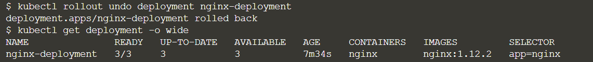

# k8s之Deployment详解

参考链接：

[Deployment详解](https://blog.csdn.net/lixinkuan328/article/details/103993274)

[官方介绍](https://kubernetes.io/docs/concepts/workloads/controllers/deployment/)

## 官方介绍

一个 *Deployment* 为 [Pods](https://kubernetes.io/docs/concepts/workloads/pods/pod-overview/) 和 [ReplicaSets](https://kubernetes.io/zh/docs/concepts/workloads/controllers/replicaset/) 提供声明式的更新能力。

你负责描述 Deployment 中的 *目标状态*，而 Deployment [控制器（Controller）](https://kubernetes.io/zh/docs/concepts/architecture/controller/) 以受控速率更改实际状态， 使其变为期望状态。你可以定义 Deployment 以创建新的 ReplicaSet，或删除现有 Deployment， 并通过新的 Deployment 收养其资源。

## Deployment可以帮我们做什么

- 定义一组Pod期望数量，Controller会维持Pod数量与期望数量一致
- 配置Pod的发布方式，controller会按照给定的策略更新Pod，保证更新过程中不可用Pod维持在限定数量范围内
- 如果发布有问题支持回滚

## Deployment原理

### 控制器模型

在Kubernetes架构中，有一个叫做kube-controller-manager的组件。这个组件，是一系列控制器的集合。其中每一个控制器，都以独有的方式负责某种编排功能。而Deployment正是这些控制器中的一种。它们都遵循Kubernetes中一个通用的编排模式，即：控制循环

用一段go语言伪代码，描述这个控制循环

```
for {
    实际状态 := 获取集群中对象X的实际状态
    期望状态 := 获取集群中对象X的期望状态
    if 实际状态 == 期望状态 {
        什么都不做
    }else{
        执行编排动作，将实际状态调整为期望状态
    }
}
```

在具体实现中，实际状态往往来自于Kubernetes集群本身。比如Kubelet通过心跳汇报的容器状态和节点状态，或者监控系统中保存的应用监控数据，或者控制器主动收集的它感兴趣的信息，这些都是常见的实际状态的来源；期望状态一般来自用户提交的YAML文件，这些信息都保存在Etcd中

对于Deployment，它的控制器简单实现如下：

- Deployment Controller从Etcd中获取到所有携带 “app：nginx”标签的Pod，然后统计它们的数量，这就是实际状态
- Deployment对象的replicas的值就是期望状态
- Deployment Controller将两个状态做比较，然后根据比较结果，确定是创建Pod，还是删除已有Pod

### 滚动更新

Deployment滚动更新的实现，依赖的是Kubernetes中的ReplicaSet

Deployment控制器实际操纵的，就是Replicas对象，而不是Pod对象。对于Deployment、ReplicaSet、Pod它们的关系如下图:


ReplicaSet负责通过“控制器模式”，保证系统中Pod的个数永远等于指定的个数。这也正是Deployment只允许容器的restartPolicy=Always的主要原因：只有容器能保证自己始终是running状态的前提下，ReplicaSet调整Pod的个数才有意义。

Deployment同样通过控制器模式，操作ReplicaSet的个数和属性，进而实现“水平扩展/收缩”和“滚动更新”两个编排动作对于“水平扩展/收缩”的实现，Deployment Controller只需要修改replicas的值即可。用户执行这个操作的指令如下：

```
kubectl scale deployment nginx-deployment --replicas=4
```

## Deployment

- 启动minikube

`minikube start`


- deployment_nginx.yml文件

  ```yaml
  apiVersion: apps/v1
  kind: Deployment
  metadata:
    name: nginx-deployment
    labels:
      app: nginx
  spec:
    replicas: 3
    selector:
      matchLabels:
        app: nginx
    template:
      metadata:
        labels:
          app: nginx
      spec:
        containers:
        - name: nginx
          image: nginx:1.12.2
          ports:
          - containerPort: 80
  ```

  

- 创建deployment

```
kubectl create -f deployment_nginx.yml
kubectl get deployment
kubectl get rs
kubectl get pods
```


- deployment信息

`kubectl get deployment -o wide`


- deployment升级

将nginx从1.12.2升级成1.13

```
kubectl set image deployment nginx-deployment nginx=nginx:1.13
kubectl get deployment
kubectl get deployment -o wide
kubectl get pods
```


- deployment查看历史版本

```
kubectl rollout history deployment nginx-deployment
```


- 回滚到之前的版本

````
kubectl rollout undo deployment nginx-deployment

kubectl get deployment -o wide

````



- deployment 暴露端口

其实就是把端口暴露在minikube上

```
kubectl get node
kubectl get node -o wide
kubectl expose deployment nginx-deployment --type=NodePort
#查看node节点暴露的端口30960
kubectl get svc
#进入minikube查看ip地址192.168.99.100
minikube ssh
```

