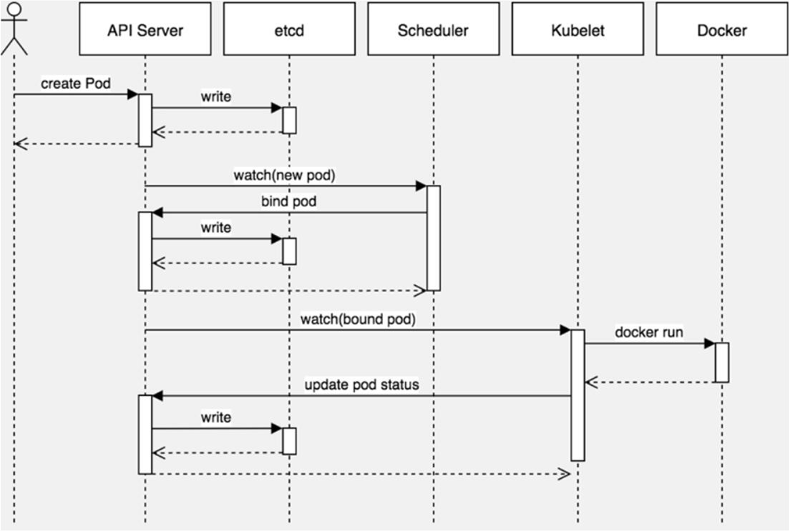

# Pod

参考链接：

[Pod详解](https://www.cnblogs.com/zhaobin-diray/p/13363496.html)

[k8s yaml说明](https://www.cnblogs.com/lori/p/12001249.html)

## 一般pod是怎么来的

k8s通过各种controller来管理pod的生命周期，为了满足不同业务场景，k8s开发了Deployment、ReplicaSet、DaemonSet、StatefuleSet、Job 等多种 Controller。**最常用的 Deployment用来建立Pod**，以下是它的步骤

1. kubectl创建deployment
2. deployment创建Replcasset
3. 根据Replicaset创建pod

replicas的命名方式 ：deployment名称+随机数
pod的命名方式：replicas名称+随机数

## Pod介绍

- 最小部署单元
- 一组容器的集合
- 一个Pod中的容器共享网络命名空间
- Pod是短暂的

## Pod存在的意义

Pod为亲密性应用而存在。

亲密性应用场景：

- 两个应用之间发生文件交互
- 两个应用需要通过127.0.0.1或者socket通信
- 两个应用需要发生频繁的调用

## Pod实现机制与设计模式

Pod本身是一个逻辑概念，没有具体存在，那究竟是怎么实现的呢？

众所周知，容器之间是通过Namespace隔离的，Pod要想解决上述应用场景，那么就要让Pod里的容器之间高效共享。

具体分为两个部分：网络和存储

- **共享网络**

kubernetes的解法是这样的：会在每个Pod里先启动一个`infra container`小容器，然后让其他的容器连接进来这个网络命名空间，然后其他容器看到的网络试图就完全一样了，即网络设备、IP地址、Mac地址等，这就是解决网络共享问题。在Pod的IP地址就是infra container的IP地址。

- **共享存储**

比如有两个容器，一个是nginx，另一个是普通的容器，普通容器要想访问nginx里的文件，就需要nginx容器将共享目录通过volume挂载出来，然后让普通容器挂载的这个volume，最后大家看到这个共享目录的内容一样。

例如：

```yaml
# pod.yaml
apiVersion: v1
kind: Pod
metadata:
  name: my-pod
spec:
  containers:
  - name: write
    image: centos
    command: ["bash","-c","for i in {1..100};do echo $i >> /data/hello;sleep 1;done"]
    volumeMounts:
      - name: data
        mountPath: /data
 
  - name: read
    image: centos
    command: ["bash","-c","tail -f /data/hello"]
    volumeMounts:
      - name: data
        mountPath: /data
   
  volumes:
  - name: data
    emptyDir: {}
```

 上述示例中有两个容器，write容器负责提供数据，read消费数据，通过数据卷将写入数据的目录和读取数据的目录都放到了该卷中，这样每个容器都能看到该目录。

验证：

```
kubectl apply -f pod.yaml
kubectl logs my-pod -c ``read` `-f
```

## Pod中容器分类

- **Infrastructure Container**：基础容器，维护整个Pod网络空间，对用户不可见
- **InitContainers**：初始化容器，先于业务容器开始执行，一般用于业务容器的初始化工作
- **Containers**：业务容器，具体跑应用程序的镜像

## 镜像拉取策略

```yaml
apiVersion: v1
kind: Pod
metadata:
  name: my-pod
spec:
  containers:
    - name: java
      image: a13552821243/java-demo
      imagePullPolicy: IfNotPresent
```

imagePullPolicy 字段有三个可选值：

- IfNotPresent：镜像在宿主机上不存在时才拉取
- Always：默认值,每次创建 Pod 都会重新拉取一次镜像
- Never： Pod 永远不会主动拉取这个镜像

## 注意：私有仓库需配置

<span style="color:red">PS：</span>如果拉取公开的镜像，直接按照上述示例即可，但要拉取私有的镜像，是必须认证镜像仓库才可以，即docker login，而在K8S集群中会有多个Node，显然这种方式是很不放方便的！为了解决这个问题，K8s 实现了自动拉取镜像的功能。 以secret方式保存到K8S中，然后传给kubelet。

## 资源限制

Pod资源配额有两种：

- 申请配额：调度时使用，参考是否有节点满足该配置

  spec.containers[].resources.limits.cpu

  spec.containers[].resources.limits.memory

- 限制配额：容器能使用的最大配置

  spec.containers[].resources.requests.cpu

  spec.containers[].resources.requests.memory

示例：

```yaml
apiVersion: v1
kind: Pod
metadata:
  name: web
spec:
  containers:
  - name: java
    image: a13552821243/java-demo
    resources:
      requests:
        memory: "64Mi"
        cpu: "250m"
      limits:
        memory: "128Mi"
        cpu: "500m"
```

其中cpu值比较抽象，可以这么理解：

1核=1000m

1.5核=1500m

那上面限制配置就是1核的二分之一（500m），即该容器最大使用半核CPU。

该值也可以写成浮点数，更容易理解：

半核=0.5

1核=1

1.5核=1.5

## 重启策略

```yaml
apiVersion: v1
kind: Pod
metadata:
  name: my-pod
spec:
  containers:
  - name: java
    image: a13552821243java-demo
  restartPolicy: Always
```

restartPolicy字段有三个可选值：

- Always：当容器终止退出后，总是重启容器，默认策略。
- OnFailure：当容器异常退出（退出状态码非0）时，才重启容器。适于job
- Never：当容器终止退出，从不重启容器。适于job

## 健康检查

默认情况下，kubelet 根据容器状态作为健康依据，但不能容器中应用程序状态，例如程序假死。这就会导致无法提供服务，丢失流量。因此引入健康检查机制确保容器健康存活。

### **健康检查有两种类型：**

- livenessProbe

  如果检查失败，将杀死容器，根据Pod的restartPolicy来操作。

- readinessProbe

  如果检查失败，Kubernetes会把Pod从service endpoints中剔除。

这两种类型支持三种检查方法：

### **Probe支持以下三种检查方法：**

- httpGet

  发送HTTP请求，返回200-400范围状态码为成功。

- exec

  执行Shell命令返回状态码是0为成功。

- tcpSocket

  发起TCP Socket建立成功。

```yaml
apiVersion: v1
kind: Pod
metadata:
  labels:
    test: liveness
  name: liveness-exec
spec:
  containers:
  - name: liveness
    image: busybox
    args:
    - /bin/sh
    - -c
    - touch /tmp/healthy; sleep 30; rm -rf /tmp/healthy; sleep 60
    livenessProbe:
      exec:
        command:
        - cat
        - /tmp/healthy
      initialDelaySeconds: 5
      periodSeconds: 5
```

上述示例：启动容器第一件事创建文件，停止30s，删除该文件，再停止60s，确保容器还在运行中。

验证现象：容器启动正常，30s后异常，会restartPolicy策略自动重建，容器继续正常，反复现象。

## 调度策略

先看下创建一个Pod的工作流程： create pod -> apiserver -> write etcd -> scheduler -> bind pod to node -> write etcd -> kubelet( apiserver get pod) -> dcoekr api,create container -> apiserver -> update pod status to etcd -> kubectl get pods



Pod根据调度器默认算法将Pod分配到合适的节点上，一般是比较空闲的节点。但有些情况我们希望将Pod分配到指定节点，该怎么做呢？

### 调度策略：nodeName、nodeSelector、污点与容忍

#### **1、nodeName**

nodeName用于将Pod调度到指定的Node名称上。

例如：下面示例会绕过调度系统，直接分配到k8s-node1节点。

```yaml
apiVersion: v1
kind: Pod
metadata:
  labels:
    run: busybox
  name: busybox
  namespace: default
spec:
  nodeName: k8s-node1
  containers:
  - image: busybox
    name: bs
    command:
    - "ping"
    - "baidu.com"
```

#### **2、nodeSelector**

```
kubectl label nodes k8s-node1 team=a
kubectl label nodes k8s-node2 team=b
```

nodeSelector用于将Pod调度到匹配Label的Node上。

先给规划node用途，然后打标签，例如将两台node划分给不同团队使用：

后在创建Pod只会被调度到含有team=a标签的节点上。

```yaml
apiVersion: v1
kind: Pod
metadata:
 ``name: busybox
 ``namespace: default
spec:
 ``nodeSelector:
  ``team: b
 ``containers:
 ``- image: busybox
  ``name: bs
  ``command``:
  ``- ``"ping"
  ``- ``"baidu.com"
```

### **3、taint（污点）与tolerations（容忍)** 

污点应用场景：节点独占，例如具有特殊硬件设备的节点，如GPU 

```
设置污点命令：<br>kubectl taint node [node] key=value[effect]
```

其中[effect] 可取值：

- NoSchedule ：一定不能被调度。
- PreferNoSchedule：尽量不要调度。
- NoExecute：不仅不会调度，还会驱逐Node上已有的Pod。

示例：

先给节点设置污点，说明这个节点不是谁都可以调度过来的：

kubectl taint node k8s-node1 abc=123:NoSchedule

查看污点：

kubectl describe node k8s-node1 |grep Taints

然后在创建Pod只有声明了容忍污点（tolerations），才允许被调度到abc=123污点节点上。

```
apiVersion: v1
kind: Pod
metadata:
 ``labels:
  ``run: busybox
 ``name: busybox3
 ``namespace: default
spec:
 ``tolerations:
 ``- key: ``"abc"
  ``operator: ``"Equal"
  ``value: ``"123"
  ``effect: ``"NoSchedule"
 ``containers:
 ``- image: busybox
  ``name: bs
  ``command``:
  ``- ``"ping"
  ``- ``"baidu.com"
```

如果不配置容忍污点，则永远不会调度到k8s-node1。

去掉污点：

```
kubectl taint node [node] key:[effect]-
kubectl taint node k8s-node1 abc:NoSchedule-
```

## pod yaml文件解释

```yaml
# yaml格式的pod定义文件完整内容：
apiVersion: v1       #必选，版本号，例如v1
kind: Pod       #必选，Pod
metadata:       #必选，元数据
  name: string       #必选，Pod名称
  namespace: string    #必选，Pod所属的命名空间
  labels:      #自定义标签
    - name: string     #自定义标签名字
  annotations:       #自定义注释列表
    - name: string
spec:         #必选，Pod中容器的详细定义
  containers:      #必选，Pod中容器列表
  - name: string     #必选，容器名称
    image: string    #必选，容器的镜像名称
    imagePullPolicy: [Always | Never | IfNotPresent] #获取镜像的策略 Alawys表示下载镜像 IfnotPresent表示优先使用本地镜像，否则下载镜像，Nerver表示仅使用本地镜像
    command: [string]    #容器的启动命令列表，如不指定，使用打包时使用的启动命令
    args: [string]     #容器的启动命令参数列表
    workingDir: string     #容器的工作目录
    volumeMounts:    #挂载到容器内部的存储卷配置
    - name: string     #引用pod定义的共享存储卷的名称，需用volumes[]部分定义的的卷名
      mountPath: string    #存储卷在容器内mount的绝对路径，应少于512字符
      readOnly: boolean    #是否为只读模式
    ports:       #需要暴露的端口库号列表
    - name: string     #端口号名称
      containerPort: int   #容器需要监听的端口号
      hostPort: int    #容器所在主机需要监听的端口号，默认与Container相同
      protocol: string     #端口协议，支持TCP和UDP，默认TCP
    env:       #容器运行前需设置的环境变量列表
    - name: string     #环境变量名称
      value: string    #环境变量的值
    resources:       #资源限制和请求的设置
      limits:      #资源限制的设置
        cpu: string    #Cpu的限制，单位为core数，将用于docker run --cpu-shares参数
        memory: string     #内存限制，单位可以为Mib/Gib，将用于docker run --memory参数
      requests:      #资源请求的设置
        cpu: string    #Cpu请求，容器启动的初始可用数量
        memory: string     #内存清楚，容器启动的初始可用数量
    livenessProbe:     #对Pod内个容器健康检查的设置，当探测无响应几次后将自动重启该容器，检查方法有exec、httpGet和tcpSocket，对一个容器只需设置其中一种方法即可
      exec:      #对Pod容器内检查方式设置为exec方式
        command: [string]  #exec方式需要制定的命令或脚本
      httpGet:       #对Pod内个容器健康检查方法设置为HttpGet，需要制定Path、port
        path: string
        port: number
        host: string
        scheme: string
        HttpHeaders:
        - name: string
          value: string
      tcpSocket:     #对Pod内个容器健康检查方式设置为tcpSocket方式
         port: number
       initialDelaySeconds: 0  #容器启动完成后首次探测的时间，单位为秒
       timeoutSeconds: 0   #对容器健康检查探测等待响应的超时时间，单位秒，默认1秒
       periodSeconds: 0    #对容器监控检查的定期探测时间设置，单位秒，默认10秒一次
       successThreshold: 0
       failureThreshold: 0
       securityContext:
         privileged:false
    restartPolicy: [Always | Never | OnFailure]#Pod的重启策略，Always表示一旦不管以何种方式终止运行，kubelet都将重启，OnFailure表示只有Pod以非0退出码退出才重启，Nerver表示不再重启该Pod
    nodeSelector: obeject  #设置NodeSelector表示将该Pod调度到包含这个label的node上，以key：value的格式指定
    imagePullSecrets:    #Pull镜像时使用的secret名称，以key：secretkey格式指定
    - name: string
    hostNetwork:false      #是否使用主机网络模式，默认为false，如果设置为true，表示使用宿主机网络
    volumes:       #在该pod上定义共享存储卷列表
    - name: string     #共享存储卷名称 （volumes类型有很多种）
      emptyDir: {}     #类型为emtyDir的存储卷，与Pod同生命周期的一个临时目录。为空值
      hostPath: string     #类型为hostPath的存储卷，表示挂载Pod所在宿主机的目录
        path: string     #Pod所在宿主机的目录，将被用于同期中mount的目录
      secret:      #类型为secret的存储卷，挂载集群与定义的secre对象到容器内部
        scretname: string  
        items:     
        - key: string
          path: string
      configMap:     #类型为configMap的存储卷，挂载预定义的configMap对象到容器内部
        name: string
        items:
        - key: string
          path: string
```

