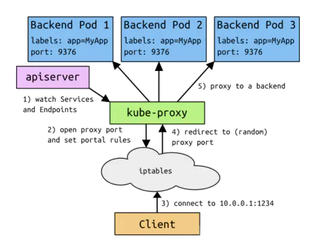
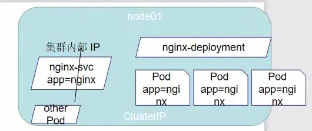
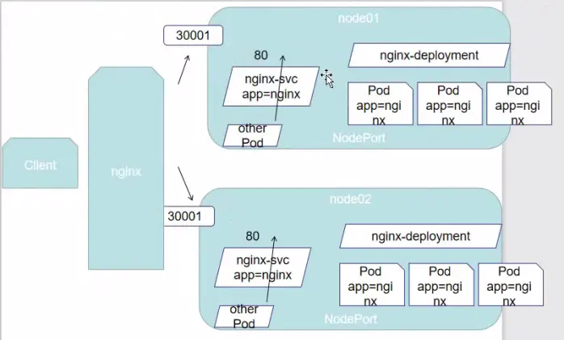
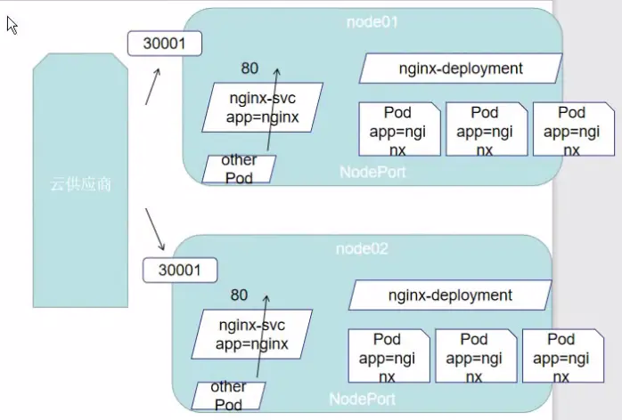
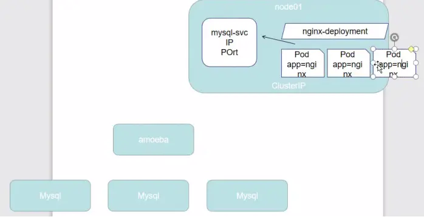

# service  svc

参考链接：

[k8s svc服务](https://www.jianshu.com/p/fd597312751a)

[svc的类型使用](https://blog.csdn.net/weixin_42715225/article/details/109313655)

## Service 的概念

Kubernetes Service定义了这样一种抽象：一个Pod的逻辑分组，一种可以访问它们的策略 —— 通常称为微服务。这一组Pod能够被Service访问到，通常是通过Label Selector


Service能够提供负载均衡的能力，但是在使用上有以下限制：

- 只提供 4 层负载均衡能力，而没有 7 层功能，但有时我们可能需要更多的匹配规则来转发请求，这点上 4 层负载均衡是不支持的

## **svc基础导论**



**总结：**


- 客户端访问节点时通过iptables实现的，
- iptables规则是通过kube-proxy写入的，
- apiserver通过监控kube-proxy去进行对服务和端点的监控，
- kube-proxy通过pod的标签（lables）去判断这个断点信息是否写入到Endpoints里去。

## VIP 和 Service 代理

在 Kubernetes 集群中，每个 Node 运行一个kube-proxy进程。kube-proxy负责为Service实现了一种VIP（虚拟 IP）的形式，而不是ExternalName的形式。在 Kubernetes v1.0 版本，代理完全在 userspace。在Kubernetes v1.1 版本，新增了 iptables 代理，但并不是默认的运行模式。从 Kubernetes v1.2 起，默认就是iptables 代理。在 Kubernetes v1.8.0-beta.0 中，添加了 ipvs 代理

在 Kubernetes 1.14 版本开始默认使用ipvs 代理

在 Kubernetes v1.0 版本，Service是 “4层”（TCP/UDP over IP）概念。在 Kubernetes v1.1 版本，新增了Ingress API（beta 版），用来表示 “7层”（HTTP）服务

**为何不使用 round-robin DNS？**
 DNS会在很多的客户端里进行缓存，很多服务在访问DNS进行域名解析完成、得到地址后不会对DNS的解析进行清除缓存的操作，所以一旦有他的地址信息后，不管访问几次还是原来的地址信息，导致负载均衡无效。

## 代理模式的分类

#### 1、userspace 代理模式

- 客户端首先访问iptables通过iptables访问到kube-proxy然后访问到具体的pod上

- 也就是说每次访问的时候都需要Kube-proxy进行一次代理

- 也就是说kube-proxy压力是非常大的

- 同时kube-apiserver也会监控kube-proxy服务更新及端点的维护

  

#### 2、iptables 代理模式

- 舍弃掉了kube-proxy，所有访问直接通过iptables而不需要kube-proxy去调度

- 这样的话访问速度就会大大增加以及kube-proxy稳定性会提高压力将会减少很多

- 当然使用iptables(防火墙)性能并不会怎么高，但除此之外几乎没有什么缺点。

- kube-apiserver依然通过监控kube-proxy去实现iptables的端口的更新维护

  

#### 3、ipvs 代理模式

- 将iptables代理模式中iptables变更为ipvs,原来是把所有的调度规则通过iptables

- 进行所谓的服务转发定向的变成了通过ipvs模块去实现负载均衡以及流量导向，并且和

- iptables代理模式相同，所有的访问也是不经过kube-proxy的

- 如果没有提前安装ipvs模块以及一些基本需求没有完成，那些k8s将会使用iptables的代理模式

  

  image.png

这种模式，kube-proxy 会监视 Kubernetes Service对象和Endpoints，调用netlink接口以相应地创建ipvs 规则并定期与 Kubernetes Service对象和Endpoints对象同步 ipvs 规则，以确保 ipvs 状态与期望一致。访问服务时，流量将被重定向到其中一个后端 Pod

与 iptables 类似，ipvs 于 netfilter 的 hook 功能，但使用哈希表作为底层数据结构并在内核空间中工作。这意味着 ipvs 可以更快地重定向流量，并且在同步代理规则时具有更好的性能。此外，ipvs 为负载均衡算法提供了更多选项，例如：

- **①rr：轮询调度**
- **②lc：最小连接数**
- **③dh：目标哈希**
- **④sh：源哈希**
- **⑤sed：最短期望延迟**
- **⑥nq：不排队调度**

注意： ipvs模式假定在运行kube-proxy之前在节点上都已经安装了IPVS内核模块。当kube-proxy以ipvs代理模式启动时，kube-proxy将验证节点上是否安装了IPVS模块，如果未安装，则kube-proxy将回退到iptables代理模式

```bash
#查看ipvs代理规则
ipvsadm -Ln 
```

## Service 的类型

Service 在 K8s 中有以下四种类型

### ClusterIp

- 概述
  分配一个内部集群IP地址，只能在集群内部访问(同Namespace内的Pod)，默认ServiceType，ClusterIP模式的Service默认提供的，就是一个Pod的稳定的IP地址，即VIP，访问地址: 
- yaml文本示例

```
cat > ng-svc-clusterip.yaml <<-EOF
apiVersion: v1
kind: Service
metadata:
    name: nginx-clusterip
    namespace: default
spec:
    selector:
        app: nginx-dev	# 为Pod资源的app键值
    type: ClusterIP
    ports:
       - protocol: TCP
         targetPort: 80
         port: 80
EOF         
```

- 查看其svc相关信息

```
]# kubectl apply -f ng-svc-clusterip.yaml
]# kubectl get svc -n default | grep nginx
nginx--clusterip              ClusterIP      172.21.6.109    <none>                                        80/TCP               18m
```

- 访问其应用服务



```
]# curl 172.21.6.109
<!DOCTYPE html>
<html>
<head>
<title>Welcome to nginx!</title>
<style>
    body {
        width: 35em;
        margin: 0 auto;
        font-family: Tahoma, Verdana, Arial, sans-serif;
    }
</style>
</head>
<body>
<h1>Welcome to nginx!</h1>
<p>If you see this page, the nginx web server is successfully installed and
working. Further configuration is required.</p>

<p>For online documentation and support please refer to
<a href="http://nginx.org/">nginx.org</a>.<br/>
Commercial support is available at
<a href="http://nginx.com/">nginx.com</a>.</p>

<p><em>Thank you for using nginx.</em></p>
</body>
</html>
```

### NodePort

- 概述
  分配一个内部集群IP地址，并在每个节点上启用一个端口来暴露服务，可以在集群内部访问，访问地址: :
- 要点
  类型缺陷

```
a. 端口容器冲突
b. NodePort属于四层，不能做七层的事，比如根据域名/url进行转发
c. 不能统一入口
```

- yaml文本示例

```
cat > ng-svc-nodeport.yaml <<-EOF
apiVersion: v1
kind: Service
metadata:
    name: nginx-nodeport
    namespace: default
spec:
    selector:
        app: nginx-dev
    type: NodePort
    ports:
       - protocol: TCP
         targetPort: 80
         port: 8020
EOF         
```

- 查看其svc相关信息

```
]# kubectl apply -f ng-svc-nodeport.yaml
]# kubectl get svc -n default | grep nginx
nginx-nodeport          NodePort       172.21.12.177   <none>                                        8020:30076/TCP       48m
```

其中8020:30076的8020为内部集群端口，而30076为公网ip/NodeIP端口

- 访问其应用服务



1.  内部集群访问

```
]# curl 172.21.12.177:8020
<!DOCTYPE html>
<html>
<head>
<title>Welcome to nginx!</title>
<style>
    body {
        width: 35em;
        margin: 0 auto;
        font-family: Tahoma, Verdana, Arial, sans-serif;
    }
</style>
</head>
<body>
<h1>Welcome to nginx!</h1>
<p>If you see this page, the nginx web server is successfully installed and
working. Further configuration is required.</p>

<p>For online documentation and support please refer to
<a href="http://nginx.org/">nginx.org</a>.<br/>
Commercial support is available at
<a href="http://nginx.com/">nginx.com</a>.</p>

<p><em>Thank you for using nginx.</em></p>
</body>
</html>
```

2. 通过公网ip/NodeIP访问

```
]# curl 公网ip/NodeIP:30076
<!DOCTYPE html>
<html>
<head>
<title>Welcome to nginx!</title>
<style>
    body {
        width: 35em;
        margin: 0 auto;
        font-family: Tahoma, Verdana, Arial, sans-serif;
    }
</style>
</head>
<body>
<h1>Welcome to nginx!</h1>
<p>If you see this page, the nginx web server is successfully installed and
working. Further configuration is required.</p>

<p>For online documentation and support please refer to
<a href="http://nginx.org/">nginx.org</a>.<br/>
Commercial support is available at
<a href="http://nginx.com/">nginx.com</a>.</p>

<p><em>Thank you for using nginx.</em></p>
</body>
</html>
```

### LoadBalancer

- 概述
  分配一个内部集群IP地址，并在每个节点上启用一个端口来暴露服务，除此之外，k8s会请求底层云平台上的负载均衡器，将每个Node ([NodeIP]:[NodePort])作为后端添加进去

  在 NodePort 的基础上，借助 cloud provider 创建一个外部负载均衡器，并将请求转发到: NodePort【在NodePort基础之上，即各个节点前加入了负载均衡器实现了真正的高可用，一般云供应商提供的k8s集群就是这种】

- yaml文本示例

```
cat > ng-svc-lb.yaml <<-EOF
apiVersion: v1
kind: Service
metadata:
  annotations:
    service.beta.kubernetes.io/alibaba-cloud-loadbalancer-id: "lb-wxxx"		# 负载均衡器的实例id值
    service.beta.kubernetes.io/alibaba-cloud-loadbalancer-force-override-listeners: "true"
  name: nginx-lb
  namespace: default
spec:
  selector:
    app: nginx-dev
  type: LoadBalancer
  ports:
    - protocol: TCP
      targetPort: 80
      port: 8030
```

- 查看其svc相关信息

```
]# kubectl apply -f ng-svc-lb.yaml
]# kubectl get svc -n default | grep nginx
nginx-lb                LoadBalancer   172.21.11.211   120.76.70.149                                  8030:30636/TCP       54s
```

其中8030:30076的8030为内部集群端口，而30636为公网ip/NodeIP端口

- 访问其应用服务



1. 内部集群访问

```
]# curl 172.21.11.211:8030
<!DOCTYPE html>
<html>
<head>
<title>Welcome to nginx!</title>
<style>
    body {
        width: 35em;
        margin: 0 auto;
        font-family: Tahoma, Verdana, Arial, sans-serif;
    }
</style>
</head>
<body>
<h1>Welcome to nginx!</h1>
<p>If you see this page, the nginx web server is successfully installed and
working. Further configuration is required.</p>

<p>For online documentation and support please refer to
<a href="http://nginx.org/">nginx.org</a>.<br/>
Commercial support is available at
<a href="http://nginx.com/">nginx.com</a>.</p>

<p><em>Thank you for using nginx.</em></p>
</body>
</html>
```

2. 通过负载均衡器IP访问

```
]# curl 120.76.70.149:8030
<!DOCTYPE html>
<html>
<head>
<title>Welcome to nginx!</title>
<style>
    body {
        width: 35em;
        margin: 0 auto;
        font-family: Tahoma, Verdana, Arial, sans-serif;
    }
</style>
</head>
<body>
<h1>Welcome to nginx!</h1>
<p>If you see this page, the nginx web server is successfully installed and
working. Further configuration is required.</p>

<p>For online documentation and support please refer to
<a href="http://nginx.org/">nginx.org</a>.<br/>
Commercial support is available at
<a href="http://nginx.com/">nginx.com</a>.</p>

<p><em>Thank you for using nginx.</em></p>
</body>
</html>
```

3. 通过公网ip/NodeIP访问

```
]# curl 公网ip/NodeIP:30636
<!DOCTYPE html>
<html>
<head>
<title>Welcome to nginx!</title>
<style>
    body {
        width: 35em;
        margin: 0 auto;
        font-family: Tahoma, Verdana, Arial, sans-serif;
    }
</style>
</head>
<body>
<h1>Welcome to nginx!</h1>
<p>If you see this page, the nginx web server is successfully installed and
working. Further configuration is required.</p>

<p>For online documentation and support please refer to
<a href="http://nginx.org/">nginx.org</a>.<br/>
Commercial support is available at
<a href="http://nginx.com/">nginx.com</a>.</p>

<p><em>Thank you for using nginx.</em></p>
</body>
</html>
```

### ExternalName

把集群外部的服务引入到集群内部来，在集群内部直接使用。没有任何类型代理被创建，这只有 kubernetes 1.7 或更高版本的 kube-dns 才支持【当我们的集群服务需要访问k8s之外的集群时，可以选择这种类型，然后把外部服务的IP及端口写入到k8s服务中来，k8s的代理将会帮助我们访问到外部的集群服务】



