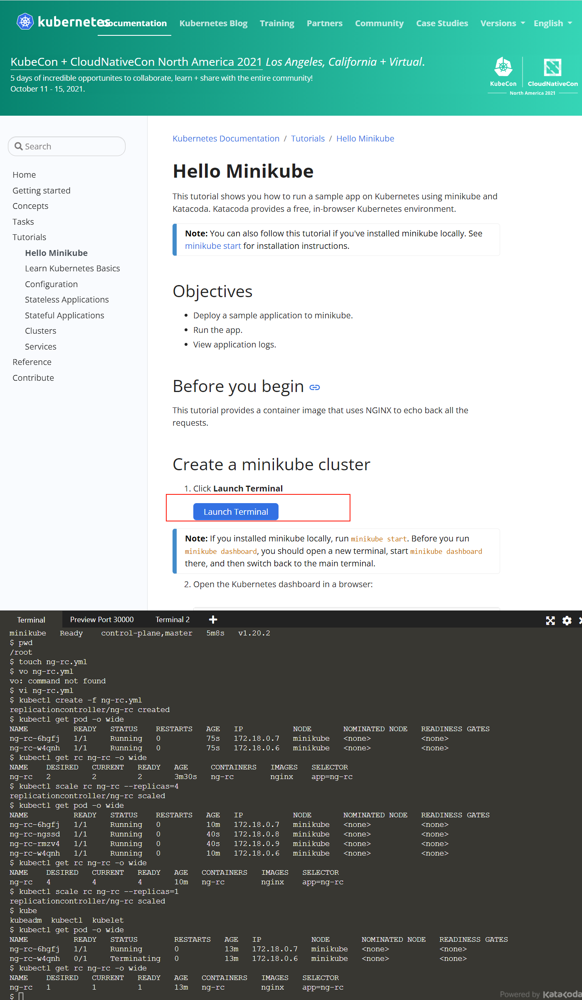

# k8s在线实验平台

就是官网，官网上可以在线启动一个k8s环境，在里面就可以了运行各种命令了

[k8s在线平台参考链接](https://www.hangge.com/blog/cache/detail_2426.html)

## 官方地址

[官方地址](https://kubernetes.io/docs/tutorials/hello-minikube/)

## 初始化集群

minikube start