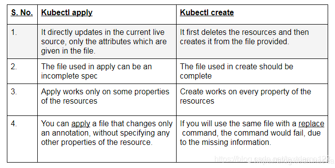

# kubectl create和 kubectl apply区别

[kubernetes: kubectl create与kubectl apply的区别](https://blog.csdn.net/textdemo123/article/details/104400985/)

## 背景：

创建一个k8s资源的时候可以使用 kubectl create 也可以使用 kubectl apply，到底有什么区别呢？
分析：
1.官方解释

## kubectl create和kubectl apply命令之间存在细微差别。

1. **kubectl create命令可创建新资源。 因此，如果再次运行该命令，则会抛出错误，因为资源名称在名称空间中应该是唯一的。**

kubectl get pods
No resources found.

kubectl create -f pod.xml
pod/myapp-pod created

kubectl create -f pod.xml
Error from server (AlreadyExists): error when creating “pod.xml”: pods “myapp-pod” already exists

2. **kubectl apply命令将配置应用于资源。 如果资源不在那里，那么它将被创建。 kubectl apply命令可以第二次运行，因为它只是应用如下所示的配置。 在这种情况下，配置没有改变。 所以，pod没有改变。**  

kubectl delete pod/myapp-pod
pod “myapp-pod” deleted

kubectl apply -f pod.xml
pod/myapp-pod created

kubectl apply -f pod.xml
pod/myapp-pod unchanged
在kubectl create ，我们指定一个特定的动作，在这种情况下create ，因此它是必要的 。 在kubectl apply命令中，我们指定系统的目标状态，并且不指定特定操作，因此声明性 。 我们让系统决定采取什么行动。 如果资源不在那里，它将创建它，如果资源在那里，那么它将配置应用于现有资源。

从执行的角度来看，如上所示，在kubectl create和kubectl apply之间第一次创建资源时没有区别。 但是，第二次kubectl create会抛出错误。

简单来说，如果在单个文件上运行操作以创建资源，则create和apply基本相同。 但是， apply允许您在目录下的多个文件上同时创建和修补。

还有一个apply于从目录中删除资源但在撰写本文时它处于alpha状态：

kubectl apply -f --prune -l your=label)
参考：
https://stackoverflow.com/questions/47369351/kubectl-apply-vs-kubectl-create