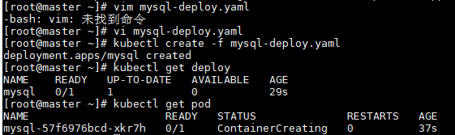

# kubectl常用命令

参考链接：

[kubectl常用命令一](https://blog.csdn.net/miss1181248983/article/details/88037531)

[kuibectl常用命令二](https://blog.csdn.net/miss1181248983/article/details/88130576)

[kubectl常用命令三](https://blog.csdn.net/miss1181248983/article/details/88181434)

[kubectl常用命令四](https://blog.csdn.net/miss1181248983/article/details/88235664)

## 语法格式

`kubectl [command] [TYPE] [NAME] [flags]`

- command：指定在一个或多个资源上要执行的操作，列如：create，get，describe，delete，apply等

- TYPE：指定资源类型，如：pod、node、services、deployments等。

  - 资源类型大小写敏感
  - 可以是单数、复数、缩写形式，如：
    - kubectl get pod -n kubernets-dashboard
    - kebectl get pods -n kubernetes-dashboard
    - kubectl get po -n kubernets-dashboard

- NANME 指定资源名称。

  - 大小写敏感

  - 如果省略，则显示默认名称空间资源的详细信息或者提示：No resources found in default namespace，如：

  - ```
    1 # 示例：
    2 [root@k8s-master ~]# kubectl get pods
    3 No resources found in default namespace.
    4 [root@k8s-master ~]# kubectl get pods --all-namespaces  # 或者 kubectl get pods --A
    5 NAMESPACE              NAME                                         READY   STATUS    RESTARTS   AGE
    6 kube-system            coredns-6955765f44-c9zfh                     1/1     Running   8          6d7h
    7 kube-system            coredns-6955765f44-lrz5q                     1/1     Running   8          6d7h
    8 kube-system            etcd-k8s-master                              1/1     Running   9          6d7h
    9 kube-system            kube-apiserver-k8s-master                    1/1     Running   9          6d7h
    10 kube-system            kube-controller-manager-k8s-master           1/1     Running   8          6d7h
    11 kube-system            kube-flannel-ds-amd64-dngrk                  1/1     Running   13         6d7h
    12 kube-system            kube-flannel-ds-amd64-h4sn6                  1/1     Running   13         6d6h
    13 kube-system            kube-flannel-ds-amd64-m92wp                  1/1     Running   11         6d6h
    14 kube-system            kube-proxy-28dwj                             1/1     Running   9          6d6h
    15 kube-system            kube-proxy-c875m                             1/1     Running   8          6d7h
    16 kube-system            kube-proxy-stg6w                             1/1     Running   10         6d6h
    17 kube-system            kube-scheduler-k8s-master                    1/1     Running   9          6d7h
    18 kubernetes-dashboard   dashboard-metrics-scraper-7b8b58dc8b-nr5fz   1/1     Running   7          6d1h
    19 kubernetes-dashboard   kubernetes-dashboard-755dcb9575-9kg7p        1/1     Running   9          6d1h
    20 [root@k8s-master ~]# kubectl get service --all-namespaces  # 或者 kubectl get service -A
    21 NAMESPACE              NAME                        TYPE        CLUSTER-IP      EXTERNAL-IP   PORT(S)                  AGE
    22 default                kubernetes                  ClusterIP   10.96.0.1       <none>        443/TCP                  6d7h
    23 kube-system            kube-dns                    ClusterIP   10.96.0.10      <none>        53/UDP,53/TCP,9153/TCP   6d7h
    24 kubernetes-dashboard   dashboard-metrics-scraper   ClusterIP   10.104.12.221   <none>        8000/TCP                 6d1h
    25 kubernetes-dashboard   kubernetes-dashboard        NodePort    10.110.157.29   <none>        443:30001/TCP            6d1h
    ```

- flags：指定可选的标记，例如：可以使用-s或-server标识来指定kubenets api服务器的地址和端口号；-n指定名称空间；等。

  - 注意：命令行指定的flags将覆盖默认值和任何响应的环境变量。优先级最高

- 在多个资源上执行操作时，可以通过类型【TYPE】和名称【NAME】指定每个资源，也可以指定一个或多个文件。

## Command

通过kubectl -h可以查看所有的Command命令，查看具体的命令，需要用kubectl <command> -h

```
kubectl controls the Kubernetes cluster manager.

 Find more information at: https://kubernetes.io/docs/reference/kubectl/overview/

Basic Commands (Beginner):
  create        Create a resource from a file or from stdin
  expose        Take a replication controller, service, deployment or pod and expose it as a new Kubernetes service
  run           在集群中运行一个指定的镜像
  set           为 objects 设置一个指定的特征

Basic Commands (Intermediate):
  explain       Get documentation for a resource
  get           显示一个或更多 resources
  edit          在服务器上编辑一个资源
  delete        Delete resources by file names, stdin, resources and names, or by resources and label selector

Deploy Commands:
  rollout       Manage the rollout of a resource
  scale         Set a new size for a deployment, replica set, or replication controller
  autoscale     Auto-scale a deployment, replica set, stateful set, or replication controller

Cluster Management Commands:
  certificate   修改 certificate 资源.
  cluster-info  Display cluster information
  top           Display resource (CPU/memory) usage
  cordon        标记 node 为 unschedulable
  uncordon      标记 node 为 schedulable
  drain         Drain node in preparation for maintenance
  taint         更新一个或者多个 node 上的 taints

Troubleshooting and Debugging Commands:
  describe      显示一个指定 resource 或者 group 的 resources 详情
  logs          输出容器在 pod 中的日志
  attach        Attach 到一个运行中的 container
  exec          在一个 container 中执行一个命令
  port-forward  Forward one or more local ports to a pod
  proxy         运行一个 proxy 到 Kubernetes API server
  cp            Copy files and directories to and from containers
  auth          Inspect authorization
  debug         Create debugging sessions for troubleshooting workloads and nodes

Advanced Commands:
  diff          Diff the live version against a would-be applied version
  apply         Apply a configuration to a resource by file name or stdin
  patch         Update fields of a resource
  replace       Replace a resource by file name or stdin
  wait          Experimental: Wait for a specific condition on one or many resources
  kustomize     Build a kustomization target from a directory or URL.

Settings Commands:
  label         更新在这个资源上的 labels
  annotate      更新一个资源的注解
  completion    Output shell completion code for the specified shell (bash or zsh)

Other Commands:
  api-resources Print the supported API resources on the server
  api-versions  Print the supported API versions on the server, in the form of "group/version"
  config        修改 kubeconfig 文件
  plugin        Provides utilities for interacting with plugins
  version       输出 client 和 server 的版本信息

Usage:
  kubectl [flags] [options]

Use "kubectl <command> --help" for more information about a given command.
Use "kubectl options" for a list of global command-line options (applies to all commands).
```

## 基础命令

命令具体的使用方法，可以使用kubectl <command> -h来查看

| 命令    | 说明                                                    |
| ------- | ------------------------------------------------------- |
| create  | 使用文件或者标准输入的方式创建一个资源                  |
| expose  | 将一个资源公开为为新的Kubernetes Service                |
| run     | 创建并运行一个或多个容器镜像                            |
| set     | 配置应用资源                                            |
| explain | 显示资源文档信息                                        |
| get     | 获取显示一个或多个资源                                  |
| edit    | 编辑服务器上定义的资源                                  |
| delete  | 按文件名、stdin、资源和名称或按资源和标签选择器删除资源 |

### create

**kubectl create**可以通过配置文件名或stdin创建一个集群资源对象(Pod)。支持JSON和YAML格式的文件。

```
# vim mysql-deploy.yaml
```

```yaml
apiVersion: apps/v1
kind: Deployment
metadata:
  name: mysql
spec:
  replicas: 1
  selector:
    matchLabels:
      app: mysql
  template:
    metadata:
      labels:
        app: mysql
    spec:
      containers:
      - name: mysql
        image: mysql:5.6
        ports:
        - containerPort: 3306
        env:
        - name: MYSQL_ROOT_PASSWORD
          value: "123456"
```

```
# kubectl create -f mysql-deploy.yaml 
deployment.apps/mysql created

# kubectl get deploy
NAME      DESIRED   CURRENT   UP-TO-DATE   AVAILABLE   AGE
mysql     1         1         1            1           1m

# kubectl get pod
NAME                     READY     STATUS    RESTARTS   AGE
mysql-5fb6c74b86-xg97j   1/1       Running   0          48s
```



### expose

**kubectl expose**将RC、Service、Deployment或Pod作为新的Kubernetes Service公开。

下面为Deployment的mysql创建service，并通过Service的33060端口转发至容器的3306端口上。

```
# kubectl expose deploy mysql --port=33060 --target-port=3306
service/mysql exposed               #自动创建一个新的service

# kubectl get svc
NAME         TYPE        CLUSTER-IP    EXTERNAL-IP   PORT(S)     AGE
kubernetes   ClusterIP   10.68.0.1     <none>        443/TCP     10d
mysql        ClusterIP   10.68.86.66   <none>        33060/TCP   32s

```

### run

**kubectl run**创建并运行一个或多个容器镜像。

kubectl run和docker run一样，它能将一个镜像运行起来。下面使用kubectl run来将一个nginx的镜像启动起来。

```
# kubectl run nginx --image=nginx --expose --port=80            #指定镜像，指定暴露端口
service/nginx created
deployment.apps/nginx created
```

使用kubectl run会自动创建deployment，加上`--export`会自动创建service。

```
# kubectl get svc
NAME         TYPE        CLUSTER-IP    EXTERNAL-IP   PORT(S)   AGE
kubernetes   ClusterIP   10.68.0.1     <none>        443/TCP   10d
nginx        ClusterIP   10.68.56.89   <none>        80/TCP    1m

# kubectl get deploy
NAME      DESIRED   CURRENT   UP-TO-DATE   AVAILABLE   AGE
mysql     1         1         1            1           16m
nginx     1         1         1            1           1m

# kubectl get pod
NAME                     READY     STATUS    RESTARTS   AGE
mysql-5fb6c74b86-xg97j   1/1       Running   0          21m
nginx-6f858d4d45-dt44v   1/1       Running   0          6m

```

