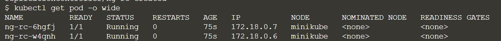
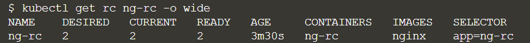
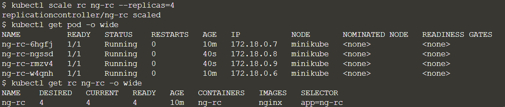
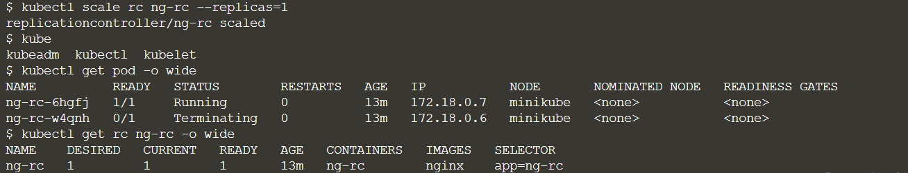

# rc基础

参考链接：

[k8s入门系列之rc基础篇](http://www.21yunwei.com/archives/6818)

Replication Controller(简称rc)用来管理Pod的副本，保证集群中存在指定数量的Pod副本。集群中副本的数量大于指定数量，则会停止指定数量之外的多余容器数量，反之，则会启动少于指定数量个数的容器，保证数量不变。Replication Controller是实现弹性伸缩、动态扩容和滚动升级的核心。

Rc的主要功能点：

- **确保Pod数量**：指定某个服务在Kubernetes中有相应数量Pod在运行；

- **确保Pod健康**：当Pod不健康，运行出错或者无法提供服务时，会杀死不健康的Pod并重新创建，保持Pod数量一致；

- **弹性伸缩**：当业务高峰期的时候可以设置扩增Pod数量，配合监控就可以了做自动伸缩了；
- **滚动升级**：也就是蓝绿发布，当一个Pod使用的镜像更新，采用滚动升级模式，Rc会自动一个一个Pod的进行升级，关闭一个Pod的同时进行升级，且在原镜像基础上创建一个新Pod，当一个Pod更新完成后再关闭一个旧镜像Pod。

## 创建rc

基于yml创建，案例yml文件：

```yaml
apiVersion: v1  
kind: ReplicationController  
metadata:  
  name: ng-rc
spec:  
  replicas: 2
  selector:  
    app: ng-rc 
  template:   
    metadata:  
      labels:  
        app: ng-rc
    spec:  
      containers:  
      - name: ng-rc 
        image: nginx  
        ports:  
        - containerPort: 80 
```

kind: ReplicationController #定义这是一个RC
replicas: 2 #定义将创建2个pod
image: nginx #使用nginx镜像
containerPort :80 #容器监听端口号（nginx 默认监听80，如果自定义监听，设置为镜像内监听端口即可）
最简单基础的nginx 就定义好了，启动命令为：

```sh
kubectl create -f ng-rc.yml
```

## 查看rc

先查看pod

```
kubectl get pod -o wide
```



查看rc

```
kubectl get rc ng-rc -o wide
```



通过pod和rc可见，基于yml创建的pod以及rc副本都是成功的，rc副本各存在于minikube节点。通过get rc 可以看到副本的一些详细信息，比如pod名称，副本数量，镜像名称以及打的标签信息等。

## 弹性伸缩和扩容

### 增加副本数量

```
kubectl scale rc ng-rc --replicas=4
```



###  缩减副本数量

```
kubectl sacle rc ng-rc --replicas=1
```

