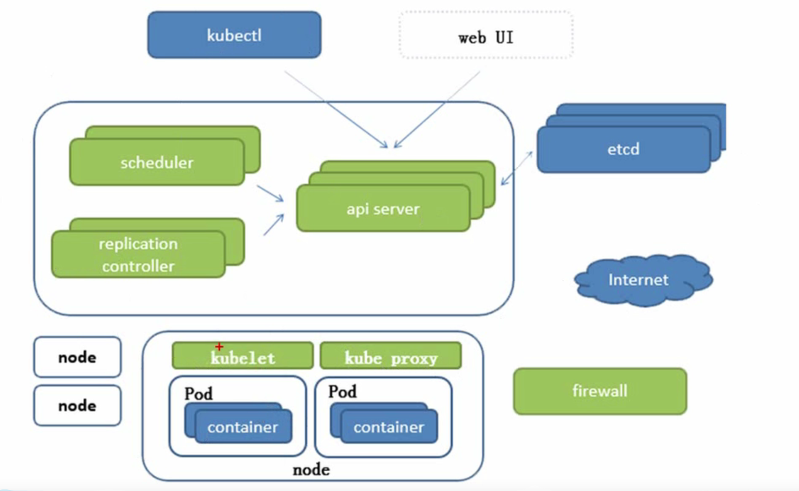
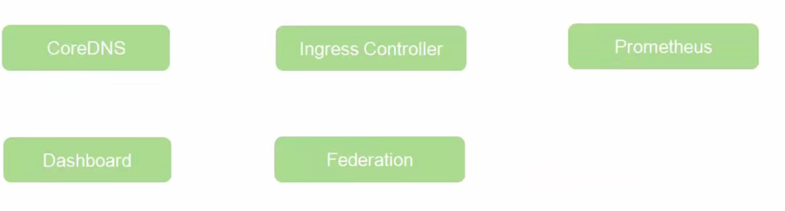

# 看B站尚硅谷笔记

​	什么是k8s

1. 发展历程

2. 特点

   - 轻量级

   - 开源

   - 弹性伸缩
   - 负载均衡

k8s架构

服务分类：

​	有状态：DBMS

​	无状态：LVS APACHE

高可用集群副本数据最好大于等于三，同时是奇数个

​	

​	

APISERVER：所有服务的访问入口

replication controller 控制器：维持副本期望数目

Scheduler：负责接受任务，选择合适的节点进行分配任务

ETCD：键值对数据库，存储K8S集群的所有重要信息（持久化）

Kubelet：直接跟容器引擎交互实现容器的生命周期管理

Kube-proxy：负责写入规则至 IPTABLES、IPVS实现服务映射访问

重要插件

CoreDNS：可以为集群中的SVC创建一个域名IP的对应关系解析

DashBoard：给k8s集群提供一个B/S结构的访问体系

Ingress Controller：官方智能实现四层代理，这个可以实现七层代理

Federation：提供一个可以跨集群中心为多K8S统一管理功能

Prometheus：普罗米修斯，提供一个K8S集群的监控能力

ELK：提供K8S集群日志容易分析接入平台

