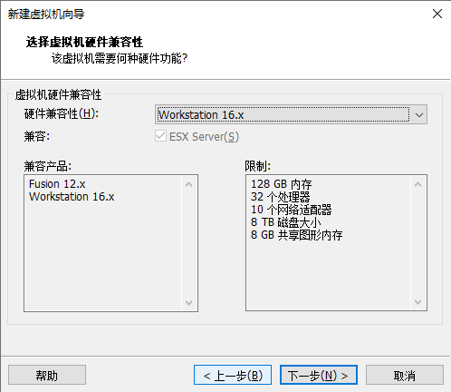
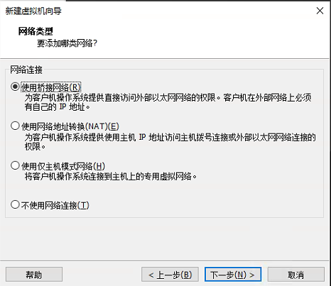
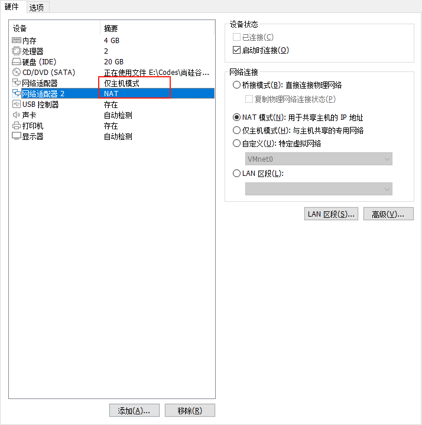
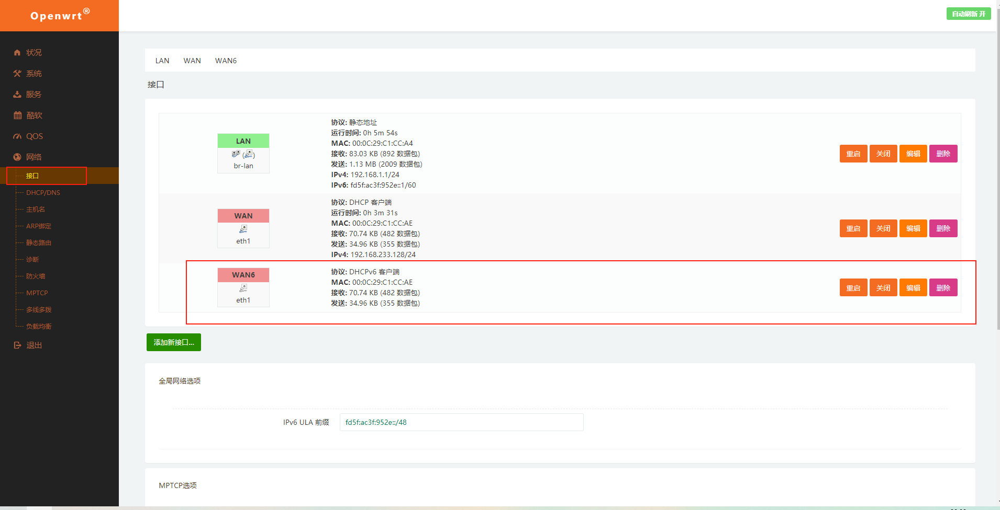

# 第一个k8s集群的安装

##  说明

采用kubeadm自动构建工具，构建一个66网段的集群

| 名称         | ip             | 说明               |
| ------------ | -------------- | ------------------ |
| k8s-master01 | 192.168.66.10  |                    |
| k8s-node01   | 192.168.66.20  |                    |
| k8s-node02   | 192.168.66.21  |                    |
| harbor       | 192.168.66.100 |                    |
| koolshare    | 192.168.66.1   | 让虚拟机可以上外网 |

## 系统

- centos7
- 内核4.4，三点几的有bug，运行不稳定

## 网络


## 资源分配

| 节点名称     | 处理器数量 | 内核数量 | 内存 | 磁盘大小 | 备注                       |
| ------------ | ---------- | -------- | ---- | -------- | -------------------------- |
| k8s-master01 | 2          | 2        | 2048 | 100      |                            |
| k8s-node01   | 2          | 2        | 4096 | 50       |                            |
| k8s-node02   | 2          | 2        | 4096 | 50       |                            |
| harbor       | 2          | 2        | 2048 | 100      |                            |
| koolshare    | 1          | 1        | 4096 | 20       | 安装完系统后，内存改为1024 |

# koolshare软路由安装

### 新建软路由虚拟机








### 进入虚拟机安装软路由

挂载老毛桃PE系统


开启虚拟机，选择windows10 PE


​		把光驱里面的老毛桃ISO换成准备好的镜像

​										

PS：准备好的ISO文件里面的内容：1）IMG写盘工具，2）openwrt-koolshare-mod


打开写盘工具


选择openwrt-koolshare-mod


点击开始，点击是，等待安装完成，将应用窗口关掉。

将光驱，弹出，重启虚拟机。

重启完成后，是这个样子。


### 配置软路由

重新配置虚拟机网卡



编辑——》虚拟机网络设置——》取消勾选DHCP


本地网络适配器里面配置虚拟机的VMet1网络


点击高级给网卡添加另外一个IP


浏览器输入：192.168.1.1<span style="color:red">容易进入路由器的管理页面</span>


输入密码koolshare进入

删除下面的WAN6



这里改成静态协议，192.168.66.1


<span style="color:red">可能需要重启一下客户端</span>

输入192.168.66.1，重新进入koolshare管理界面

### 安装koolshare插件

选择库软，离线安装，上传并安装koolss的安装包


安装好后，有个这玩意


把它打开，在这里填写机场的SSR的订阅地址

模式我选择的GFW


# 安装centos系统

具体可以参考

[centos安装](https://github.com/ck-chenkang/Server-Learning/blob/main/Linux/CentOS7/CentOS7.8%E5%AE%89%E8%A3%85.md)

视频和上述教程的不同点：

- 网络适配器选择，仅主机模式
- 没有自定义目录
- 安装语言过程中的语言选择的是中文

## 配置主机网络

`vi /etc/sysconfig/network-scripts/ifcfg-ens33`

注意最后几行

```
TYPE=Ethernet
PROXY_METHOD=none
BROWSER_ONLY=no
BOOTPROTO=dhcp
DEFROUTE=yes
IPV4_FAILURE_FATAL=no
IPV6INIT=yes
IPV6_AUTOCONF=yes
IPV6_DEFROUTE=yes
IPV6_FAILURE_FATAL=no
IPV6_ADDR_GEN_MODE=stable-privacy
NAME=ens33
UUID=c6f06906-de37-4f69-aaa0-4dc160fab9e4
DEVICE=ens33
ONBOOT=yes
IPADDR=192.168.66.10
NETMASK=255.255.255.0
GATEWAY=192.168.66.1
DNS1=192.168.66.1
DNS2=114.114.114.114
```

`service network restart`

```
# 测试下网络
ping www.baidu.com
```

用mobaxterm进行ssh连接


chrome浏览器，192.168.66.1进入koolshare的管理平台，查看当前网络状态，可以看到lan下面有我们的主机


同样配置其他的机台机器的网络

# centos系统初始化

## 设置主机名

```
hostnamectl set-hostname k8s-master01
hostnamectl set-hostname k8s-node01
hostnamectl set-hostname k8s-node02
```

## Host文件相互解析

ps:大型项目中通过DNS的方法，让主机名和IP相互解析

```
vi /etc/hosts

# 下面添加如下内容
127.0.0.1   localhost localhost.localdomain localhost4 localhost4.localdomain4
::1         localhost localhost.localdomain localhost6 localhost6.localdomain6
192.168.66.10 k8s-master01
192.168.66.20 k8s-node01
192.168.66.21 k8s-node02

# 拷贝文件到node01和node02目录下
scp /etc/hosts root@k8s-node01:/etc/hosts
scp /etc/hosts root@k8s-node02:/etc/hosts
```


## 修改yum源

```
mv /etc/yum.repos.d/CentOS-Base.repo /etc/yum.repos.d/CentOS-Base.repo.backup
curl -o /etc/yum.repos.d/CentOS-Base.repo http://mirrors.aliyun.com/repo/Centos-7.repo
yum makecache fast
```

## 安装依赖包

```
yum install -y conntrack ntpdate ntp ipvsadm ipset jq iptables curl sysstat libseccomp wget vim net-tools git
```

## 设置防火墙为Iptables并设置为空规则

```
systemctl stop firewalld && systemctl disable firewalld

yum -y install iptables-services && systemctl start iptables && systemctl enable iptables && iptables -F && service iptables save
```

## 关闭虚拟内存，关闭SELINUX

```
# 关闭虚拟内存
swapoff -a && sed -i '/ swap / s/^\(.*\)$/#\1/g' /etc/fstab

# 关闭SELINUX
setenforce 0 && sed -i 's/^SELINUX=.*/SELINUX=disabled/' /etc/selinux/config

```

## 调整内核参数，对于k8s

```
# 创建一个文件，并让它的内容是下面的东西
cat > kubernetes.conf <<EOF
net.bridge.bridge-nf-call-iptables=1 #k8s必须
net.bridge.bridge-nf-call-ip6tables=1 #k8s必须
net.ipv4.ip_forward=1
net.ipv4.tcp_tw_recycle=0
vm.swappiness=0 # 禁止使用 swap 空间，只有当系统 OOM 时才允许使用它
vm.overcommit_memory=1 # 不检查物理内存是否够用
vm.panic_on_oom=0 # 开启 OOM  
fs.inotify.max_user_instances=8192
fs.inotify.max_user_watches=1048576
fs.file-max=52706963
fs.nr_open=52706963
net.ipv6.conf.all.disable_ipv6=1 #k8s必须
net.netfilter.nf_conntrack_max=2310720
EOF

# 拷贝文件到开机自启动目录
cp kubernetes.conf  /etc/sysctl.d/kubernetes.conf

# 让它文件立即生效
sysctl -p /etc/sysctl.d/kubernetes.conf
```

## 调整系统时区

ps：系统安装的时候，设置过了，略过

```
# 设置系统时区为 中国/上海
timedatectl set-timezone Asia/Shanghai
# 将当前的 UTC 时间写入硬件时钟
timedatectl set-local-rtc 0
# 重启依赖于系统时间的服务
systemctl restart rsyslog 
systemctl restart crond
```

## 关闭系统不要的服务

```
systemctl stop postfix && systemctl disable postfix
```

## 系统日志，不用 rsyslogd ，设置为 systemd journald

```
# 创建持久化保存日志的目录
mkdir /var/log/journal

# 创建配置文件存放目录
mkdir /etc/systemd/journald.conf.d

# 创建配置文件
cat > /etc/systemd/journald.conf.d/99-prophet.conf <<EOF
[Journal]
# 持久化保存到磁盘
Storage=persistent
 
# 压缩历史日志
Compress=yes
 
SyncIntervalSec=5m
RateLimitInterval=30s
RateLimitBurst=1000
 
# 最大占用空间 10G
SystemMaxUse=10G
 
# 单日志文件最大 200M
SystemMaxFileSize=200M
 
# 日志保存时间 2 周
MaxRetentionSec=2week
 
# 不将日志转发到 syslog
ForwardToSyslog=no
EOF

# 重启
systemctl restart systemd-journald
```

## 升级系统内核为4.44——<span style="color:red">错误指导，不要这样，看下面</span>

ps. <span style="color:red">搞完之后是5点多的版本了</span>

CentOS 7.x 系统自带的 3.10.x 内核存在一些 Bugs，导致运行的 Docker、Kubernetes 不稳定，例如： rpm -Uvh
http://www.elrepo.org/elrepo-release-7.0-3.el7.elrepo.noarch.rpm

```
rpm -Uvh http://www.elrepo.org/elrepo-release-7.0-3.el7.elrepo.noarch.rpm
# 安装完成后检查 /boot/grub2/grub.cfg 中对应内核 menuentry 中是否包含 initrd16 配置，如果没有，再安装
一次！
yum --enablerepo=elrepo-kernel install -y kernel-lt
# 设置开机从新内核启动
grub2-set-default 'CentOS Linux (4.4.189-1.el7.elrepo.x86_64) 7 (Core)'
```

## 重启

```
reboot -h now
```

## 检测内核版本

```
uname -r
```


# <span style="color:red">centos安装指定内核版本</span>

[centos安装内核到指定版本](https://www.cnblogs.com/cnwangshijun/p/7405153.html)

1. 到[内核官网](https://www.cnblogs.com/cnwangshijun/p/7405153.html)下载对应的版本
2. 
3. 在上图，框的位置，右击，复制链接

```
# 4 安装开发工具包
yum groupinstall "Development Tools" -y  

# 5 安装常用软件
yum install -y elfutils-libelf-devel bc openssl-devel ncurses-devel wget ntpdate vim net-tools 

# 6 同步时间，如果时间不对编译可能会出问题
ntpdate -u times.aliyun.com  

# 7 下载内核，url是3中拷贝的连接
wget https://cdn.kernel.org/pub/linux/kernel/v4.x/linux-4.4.284.tar.xz

# 9 解压内核 到/usr/src目录
tar -xvf linux-4.4.284.tar.xz -C /usr/src/

# 10 
cd /usr/src/linux-4.4.284

# 11 
sh -c 'yes "" | make oldconfig'

# 12 编译 4是指定内核，根据服务器的核心数设置
make -j4 bzImage 
```


```
# 13 
make -j4 modules
```


# Kubeadm 部署安装

## kube-proxy开启ipvs的前置条件 

```
# modprobe:用于向内核中加载模块或者从内核中移除模块。 
# https://blog.csdn.net/cd_yourheart/article/details/107534874
modprobe br_netfilter

# 新建一个文件
cat > /etc/sysconfig/modules/ipvs.modules <<EOF
#!/bin/bash
modprobe -- ip_vs
modprobe -- ip_vs_rr
modprobe -- ip_vs_wrr
modprobe -- ip_vs_sh
modprobe -- nf_conntrack_ipv4
EOF

chmod 755 /etc/sysconfig/modules/ipvs.modules && bash /etc/sysconfig/modules/ipvs.modules && 
lsmod | grep -e ip_vs -e nf_conntrack_ipv4
```

