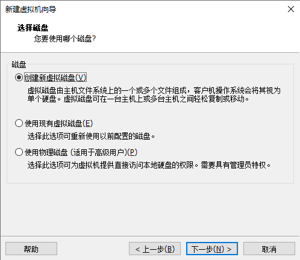

# 第一个k8s集群的安装

##  说明

采用kubeadm自动构建工具，构建一个66网段的集群

| 名称         | ip             | 说明               |
| ------------ | -------------- | ------------------ |
| k8s-master01 | 192.168.66.10  |                    |
| k8s-node01   | 192.168.66.20  |                    |
| k8s-node02   | 192.168.66.21  |                    |
| harbor       | 192.168.66.100 |                    |
| koolshare    | 192.168.66.1   | 让虚拟机可以上外网 |

## 系统

- centos7
- 内核4.4，三点几的有bug，运行不稳定

## 网络


## 资源分配

| 节点名称     | 处理器数量 | 内核数量 | 内存 | 磁盘大小 | 备注                       |
| ------------ | ---------- | -------- | ---- | -------- | -------------------------- |
| k8s-master01 | 2          | 2        | 2048 | 100      |                            |
| k8s-node01   | 2          | 2        | 4096 | 50       |                            |
| k8s-node02   | 2          | 2        | 4096 | 50       |                            |
| harbor       | 2          | 2        | 2048 | 100      |                            |
| koolshare    | 1          | 1        | 4096 | 20       | 安装完系统后，内存改为1024 |

## koolshare软路由安装

### 新建软路由虚拟机





### 进入虚拟机安装软路由

挂载老毛桃PE系统


开启虚拟机，选择windows10 PE


​		把光驱里面的老毛桃ISO换成准备好的镜像

​										

PS：准备好的ISO文件里面的内容：1）IMG写盘工具，2）openwrt-koolshare-mod


打开写盘工具


选择openwrt-koolshare-mod


点击开始，点击是，等待安装完成，将应用窗口关掉。

将光驱，弹出，重启虚拟机。

重启完成后，是这个样子。


### 配置软路由

重新配置虚拟机网卡


编辑——》虚拟机网络设置——》取消勾选DHCP


本地网络适配器里面配置虚拟机的VMet1网络


点击高级给网卡添加另外一个IP


浏览器输入：192.168.1.1<span style="color:red">容易进入路由器的管理页面</span>


输入密码koolshare进入

删除下面的WAN6


这里改成静态协议，192.168.66.1


<span style="color:red">可能需要重启一下客户端</span>

输入192.168.66.1，重新进入koolshare管理界面

### 安装koolshare插件

选择库软，离线安装，上传并安装koolss的安装包


安装好后，有个这玩意


把它打开，在这里填写机场的SSR的订阅地址

模式我选择的GFW


## 安装centos系统

具体可以参考

[centos安装](https://github.com/ck-chenkang/Server-Learning/blob/main/Linux/CentOS7/CentOS7.8%E5%AE%89%E8%A3%85.md)

视频和上述教程的不同点：

- 网络适配器选择，仅主机模式
- 没有自定义目录
- 安装语言过程中的语言选择的是中文

## 配置主机网络

`vi /etc/sysconfig/network-scripts/ifcfg-ens33`

注意最后几行

```
TYPE=Ethernet
PROXY_METHOD=none
BROWSER_ONLY=no
BOOTPROTO=dhcp
DEFROUTE=yes
IPV4_FAILURE_FATAL=no
IPV6INIT=yes
IPV6_AUTOCONF=yes
IPV6_DEFROUTE=yes
IPV6_FAILURE_FATAL=no
IPV6_ADDR_GEN_MODE=stable-privacy
NAME=ens33
UUID=c6f06906-de37-4f69-aaa0-4dc160fab9e4
DEVICE=ens33
ONBOOT=yes
IPADDR=192.168.66.10
NETMASK=255.255.255.0
GATEWAY=192.168.66.1
DNS1=192.168.66.1
DNS2=114.114.114.114
```

`service network restart`

```
# 测试下网络
ping www.baidu.com
```

用mobaxterm进行ssh连接


chrome浏览器，192.168.66.1进入koolshare的管理平台，查看当前网络状态，可以看到lan下面有我们的主机


同样配置其他的机台机器的网络

## 设置主机名

