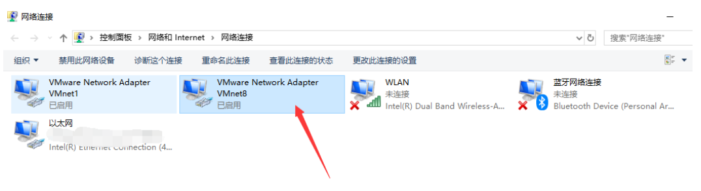

# 第二次k8s集群的安装(这次我成功了，记录一下)

参考链接：

[github上自动化安装集群的工具](https://github.com/fanux/sealos)

[docker拉取k8s镜像问题，完美解决方法](https://www.freesion.com/article/20831079183/)

[dockhub官方镜像仓库——用来下载kubeadm init初始化需要的镜像](https://hub.docker.com/)

## 网络分配

| master | 192.168.67.10 |
| ------ | ------------- |
| node01 | 192.168.67.20 |
| node01 | 192.168.67.21 |

## 网络模式设置

三台虚拟机都是nat模式，nat模式，怎么设置网络，参考下面的连接：

[VMware安装CentOS7使用NAT模式进行上网配置，只需四步！](https://blog.csdn.net/fei1234456/article/details/107180111/)

首先点击网络编辑器，取消DHCP服务，点击NAT设置


配置宿主VMnet8网卡





说明：

- IP地址：与虚拟网关（也就是上图的192.168.67.2）要在同个网段（如：192.168.67.3）
- 默认网关：虚拟网关的地址（如：192.168.67.2）
- 子网掩码：与虚拟网关相同（如：255.255.255.0）
- DNS：可以用虚拟网关的地址（192.168.67.2）或者其他（如 8.8.8.8/114.114.114.114等）


重启网卡

```
service network restart 
```

## centos安装

## Master节点安装步骤

<span style="color:red">Master和Node节点有一部分配置是一样的</span>

### 设置主机名，并重启

```
#设置主机名
vi /etc/hosts

192.168.67.10 master
192.168.67.20 node01
192.168.67.21 node02
```

### 关闭linux防火墙

```
#关闭防火墙
[root@master ~]# systemctl stop firewalld

#设置防火墙开机不启动
[root@master ~]# systemctl disable firewalld

#查看防火墙状态
[root@master ~]# systemctl status firewalld
```

### 禁用SELINUX

```
#临时关闭,用于关闭selinux防火墙，但重启后失效
[root@master ~]# setenforce 0

#关闭selinux，将SELINUX=enforcing修改为disabled
[root@master ~]# vi /etc/selinux/config
SELINUX=disabled

#重启系统
[root@master ~]# reboot

#查看selinux的状态
[root@master ~]# /usr/sbin/sestatus
SELinux status:                 disabled

```

### 注释掉 SWAP 的自动挂载

```
#修改 /etc/fstab 文件，注释掉 SWAP 的自动挂载，即注释/dev/mapper/centos-swap这行
[root@master ~]# vi  /etc/fstab
 #
 # /etc/fstab
 # Created by anaconda on Mon Jan 21 19:19:41 2019
 #
 # Accessible filesystems, by reference, are maintained under '/dev/disk'
 # See man pages fstab(5), findfs(8), mount(8) and/or blkid(8) for more info
 #
 /dev/mapper/centos-root /                       xfs     defaults        0 0
 UUID=214b916c-ad23-4762-b916-65b53fce1920 /boot                   xfs     defaults        0     0
 #/dev/mapper/centos-swap swap                    swap    defaults        0 0
```

### 创建/etc/sysctl.d/k8s.conf文件，添加如下内容

```
#关闭swap，保证 kubelet正确运行
[root@master ~]# swapoff -a

#创建k8s.conf文件
[root@master ~]# vi /etc/sysctl.d/k8s.conf
#文件内容
net.bridge.bridge-nf-call-ip6tables = 1
net.bridge.bridge-nf-call-iptables = 1
net.ipv4.ip_forward = 1
vm.swappiness=0 

#执行命令使修改生效
[root@master ~]# modprobe br_netfilter
[root@master ~]# sysctl -p /etc/sysctl.d/k8s.conf
```

### kube-proxy开启ipvs的前置条件

```
#保证在节点重启后能自动加载所需模块
[root@master ~]# cat > /etc/sysconfig/modules/ipvs.modules <<EOF
#!/bin/bash
modprobe -- ip_vs
modprobe -- ip_vs_rr
modprobe -- ip_vs_wrr
modprobe -- ip_vs_sh
modprobe -- nf_conntrack_ipv4
EOF

[root@master ~]# chmod 755 /etc/sysconfig/modules/ipvs.modules && bash /etc/sysconfig/modules/ipvs.modules && lsmod | grep -e ip_vs -e nf_conntrack_ipv4

#查看是否已经正确加载所需的内核模块
[root@master ~]# lsmod | grep -e ip_vs -e nf_conntrack_ipv4

#安装了ipset软件包
[root@master ~]# yum install ipset

#为了便于查看ipvs的代理规则,安装管理工具ipvsadm
[root@master ~]# yum install ipvsadm
```

**PS:** 如果以上前提条件如果不满足，则即使kube-proxy的配置开启了ipvs模式，也会退回到iptables模式

### 安装Docker(仅提供一种安装方式参考)

1. 配置安装docker的yum源，①阿里云；②docker：

```
[root@master ~]# yum install -y yum-utils device-mapper-persistent-data lvm2

#配置yum源路径，：
#阿里云的yum源（推荐）
[root@master ~]# yum-config-manager  --add-repo https://mirrors.aliyun.com/docker-ce/linux/centos/docker-ce.repo

#  下面和上面只做一个

#docker的yum源(和上一个命令一样，配置yum源地址)
[root@master ~]# yum-config-manager  --add-repo  https://download.docker.com/linux/centos/docker-ce.repo
 
#查看可安装Docker版本
[root@master ~]# yum list docker-ce.x86_64  --showduplicates |sort -r
docker-ce.x86_64            3:18.09.0-3.el7                    docker-ce-stable 
docker-ce.x86_64            18.06.1.ce-3.el7                   docker-ce-stable 
docker-ce.x86_64            18.06.1.ce-3.el7                   @docker-ce-stable
docker-ce.x86_64            18.06.0.ce-3.el7                   docker-ce-stable 
docker-ce.x86_64            18.03.1.ce-1.el7.centos            docker-ce-stable 
docker-ce.x86_64            18.03.0.ce-1.el7.centos            docker-ce-stable 
docker-ce.x86_64            17.12.1.ce-1.el7.centos            docker-ce-stable 
docker-ce.x86_64            17.12.0.ce-1.el7.centos            docker-ce-stable 
docker-ce.x86_64            17.09.1.ce-1.el7.centos            docker-ce-stable 
docker-ce.x86_64            17.09.0.ce-1.el7.centos            docker-ce-stable 
docker-ce.x86_64            17.06.2.ce-1.el7.centos            docker-ce-stable 
docker-ce.x86_64            17.06.1.ce-1.el7.centos            docker-ce-stable 
docker-ce.x86_64            17.06.0.ce-1.el7.centos            docker-ce-stable 
docker-ce.x86_64            17.03.3.ce-1.el7                   docker-ce-stable 
docker-ce.x86_64            17.03.2.ce-1.el7.centos            docker-ce-stable 
docker-ce.x86_64            17.03.1.ce-1.el7.centos            docker-ce-stable 
docker-ce.x86_64            17.03.0.ce-1.el7.centos            docker-ce-stable
```

在线安装

PS： Kubernetes 1.12已经针对Docker的1.11.1, 1.12.1, 1.13.1, 17.03, 17.06, 17.09, 18.06 等版本做了验证，需要注意Kubernetes 1.12最低支持的Docker版本是1.11.1。我们这里在各节点安装docker的18.06.1版本，如果需要安装其他版本，只需修改版本号即可

```
#建立元数据缓存
[root@master ~]# yum makecache fast

#安装docker,有时会因为网络问题下载有问题会报错，可以重复安装试试
[root@master ~]# yum install -y --setopt=obsoletes=0 docker-ce-18.06.1.ce-3.el7

#设置启动docker
[root@master ~]# systemctl start docker

#设置开机自启，否则kubeadm会报错，要求必须设置开机自启
[root@master ~]# systemctl enable docker
```

确认一下iptables filter表中FOWARD链的默认策略(pllicy)为ACCEPT

```
[root@master ~]# iptables -nvL
Chain INPUT (policy ACCEPT 9 packets, 760 bytes)
 pkts bytes target     prot opt in     out     source            destination         
 
Chain FORWARD (policy ACCEPT 0 packets, 0 bytes)
 pkts bytes target     prot opt in     out     source               destination
 
 #如果不是ACCEPT，则修改
[root@master ~]# iptables  -P FORWARD  ACCEPT
```

PS： Docker从1.13版本开始调整了默认的防火墙规则，禁用了iptables filter表中FOWARD链，这样会引起Kubernetes集群中跨Node的Pod无法通信。但这里通过安装docker 1806，发现默认策略又改回了ACCEPT，这个不知道是从哪个版本改回的，因为我们线上版本使用的1706还是需要手动调整这个策略的。

## 用yum 安装kubelet kubeadm kubectl

<span style="color:red">安装的时候，kubelet-1.12.1 kubeadm-1.12.1 kubectl-1.12.1</span>

创建配置文件

```
#创建文件命令，这里用阿里云的，也可以用其他的
[root@master ~]# vi /etc/yum.repos.d/kubernetes.repo
#文件内容
[kubernetes]
name=Kubernetes
baseurl=https://mirrors.aliyun.com/kubernetes/yum/repos/kubernetes-el7-x86_64/
gpgcheck=1
enable=1
repo_gpgcheck=1
gpgkey=https://mirrors.aliyun.com/kubernetes/yum/doc/yum-key.gpg
	https://mirrors.aliyun.com/kubernetes/yum/doc/rpm-package-key.gpg
```

```
#建立元数据缓存并安装kubelet，kubeadm，kubectl
#不指定版本，则默认安装最新版本，目前为1.13版本，这里安装1.12版本
[root@master ~]# yum makecache fast && yum install -y kubelet-1.12.1 kubeadm-1.12.1 kubectl-1.12.1

# 下面这个代表安装的是最新版
# yum install -y kubelet kubeadm kubectl 
```

PS：如果上述命令报错，可以拆开分别执行

1. 安装过程常见的错误信息
   ①提示gpgkey没有安装

```
#检查kubernetes.repo文件是否写错，gpgkey第二行没有空格有可能也会造成错误
#没有错误，仍然提示错误，则下载手动导入
#如果没有wget，则执行下面命令安装
[root@master ~]# yum install wget
#下载错误信息对应的gpgkey，这里以rpm-package-key.gpg为例
[root@master ~]# wget https://mirrors.aliyun.com/kubernetes/yum/doc/rpm-package-key.gpg
[root@master ~]# rpm --import rpm-package-key.gpg
#再次执行安装命令

```

## 初始化集群，重点来了

如果不能科学上网，则需先将需要的镜像拉取到本地，否则初始化命令无法执行

#### 查看需要哪些镜像

```
#不清楚需要哪些镜像，则执行下列命令查看，默认显示最新版本，将对应的镜像版本修改以下即可，下列为v1.12.1
[root@master ~]# kubeadm config images list
I0122 13:54:06.772434   29672 version.go:89] could not fetch a Kubernetes version from the internet: unable to get URL "https://dl.k8s.io/release/stable-1.txt": Get https://storage.googleapis.com/kubernetes-release/release/stable-1.txt: net/http: request canceled while waiting for connection (Client.Timeout exceeded while awaiting headers)
I0122 13:54:06.772503   29672 version.go:94] falling back to the local client version: v1.12.1
k8s.gcr.io/kube-apiserver:v1.12.1
k8s.gcr.io/kube-controller-manager:v1.12.1
k8s.gcr.io/kube-scheduler:v1.12.1
k8s.gcr.io/kube-proxy:v1.12.1
k8s.gcr.io/pause:3.1
k8s.gcr.io/etcd:3.2.24
k8s.gcr.io/coredns:1.2.2
```

#### 总体思想：1）用docker pull下来，2）给pull下来的镜像打个kubeadm init的时候需要的名称，3）将docker pull下来的原始镜像删除

<span style="color:red">下面这个执行会报错，但是很有参考意义。更有参考意义的是开头的一篇链接</span>

```
#创建sh脚本
[root@master ~]# vi k8s.sh
#脚本内容
docker pull mirrorgooglecontainers/kube-apiserver:v1.12.1
docker pull mirrorgooglecontainers/kube-controller-manager:v1.12.1
docker pull mirrorgooglecontainers/kube-scheduler:v1.12.1
docker pull mirrorgooglecontainers/kube-proxy:v1.12.1
docker pull mirrorgooglecontainers/pause:3.1
docker pull mirrorgooglecontainers/etcd:3.2.24
docker pull coredns/coredns:1.2.2

docker tag mirrorgooglecontainers/kube-apiserver:v1.12.1 k8s.gcr.io/kube-apiserver:v1.12.1
docker tag mirrorgooglecontainers/kube-controller-manager:v1.12.1 k8s.gcr.io/kube-controller-manager:v1.12.1
docker tag mirrorgooglecontainers/kube-scheduler:v1.12.1 k8s.gcr.io/kube-scheduler:v1.12.1
docker tag mirrorgooglecontainers/kube-proxy:v1.12.1  k8s.gcr.io/kube-proxy:v1.12.1
docker tag mirrorgooglecontainers/pause:3.1  k8s.gcr.io/pause:3.1
docker tag mirrorgooglecontainers/etcd:3.2.24  k8s.gcr.io/etcd:3.2.24
docker tag coredns/coredns:1.2.2 k8s.gcr.io/coredns:1.2.2

docker rmi mirrorgooglecontainers/kube-apiserver:v1.12.1
docker rmi mirrorgooglecontainers/kube-controller-manager:v1.12.1
docker rmi mirrorgooglecontainers/kube-scheduler:v1.12.1
docker rmi mirrorgooglecontainers/kube-proxy:v1.12.1
docker rmi mirrorgooglecontainers/pause:3.1
docker rmi mirrorgooglecontainers/etcd:3.2.24
docker rmi coredns/coredns:1.2.2

#运行脚本，下载所需镜像
[root@master ~]# bash k8s.sh

#查看本地镜像是否下载有我们所需镜像
[root@master ~]# docker image ls
```

[k8s拉取镜像完美解决办法](https://www.freesion.com/article/20831079183/)

[docker hub官方仓库](https://hub.docker.com/)

#### 1. docker 换源，换成国内的

[Docker设置国内镜像源](https://blog.csdn.net/whatday/article/details/86770609?ops_request_misc=%257B%2522request%255Fid%2522%253A%2522163175415316780366557218%2522%252C%2522scm%2522%253A%252220140713.130102334.pc%255Fall.%2522%257D&request_id=163175415316780366557218&biz_id=0&utm_medium=distribute.pc_search_result.none-task-blog-2~all~first_rank_ecpm_v1~hot_rank-19-86770609.pc_search_result_hbase_insert&utm_term=docker&spm=1018.2226.3001.4187)

1. `cd /etc/docker`

2. `vim ./daemon.json`

3. ```
   {
       "registry-mirrors": ["http://hub-mirror.c.163.com"]
   }
   ```

4. `systemctl restart docker.service`

#### 2. 去docker hub仓库找镜像

首先要看看该在哪个地方拉取，可以去docker hub搜一搜哪里有kube-proxy之类的组件
进入dockerhub搜索：

https://hub.docker.com/search?q=kube-proxy&type=image
按照<span style="color:red">最近更新排序</span>，结果如下，可以发现一个下载次数10k+，更新也很频繁的仓库：

<span style="color:red">记住这个镜像仓库名字</span>


#### 3.  编写脚本

这个脚本，整体上是对的，就是有个别的pull不下来，还是要手动pull，tag，remove i

vim pull_k8s_images.sh

```shell
set -o errexit
set -o nounset
set -o pipefail
##这里定义版本
KUBE_VERSION=v1.18.5
KUBE_PAUSE_VERSION=3.2
ETCD_VERSION=3.4.3-0
DNS_VERSION=1.6.7

GCR_URL=k8s.gcr.io
##这里就是写你要使用的仓库
DOCKERHUB_URL=gotok8s
##这里是镜像列表
images=(
kube-proxy:${KUBE_VERSION}
kube-scheduler:${KUBE_VERSION}
kube-controller-manager:${KUBE_VERSION}
kube-apiserver:${KUBE_VERSION}
pause:${KUBE_PAUSE_VERSION}
etcd:${ETCD_VERSION}
coredns:${DNS_VERSION}
)
##这里是拉取和改名的循环语句
for imageName in ${images[@]} ; do
  docker pull $DOCKERHUB_URL/$imageName
  docker tag $DOCKERHUB_URL/$imageName $GCR_URL/$imageName
  docker rmi $DOCKERHUB_URL/$imageName
done

```

```
然后授予执行权限
chmod +x ./pull_k8s_images.sh

执行：
./pull_k8s_images.sh
```

```
docker images 查看镜像
```

如果还有镜像没有拉取下来，比如我第一次用的不是gotok8s仓库，而另一个仓库里面并没有最新的etcd和coredns，所以这两个没有拉取下来，那就再去找一些仓库，直接搜索etcd，进入仓库后点击Tag，看是不是有你需要的版本，如下图：


如果有，假如这个仓库叫corelab，然后使用vim命令再新建一个可执行文件。

添加内容：

```shell
set -o errexit
set -o nounset
set -o pipefail

## 这里只需要留下还需要下载的组件的版本号
ETCD_VERSION=3.4.3-0
DNS_VERSION=1.6.7

GCR_URL=k8s.gcr.io
## 这里写新的仓库地址
DOCKERHUB_URL=corelab

## 这里也只留下需要下载的镜像
images=(
etcd:${ETCD_VERSION}
coredns:${DNS_VERSION}
)

for imageName in ${images[@]} ; do
  docker pull $DOCKERHUB_URL/$imageName
  docker tag $DOCKERHUB_URL/$imageName $GCR_URL/$imageName
  docker rmi $DOCKERHUB_URL/$imageName
done

```

## **PS:** Kubernetes 1.8开始要求关闭系统的Swap，默认配置下kubelet将无法启动

之前已经做过这个操作了，这个博主有提了一遍，我就跟着放这里吧。

```
#修改/etc/sysconfig/kubelet：
[root@master ~]# vi /etc/sysconfig/kubelet
KUBELET_EXTRA_ARGS=--fail-swap-on=false
```

## kube init之前的操作

这里就是另外一个坑了

参考这个链接：

[dial tcp 127.0.0.1:10248: connect: connection refused 错误解决办法](https://www.myfreax.com/how-to-solve-dial-tcp-127-0-0-1-10248-connect-connection-refused-during-kubeadm-init-initialization/)

就是下面两个错误

<span style="color:red">[kubelet-check] It seems like the kubelet isn't running or healthy.</span>

<span style="color:red">[kubelet-check] The HTTP call equal to 'curl -sSL http://localhost:10248/healthz' failed with error: Get http://localhost:10248/healthz: dial tcp 127.0.0.1:10248: connect: connection refused.</span>

这是cgroup驱动问题。默认情况下Kubernetes cgroup驱动程序设置为system，但docker设置为systemd。我们需要更改Docker cgroup驱动，通过创建配置文件`/etc/docker/daemon.json`并添加以下行：

```
{"exec-opts": ["native.cgroupdriver=systemd"]}
```

然后，为使配置生效，你必须重启docker和kubelet。

systemctl daemon-reload
systemctl restart docker
systemctl restart kubelet

ps：如果你前面配置了docker国内的镜像源，那么这个文件，此时应该是这个样子的

```
{
    "registry-mirrors": ["http://hub-mirror.c.163.com"],
    "exec-opts": ["native.cgroupdriver=systemd"]
}
```

<span style="color:red">重新初始化k8s集群之前，需要执行：sudo kubeadm reset</span>

## kube init

等他完成，把下面这玩意，copy下来

```
kubeadm join 192.168.67.10:6443 --token m295em.sqbgbpaqg03mgacl \
        --discovery-token-ca-cert-hash sha256:c8c26df96a8ba581a20b40b79fc81646d858282b27016b9c1840ad2db5f0788a
```

```
#设置kubelet服务开机自启
[root@master ~]# systemctl enable kubelet.service
   
#初始化集群,版本和apiserver地址写自己对应的，Swap首字母大写，不然无效
[root@master ~]# kubeadm init \
     --kubernetes-version=v1.12.1 \
     --pod-network-cidr=10.244.0.0/16 \
     --apiserver-advertise-address=192.168.50.139 \
     --ignore-preflight-errors=Swap
     
#出现下列信息则表示成功，记录kubeadm join 命令，节点加入时候用到
   To start using your cluster, you need to run the following as a regular user:
   
     mkdir -p $HOME/.kube
     sudo cp -i /etc/kubernetes/admin.conf $HOME/.kube/config
     sudo chown $(id -u):$(id -g) $HOME/.kube/config
   
   You should now deploy a pod network to the cluster.
   Run "kubectl apply -f [podnetwork].yaml" with one of the options listed at:
     https://kubernetes.io/docs/concepts/cluster-administration/addons/
   
   You can now join any number of machines by running the following on each node
   as root:
   
     kubeadm join 192.168.50.139:6443 --token nvofhe.0cm44ebb9n18oolf --discovery-token-ca-cert-hash sha256:4e6d77ed6ee4c0be95117fd8576946aa03914985b77a773062dc3dcea0163702
     
#不管是管理员还是非管理员用户，最好都运行一下，不然关机重启系统之后可能有各种错误
[root@master ~]# mkdir -p $HOME/.kube
[root@master ~]# sudo cp -i /etc/kubernetes/admin.conf $HOME/.kube/config
[root@master ~]# sudo chown $(id -u):$(id -g) $HOME/.kube/config

```

<span style="color:red">上面最后，那几个一定要执行，不管是，master还是node，都要，不然会报错，像下面这样</span>


## kubectl可以上场了，查看组件信息

```
#查看组件状态信息
[root@master ~]# kubectl get cs
  NAME                 STATUS    MESSAGE              ERROR
  controller-manager   Healthy   ok                   
  scheduler            Healthy   ok                   
  etcd-0               Healthy   {"health": "true"} 
  
#获取节点信息，现在的主节点状态为NotReady，原因是没有配置网络
[root@master ~]# kubectl get nodes
 NAME     STATUS     ROLES    AGE     VERSION
 master   NotReady   master   8m31s   v1.12.1
```

## Flannel部署

这个没啥难的

1. 安装方式一：Kubernetes v1.7之后的版本可以用下列命令安装

```
#安装的过程需要点时间,因为需要下载镜像
[root@master ~]# kubectl apply -f https://raw.githubusercontent.com/coreos/flannel/master/Documentation/kube-flannel.yml
clusterrole.rbac.authorization.k8s.io/flannel created
clusterrolebinding.rbac.authorization.k8s.io/flannel created
serviceaccount/flannel created
configmap/kube-flannel-cfg created
daemonset.extensions/kube-flannel-ds-amd64 created
daemonset.extensions/kube-flannel-ds-arm64 created
daemonset.extensions/kube-flannel-ds-arm created
daemonset.extensions/kube-flannel-ds-ppc64le created
daemonset.extensions/kube-flannel-ds-s390x created

#下面的命令与上面作用一样都是安装Flannel
[root@master ~]# mkdir -p ~/k8s/
[root@master ~]# cd ~/k8s
#如果没有wget，需要执行下列命令安装
[root@master ~]# yum install wget
[root@master ~]# wget https://raw.githubusercontent.com/coreos/flannel/master/Documentation/kube-flannel.yml
[root@master ~]# kubectl apply -f  kube-flannel.yml

```

**PS:** 安装命令获取地址：https://github.com/coreos/flannel ;

2. 查看是否成功

```
#可以通过下列命令查看是否成功
#查看quay.io/coreos/flannel镜像是否下载到本地
[root@master ~]# docker image ls

#查看master节点状态是否从notReady变成Ready
[root@master ~]# kubectl get nodes

#查看pods具体信息，运行的所有pod，会发现有flannel的pod
[root@master ~]# kubectl get pods -n kube-system -o wide

```

**PS:** 上述在线安装，镜像无法下载可以先下载好flannel镜像，重新安装可以按照下列命令操作

自动安装失败处理

```
#如果按照上述在线安装，重新安装需要先删除所创建的网络配置
[root@master ~]# kubectl delete -f https://raw.githubusercontent.com/coreos/flannel/master/Documentation/kube-flannel.yml

#可以网络查找，也可以下载下面的镜像包链接，将下载后的镜像包导入本地镜像库，导入方法此处不做叙述

#导入完镜像后，再按照执行上述在线安装命令
[root@master ~]# kubectl apply -f https://raw.githubusercontent.com/coreos/flannel/master/Documentation/kube-flannel.yml

```

flannel镜像下载路径：https://download.csdn.net/download/qq_24058757/10932884

## 子节点的安装步骤

##### 系统环境配置

**PS：** 参照Master节点的系统环境配置步骤

##### 安装Docker

**PS：** 参照Master节点的Docker安装，或者其他方法

##### 安装kubelet，kubeadm，加入集群

1. 文件配置创建

```
#创建kubernetes.repo配置文件
#可以参照master节点创建操作，也可以直接将master节点创建号的文件copy过来，copy命令如下：
[root@master ~]# scp /etc/yum.repos.d/kubernetes.repo node01:/etc/yum.repos.d/kubernetes.repo

#准备镜像，这里我是将master节点上的镜像利用docker命令打包转义到node01节点
[root@master ~]# docker images
REPOSITORY                           TAG                 IMAGE ID            CREATED             SIZE
k8s.gcr.io/kube-proxy                v1.12.1             61afff57f010        3 months ago        96.6MB
k8s.gcr.io/kube-controller-manager   v1.12.1             aa2dd57c7329        3 months ago        164MB
k8s.gcr.io/kube-scheduler            v1.12.1             d773ad20fd80        3 months ago        58.3MB
k8s.gcr.io/kube-apiserver            v1.12.1             dcb029b5e3ad        3 months ago        194MB
k8s.gcr.io/etcd                      3.2.24              3cab8e1b9802        4 months ago        220MB
k8s.gcr.io/coredns                   1.2.2               367cdc8433a4        4 months ago        39.2MB
quay.io/coreos/flannel               v0.10.0-amd64       f0fad859c909        12 months ago       44.6MB
k8s.gcr.io/pause                     3.1                 da86e6ba6ca1        13 months ago       742kB

#在master节点，将上述8个镜像打包
[root@master ~]# docker save  \
				k8s.gcr.io/kube-proxy \
				k8s.gcr.io/kube-controller-manager \
				k8s.gcr.io/kube-scheduler \
				k8s.gcr.io/kube-apiserver \
				k8s.gcr.io/etcd  \
				k8s.gcr.io/coredns  \
				quay.io/coreos/flannel   \
				k8s.gcr.io/pause \
				-o  k8s_all_image.tar
[root@master ~]# ls
anaconda-ks.cfg   k8s  k8s_all_image.tar  k8s.sh
[root@master ~]# scp k8s_all_image.tar node01:k8s_all_image.tar

#切换到node01节点，导入镜像
[root@node01 ~]# ls
anaconda-ks.cfg   k8s  k8s_all_image.tar  k8s.sh
[root@node01 ~]# docker load -i k8s_all_image.tar

```

2. 安装kubelet，kubeadm

```
#建立元数据缓存并安装kubelet，kubeadm
#kubectl为命令操作客户端，因为操作基本都在master节点，所以node节点可以不安装，要是喜欢也可以安装
#不指定版本，则默认安装最新版本，目前为1.13版本，这里安装1.12版本
[root@node01 ~]# yum makecache fast && yum install -y kubelet-1.12.1 kubeadm-1.12.1

#在master节点将认证文件复制到node01节点
[root@master ~]# scp /etc/kubernetes/admin.conf node01:/etc/kubernetes/admin.conf

```

PS：如果上述命令报错，可以拆开分别执行

3. 关闭swap

```
#修改/etc/sysconfig/kubelet：
[root@node01 ~]# vi /etc/sysconfig/kubelet
KUBELET_EXTRA_ARGS=--fail-swap-on=false

```

4. 加入集群

```#设置kubelet服务开机自启
[root@node01 ~]# systemctl enable kubelet.service

#执行之前记录的jion命令，加入集群
[root@node01 ~]# kubeadm join 192.168.50.139:6443 --token nvofhe.0cm44ebb9n18oolf --discovery-token-ca-cert-hash sha256:4e6d77ed6ee4c0be95117fd8576946aa03914985b77a773062dc3dcea0163702
[root@node01 ~]# mkdir -p $HOME/.kube
[root@node01 ~]# sudo cp -i /etc/kubernetes/admin.conf $HOME/.kube/config
[root@node01 ~]# sudo chown $(id -u):$(id -g) $HOME/.kube/config

#切换到master节点查看节点信息
[root@master ~]# kubectl get nodes
```

## 总结

感谢这些博主的文档

到此k8s集群环境已经部署完成，可以愉快的玩耍了！！！！！！！如有什么问题，建议底下留言，谢谢


