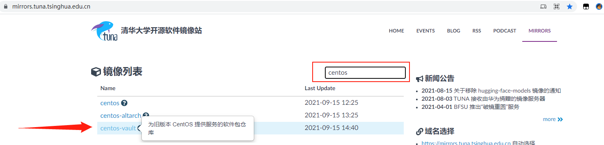
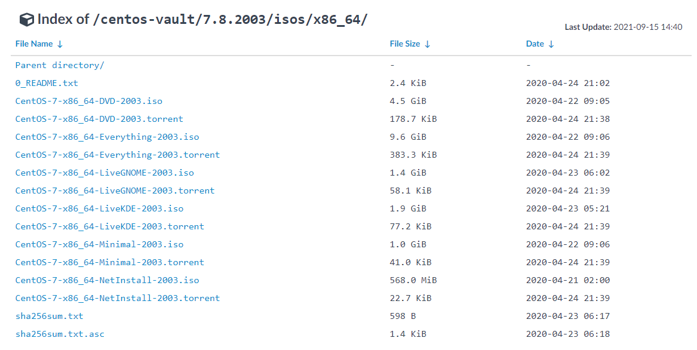

# CentOS7.8安装

参考链接：

[CentOS 7安装教程（图文详解）](https://blog.csdn.net/qq_44714603/article/details/88829423?ops_request_misc=%257B%2522request%255Fid%2522%253A%2522163169804116780255281248%2522%252C%2522scm%2522%253A%252220140713.130102334.pc%255Fblog.%2522%257D&request_id=163169804116780255281248&biz_id=0&utm_medium=distribute.pc_search_result.none-task-blog-2~blog~first_rank_v2~hot_rank-1-88829423.pc_v2_rank_blog_default&utm_term=centos7%E5%AE%89%E8%A3%85%E6%95%99%E7%A8%8B&spm=1018.2226.3001.4450)

[VMware安装Centos7超详细过程（图文）](https://blog.csdn.net/babyxue/article/details/80970526?ops_request_misc=%257B%2522request%255Fid%2522%253A%2522163169804116780255281248%2522%252C%2522scm%2522%253A%252220140713.130102334.pc%255Fblog.%2522%257D&request_id=163169804116780255281248&biz_id=0&utm_medium=distribute.pc_search_result.none-task-blog-2~blog~first_rank_v2~hot_rank-2-80970526.pc_v2_rank_blog_default&utm_term=centos7%E5%AE%89%E8%A3%85%E6%95%99%E7%A8%8B&spm=1018.2226.3001.4450)

## 下载镜像

[清华大学开源镜像站](https://mirrors.tuna.tsinghua.edu.cn/)

选择centos-vault

进入下面的目录

选择CentOS-7-x86_64-Everything-2003.iso

## 制作镜像（本地服务器安装）

## 在VmWare中安装

