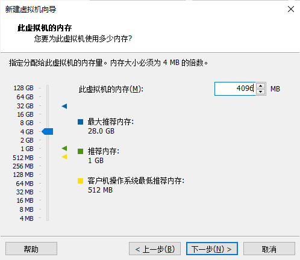

# CentOS7.8安装

参考链接：

[CentOS 7安装教程（图文详解）](https://blog.csdn.net/qq_44714603/article/details/88829423?ops_request_misc=%257B%2522request%255Fid%2522%253A%2522163169804116780255281248%2522%252C%2522scm%2522%253A%252220140713.130102334.pc%255Fblog.%2522%257D&request_id=163169804116780255281248&biz_id=0&utm_medium=distribute.pc_search_result.none-task-blog-2~blog~first_rank_v2~hot_rank-1-88829423.pc_v2_rank_blog_default&utm_term=centos7%E5%AE%89%E8%A3%85%E6%95%99%E7%A8%8B&spm=1018.2226.3001.4450)

[VMware安装Centos7超详细过程（图文）](https://blog.csdn.net/babyxue/article/details/80970526?ops_request_misc=%257B%2522request%255Fid%2522%253A%2522163169804116780255281248%2522%252C%2522scm%2522%253A%252220140713.130102334.pc%255Fblog.%2522%257D&request_id=163169804116780255281248&biz_id=0&utm_medium=distribute.pc_search_result.none-task-blog-2~blog~first_rank_v2~hot_rank-2-80970526.pc_v2_rank_blog_default&utm_term=centos7%E5%AE%89%E8%A3%85%E6%95%99%E7%A8%8B&spm=1018.2226.3001.4450)

## 下载镜像

[清华大学开源镜像站](https://mirrors.tuna.tsinghua.edu.cn/)

选择centos-vault

进入下面的目录

选择CentOS-7-x86_64-Everything-2003.iso，进行下载

## 制作镜像（本地服务器安装）

## 在VmWare中安装——创建虚拟机

网络连接类型的选择，网络连接类型一共有桥接、NAT、仅主机和不联网四种。

桥接：选择桥接模式的话虚拟机和宿主机在网络上就是平级的关系，相当于连接在同一交换机上。

NAT：NAT模式就是虚拟机要联网得先通过宿主机才能和外面进行通信。

仅主机：虚拟机与宿主机直接连起来

桥接与NAT模式访问互联网过程，如下图所示

磁盘容量暂时分配50G即可后期可以随时增加，不要勾选立即分配所有磁盘，否则虚拟机会将50G直接分配给CentOS，会导致宿主机所剩硬盘容量减少。

勾选将虚拟磁盘拆分成多个文件，这样可以使虚拟机方便用储存设备拷贝复制。

选择声卡、打印机等不需要的硬件然后移除。

## 在VmWare中安装——开始安装CentOS

ESC—ESC Discard changes

等待它检测完成

环境这里根据情况，看着选

选择安装位置，进行磁盘划分

等待ing...

等待完成

输入账户名密码登录

