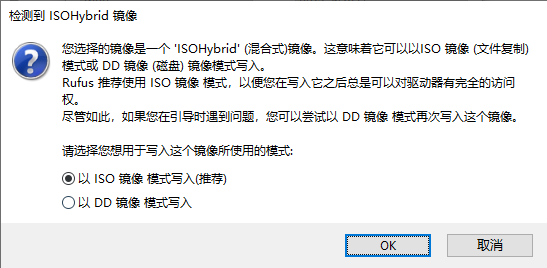

# 主机安装CENTOS7

在dell台式机7070上安装centos7系统

dell新的引导模式为UEFI，下面这个软件就是制作一种这种类型的启动盘

# 一、制作U盘系统盘

PE制作软件：

rufus-3.1p.exe

## 开始装机

选择中文，英文都行，然后进入到磁盘配置

勾选主机的两个磁盘，选择我要配置分区

把这些默认的点－号全部删除

分区选择标准分区

这次两个磁盘一个128g固态，一个1T机械

- /boot 200m

- /boot/efi 200m

- swap 两倍的内存 16g
- / 固态硬盘剩余大小
- /home 机械硬盘全部大小，参考tips分配方式

选择右侧修改，可以选择文件系统在的磁盘

tips: 分配到某一个磁盘最后一个文件系统的时候，如/分区，可以先给/分区分配一个小一点的如100g，然后再修改磁盘容量为超过磁盘剩余空间大小，然后点击，更新设置，即可将磁盘剩余大小全部分配给/分区

