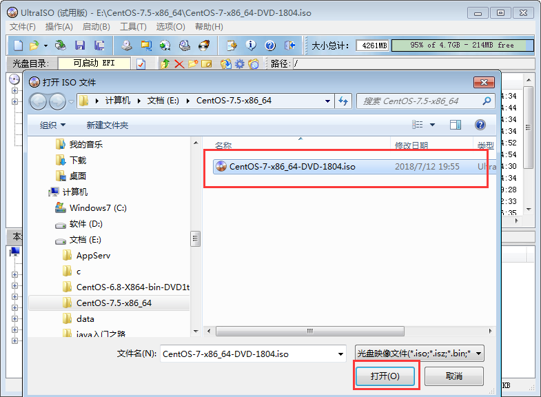
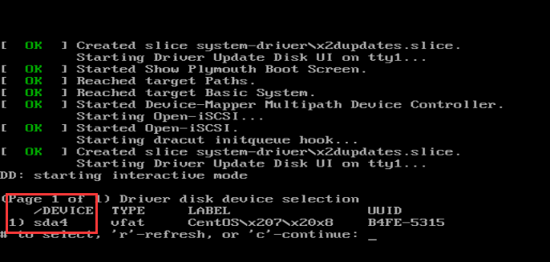

#  一、准备相关软件+

参考连接：

[PC安装centos](https://www.cnblogs.com/wutao666/p/10700158.html)

1、8G以上U盘

2、UltraISO虚拟光驱（试用版即可）最新版 下载地址：https://cn.ultraiso.net/xiazai.html 点击下载试用

3、CentOS7镜像：http://isoredirect.centos.org/centos/7/isos/x86_64/CentOS-7-x86_64-DVD-1810.iso

# 二、制作U盘系统盘

#### 2.1 打开UltraISO的窗口后依次点击左上角的"文件"-"打开"

#### 2.2 浏览到存放镜像文件的目录，选中该目标文件，点击"打开"按钮

#### 2.3 然后再次回到UltraISO窗口，点击菜单栏中的"启动"选"写入硬盘镜像"

 

#### 2.4 选择写入方式选择为“USB-HDD+”，如果不是这个模式，可能导致电脑无法通过U盘正常启动

#### 2.5 格式化U盘并写入镜像

#### 2.6 请等待片刻，正在将安装系统的镜像文件数据写入到U盘里

# 三、安装CentOS7.5

3.1、把U盘插到服务器

3.2、设置开机U盘启动 

3.3、选择U盘后跳转到下图界面

3.4、按下键盘TAB键将最下面的vmlinuz initrd=initrd.img inst.stage2=hd:LABEL=CentOS\x207\x20x86_64 rd.live.check quiet 改为 **vmlinuz initrd=initrd.img linux dd quiet，然后键入回车查看设备名**

****

3.5、查看U盘启动盘的名称比如：sda，sdb，sdc ps：label一列会显示Centos7等字样的

3.6、重启后到第三步界面按下TAB键

3.7、将vmlinuz initrd=initrd.img inst.stage2=hd:LABEL=CentOS\x207\x20x86_64 rd.live.check quiet 改为 vmlinuz initrd=initrd.img inst.stage2=hd:/dev/**sda4** quiet  ps：sda4就是你看到的启动盘名称

 

键入回车安装系统

8、之后等待安装到图形界面

具体CentOS7.5安装点击这里：https://www.cnblogs.com/wutao666/p/9479429.html