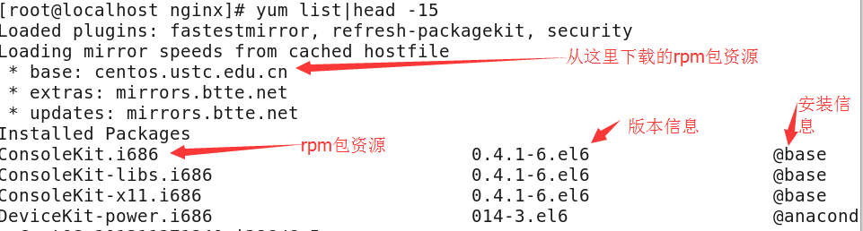

# rpm和yum

[软件包管理之rpm与yum](https://www.cnblogs.com/qingjiaowoxiaoxioashou/p/7059701.html)

软件包的安装和卸载时很平常的事，但在Linux上面却不简单。。Linux的其中一个哲学就是一个程序只做一件事，并且做好。组合小程序来完成复杂的任务，这样做有很多好处，但是各个小程序之间往往会存在着复杂的依赖关系。源码安装的软件更贴近本机的系统运行环境，但也更复杂。这时就有了包管理器,其中一个包管理器就是redhat系的rpm(redhat package manager).

　　rpm是以一种数据库记录的方式来将将所需要的套件安装在Linux主机的一套管理程序。也就是说Linux系统中存在一个关于rpm的数据库，它记录了安装的包与包之间的依赖相关性。rpm包是预先在Linux主机上编译好并打包的文件，安装起来非常快捷。下面就介绍rpm常用的命令

　　1.安装一个rpm包

　　 　 rpm -ivh package_file

　　　　　　-i:安装

　　　　　　-v:可视化

　　　　　　-h:显示安装进度

　　　　另外的常用的附带参数为：

　　　　　　--force 强制安装，即使覆盖其他包的文件也要安装

　　　　　　--nodeps:当要安装的rpm包依赖其他包的时候，即使其他包没有安装，也要安装这个包

　　2.升级一个rpm包

　　　　rpm -Uvh filename

　　　　　　-U:即升级的意思

　　3.卸载一个rpm包

　　　　rpm -e filename filename通过rpm查询功能查询到的，卸载时的filename和安装时的是有区别的。

　　4.查询一个包是否安装

　　　　rpm -q rpm包名（这里的包名是不带有平台信息以及后缀名的）

　　　　　　eg:rpm -q alacarte-0.10.0-1.fc6(如果加了平台信息及后缀名alacarte-0.10.0-1.fc6.noarch.rpm反而不能查出来）

　　　　查询当前系统上所安装的所有rpm包　　　

　　　　　　rpm -qa

　　5.得到一个rpm包的相关信息

　　　　rpm -qi 包名（同样不需要加平台信息和后缀名）　

　　6.列出一个rpm包安装的文件

　　　　rpm -ql 包名

　　7.列出某一个文件属于哪个rpm包

　　　　rpm -qf 文件的绝对路径

　　　　文件的绝对路径如何查找：which vim

　　　　rpm -qf `which vim`

　　yum工具比rpm工具更好用，当然前提是你使用的linux系统支持yum.yum最大的优势是可以去互联网下载所需要的rpm包，然后自动安装，在这个工程中如果要安装的rpm包有依赖关系，yum会能帮你解决掉这些依赖关系依次安装所有的rpm包。下面笔者介绍常用的yum命令。

　　　　1.列出所有可用的rpm包

　　　　　　yum list

　　　　　　

　　　　　安装信息如果安装了就显示installed,未安装则显示base或者extras，如果是该rpm包已经安装但需要升级则显示updates.

　　　　2.搜索一个rpm包

　　　　　　有两种搜索方法：

　　　　　　1）yum search [相关关键词]  

　　　　　　　　eg:yum serch vim

　　　　　　2)使用grep过滤　　

　　　　　　　　yum list|grep vim

　　　　3.安装一个rpm包“yum install [-y][rpm包名]”

　　　　　　如果不加-y选项，则会以用户交互方式安装，首先列出需要安装的rpm包信息，然后会问用户是否需要安装，输入y安装，输入n不安装。直接加上-y选项，就省略掉了问用户是否安装的那一步。

　　　　4.卸载一个rpm包“yum remove [-y][rpm包名]”

　　　　　　-y选项和安装时时一样的作用

　　　　5.升级一个rpm包“yum update [-y][rpm包]”