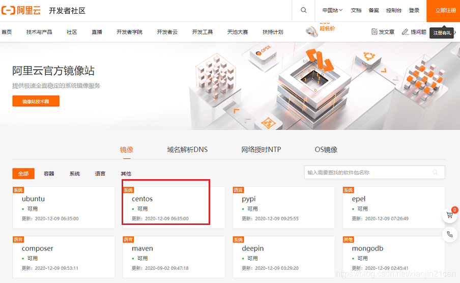
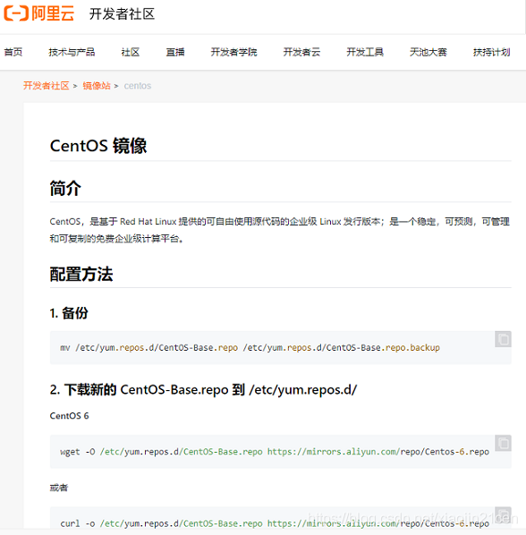
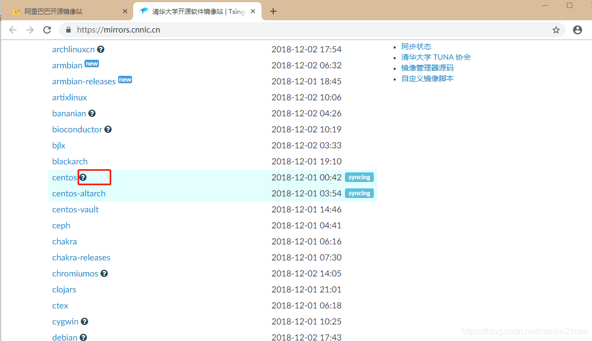
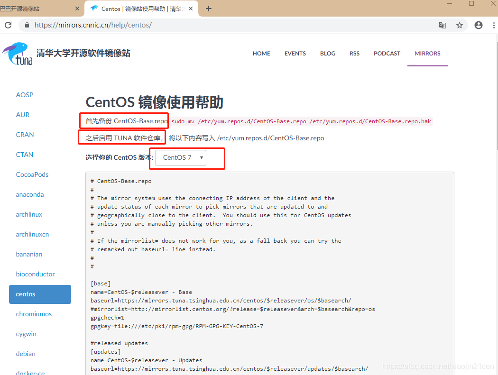

# centos7配置国内yum源

[centos7配置国内yum源](https://blog.csdn.net/xiaojin21cen/article/details/84726193)

## 1、什么是yum仓库?

yum仓库就是使用yum命令下载软件的镜像地址。

我们通常使用 yum install 命令来在线安装 linux系统的软件， 这种方式可以自动处理依赖性关系，并且一次安装所有依赖的软件包。众所周知，从国外下载软件速度非常慢，很多情况下都无法下载。国内一些大公司做镜像同步国外的软件， 那么我们可能使用国内的下载地址，就能下载我们需要的软件。

yum的配置文件
yum 的配置文件在 /etc/yum.repos.d 目录下, 其中有多个配置文件,每一个配置文件中都可以配置一个或多个repository, 但是最终会被合并为一个交给系统，所以多个文件只是为了方便管理。

## 2、yum仓库配置

下面提供了 **阿里** 和 **清华大学** 两个镜像仓库配置操作说明，**实际使用时，选择其中一个配置即可**

### 2.1、配置 阿里镜像仓库

进入 [阿里巴巴开源镜像站](https://developer.aliyun.com/mirror/)



点击 `centos` ，进行配置说明页面，如下图所示：



### 2.1.1、配置步骤

根据官网的说明，分别有 CentOS 6、CentOS 7、CentOS 8等配置操作步骤。

（1）、备份，将 CentOS-Base.repo 为CentOS-Base.repo.backup

```
cp /etc/yum.repos.d/CentOS-Base.repo /etc/yum.repos.d/CentOS-Base.repo.backup
```


（2）、下载新的 http://mirrors.aliyun.com/repo/Centos-7.repo,并命名为CentOS-Base.repo

（2）、下载新的 http://mirrors.aliyun.com/repo/Centos-7.repo,并命名为CentOS-Base.repo

```
wget -O /etc/yum.repos.d/CentOS-Base.repo http://mirrors.aliyun.com/repo/Centos-7.repo
或者
curl -o /etc/yum.repos.d/CentOS-Base.repo http://mirrors.aliyun.com/repo/Centos-7.repo
```


（3）、清除缓存

```
yum clean all     # 清除系统所有的yum缓存
yum makecache     # 生成yum缓存
```

### 2.2、配置 清华大学镜像仓库（推荐）

地址： https://mirrors.cnnic.cn/



点击 `?` 进入帮助说明页面 https://mirrors.cnnic.cn/help/centos/。



页面提供了 `CentOS5`，`CentOS6`、`CentOS7` 的镜像仓库配置，下面列出的是`CentOS7`的配置。

（1）、首先备份 CentOS-Base.repo

```
cp /etc/yum.repos.d/CentOS-Base.repo  /etc/yum.repos.d/CentOS-Base.repo.bak
```

（2）、之后启用 TUNA 软件仓库， 将`清华大学镜像仓库信息`写入 `/etc/yum.repos.d/CentOS-Base.repo`

```
vim /etc/yum.repos.d/CentOS-Base.repo
```

将 CentOS-Base.repo 中的内容 更新为 下面的内容：

```
# CentOS-Base.repo
#
# The mirror system uses the connecting IP address of the client and the
# update status of each mirror to pick mirrors that are updated to and
# geographically close to the client.  You should use this for CentOS updates
# unless you are manually picking other mirrors.
#
# If the mirrorlist= does not work for you, as a fall back you can try the
# remarked out baseurl= line instead.
#
#

[base]
name=CentOS-$releasever - Base
baseurl=https://mirrors.tuna.tsinghua.edu.cn/centos/$releasever/os/$basearch/
#mirrorlist=http://mirrorlist.centos.org/?release=$releasever&arch=$basearch&repo=os
gpgcheck=1
gpgkey=file:///etc/pki/rpm-gpg/RPM-GPG-KEY-CentOS-7

#released updates
[updates]
name=CentOS-$releasever - Updates
baseurl=https://mirrors.tuna.tsinghua.edu.cn/centos/$releasever/updates/$basearch/
#mirrorlist=http://mirrorlist.centos.org/?release=$releasever&arch=$basearch&repo=updates
gpgcheck=1
gpgkey=file:///etc/pki/rpm-gpg/RPM-GPG-KEY-CentOS-7

#additional packages that may be useful
[extras]
name=CentOS-$releasever - Extras
baseurl=https://mirrors.tuna.tsinghua.edu.cn/centos/$releasever/extras/$basearch/
#mirrorlist=http://mirrorlist.centos.org/?release=$releasever&arch=$basearch&repo=extras
gpgcheck=1
gpgkey=file:///etc/pki/rpm-gpg/RPM-GPG-KEY-CentOS-7

#additional packages that extend functionality of existing packages
[centosplus]
name=CentOS-$releasever - Plus
baseurl=https://mirrors.tuna.tsinghua.edu.cn/centos/$releasever/centosplus/$basearch/
#mirrorlist=http://mirrorlist.centos.org/?release=$releasever&arch=$basearch&repo=centosplus
gpgcheck=1
enabled=0
gpgkey=file:///etc/pki/rpm-gpg/RPM-GPG-KEY-CentOS-7
```

## 3、epel源 安装和配置

（1）、查看可用的epel源

```
[java@localhost yum.repos.d]$ yum list | grep epel-release
epel-release.noarch                         7-11                       extras   
[java@localhost yum.repos.d]$ 
```

（2）、安装 epel

```
[java@localhost yum.repos.d]$ yum install -y epel-release
......省略.....
```

（3）、配置阿里镜像提供的epel源

```
wget -O /etc/yum.repos.d/epel-7.repo  http://mirrors.aliyun.com/repo/epel-7.repo
```

（4）、清除缓存

```
yum clean all     # 清除系统所有的yum缓存
yum makecache     # 生成yum缓存
```

### 3.1、查看yum源

查看所有的yum源：

```
yum repolist all
```

查看可用的yum源：

```
yum repolist enabled
```

