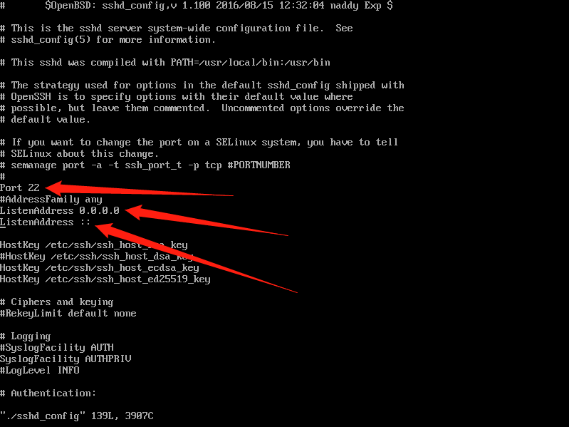
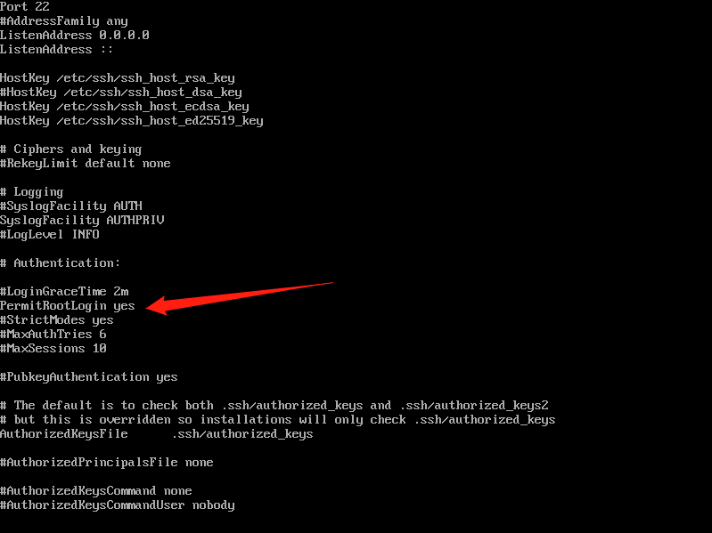
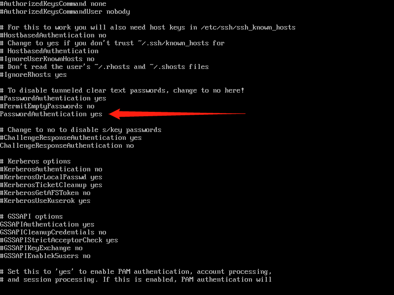
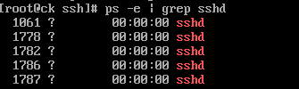
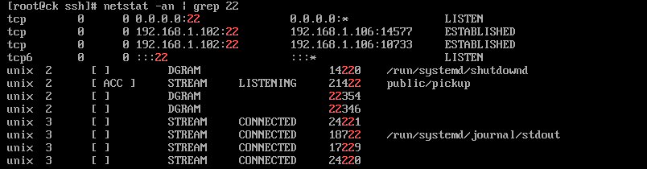

# 开启SSH服务

参考链接：

[centos7开启SSH服务](https://blog.csdn.net/qq_36663951/article/details/79813038)

1. 查看是否已经安装了ssh服务`yum list installed | grep openssh-server`

这里显示已经安装了

如果没有安装，输入yum install openssh-server安装

2. `cd /etc/ssh`

3. vi ./sshd_config

4. 将端口、监听地址前面的#去掉

   

   5.允许root登录

   

6.允许用户名密码来作为连接验证

7. `sudo service ssh start`重启服务

8. `ps -e | grep sshd`查看sshd服务是否开启

   

9. 或者`netstat -an | grep 22` 查看22端口是否开启监听

