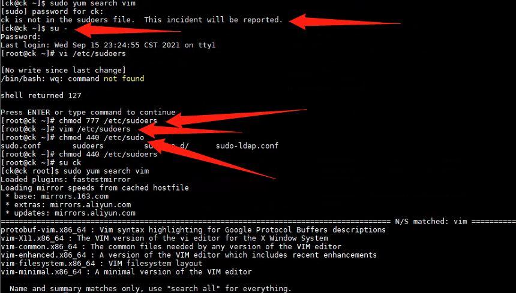

# 用户没有在sodoers文件中

参考链接：

[CentOS6.4使用sudo提示用户不在sudoers文件中的解决方法](https://blog.csdn.net/hsg77/article/details/49979487)

1. `su -`切换到root账户
2. `chmod 777 /etc/sudoers`
3. `vim /etc/sudoers`
4. 在` root   ALL=(ALL)   ALL`下面添加`username   ALL=(ALL)   NOPASSWD: ALL`
5. `chmod 440 /etc/sudoers`
6. `su ck`再执行一次命令测试一下效果

#### `username   ALL=(ALL)   ALL`与`username   ALL=(ALL)   NOPASSWD: ALL`的区别

**后面一个密码，5分钟后不过期**

