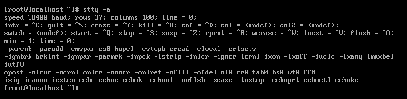

#  linux下 Ctrl + c, Ctrl + z, Ctrl + d等组合键

[Linux中ctrl-c, ctrl-z, ctrl-d 区别](https://blog.csdn.net/mylizh/article/details/38385739)

**ctrl-c:** ( kill foreground process ) 发送 SIGINT 信号给**前台**进程组中的所有进程，**强制终止程序的执行**；

**ctrl-d:** 同目录下有一个另外的解释

**ctrl-d:** ( Terminate input, or exit shell ) 一个特殊的二进制值，表示 EOF，作用相当于在终端中输入exit后回车；

- 退出当前账号的登录
- mobaxterm下直接连接

下面三个没用过，最后一个有用

**ctrl-/**   发送 SIGQUIT 信号给前台进程组中的所有进程，终止前台进程并生成 core 文件

**ctrl-s**  中断控制台输出

**ctrl-q**  恢复控制台输出

**ctrl-l**   清屏

其实，控制字符都是可以通过stty命令更改的，可在终端中输入命令"stty -a"查看终端配置

