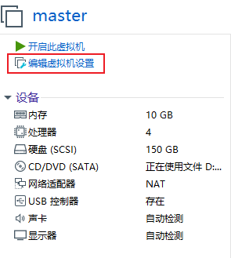

# 虚拟机磁盘扩容    

一般在[虚拟机](https://so.csdn.net/so/search?q=虚拟机&spm=1001.2101.3001.7020)下安装ubuntu系统时，开始分配的硬盘空间会比较小，随着使用的增加发现硬盘不够用了，那应该怎么办呢？重装系统？显然不是，只需要给虚拟机系统硬盘扩容即可。虚拟机系统扩容有两种方式一个是扩容根目录或者其他目录，一个是增加新的分区，一下就两种方法进行详细说明。

# 1 VMware扩容硬盘

   不管是[根目录](https://so.csdn.net/so/search?q=根目录&spm=1001.2101.3001.7020)扩容还是增加分区，首先都需要先给虚拟硬盘扩容。

   1）选中虚拟机，点击编辑此虚拟机（1.1所示）或者点击VMware的“虚拟机(M)”->“设置”（1.2所示）。

 

       1.1 编辑虚拟机   

   

       1.2 编辑虚拟机   

 

   2）弹出对话框中左边选择“硬盘(SCSI)”->“扩展(E)”，然后弹出对话框中设置虚拟磁盘大小，最后点击“扩展”。

       1.3 设置容量   

   3）等待扩展完成。（此过程会对磁盘进行迁移操作，需要时间，请耐心等待）

       1.4 扩展虚拟磁盘   

   4）虚拟磁盘扩展完成。点击确定后可以看到此时磁盘的容量为150G。

       1.5 完成虚拟磁盘扩展   

 

       1.6 虚拟磁盘容量   

# 2 ubuntu下扩容

## 2.1 扩容主分区

1. 左下角，几个小点，打开应用管理器
2. 搜索disk
3. 点击自己的分区
4. 看到分区下面有个小齿轮
5. 点击它
6. 点击扩容
7. 用鼠标拉到最右边

## **2.2 扩容：增加新分区** 

  1）在ubuntu系统下，点击左下角的图标，然后输入“disk”，选择Disk。

  2）在左边可以看到一个新的硬盘，点击后边齿轮图标，然后选择“Format Partition”。

   3）弹出对话框中输入“Volume Name”名称，然后点击“Next”按钮。

   4）点击右上角“Formate”按钮，等待格式化完成。

  5）打开文件夹，选择“Other Locations”，可以看到新分区。 

 