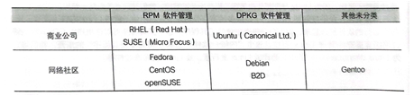

# [[Linux\]Linux发展历程](https://www.cnblogs.com/johnnyzen/p/15063926.html)

**别人写的文章**

**目录**


- [[1\] 1964 Multics (分时操作系统 / 交互式操作系统)](https://www.cnblogs.com/johnnyzen/p/15063926.html#_label0)

- [[2\] 1969 Unics/Unix (分时操作系统 / 交互式操作系统)](https://www.cnblogs.com/johnnyzen/p/15063926.html#_label1)

- [[3\] 1973 Unics/Unix](https://www.cnblogs.com/johnnyzen/p/15063926.html#_label2)

- [[4\] 1977 BSD（Berkeley Software Distribution）（类Unix的OS）](https://www.cnblogs.com/johnnyzen/p/15063926.html#_label3)

- [[5\] 【1984】 GNU(GNU’s Not Unix)项目 → 自由软件运动](https://www.cnblogs.com/johnnyzen/p/15063926.html#_label4)

- [[6\] 1987 Minix（类Unix的OS）](https://www.cnblogs.com/johnnyzen/p/15063926.html#_label5)

- [[7\] 【1989】 POSIX标准/可移植操作系统接口 → OS系统调用接口标准](https://www.cnblogs.com/johnnyzen/p/15063926.html#_label6)

- [[8\] 1991.10 Linux | GNU/Linux[OS内核]（类Unix、类Minix的OS）](https://www.cnblogs.com/johnnyzen/p/15063926.html#_label7)

- - [8.1 Linux 内核版](https://www.cnblogs.com/johnnyzen/p/15063926.html#_lab2_7_0)
  - [8.2 Linux 发行版](https://www.cnblogs.com/johnnyzen/p/15063926.html#_lab2_7_1)

- [[9\] Linux发行版](https://www.cnblogs.com/johnnyzen/p/15063926.html#_label8)

- - [1992 SuSE Linux/OpenSuSE](https://www.cnblogs.com/johnnyzen/p/15063926.html#_lab2_8_0)
  - [1993 Debian](https://www.cnblogs.com/johnnyzen/p/15063926.html#_lab2_8_1)
  - [1995 RedHat](https://www.cnblogs.com/johnnyzen/p/15063926.html#_lab2_8_2)
  - [2003 Fedora](https://www.cnblogs.com/johnnyzen/p/15063926.html#_lab2_8_3)
  - [2004 CENTOS](https://www.cnblogs.com/johnnyzen/p/15063926.html#_lab2_8_4)
  - [2004 Ubuntu](https://www.cnblogs.com/johnnyzen/p/15063926.html#_lab2_8_5)

- [[10\] Filesystem Hierarchy Standard/文件系统层次结构标准(FHS for Linux)](https://www.cnblogs.com/johnnyzen/p/15063926.html#_label9)

- [Y 延申:](https://www.cnblogs.com/johnnyzen/p/15063926.html#_label10)

- - [国产操作系统](https://www.cnblogs.com/johnnyzen/p/15063926.html#_lab2_10_0)

  - - [1) 深度Linux / deepin](https://www.cnblogs.com/johnnyzen/p/15063926.html#_label3_10_0_0)
    - [2) 安超OS（国产通用型云操作系统）](https://www.cnblogs.com/johnnyzen/p/15063926.html#_label3_10_0_1)
    - [3) 优麒麟（Ubuntu Kylin）（由中国CCN联合实验室支持和主导的开源项目）](https://www.cnblogs.com/johnnyzen/p/15063926.html#_label3_10_0_2)
    - [4) 中标麒麟（NeoKylin）；（银河麒麟与中标普华已在2010年12月16日宣布合并品牌）](https://www.cnblogs.com/johnnyzen/p/15063926.html#_label3_10_0_3)
    - [5) 银河麒麟](https://www.cnblogs.com/johnnyzen/p/15063926.html#_label3_10_0_4)
    - [6) 威科乐恩Linux（WiOS）](https://www.cnblogs.com/johnnyzen/p/15063926.html#_label3_10_0_5)
    - [7) 起点操作系统（StartOS 原雨林木风OS）](https://www.cnblogs.com/johnnyzen/p/15063926.html#_label3_10_0_6)
    - [8) 凝思磐石安全操作系统](https://www.cnblogs.com/johnnyzen/p/15063926.html#_label3_10_0_7)
    - [9) 共创Linux](https://www.cnblogs.com/johnnyzen/p/15063926.html#_label3_10_0_8)
    - [10) 思普操作系统](https://www.cnblogs.com/johnnyzen/p/15063926.html#_label3_10_0_9)
    - [11) 中科方德桌面操作系统](https://www.cnblogs.com/johnnyzen/p/15063926.html#_label3_10_0_10)
    - [12) 普华Linux（I-soft OS）](https://www.cnblogs.com/johnnyzen/p/15063926.html#_label3_10_0_11)
    - [13) RT-Thread RTOS](https://www.cnblogs.com/johnnyzen/p/15063926.html#_label3_10_0_12)
    - [14) 中兴新支点操作系统](https://www.cnblogs.com/johnnyzen/p/15063926.html#_label3_10_0_13)
    - [15) 一铭操作系统](https://www.cnblogs.com/johnnyzen/p/15063926.html#_label3_10_0_14)
    - [16) springLinux](https://www.cnblogs.com/johnnyzen/p/15063926.html#_label3_10_0_15)
    - [17) 红旗 linux（redflag linux）](https://www.cnblogs.com/johnnyzen/p/15063926.html#_label3_10_0_16)
    - [18) Veket Linux](https://www.cnblogs.com/johnnyzen/p/15063926.html#_label3_10_0_17)
    - [19) UOS（统信操作系统）](https://www.cnblogs.com/johnnyzen/p/15063926.html#_label3_10_0_18)
    - [20) AliOS（阿里云系统）（原Yun OS）](https://www.cnblogs.com/johnnyzen/p/15063926.html#_label3_10_0_19)
    - [21) PhoenixOS（凤凰系统）](https://www.cnblogs.com/johnnyzen/p/15063926.html#_label3_10_0_20)
    - [22) JideOS（技德系统）（原remixOS）](https://www.cnblogs.com/johnnyzen/p/15063926.html#_label3_10_0_21)
    - [23) HopeEdgeOS（面向物联网领域操作系统）](https://www.cnblogs.com/johnnyzen/p/15063926.html#_label3_10_0_22)
    - [24) openEuler](https://www.cnblogs.com/johnnyzen/p/15063926.html#_label3_10_0_23)
    - [25) Harmony OS(鸿蒙系统)](https://www.cnblogs.com/johnnyzen/p/15063926.html#_label3_10_0_24)

  - [国产数据库](https://www.cnblogs.com/johnnyzen/p/15063926.html#_lab2_10_1)

- [X 参考文献](https://www.cnblogs.com/johnnyzen/p/15063926.html#_label11)

古人云，知其然知其所以然。马哲思想指导着我们，任何事物、问题，离不开：为什么(Why，事物从哪里来?)、是什么(What，事物的定位?)、怎么做(How，到哪里去？)的哲学3问。

继上个月算是**相对彻底地**弄懂了2个对于大部分从业者在今天看来的可能相当**'常识'**的底层概念问题：云计算————[[云计算\]概念辨析：云计算 [IaaS/PaaS/SaaS & 公有云/私有云/混合云]](https://www.cnblogs.com/johnnyzen/p/14797885.html)、底层计算机硬件——**CPU架构**与**计算机芯片**的问题：[[Linux\]CPU架构/指令集：RISC / CISC | arm | amd | X86/i386 | aarch64](https://www.cnblogs.com/johnnyzen/p/13224632.html)的时候，便对日日接触的服务器底层的CENTOS操作系统的内核Linux的发展、由来产生了莫大兴趣。(虽说在学校的时候，已经专门开过4门的操作系统、Linux的理论与实操课程，奈何人的记忆力总是有限，只能再从头开始自个儿来理一理了)

因此可见，这篇文章是憋了许久的，回答自个儿想要搞明白的一个问题的**记叙性笔记**。除了反复阅读鸟哥的书籍外，也广泛阅读了各网站的相对权威、可信的叙述。
（理完这些的时候，有一种感触是：**硬件(架构)**、**操作系统**(及OS级基础软件：数据库等)、**云计算与云服务**（尤其含：虚拟化技术）、**大数据与AI**(含：数字化、自动化等) 这几大业态绝非单一的发展，它们之间存在着紧密联络）
好了，咱开门见山：

[回到顶部(Back to Top)](https://www.cnblogs.com/johnnyzen/p/15063926.html#_labelTop)

# [1] 1964 Multics (分时操作系统 / 交互式操作系统)

```shell
1964 Multics (分时操作系统 / 交互式操作系统)
开发者: 贝尔实验室(Bell Lab) / 麻省理工学院(MIT) / 美国通用电气公司(GE)
备注：因资金超支及贝尔实验室的退出而废弃
```

[回到顶部(Back to Top)](https://www.cnblogs.com/johnnyzen/p/15063926.html#_labelTop)

# [2] 1969 Unics/Unix (分时操作系统 / 交互式操作系统)

```shell
1969 Unics/Unix (分时操作系统 / 交互式操作系统)
开发者: 贝尔实验室-Ken Thompson
编程语言: B语言（汇编语言）
备注：
①Ken Thompson 利用汇编语言（B语言）开发了 File Server System（Unics，即 UNIX 的原型）。
```

[回到顶部(Back to Top)](https://www.cnblogs.com/johnnyzen/p/15063926.html#_labelTop)

# [3] 1973 Unics/Unix

```shell
1973 Unics/Unix 
开发者: 贝尔实验室-Ken Thompson(C语言之父) + Ritchie
编程语言: C语言
备注:
①1971年，Thompson联合Ritchie，利用汇编语言共同发明了C语言。
     由于B语言进行系统编程时不够强大，故二人对其改造
②1973年，Thompson和Ritchie用C语言重写了UNIX
③自此到20世纪90年代，UNIX已成为大学中的主流操作系统。与此同时，UNIX 转向商业化，价格昂贵。
④1979 年，UNIX 发布 System V，用于个人计算机
```

[回到顶部(Back to Top)](https://www.cnblogs.com/johnnyzen/p/15063926.html#_labelTop)

# [4] 1977 BSD（Berkeley Software Distribution）（类Unix的OS）

```shell
1977 BSD（Berkeley Software Distribution）（类Unix的OS） 
开发者: Bill Joy(UC Berkeley大学，SUN公司的创始人)
编程语言: C语言
备注:
①1977 年， 大学的  （ Sun 公司的创始人）针对他的机器修改了 UNIX V7版本的源码，称为BSD（Berkeley Software Distribution）操作系统。

②后来很多商业厂家意识到Unix的价值也纷纷以Bell Lab的System V OS或BSD OS为基础来开发自己的Unix，较著名的有Sun OS，AIX，VMS。
```

[回到顶部(Back to Top)](https://www.cnblogs.com/johnnyzen/p/15063926.html#_labelTop)

# [5] 【1984】 GNU(GNU’s Not Unix)项目 → 自由软件运动

```shell
1984  GNU(GNU’s Not Unix)项目 → 自由软件运动
           FSF（Free Software Foundation）基金会
创始者: Richard Stallman 
备注:
①1984 年，Richard Stallman 开始 GNU[GNU’s Not Unix]项目，创办 FSF[Free Software Foundation]基金会
②该组织倡导“自由软件”，开发了非常重要的几个软件：
    GCC(GNU C Compiler/GNU Compiler Collection)、GLIBC(GNU C Library)、G++(GCC的c++编译器)、
    Bash Shell、Emacs等产品；
    GNU 的软件缺乏一个开放的平台运行，只能在 UNIX 上运行；
    自由软件指用户可以对软件做任何修改，甚至再发行，但要遵守GPL 的版权规定；
    自由软件是可以卖的，但是不能只卖软件，而是卖服务、手册等。
③GCC全称是 GNU C Compiler, 最早的时候就是一个c编译器。但是后来因为这个项目里边集成了更多其他不同语言的编译器，GCC就代表 the GNU Compiler Collection。故现在 GCC 表示一堆编译器的合集。）
④1985 年，为了避免 GNU 开发的自由软件被其他人用作专利软件，因此创建 GPL（General Public License）版权声明。
```

[回到顶部(Back to Top)](https://www.cnblogs.com/johnnyzen/p/15063926.html#_labelTop)

# [6] 1987 Minix（类Unix的OS）

```shell
1987 Minix（类Unix的OS）
开发者: Andrew S. Tanenbaum
编程语言: C语言
备注:
①1984 年，因UNIX 规定“不能对学生提供源码”，作为老师的 Andrew Tanenbaum 编写兼容于 UNIX 的 Minix，用于教学。
①Minix是一个兼容Unix的类UNIX操作系统。
②Minix价格低廉，它的诞生就是为了解决在高校、科研院所里Unix昂贵的授权费，不利于OS教学使用。
③Minix的初衷：操作系统的教学，故强调代码的可读性与简洁性；UNIX用于商业，注重代码的高效率。
```

[回到顶部(Back to Top)](https://www.cnblogs.com/johnnyzen/p/15063926.html#_labelTop)

# [7] 【1989】 POSIX标准/可移植操作系统接口 → OS系统调用接口标准

```shell
1989  POSIX标准/可移植操作系统接口 → OS系统调用接口标准 
                 (Portable Operating System Interface for Computing Systems) 
创始者:
    IEEE(Institute of Electrical and Electronics Engineers 电气和电子工程师协会)
    ISO/IEC
备注:
①IEEE最初开发 POSIX 标准，是为了提高 UNIX  OS环境及类Unix OS环境下应用程序的可移植性
   （即 POSIX 标准并不限于Unix）
②支持其标准的OS包括但不限于： 
    Linux(start from V0.0.1 to now) / DEC OpenVMS / Microsoft Windows NT / 
③POSIX.1 已被国际标准化组织（International Standards Organization / ISO）所接受，被命名为 :
    ISO/IEC 9945-1:1990 标准
④该标准是基于现有的UNIX 实践和经验，描述了操作系统的调用服务接口。
    用于保证编制的应用程序可以在源代码一级上在多种操作系统上移植和运行
⑤【POSIX与Linux结缘】90 年代初，POSIX 标准的制定正处在最后投票敲定的时候，那是1991-1993 年间。
    此时正是Linux刚刚起步的时候，这个UNIX 标准为Linux 提供了极为重要的信息。
    使得Linux 能够在标准的指导下进行开发，并能够与绝大多数UNIX 操作系统兼容。
    在最初的Linux 内核源代码中（0.01 版、0.11 版）就已为Linux 系统与POSIX 标准的兼容做好了准备工作。
    在Linux 0.01 版内核的/include/unistd.h 文件中就已定义了几个有关POSXI 标准要求的符号常数，
    且Linus 在注释中已写道：“OK，这也许是个玩笑，但我正在着手研究它呢”。
⑥第一个POSIX正式标准是在1988 年9 月份批准的（IEEE 1003.1-1988），也既以后经常提到的POSIX.1 标准。
    1989 年POSIX 的工作被转移至ISO/IEC 社团，并由15 工作组继续将其制定成ISO 标准。
    到1990 年，POSIX.1 与已通过的C 语言标准联合，正式批准为：
        IEEE 1003.1-1990（即 ANSI 标准）和ISO/IEC 9945-1:1990 标准。
```

[回到顶部(Back to Top)](https://www.cnblogs.com/johnnyzen/p/15063926.html#_labelTop)

# [8] 1991.10 Linux | GNU/Linux[OS内核]（类Unix、类Minix的OS）

```shell
1991.10 Linux | GNU/Linux[OS内核]（类Unix、类Minix的OS）
开发者: Linus Torvalds
编程语言: C语言
备注:
①1991年初，芬兰赫尔辛基大学的研究生 Linus Torvalds 基于 gcc、bash 开发了针对 386 机器的 Linux 内核。Linus Torvalds接触到UNIX操作系统，通过学习 MINIX成功地将自己开发的bash移植到了minix 上，并于1991年10月正式向外宣布Linux内核(Linux 0.0.1)的诞生。
    1994 年，Torvalds 发布 Linux-v1.0。
    1996 年，Torvalds 发布 Linux-v2.0，确定了 Linux 的吉祥物：企鹅（Tux）。
        因为Torvalds在小时候被企鹅咬过，故印象非常深刻。
②Linux是一个采用GNU GPL授权模式的、参考POSIX标准的、兼容Unix的类Minix、类UNIX操作系统。
③同年，GNU计划已开发出了许多工具软件，最受期盼的【GNU C编译器】已出现。
   但GNU的操作系统核心HURD一直处于实验阶段，没有任何可用性。
   实质上也没能开发出完整的GNU操作系统，但是【GNU】奠定了Linux用户基础和开发环境。
④Linux 本身只是操作系统的内核，而不是一个操作系统。内核是使其它程序能够运行的基础。
    它实现了多任务和硬件管理，用户或者系统管理员交互运行的所有程序实际上都运行在内核之上。
    因此，我们平常说的“操作系统用的是Windows、Mac还是Linux啊？”是错误的；
    Ubuntu、Fedora等才是操作系统的名字，他们都使用Linux内核；
    内核负责控制硬件资源分配，而如果只有内核，则只能让计算机硬件运行，而不能有任何功能。
    因此，需要【系统调用】提供给开发者使用，从而开发应用程序；
    内核能够控制硬件，比如：让CPU可以运算、让硬盘可以读写数据等；
    只有内核的话，只能让计算机运行，但是我们不能控制计算机；
    而系统调用是操作系统提供给开发者的调用接口；
    任何硬件都不会默认就被操作系统控制，而需要开发商根据操作系统提供的接口开发驱动程序，只有安装了驱动程序才能够控制硬件设备。
⑤Linux 其中有些程序是必需的，比如说，命令行解释器（shell），它用于用户交互和编写 shell 脚本。 
   Linux 没有自己去开发这些应用程序，而是使用已有的自由软件。
   许多重要的软件，包括 C 编译器，都来自于自由软件基金 GNU 项目。因此，把 Linux 也称为 GNU/Linux。
⑥Linux核心理念：万物皆文件；
⑦Unix和Linux的代码是由90%的C语言和10%的汇编组成，因此只需要稍加修改，就能移植到其他硬件上；
```

## 8.1 Linux 内核版

```shell
Linux 内核版
①Linux内核(版)编号:
    主版本.次版本.发布版本-修改版本
    3.10.0-123.el7.x84_64
   【注】虽然编号就是如上方式来编的，但依据Linux内核的发展离场，内核版本的定义有点不太相同。

[1] 奇数、偶数版本分类
    在2.6.x版本以前，Torvalds将内核的发展方向分为2类，并根据这2类内核的发展分别给予不同的编号：
A. 主、次版本为奇数：开发中版本(development)

    如2.5.xx，这种内核版本主要用于测试与发展新功能，所以通常这种版本仅有内核开发工程师会使用。如果有新增的内核程序代码，会加入到这种版本当中，等到众多工程师测试没有问题后，才加入下一版的稳定内核中。
B.主、次版本为偶数：稳定版本(stable)
  
  如2.6.xx，等到内核功能发展成熟后会加入到这类的版本中，主要用在一般家庭计算机以及企业版本中，重点在于提供用户一个相对稳定的Linux操作环境平台。

[2] 主线版本、长期维护版本(longterm version)
    不过，这种奇数、偶数的编号格式在3.0版推出之后就不再使用了。从3.0版开始，内核主要依靠主线版本(MainLine)来开发，开发完毕后会往下一个主线版本进行。例如 3.10 就是在3.9的架构下继续开发出来的新的主线版本，通常新一版的主线版本在2~3个月会被提出。
    之所以会有新的主线版本，是因为加入新功能之故。现在(2021/07/26)最新的主线版本已经是5.13版了。
    https://www.kernel.org/
    而旧的版本在新的主线版本出现之后，会有两种机制来处理。一种机制为结束开发(End of Live, EoL)，亦即该程序代码已结束，不会有继续维护的状态。另一种机制为保持该版本的持续维护，亦即为长期维护版本(Longterm)。例如 3.10 即为一个长期维护版本，这个版本的程序代码会被持续更长的时间，若程序代码有bug或其他问题，内核维护者会持续进行程序代码的更新维护。两种机制结合，即：
    所有的长期维护版本均会有终结(停止维护)的那一天；已停止维护的版本将不再被视为长期维护版。
    所以，若你想要使用Linux内核来开发你的系统，那么当然要选择长期支持的版本才行。要判断你的Linux内核是否为长期支持的版本，可以使用`uname -r`来查看内核版本，然后对照下列链接来了解其对应值。
    https://www.kernel.org/releases.html
```

> [The Linux Kernel Archives - kernel.org](https://www.kernel.org/releases.html)

## 8.2 Linux 发行版

```shell
Linux 内核版 与 Linux 发行版
    Linux内核版本与发行版(distribution)的版本并不相同，很多朋友常常上网问到：“我的Linux是7.x版，请问...”之类的留言。这是不对的提问方式，因为所谓的Linux版本指的应该是内核版本，而目前最新的内核版本应该是5.13.5(2021/07/26)才对，并不会有7.x的版本出现。
    你常用的Linux系统应该说明为发行版。因此，如果以CENTOS这个发行版来说，你应该说：“我用的Linux是CENOTS这个发行版，版本为7.x，请问...”才对。
    CENTOS 7.4.1708  à 3.10.0-693.el7.x86_64

Linux发行版(可完全安装的Linux发行版)
[1] 小结：Linux 与 Unix（类Unix）、GNU、POSIX
由此，我们可知：
    Linux其实就是一个操作系统最底层的内核，及其提供的内核工具。
    它是GNU GPL授权模式。所以，任何人均可获得源代码与可执行的这个内核程序，并且可以修改。
    此外，因为Linux参考POSIX设计规范，于是兼容Unix操作系统，故可称之为“Unix-Like”(类Unix)的一种。

[2] 可完全安装的Linux发行版
     Linux的出现让GNU计划放下了心里的一块大石头，因为GNU一直以来就是缺乏内核程序，导致它们的GNU自由软件只能在其他的UNIX上面运行，既然目前有Linux出现，且Linux也用了很多的GNU相关软件，所以斯托曼认为Linux的全名应该称之为GNU/Linux。不管怎么说，Linux实在很不错，让GNU软件大多以Linux 为主要操作系统来进行开发。此外，很多其他的自由软件团队，例如 postfix.vsftpd、apache等也都有以Linux为开发测试平台的计划出现。如此一来，Linux 除了主要的内核程序外，可以在Linux 上面运行的软件也越来越多，如果有心，就能够将一个完整的 Linux操作系统搞定。
     虽然由托瓦兹负责开发的Linux仅具有内核与内核所提供的工具。不过，如上所述，很多的软件已经
可以在Linux上面运行，因此，“Linux+各种软件”就是一个相当完整的操作系统。不过，要完成这样的
操作系统还真难，因为Linux早期都是由黑客工程师所开发维护，他们并没有考虑到一般用户的能力。
     为了让用户能够接触到Linux,于是很多的商业公司或非营利团体，就将Linux内核（及其工具）与可运行的软件整合起来，加上自己具有创意的工具程序，这个工具程序可以让用户以CD/DVD或通过网络直接安装／管理 Linux 系统。这个“内核＋软件＋工具＋可完全安装程序”的东西，我们称之为 Linux distribution,一般中文翻译成Linux发行版，或Linux发布商套件等。
     由于GNU的GPL授权并非不能从事商业行为，于是很多商业公司便专门来销售Linux发行版。而由于Linux的GPL版权声明，因此，商业公司所销售的Linux发行版通常也都可以从互联网上面来下载。此外，如果你想要其他商业公司的服务，那么直接向该公司购买光盘来安装，也是一个很不错的方式。
```


```shell
[3] 各大Linux发行版的主要异同；支持标准
    不过，由于发展Linux 发行版的社区与公司实在太多，例如有名的 Red Hat、SUSE、Ubuntu、 Fedora、 Debian  等，所以很多人都很担心，如此一来每个发行版是否都不相同呢？这就不需要担心了，因为每个Linux发行版使用的内核都由https://www.kernel.org网站所发布，而它们所选择的软件，几乎都是目前很知名的软件，重复性相当的高，例如网页服务器的 Apache,电子邮件服务器的
Postfix/sendmail,文件服务器的Samba等。
    此外，为了让所有的Linux发行版开发不致于差异太大，且让这些开发商在开发的时候有所依据，
还有 Linux Standard Base(LSB)等标准来规范开发者，以及目录结构的File system Hierarchy Standard(FHS)标准规范。唯一的差别，可能就是该厂商所开发出来的管理工具，以及套件管理的模式。
    所以说，基本上，每个Linux发行版除了架构的严谨度与选择的套件内容外，其实差异并不大，大家可以选择自己喜好的发行版来安装即可。
    FHS:http://www.pathname.com/fhs/
    LSB:https://wiki.linuxfoundation.org/lsb/start

# 包管理模式 #
    事实上鸟哥认为发行版主要分为两大家族：
        一种是使用RPM方式安装软件的系统，包括Red Hat、Fedora、SUSE等都是这类；
        一种则是使用Debian的dpkg方式安装软件的系统，包括Debian、Ubuntu、B2D等。
    若是加上商业公司或网络社区的分类，那么我们可以简单的用下表来做个说明。
```



```
下面列出几个主要的Linux发行版官方网址：
    Red Hat:https://www.redhat.com/
    SUSE:https://www.suse.com/
    Fedora:https://getfedora.org/
    CentOS:https://www.centos.org/
    Debian:http://www.debian.org/
    Ubuntu:http://www.ubuntu.com/
    Gentoo:https://www.gentoo.org/
```

[回到顶部(Back to Top)](https://www.cnblogs.com/johnnyzen/p/15063926.html#_labelTop)

# [9] Linux发行版

## 1992 [SuSE Linux/OpenSuSE](https://www.suse.com/)

```shell
1992 SuSE Linux/OpenSuSE（Linux发行版之一，基于Slackware Linux开发，商业公司[Micro Focus]，基于rpm包管理）
开发者: Peter McDonald
编程语言: C语言
备注:
①SuSE Linux原是以Slackware Linux为基础，并提供完整德文使用界面的产品。
②1992年Peter McDonald成立了Softlanding Linux System（SLS）这个发行版，其后SuSE Linux采用了不少Red Hat Linux的特质，如使用RPM及/etc/sysconfig等。
```

## 1993 [Debian](http://www.debian.org/)

```shell
1993.8.16 Debian（Linux发行版之一，基于Linux开发，开源社区，基于deb/dpkg包管理）
开发者: Ian Murdock(US.普渡大学的一名学生)
编程语言: C语言
备注:
①Debian于1993年8月16日由美国普渡大学一名学生Ian Murdock首次发表。
②Ian Murdock最初把他的系统称为“Debian Linux Release”。
③Debian不带有任何商业性质，背后也没有任何商业团体支持，因而使得它能够坚持其自由的风格。
④Debian对GNU和UNIX精神的坚持，也获得开源社群的普遍支持。目前其采用的deb包和Red Hat Linux的RPM包是Linux里最为重要的两个程序包管理系统。
```

## 1995 [RedHat](https://www.redhat.com/)


> RedHat 创始人：`Marc Ewing` 、 `Bob Young`

> [Red Hat Enterprise Linux - distrowatch](https://distrowatch.com/table.php?distribution=redhat)

- 操作系统类型: Linux
- 基于何种发行: Fedora
- 来源: USA
- 处理器架构: aarch64, i386, ia64, IBM Z, ppc, ppc64el, s390, s390x, x86_64
- 桌面: GNOME, KDE
- 类型: Desktop, Server
- 状态: 活跃发展中
- 受欢迎程度排名: 62

```shell
1995 RedHat (Linux发行版之一，基于Linux开发，商业公司(RedHat，2018年被IBM收购)，基于rpm包管理）
备注：
①1993年
  Bob Young 和ACC集团合作，开始销售Linux、Unix软件的附件和书籍，并创办杂志New Yord Unix。
  公司最初创立于Bob Young妻子的缝纫室。
1994年
  Marc Ewing 建立以自己的名为红帽Linux 的销售渠道。
1995年
  Bob Young购买了Ewing的股份，并和ACC公司合并，同时把新公司命名为【红帽软件】。
  【红帽软件】发布Linux2.0，并正式启动名为RPM的新的包装管理系统。
1996年
  红帽在北卡罗莱娜州开始其业务，同时在Durham设立公司总部。
1997年
  Greylock和August在Cygnus解决方案上投资了625万美元，成为在第一个在免费软件业务上投资的VC。
  红帽发布Linux5.0
1999年
  红帽上市，成为华尔街历史上上市首日融资额排名第八的公司
2000年
  Matthew Szulik成为公司新CEO。
  IDC宣布红帽以52.4％的出货量连续两年获得Linux市场领导地位。
2001年
  微软CEO Steve Ballmer把Linux称为是一个“毒瘤”和一个“具有高智商的破坏者”。
2002年
  红帽公布了首个企业级的Linux操作系统：红帽Linux高级服务器。戴尔，IBM，惠普，Oracle和VERITAS表示支持。
2008年
  红帽企业版Linux成为AWS EC2唯一的操作系统（当然现在已经不是唯一了）。
2009年
  红帽进入虚拟化市场。
```


```shell
2010年
  纽交所选择红帽平台和中间件方案，作为其金融交易平台。
2011年
  红帽收购Gluster，进入存储市场。
2013年
  红帽加入Openstack基金会，成为白金会员，并在社区贡献中一枝独秀。
2014年
  红帽企业版Linux 7发布。
2015年
  微软和红帽结成战略合作伙伴，在Azure上提供红帽解决方案，这是一个里程碑事件。
2018年
  10月29日，IBM宣布天价收购红帽。IBM将以每股190.00美元现金收购红帽所有公开发行的普通股，总价值约340亿美元。
  收购完成后，红帽将作为一个独立的部门加入IBM的混合云团队，保持红帽开源发展传统和承诺的独立性和中立性，当前的产品组合和市场战略以及独特的发展文化。
```


> RedHat CEO: `Jim Whitehurst` & IBM CEO: `Ginni Rometty`

## 2003 [Fedora](https://getfedora.org/)

> [Fedora - distrowatch](https://distrowatch.com/table.php?distribution=fedora)

- 操作系统类型: Linux
- 基于何种发行: Independent
- 来源: USA
- 处理器架构: aarch64, armhfp, x86_64
- 桌面: Awesome, Cinnamon, Enlightenment, i3, GNOME, KDE Plasma, LXDE, LXQt, MATE, Openbox, Pantheon, Ratpoison, Xfce
- 类型: Desktop, Server, Live Medium
- 状态: 活跃发展中
- 受欢迎程度排名: 10


```shell
创立时间： 2003.11.05
创立者: fedora.us社区、Red Hat
备注：
2003-11-06 Red Hat 宣布推出 Fedora Core 1，这是 Fedora Project 的首个软件，而这份公告亦标志着一个在 Red Hat 和 开源社区 之间协作开发的项目的诞生。
Fedora项目是一份由Red Hat策划的开放开发项目，它向普通参与者开放并由精英管理者领导，沿着一系列项目目标而前进。
Fedora项目的目标是与Linux社区协作，只从开放源码软件来创建一份完整的、通用的操作系统。其开发过程是以公开论坛的形式进行的。

Fedora Project 源于一个名为 fedora.us 的社区主导项目。
Fedora.us 推出几个月后，便在其主页发布了重大声明，宣布 Red Hat Linux 正在与 Fedora Linux 合并，而 Fedora Project 亦由此诞生。
Fedora 是一个社区项目，旨在简化 Red Hat 平台上第三方软件的发布和交付。
当免费的 Red Hat Linux 停止发行后，Fedora 社区便集成到 Red Hat 赞助的 Fedora Project，目标是开发出由社区支持的操作系统。
事实上，Fedora Project 除了由志愿者组织外，也有许多 Red Hat 的员工参与开发。
Red Hat Enterprise Linux 则取代 Red Hat Linux 成为官方支持的系统版本。
可理解为 Red Hat Linux 变成了 Fedora Core，而 Fedora.us (or Fedora Linux) 则成了 Fedora Extras。

在 Fedora 7 之前，有 Core 和 Extras 这两个主要的仓库。
Fedora Core 仓库包含所有操作系统必需的基本软件包，以及其他随安装 CD/DVD 发行的、由 Red Hat 开发者维护的软件包。
Fedora Extras 仓库自 Fedora Core 3 开始加入，包含社区维护的、没有随安装 CD/DVD 发布的软件包。
自 Fedora 7 开始，Core 和 Extras 软件仓库被合并，因此该版本在其名称中去掉了Core。
该软件仓库同样允许社区成员维护的软件包，这在以前是 Red Hat 开发者才可进行的。

Fedora是最好的桌面Linux发行版，原因有很多。
它不仅快速可靠，而且始终保持最新的包装。
更不用说，它默认使用最好的桌面环境GNOME。
最重要的是，它尊重并遵循开源意识形态。
这是一种纯粹的Linux体验，使用起来非常愉快。难怪Linus Torvalds-- Linux之父也选择它。

它早在2003年Fedora Core 1发布到世界时就已经存在，它将永远改变历史进程。
更好的是，Fedora项目创建了一个Fedora Core 1虚拟磁盘映像，因此您可以自己轻松尝试复古操作系统！你只需将它加载到GNOME Boxes中即可进入。

Fedora（以前叫做Fedora Core）是由得到社区支持的、Red Hat所拥有的Fedoro项目所开发的Linux发行。
Fedora包含的软件以自由及开放源码许可来发布，并旨在成为该技术领域的领先者。
Fedora在专注创新、抢先集成新技术、与上游Linux社区紧密工作方面拥有良好名声。
Fedora的缺省桌面是GNOME，缺省界面是GNOME Shell。其他的桌面环境，包括KDE、Xfce、LXDE、MATE、Cinnamon，也都可以获得。
Fedora项目还发布Fedora的定制变体，叫做Fedora spins。
它们是用多套特定的软件包来创建的，以提供可选的桌面环境，或者迎合特别的兴趣如游戏、安全、设计、科学计算、机器人等。
```

## 2004 [CENTOS](https://www.centos.org/)

> [CentOS - distrowatch](https://distrowatch.com/table.php?distribution=centos)

- 操作系统类型: Linux
- 基于何种发行: Fedora, Red Hat
- 来源: USA
- 处理器架构: aarch64, ppc64le, x86_64
- 桌面: GNOME
- 类型: Desktop, Live Medium, Server
- 状态: 活跃发展中
- 受欢迎程度排名: 25

```shell
2004.3 CENTOS （Linux发行版之一，基于RedHat开发，开源社区，基于RPM包管理）
创始者：Gregory Kurtzer
编程语言: C语言
备注：
①CentOS（Community Enterprise Operating System，中文意思是：社区企业操作系统）是Linux发行版之一；
②它是来自于Red Hat Enterprise Linux依照开放源代码规定释出的源代码所编译而成;且其在RHEL的基础上修正了不少已知的 Bug ，相对于其他 Linux 发行版，其稳定性值得信赖。
 CentOS Linux是一个社区支持的发行版，源于Red Hat或CentOS git for Red Hat Enterprise Linux(RHEL)上免费提供给公众的源代码。
 CentOS项目主要是更改包。CentOS Linux是免费的完全开源。
③由于出自同样的源代码，因此有些要求高度稳定性的服务器以CentOS替代商业版的Red Hat Enterprise Linux使用。两者的不同，在于CentOS并不包含封闭源代码软件。
④重大发布时间线: 每个版本的CentOS都会获得十年的支持(通过安全更新方式)。新版本的 CentOS 大约每两年发行一次，而每个版本的CentOS会定期(大概每六个月)更新一次，以便支持新的硬件。
　　2004年，CentOS 2发布。自2004年3月以来，CentOS Linux一直是社区驱动的开源项目，旨在与RHEL在功能上兼容
　　2004年3月，CentOS 3发布
　　2005年6月23日，CentOS 4发布
　　2007年4月11日，CentOS 5发布
　　2011年12月19日，CentOS 6发布
　　2014年，CentOS 宣布加入 Red Hat，CentOS 将在新的委员会下运作，不受 RHEL 影响。同年，7月7号正式发布CentOS 7。
　　2019年10月1日 CentOS 8发布，目前最新版本为CentOS 8.1.1911，2020年1月13日发布
⑤CENTOS的创建由来：
  Kurtzer 于 2002 年创建了 CentOS，该项目最初旨在成为基于 RPM 的新社区维护发行版 Caos Linux 的构建平台。
  后来该项目被设计为向公众发布，并命名为 Caos-EL（企业 Linux）。
  Caos-EL 在 2003 年 12 月正式更名为今天的 CentOS 。
  建立 CentOS 后，Kurtzer 一直领导该项目直到 2005 年，在此期间，他负责了项目最初的领导、管理、公共宣传和合作伙伴关系等所有的工作。
  但由于自身在法律、政治以及运营方面能力的不足，Kurtzer 被迫将 CentOS 的领导权交给了英国的一个机构。CentOS 在 2014 年初被 Red Hat 收购。
```

## 2004 [Ubuntu](http://www.ubuntu.com/)

> [Ubuntu - distrowatch](https://distrowatch.com/table.php?distribution=ubuntu)

- 操作系统类型: Linux
- 基于何种发行: Debian
- 来源: Isle of Man
- 处理器架构: armhf, ppc64el, riscv, s390x, x86_64
- 桌面: GNOME, Unity
- 类型: Beginners, Desktop, Server, Live Medium
- 状态: 活跃发展中
- 受欢迎程度排名: 6

```shell
2004.10 Ubuntu（Linux发行版之一，基于Debian开发，商业公司，基于deb/dpkg包管理）
开发者: Andrew S. Tanenbaum
编程语言: C语言
备注:

①Ubuntu基于Debian为开发蓝本，由马克·舍特尔沃斯 创立，其首个版本于2004年 10月20日 发布。

②其以每六个月发布一次新版本为目标，使得人们得以更频繁地获取新软件。
    
 而其开发目的是为了使个人电脑变得简单易用，但亦有提供服务器版本。

③Ubuntu的每个新版本均包含了最新版本的GNOME桌面环境，且会在GNOME发布新版本后一个月内发行。

④Ubuntu的运作主要依靠Canonical有限公司的支持，但亦有来自Linux社区的热心人士提供协助。在2005年 7月8日 ，马克·舍特尔沃斯与Canonical有限公司宣布成立Ubuntu基金会，并对其提供1千万美元 作为启始营运资金。

⑤Ubuntu不仅仅使用与Debian 相同的deb 软件包格式，还和Debian社区有著密切联系，其会直接和实时地向Debian社区作出贡献，而不是只在发布时宣布一下。许多Ubuntu的开发者也负责为Debian的关键软件包作出维护。

⑥Ubuntu的软件管理系统与Debian的相同，俱使用apt-get这个指令，而同时亦有图形使用者接口的Synaptic（新立得软件包管理器）可供使用。
⑦其将所有软件分为4类，称为“组件（component）”，以反映不同的许可证和可用的支持级别。
    
 官方支持 + 自由软件： Main
    非官方支持 + 自由软件： Universe
    官方支持 + 非自由软件： Restricted
 非官方支持 + 非自由软件： Multiverse
⑧Ubuntu均支持主流的CPU指令集架构：i386、AMD64、PowerPC等
⑨Ubuntu的新版本在发行后，该版本的套件库便会被冻结，只提供安全性更新。
⑧Ubuntu名称来自非洲南部祖鲁语或豪萨语的“ubuntu”一词，意思是“人道待人”。同系列的发行版还有Kubuntu和Edubunt。
```

[回到顶部(Back to Top)](https://www.cnblogs.com/johnnyzen/p/15063926.html#_labelTop)

# [10] Filesystem Hierarchy Standard/文件系统层次结构标准(FHS for Linux)

> 参见: [[Linux\]Filesystem Hierarchy Standard/文件系统层次结构标准(FHS for Linux) - 博客园](https://www.cnblogs.com/johnnyzen/p/15065474.html)

[回到顶部(Back to Top)](https://www.cnblogs.com/johnnyzen/p/15063926.html#_labelTop)

# Y 延申:

## 国产操作系统

国产操作系统**多为以Linux或Andriod为基础二次开发**的操作系统。
2014年4月8日起，美国微软公司停止了对Windows XP SP3操作系统提供服务支持，这引起了社会和广大用户的广泛关注和对信息安全的担忧。
而2020年对Windows7服务支持的终止再一次推动了国产系统的发展。

### 1) `深度Linux` / deepin

> [depin - distrowatch](https://distrowatch.com/table.php?distribution=deepin)

- 操作系统类型: Linux
- 基于何种发行: Debian
- 来源: China
- 处理器架构: x86_64
- 桌面: Deepin
- 类型: Desktop
- 状态: 活跃发展中
- 受欢迎程度排名: 17

```shell
武汉深之度科技有限公司（以下简称深度科技）成立于 2011 年，是专注基于 Linux 的国产操作系统研发与服务的商业公司。

作为国内顶尖的操作系统研发团队，深度科技以提供安全可靠、美观易用的国产操作系统与开源解决方案为目标，拥有操作系统研发、行业定制、国际化、迁移和适配、交互设计、支持服务与培训等多方面专业人才，能够满足不同用户和应用场景对操作系统产品的广泛需求。

深度科技作为国产操作系统生态的打造者，不但与各芯片、整机、中间件、数据库等厂商结成了紧密合作关系，还与 360、金山、网易、搜狗等企业联合开发了多款符合中国用户需求的应用软件。深度科技的操作系统产品，已通过了公安部安全操作系统认证、工信部国产操作系统适配认证、入围国管局中央集中采购名录，并在国内党政军、金融、运营商、教育等客户中得到了广泛应用。

截止到 2015 年，深度操作系统下载超过 4000 万次，提供 30 种不同的语言版本，以及遍布六大洲的 70 多个镜像站点的升级服务。在全球开源操作系统排行榜上，深度操作系统长期保持前 20 名，也是排名最高的中国操作系统产品。

未来，深度科技将继续秉承开源和创新精神，以操作系统的自主可控替代为契机，争取在三年内成为中国市场主要操作系统供应商，五年后成为具备国际影响力的主流操作系统厂商。

以上是截取自DEPP IN深度官网的简介。Wiki.deepin.org

安装基本要求较高，无论是哪个版本对硬件的要求要比前两款的高，基本硬盘空间需求130G以上，内存达到4G可以顺畅运行。偏向于MAC图标风格的界面设计，有点“冰冷”感的整体风格（个人感觉），对于家庭用户来说，这款系统最好是有点基础的人使用还是比较好的，对于做软件周边开发者来说是比较友好的，支持多种编程语言的环境搭建。软件生态圈也是非常不错，可以使用的

但不得不说，这款操作系统还是非常让人喜欢的，界面优化效果很好，风格的类型是即有WINDOWS的众多操作习惯，又有MAC系统的美观，并且（重点，要敲黑板！！）软件生态圈让人很欣慰，众多的软件应接不暇，多媒体应用、办公应用，游戏应用（当然不可能像WINDOWS那样的支持率，毕竟WINDOWS作为桌面应用的先进代表占领市场N多年了）也是相当不错，就个人版来说，家庭用户非特殊要求的使用此款软件还是强力推荐的！
```

### 2) 安超OS（国产通用型云操作系统）

### 3) `优麒麟`（Ubuntu Kylin）（由中国CCN联合实验室支持和主导的开源项目）

- 优麒麟/Ubuntu Kylin : 基于 Ubuntu

```shell
它由工业和信息化部软件与集成电路促进中心(CSIP)携手国防科技大学和Canonical公司合作成立的CCN开源软件创新联合实验室研制。
基于Canonical公司的Ubuntu，Ubuntu又基于Debian。
与Canonical这么深的关系，如果这里的国指的不是南非的话，怎么可能称为国产？它是各种名字叫麒麟的操作系统中，历史最清白的一个。

目前最新版的优麒麟20.04 LTS默认搭载最新的Linux 5.4系统内核、全新的UKUI 3.0桌面环境预览版，同时支持x86、ARM64 CPU体系结构。同时官网也没有宣称支持国产系列的CPU。
安装速度快，界面与原生的WINDOWS系列也比较接近，软件生态圈较小，适用于办公用，用于一般性文字处理没有问题，对于多媒体方面应用较少，游戏就更加呵呵了。
官网着重宣传的方面也是在于内核升级更高，界面优化更美，加入了支持ARM系列的处理器，软件生态圈的稀少是最大的短版！
```

### 4) `中标麒麟`（NeoKylin）；（银河麒麟与中标普华已在2010年12月16日宣布合并品牌）

```shell
完全的一款仿WINDOWS界面和操作的系统，用的的WINDOWS XP的界面和布局方式，
目前因为我使用的虚拟机安装的系统，对于软件源的管理网络连接总是不可达!据我分析看来，也是生态圈不如后面两款系统好，
毕竟它们的社区成熟度不如尝试和统信那么好，而且是属于早期的开发者，
但是属于闭门造车那一类的，所以针对它们做出开发的人员和匹配的人员太少的缘故。

它是863计划的研究成果，由国防科大负责研发，2002年启动，2004年通过验收，“是自主研发和具有完整知识产权的国产操作系统”。（贬义）
2010年银河麒麟与中标Linux合并。

但是它对于国产CPU和打印机的支持是完全没有问题的，已经在如今政府采购名录里了，属于【安可系统】的成员（政府提倡的安全可用的系统，放弃使用WINDOWS）。
在安全方面有自己的独到之处，个人用户的免费版本（即本人测试使用的仿WINDOWS XP的版本）所能够提供的支持有限，
但是收费版本（政府采购商用版本，安可系统的）支持率高，而且界面也比免费版本友善，集成了许多现成的办公软件，奔图系列打印机驱动，还有一些简单的制图软件，多媒体方面支持比较鸡肋。
```

### 5) `银河麒麟`

- 银河麒麟高级服务器操作系统V10: 基于 CENTOS

```shell
银河麒麟高级服务器操作系统V10是针对企业级关键业务，适应虚拟化、云计算、大数据、工业互联网时代对主机系统可靠性、安全性、性能、扩展性和实时性的需求，
依据CMMI 5级标准研制的提供内生安全、云原生支持、国产平台深入优化、高性能、易管理的新一代自主服务器操作系统；
同源支持飞腾、龙芯、申威、兆芯、海光、鲲鹏等自主CPU及x86平台；
可支撑构建大型数据中心服务器高可用集群、负载均衡集群、分布式集群文件系统、虚拟化应用和容器云平台等，可部署在物理服务器和虚拟化环境、私有云、公有云和混合云环境；
应用于政府、国防、金融、教育、财税、公安、审计、交通、医疗、制造等领域。
```

### 6) 威科乐恩Linux（WiOS）

### 7) 起点操作系统（StartOS 原雨林木风OS）

### 8) 凝思磐石安全操作系统

### 9) 共创Linux

### 10) 思普操作系统

### 11) 中科方德桌面操作系统

### 12) 普华Linux（I-soft OS）

### 13) RT-Thread RTOS

### 14) 中兴新支点操作系统

### 15) 一铭操作系统

### 16) springLinux

### 17) 红旗 linux（redflag linux）

### 18) Veket Linux

### 19) `UOS`（统信操作系统）

```shell
为个人用户提供界面美观、安全稳定的系统体验，兼容市面上大部分的硬件设备，同时支持双内核、系统备份还原等功能，应用生态丰富，并提供差异化的增值服务和技术支持。
主要目标用户及市场：整机厂商、个人消费者

版本众多，但大同小异，只是针对的受众群体的区别。安装基本要求较高，无论是哪个版本对硬件的要求要比前两款的高，基本硬盘空间需求130G以上，内存达到4G可以顺畅运行。但不得不说，这款操作系统还是非常让人喜欢的，界面优化效果很好，风格的类型是即有WINDOWS的众多操作习惯，又有MAC系统的美观，并且（重点，要敲黑板！！）软件生态圈让人很欣慰，众多的软件应接不暇，多媒体应用、办公应用，游戏应用（当然不可能像WINDOWS那样的支持率，毕竟WINDOWS作为桌面应用的先进代表占领市场N多年了）也是相当不错，就个人版来说，家庭用户非特殊要求的使用此款软件还是强力推荐的！当然了，个人版是免费下载的。其它的版本是需要单独购买的。

对比深度DEEP IN的操作系统来说，同一核心，有些地方相似也是可以理解，理念一样，都是为了国产软件的强势崛起努力的好同志！其实按实际使用来说，类似DEEP IN的民用版本。

最新版本已经可以支持国产CPU系列了！龙芯，兆芯！！！

小小的总结：个人用户最佳的使用是统信UOS系统，稍有一些基础的，想深入玩一些的可以用深度系统，对于企业用户来说，安可系统的范围内可选的也只有这几种麒麟系统了。目前就我所知，统信的UOS系统和深度的系统还未被纳入安可系统的采购范围。
```

### 20) `AliOS`（阿里云系统）（原Yun OS）

### 21) PhoenixOS（凤凰系统）

### 22) JideOS（技德系统）（原remixOS）

### 23) HopeEdgeOS（面向物联网领域操作系统）

### 24) openEuler

### 25) `Harmony OS`(鸿蒙系统)

## 国产数据库

> 参见: [国产数据库排行 - 博客园](https://www.cnblogs.com/IT-Evan/p/14204845.html)

# X 参考文献

- [《鸟哥的Linux私房菜 - 基础学习篇(第4版)》 - 鸟哥、Linux中国](https://www.cnblogs.com/johnnyzen/p/15063926.html#)
- [[Linux\]CPU架构/指令集：RISC / CISC | arm | amd | X86/i386 | aarch64 - 博客园/千千寰宇](https://www.cnblogs.com/johnnyzen/p/13224632.html)
- [对哲学中关于认识论与改造论的观点 - 博客园/千千寰宇](https://www.cnblogs.com/johnnyzen/p/9944435.html)
- [CentOS是什么,CentOS版本简要历史 - 北海亭](https://www.beihaiting.com/a/SJC/SBN/20200228/11514.html)
- [Rocky Linux is go: CentOS founder's new project aims to be 100% compatible with Red Hat Enterprise Linux - theregister.com](https://www.theregister.com/2020/12/10/rocky_linux/)
- [CentOS - Baidu百科](https://baike.baidu.com/item/centos/498948?fr=aladdin)
- [红帽发家史！ - 搜狐/特大号](https://www.sohu.com/a/272038710_258957)
- [distrowatch.com](https://distrowatch.com/)
- [Fedora的来龙去脉 - linuxprobe](https://www.linuxprobe.com/linux-fedora-kernel.html)
- 
- [国产操作系统 - 百度百科](https://baike.baidu.com/item/国产操作系统/3633307?fr=aladdin)