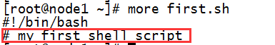

# shell脚本

参考链接：

[Linux之Shell脚本编程（一）](https://www.cnblogs.com/zhangchao162/p/9614145.html)

[Linux之Shell脚本编程（二）](https://www.cnblogs.com/zhangchao162/p/9614264.html)

[linux下的shell脚本（基本）](https://www.cnblogs.com/yinheyi/p/6648242.html)

## 什么是Shell

Shell是命令解释器(command interpreter)，是Unix操作系统的用户接口，程序从用户接口得到输入信息，shell将用户程序及其输入翻译成操作系统内核（kernel）能够识别的指令，并且操作系统内核执行完将返回的输出通过shell再呈现给用户，下图所示用户、shell和操作系统的关系：


 

　　Shell也是一门编程语言，即shell脚本，shell是解释执行的脚本语言，可直接调用linux命令。

　　一个系统可以存在多个shell，可以通过cat /etc/shells命令查看系统中安装的shell，不同的shell可能支持的命令语法是不相同的。

## Shell种类

　　操作系统内核（kernel）与shell是独立的套件，而且都可被替换。不同的操作系统使用不同的shell；同一个kernel之上可以使用不同的shell。

　　常见的shell分为两大主流：

　　**sh**：

　　　　Bourne shell（sh） ,Solaris,hpux默认shell

　　　　Bourne again shell（bash） ,Linux系统默认shell

　　**csh**：

　　　　C shell(csh)

　　　　tc shell(tcsh)

##  查看使用Shell

 

##  Shell环境定义

### 临时环境变量

　　所谓临时变量是指在用户在当前登陆环境生效的变量，用户登陆系统后，直接在命令行上定义的环境变量便只能在当前的登陆环境中使用。当退出系统后，环

境变量将不能下次登陆时继续使用。

### 将环境变量永久生效

　　通过将环境变量定义写入到配置文件中，用户每次登陆时系统自动定义，则无需再到命令行重新定义。定义环境变量的常见配置文件如下：

　　　　**/etc/profile** 针对系统所有用户生效，此文件应用于所有用户每次登陆系统时的环境变量定义

　　　　**$HOME_name/.bash_profile** 针对特定用户生效，$HOME为用户的宿主目录，当用户登陆系统后，首先继承/etc/profile文件中的定义，

　　再应用$HOME/.bash_profile文件中的定义。

### 系统预定义的环境变量

　　系统环境变量对所有用户有效，如：$PATH、$HOME、$SHELL、$PWD等等，如下用echo命令打印上述的系统环境变量：


## shell脚本编程

同传统的编程语言一样，shell提供了很多特性，这些特性可以使你的shell脚本编程更为有用。

### 创建Shell脚本

　　一个shell脚本通常包含如下部分：

#### 首行

　　　　第一行内容在脚本的首行左侧，表示脚本将要调用的shell解释器，内容如下：

　　　　#!/bin/bash

　　　　#！符号能够被内核识别成是一个脚本的开始，这一行必须位于脚本的首行，/bin/bash是bash程序的绝对路径，在这里表示后续的内容将通过bash程序

解释执行。

#### 注释

　　　　注释符号# 放在需注释内容的前面，如下：



shell 只有单行注释

#### 内容

　　　　可执行内容和shell结构

​																							 

### Shell脚本的权限

　一般情况下，默认创建的脚本是没有执行权限的。


没有权限不能执行，需要赋予可执行权限。


###  Shell脚本的执行

#### 1，输入脚本的绝对路径或相对路径

　　　　/root/helloWorld.sh

　　　　./helloWorld.sh

#### 	2，bash或sh +脚本

　　　　bash /root/helloWorld.sh

　　　　sh helloWorld.sh

　　　　注：当脚本没有x权限时，root和文件所有者通过该方式可以正常执行。


#### 3，在脚本的路径前再加". " 或source

​				source /root/helloWorld.sh

　　　　. ./helloWorld.sh

　　区别：第一种和第二种会新开一个bash，不同bash中的变量无法共享。但是使用. ./脚本.sh 这种方式是在同一个shell里面执行的。


## Shell变量

变量：是shell传递数据的一种方式，用来代表每个取值的符号名。当shell脚本需要保存一些信息时，如一个文件名或是一个数字，就把它存放在一个变量中。

### 变量设置规则：

1. 变量名和等号之间不能有空格;

2. 变量名称可以由字母，数字和下划线组成，但是不能以数字开头，环境变量名建议大写，便于区分。

3.  中间不能有空格，可以使用下划线（_）。

4. 不能使用标点符号。

5. 不能使用bash里的关键字。

### 变量分类

　　Linux Shell中的变量分为用户自定义变量,环境变量，位置参数变量和预定义变量。可以通过set命令查看系统中存在的所有变量。

　　系统变量：保存和系统操作环境相关的数据。$HOME、$PWD、$SHELL、$USER等等

　　位置参数变量：主要用来向脚本中传递参数或数据，变量名不能自定义，变量作用固定。

　　预定义变量：是Bash中已经定义好的变量，变量名不能自定义，变量作用也是固定的。

### 用户自定义变量

用户自定义的变量由字母或下划线开头，由字母，数字或下划线序列组成，并且大小写字母意义不同，变量名长度没有限制。

#### 设置变量

　　习惯上用大写字母来命名变量。变量名以字母表示的字符开头，不能用数字。

#### 变量调用

　　在使用变量时，要在变量名前加上前缀“$”.

　　使用echo 命令查看变量值。eg:echo $A

#### 变量赋值

##### **1，定义时赋值：**

　　　　变量＝值　　　　　　等号两侧不能有空格

　　　　eg:

　　　　　　STR="hello world"

　　　　　　A=9 

##### 2， 将一个命令的执行结果赋给变量

```
　　　　A=`ls -la` 反引号，运行里面的命令，并把结果返回给变量A

　　　　A=$(ls -la) 等价于反引号

　　　　　　eg: aa=$((4+5))

　　　　　　　　bb=`expr 4 + 5 `
```

##### 3，将一个变量赋给另一个变量

　　　　eg : A=$STR

#### 变量替换


#### **变量叠加**

　　eg:#aa=123

　　eg:#cc="$aa"456

　　eg:#dd=${aa}789 


　　单引号和双引号的区别：

　　现象：单引号里的内容会全部输出，而双引号里的内容会有变化

　　原因：单引号会将所有特殊字符脱意

　　NUM=10   

　　SUM="$NUM hehe"   echo $SUM   输出10 hehe

　　SUM2='$NUM hehe'   echo $SUM2   输出$NUM hehe

#### 列出所有的变量

　　set

#### 删除变量

　　unset  NAME

　　　　eg :

　　　　　　# unset A 撤销变量 A

　　　　　　# readonly B=2 声明静态的变量 B=2 ，不能 unset

 							

　　用户自定义的变量，作用域为当前的shell环境。

### 环境变量

 

　　用户自定义变量只在当前的shell中生效，而环境变量会在当前shell和其所有子shell中生效。如果把环境变量写入相应的配置文件，那么这个环境变量就会在所有的shell中生效。

 

　　export 变量名=变量值  申明变量

　　作用域：当前shell以及所有的子shell。

### 位置参数变量

| $n   | n为数字，$0代表命令本身，$1-$9代表第一到第9个参数,十以上的参数需要用大括号包含，如${10}。 |
| ---- | ------------------------------------------------------------ |
| $*   | 代表命令行中所有的参数，把所有的参数看成一个整体。以"$1 $2 … $n"的形式输出所有参数 |
| $@   | 代表命令行中的所有参数，把每个参数区分对待。以"$1" "$2" … "$n" 的形式输出所有参数 |
| $#   | 代表命令行中所有参数的个数。添加到shell的参数个数            |

shift指令：参数左移，每执行一次，参数序列顺次左移一个位置，$# 的值减1，用于分别处理每个参数，移出去的参数不再可用

　　**$\*** **和 $@的区别**

　　1，$* 和 $@ 都表示传递给函数或脚本的所有参数，不被双引号" "包含时，都以"$1" "$2" … "$n" 的形式输出所有参数；

　　2，当它们被双引号" "包含时，"$*" 会将所有的参数作为一个整体，以"$1 $2 … $n"的形式输出所有参数；

　　3，"$@" 会将各个参数分开，以"$1" "$2" … "$n" 的形式输出所有参数。

### 预定义变量


**$?** 可以获取上一个命令的退出状态。所谓退出状态，就是上一个命令执行后的返回结果。退出状态是一个数字，一般情况下，大部分命令执行成功会返回 0，失败返回 1。

## `` '' "" 三种引号

　　单引号和双引号的区别：

　　现象：单引号里的内容会全部输出，而双引号里的内容会有变化

　　原因：单引号会将所有特殊字符脱意

　　NUM=10   

　　SUM="$NUM hehe"   echo $SUM   输出10 hehe

　　SUM2='$NUM hehe'   echo $SUM2   输出$NUM hehe

```
　　　　A=`ls -la` 反引号，运行里面的命令，并把结果返回给变量A

　　　　A=$(ls -la) 等价于反引号

　　　　　　eg: aa=$((4+5))

　　　　　　　　bb=`expr 4 + 5 `
```

## $变量名 、$()  、 ${}

　　**$()****与${}的区别**

　　$( )的用途和反引号``一样，用来表示优先执行的命令

　　　　eg:echo $(ls a.txt)

　　${ } 就是取变量了  eg：echo ${PATH}

　　$((运算内容)) 适用于数值运算

　　　　eg: echo $((3+1*4))

## read命令

　　read [选项] 值

　　read -p(提示语句) -n(字符个数) -t(等待时间，单位为秒) –s(隐藏输入)  

　　　　eg:

　　　　　　read –t 30 –p “please input your name: ” NAME

　　　　　　echo $NAME

　　　　　　read –s –p “please input your age : ” AGE

　　　　　　echo $AGE

　　　　　　read –n 1 –p “please input your sex [M/F]: ” GENDER

　　　　　　echo $GENDER

## 运算符


## 内置test命令

　　内置test命令常用操作符号[]表示，将表达式写在[]中，如下：

　　　　[ expression ] 

　　或者：

　　　　test expression

　　**注意**：expression首尾都有个空格

　　　　eg: [ ] ;echo $?

　　测试范围：整数、字符串、文件

　　表达式的结果为真，则test的返回值为0，否则为非0。当表达式的结果为真时，则变量$?的值就为0，否则为非0

## Shell 字符串

**单引号的限制：**

1. 单引号里的任何字符都会原样输出，单引号字符串中的变量是无效的；
2. 单引号字串中不能出现单引号（对单引号使用转义符后也不行）。

**双引号的优点：**

1. 双引号里可以有变量
2. 双引号里可以出现转义字符

### 拼接字符串：

```
country="China"
echo "hello, $country"
#也可以
echo "hello, "$country" "
```

### 获取字符串长度:

```
string="abcd"
echo ${#string} #输出 4
```

### 提取子字符串:

```
string="alibaba is a great company"
echo ${string:1:4} #输出liba
```

### **查找子字符串:**

```
string="alibaba is a great company"
echo `expr index "$string" is`
```

 

### 处理路径的字符串：

例如：当一个路径为 /home/xiaoming/1.txt时，如何怎么它的路径（不带文件) 和如何得到它的文件名？？

得到文件名使用 bashname命令：  

```
#  参数：
#  -a,表示处理多个路径；
# -s, 用于去掉指定的文件的后缀名；

 basename /home/yin/1.txt          -> 1.txt

 basename -a /home/yin/1.txt /home/zhai/2.sh     -> 
1.txt
2.sh basename -s .txt /home/yin/1.txt    -> 1
 basename /home/yin/1.txt .txt       -> 1
```

得到路径名（不带文件名）使用 dirname命令：

```
参数：没有啥参数；

//例子：
 dirname /usr/bin/          -> /usr
 dirname dir1/str dir2/str  -> 
 dir1
 dir2
 dirname stdio.h            -> .
```

## Shell的数组:

bash支持一维数组, 不支持多维数组, 它的下标从0开始编号. 用下标[n] 获取数组元素；

**定义数组：**

在shell中用括号表示数组，元素用空格分开。 如：

```
array_name=(value0 value1 value2 value3)
```

也可以单独定义数组的各个分量，可以不使用连续的下标，而且下标的范围没有限制。如：

```
array_name[0]=value0
array_name[1]=value1
array_name[2]=value2
```

**读取数组：**

读取某个下标的元素一般格式为:

```
${array_name[index]}
```

读取数组的全部元素，用@或*

```
${array_name[*]}
${array_name[@]}
```

**获取数组的信息：**

取得数组元素的个数：

```
length=${#array_name[@]}
#或
length=${#array_name[*]}
```

获取数组的下标：

```
length=${!array_name[@]}
#或
length=${!array_name[*]}
```

取得数组单个元素的长度:

```
lengthn=${#array_name[n]}
```

## printf函数：格式化输出

它与c语言中的printf相似，不过也有不同，下面列出它的不同的地方：

1. printf 命令不用加括号
2. format-string 可以没有引号，但最好加上，单引号双引号均可。
3. 参数多于格式控制符(%)时，format-string 可以重用，可以将所有参数都转换。
4. arguments 使用空格分隔，不用逗号。

下面为例子：

```
# format-string为双引号
$ printf "%d %s\n" 1 "abc"
1 abc
# 单引号与双引号效果一样 
$ printf '%d %s\n' 1 "abc" 
1 abc
# 没有引号也可以输出
$ printf %s abcdef
abcdef
# 格式只指定了一个参数，但多出的参数仍然会按照该格式输出，format-string 被重用
$ printf %s abc def
abcdef
$ printf "%s\n" abc def
abc
def
$ printf "%s %s %s\n" a b c d e f g h i j
a b c
d e f
g h i
j
# 如果没有 arguments，那么 %s 用NULL代替，%d 用 0 代替
$ printf "%s and %d \n" 
and 0
# 如果以 %d 的格式来显示字符串，那么会有警告，提示无效的数字，此时默认置为 0
$ printf "The first program always prints'%s,%d\n'" Hello Shell
-bash: printf: Shell: invalid number
The first program always prints 'Hello,0'
$
```

## 流程控制语句

### if 语句

包括：

1.  if [ 表达式 ] then 语句 fi

2.  if [ 表达式 ] then 语句 else 语句 fi

3.  if [ 表达式] then 语句 elif[ 表达式 ] then 语句 elif[ 表达式 ] then 语句  …… fi

例子：

```
a=10
b=20
if [ $a == $b ]
then
   echo "a is equal to b"
else
   echo "a is not equal to b"
fi
```

另外：if ... else 语句也可以写成一行，以命令的方式来运行，像这样：

```
if test $[2*3] -eq $[1+5]; then echo 'The two numbers are equal!'; fi;
```

其中，test 命令用于检查某个条件是否成立，与方括号([ ])类似。

### **case …… esac语句**

case ... esac 与其他语言中的 switch ... case 语句类似，是一种多分枝选择结构。case语句格式如下：

```
case 值 in
模式1)
    command1
    command2
    command3
    ;;
模式2）
    command1
    command2
    command3
    ;;
*)
    command1
    command2
    command3
    ;;
esac
```


其中， 1. 取值后面必须为关键字 in，每一模式必须以右括号结束。取值可以为变量或常数。匹配发现取值符合某一模式后，其间所有命令开始执行直至 ;;。;; 与其他语言中的 break 类似，意思是跳到整个 case 语句的最后。2. 如果无一匹配模式，使用星号 * 捕获该值，再执行后面的命令。

### **for 循环** 

 一般格式为：

```
for 变量 in 列表
do
    command1
    command2
    ...
    commandN
done
```

注意：列表是一组值（数字、字符串等）组成的序列，每个值通过空格分隔。每循环一次，就将列表中的下一个值赋给变量。    例如：

顺序输出当前列表的数字：

```
for loop in 1 2 3 4 5
do
    echo "The value is: $loop"
done
```

显示主目录下以 .bash 开头的文件：

```
#!/bin/bash
for FILE in $HOME/.bash*
do
   echo $FILE
done
```

### **while循环**

**一般格式为：**

```
while command
do
   Statement(s) to be executed if command is true
done
```

例如：

```
COUNTER=0
while [ $COUNTER -lt 5 ]
do
    COUNTER='expr $COUNTER+1'
    echo $COUNTER
done
```

### **until 循环**

until 循环执行一系列命令直至条件为 true 时停止。until 循环与 while 循环在处理方式上刚好相反。  常用格式为：

```
until command
do
   Statement(s) to be executed until command is true
done
```

command 一般为条件表达式，如果返回值为 false，则继续执行循环体内的语句，否则跳出循环。

 

类似地， 在循环中使用 break 与continue 跳出循环。  另外，break 命令后面还可以跟一个整数，表示跳出第几层循环。

## 自定义Shell函数

Shell函数必须先定义后使用，定义如下，

```
function_name () {
    list of commands
    [ return value ]
}
```

也可以加上function关键字：

```
function function_name () {
    list of commands
    [ return value ]
}
```

注意:

1. 调用函数只需要给出函数名，不需要加括号。

2. 函数返回值，可以显式增加return语句；如果不加，会将最后一条命令运行结果作为返回值。

3. Shell 函数返回值只能是整数，一般用来表示函数执行成功与否，0表示成功，其他值表示失败。

4. 函数的参数可以通过 $n 得到.如:

```
funWithParam(){
    echo "The value of the first parameter is $1 !"
    echo "The value of the second parameter is $2 !"
    echo "The value of the tenth parameter is ${10} !"
    echo "The value of the eleventh parameter is ${11} !"
    echo "The amount of the parameters is $# !"  # 参数个数
    echo "The string of the parameters is $* !"  # 传递给函数的所有参数
}
funWithParam 1 2 3 4 5 6 7 8 9 34 73
```

5. 像删除变量一样，删除函数也可以使用 unset 命令，不过要加上 .f 选项，如下所示：

```
unset .f function_name
```

## shell的文件包含：

Shell 也可以包含外部脚本，将外部脚本的内容合并到当前脚本。使用：

```
. filename
#或
source filename
```

1. 两种方式的效果相同，简单起见，一般使用点号(.)，但是注意点号(.)和文件名中间有一空格。

2. 被包含脚本不需要有执行权限。

## 脚本调试 

　　sh -x script　　

　　这将执行该脚本并显示所有变量的值。

 

　　在shell脚本里添加 

　　set -x  对部分脚本调试

　　sh -n script

　　不执行脚本只是检查语法的模式，将返回所有语法错误。

 

　　sh –v script

　　执行并显示脚本内容。