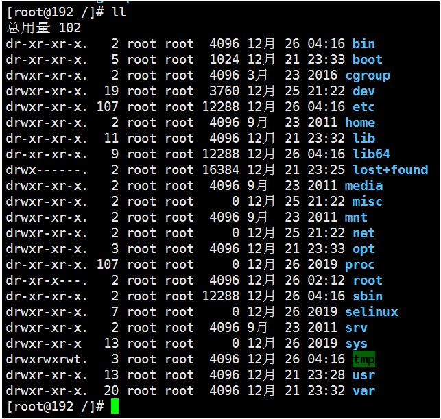

# 常见目录解释

[Unix filesystem](https://en.wikipedia.org/wiki/Unix_filesystem#Conventional_directory_layout)


Linux系统的最高一级目录是根目录（`/`），相当于Windows系统中的计算机。在根目录下会有一些一级目录，首先我们要了解这些目录的作用。（值得花点时间了解一下）

`CentOS 6`的根目录内容如下图所示：

[](https://img2020.cnblogs.com/blog/909968/202111/909968-20211101170531782-1841441858.png)

> **学习Linux目录结构有什么好处？**
>
> - 你会更加熟悉Linux系统的文件目录结构。
> - 了解了目录结结构之后，以后遇到一些陌生的文件，你就看他放在哪里，基本上就能猜出来这个文件的大概作用。
> - 如果大家都遵守这样的目录，Linux系统的管理将变得非常规范。因为服务器不是一个人在维护，是一个团队中很多人一起进行维护。

## 1、一级目录说明

### （1）一级目录列表

| 目录名         | 目录作用                                                     |
| :------------- | :----------------------------------------------------------- |
| `/bin/`        | 存放系统命令的目录，普通用户和超级用户都可以执行。是`/usr/bin/`目录的软链接。 |
| `/usr/bin/`    | 存放系统命令的目录，普通用户和超级用户都可以执行。           |
| `/sbin/`       | 存放系统命令的目录，只有超级用户才可以执行。是`/usr/sbin/`目录的软链接。 |
| `/usr/sbin/`   | 存放系统命令的目录，只有超级用户才可以执行。                 |
| `/boot/`       | 系统启动目录，保存与系统启动相关的文件，如内核文件和启动引导程序（`grub`）文件等。 |
| `/dev/`        | 硬件设备文件保存位置。                                       |
| `/etc/`        | 配置文件保存位置。系统内所有采用默认安装方式（`rpm`安装）的服务配置文件全部保存在此目录中，如用户信息、服务的启动脚本、常用服务的配置文件等。 |
| `/home/`       | 普通用户的家目录。在创建用户时，每个用户要有一个默认登录和保存自己数据的位置，就是用户的家目录，所有**普通用户**的宿主目录是在`/home/`下建立一个和用户名相同的目录。如用户`user1`的家目录就是`/home/user/`，~就是代表当前位置在用户的家目录下。 |
| `/lib/`        | 系统调用的函数库保存位置。是`/usr/lib/`的软链接。            |
| `/lib64/`      | 64位函数库保存位置。是`/usr/lib6/`的软链接。                 |
| `/lost+found/` | 当系统意外崩溃或机器意外关机，而产生一些文件碎片放在这里。当系统启动的过程中fsck工具(自动执行)会检查这里，并修复已经损坏的文件系统。这个目录只在每个分区中出现，例如`/lost+found`就是根分区的备份恢复目录，`/boot/lost+found`就是`/boot`分区的备份恢复目录。 |
| `/media/`      | 挂载目录。系统建议是用来挂载媒体设备的，如软盘和光盘。       |
| `/misc/`       | 挂载目录。系统建议用来挂载NFS服务的共享目录。                |
| `/mnt/`        | 挂载目录。早期Linux中只有这一个挂载目录，并没有细分。现在系统建议这个目录用来挂载额外的设备，如U盘、移动硬盘和其他操作系统的分区 |
| `/opt/`        | 第三方安装的软件保存位置。这个目录是放置和安装其他软件的位置，手工安装的源码包软件都可以安装到这个目录中。不过还是习惯把软件放到`/usr/local/`目录中，也就是说，`/usr/local/`目录也可以用来安装软件。 |
| `/proc/`       | 虚拟文件系统。该目录中的数据并不保存在硬盘上，而是保存到内存中。主要保存系统的内核、进程、外部设备状态和网络状态等。如`/proc/cpuinfo`是保存CPU信息的，`/proc/devices`是保存设备驱动的列表的，`/proc/filesystems`是保存文件系统列表的，`/proc/net`是保存网络协议信息的。（不要动就好） |
| `/sys/`        | 虚拟文件系统。和`/proc/`目录相似，该目录中的数据都保存在内存中，主要保存与内核相关的信息 |
| `/root/`       | `root`的宿主目录。普通用户宿主目录在`/home/`下，`root`宿主目录直接在`/`下。 |
| `/selinux/`    | Linux系统的增强安全组件的保存位置。                          |
| `/srv/`        | 服务数据目录。一些系统服务启动之后，可以在这个目录中保存所需要的数据。（不许动） |
| `/tmp/`        | 临时目录。系统存放临时文件的目录，在该目录下，所有用户都可以访问和写入。我们建议此目录中不能保存重要数据，最好每次开机都把该目录清空。 |
| `/usr/`        | 系统软件资源目录。注意`usr`不是`user`的缩写，而是`UNIX Software Resource`的缩写，所以不是存放用户数据的目录，而是存放系统软件资源的目录。系统中安装的软件大多数保存在这里 |
| `/var/`        | 动态数据保存位置。主要保存缓存、日志以及软件运行所产生的文件。 |

### （2）/bin/和/sbin/目录说明

- `bin`目录和`sbin`目录的区别？
  1）`bin`目录和`sbin`目录下放的是Linux的系统命令。
  2）在这两个`bin`目录中放的命令，是普通用户和超级用户都可以执行的命令。
  3）在两个`sbin`目录中放的命令，只有超级用户才能执行。
  4）`bin`是二机制（`binary`）的缩写，表示是二进制命令，`sbin`是（`super binary`）的缩写。
- `/bin/`目录和`/usr/bin/`目录中命令有什么区别？
  在`Red Hat 6`版本，这两个目录还是分开的，到`Red Hat 7`版本，这两个目录就合并了。就只剩下一个`/usr/bin/`目录。

### （3）/boot/目录说明

`boot`目录中的文件，都是系统启动时必须的。如果误删了，系统一定会启动失败。（没事别动它）

### （4）/lib/和/lib64/目录说明

`/lib/`和`/lib64/`目录中放的是函数库。函数库就是程序集合，函数就是程序。

一些需要频繁调用的程序，就可以封装成一个函数库。

函数库降低了开发人员的开发难度，提升了效率。

所有的成熟语言都会有完整的函数库的。Linux系统是C语言开发的函数库。

Linux的函数库的命名规则：`.so+数字`结尾命名的文件就是函数库。

### （5）/lost+found/目录说明

这个目录就是意外崩溃或者关机之后的文件修复目录。开机时通过`fsck`工具自动修复，如果自动修复不了，手动其实也解决不了什么问题，所以这个目录知道有什么作用就可以了。

### （6）/media/、/misc/、/mnt/目录说明

我们在之前的文章已经解释了挂载，知道只要是一个已经建立的空目录就可以作为挂载点。

那么系统虽然准备了三个默认挂载目录`/media`、`/mnt`、`/misc`，但是到底在哪个目录中挂载什么设备都可以由管理员自己决定。

例如刚接触Linux的时候，默认挂载目录只有`/mnt`一个，所以养成了在`/mnt`下建立不同目录挂载不同设备的习惯。如`/mnt/cdrom`挂载光盘，`/mnt/usb`挂载U盘，这都是可以的。

官方推荐`/media`目录挂载光盘，`/misc`目录挂网络存储设备，`/mnt/`挂载U盘或者移动盘。

根据自己的需求和使用习惯进行分配就可以。

> 提示：`cgroup`目录，在`Red Hat 7`版本中就淘汰了。

### （7）总结

**1）一定要记住的目录**

`/bin/`、`/sbin/`、`/usr/bin/`、`/usr/sbin/`、`/boot/`、`/dev/`、`/etc/`、`/home/`、`/lib/`、`/lib64/、/mnt/`、`/tmp/`、`/root/`、`/usr/`、`/var/`。

**2）了解即可的目录**

`/lost+found/`、`/media/`、`/misc/`、`/opt/`。

**3）没事不要动的目录**

`/proc/`、`/sys/`、`/selinux/`、`/srv/`。

**4）提示：**

推荐两个可以做实验的目录：

- 用户的家目录。
- `tmp`临时目录。

（自己创建的随便删，系统自带的或者生成的还是慎重删）

## 2、重要的二级目录说明

这些二级目录的主要位置就是在根下的`/usr/`目录和`/var/`目录中。

### （1）重要的二级目录列表

| 目录                | 说明                                                         |
| :------------------ | :----------------------------------------------------------- |
| `/usr/lib/`         | 也是一个应用程序调用的函数库保存位置。                       |
| `/usr/local/`       | 手工安装的软件保存位置。我们一般建议源码包软件安装在这个位置，不建议放在`/opt`目录下。（软件的安装位置） |
| `/usr/share/`       | 应用程序的资源文件保存位置，如帮助文档、说明文档和字体目录   |
| `/usr/src/`         | 源码包保存位置。我们手工下载的源码包和内核源码包都可以保存到这里。不过一般习惯把手工下载的源码包保存到`/usr/local/src/`目录中，把内核源码保存到`/usr/src/kernels/`目录中。（`/usr/src/`是软件安装包的位置） |
| `/usr/src/kernels/` | 内核源码保存位置。                                           |
| `/var/www/html/`    | RPM包安装的Apache的网页主目录（也就是默认安装（rpm）的Apache的网页在这里，装完Apache会自动生成`/www/html/`目录）。 |
| `/var/log/`         | 系统日志保存位置（默认安装的软件的日志在这里，手动的不在这里）。 |
| `/var/lib/`         | 程序运行中需要调用或改变的数据保存位置。如MySQL的数据库保存在`/var/lib/mysql/`目录中。（默认安装的MySQL数据库的保存位置在`/var/lib/mysql/`，这里重点记住）。 |
| `/var/run/`         | 一些服务和程序运行后，它们的PID（进程ID）保存位置。是`/run/`目录的软链接 |
| `/var/spool/`       | 放置队列数据的目录。就是排队等待其他程序使用的数据，比如邮件队列和打印队列。 |
| `/var/spool/mail/`  | 新收到的邮件队列保存位置。系统新收到的邮件会保存在此目录中。 |
| `/var/spool/cron/`  | 系统的定时任务队列保存位置。系统的计划任务会保存在这里。     |

### （2）总结：

**1）一定要记住的目录**

`/usr/local/`、`/usr/share/`、`/usr/src/`或者`/usr/local/src/`、`/var/log/`、`/var/www/html/`、`/var/lib/`、`/var/run/`、`/var/spool/`、`/var/spool/mail/`、`/var/spool/cron/`。

**2）了解即可的目录**

```
/usr/lib/`、`/usr/src/kernels/
```

> 说明：
>
> `/usr/src/kernels/`是空的，是因为我们选择安装的软件包是`basicserver`。
>
> `basicserver`软件包中是没有安装源代码的，如果你需要查看内核的源代码进行学习，可以自己手动安装。

> 提示：记住每个目录的作用，是存放什么东西的就可以了，方便以后我们对Linux系统的学习。