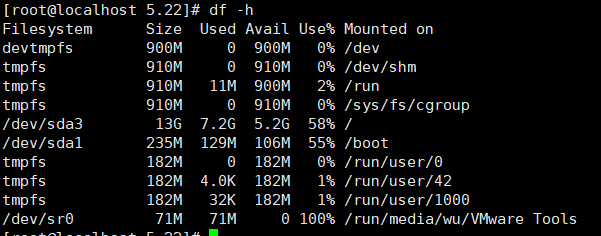

# Linux的df -h命令

df -h 查看磁盘占用的空间

 

 

- `Filesystem`：表示该文件系统位于哪个分区，因此该列显示的是设备名称；
- `Used`：表示用掉的磁盘空间大小；
- `Available`：表示剩余的磁盘空间大小；
- `Use%`：磁盘空间使用率;
- `Mounted on`：文件系统的挂载点，也就是磁盘挂载的目录位置

- `Filesystem`：表示该文件系统位于哪个分区，因此该列显示的是设备名称；
- `Used`：表示用掉的磁盘空间大小；
- `Available`：表示剩余的磁盘空间大小；
- `Use%`：磁盘空间使用率;
- `Mounted on`：文件系统的挂载点，也就是磁盘挂载的目录位置

