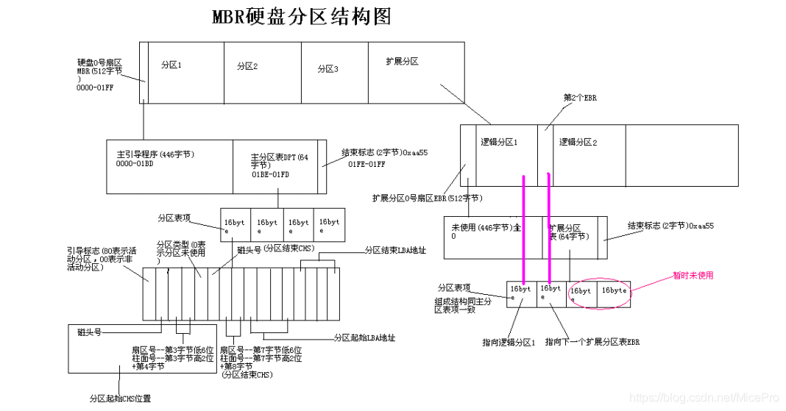

# CentOS7磁盘分区及文件系统

[CentOS7磁盘分区及文件系统](https://blog.csdn.net/MicePro/article/details/99614636)

 **一般来说，硬盘上的空间，想要被我们利用，都要经过几个步骤：**

1. 设备识别

2. 磁盘分区

3. 创建文件系统（并标记文件系统）

4. 挂载新的文件系统

5. 在/etc/fstab文件中创建新条目

   **只有当设备被挂载到文件系统中，才可以被我们访问且使用。**
    

## 1 设备识别

新插入硬盘设备，没法被系统立马识别到，需要手动扫描，才可以发现并识别新设备

echo "- - -" > /sys/class/scsi_host/host0/scan

/sys/class/scsi_host/ 目录下面有几个host 就扫描几次。
 
 

## 2 磁盘分区

### 2.1为什么要分区

- 优化I/O性能
- 实现磁盘空间配额限制
- 提高修复速度
- 隔离系统和程序
- 安装多个OS
- 采用不同文件系统
   

### 2.2分区方式

  一般来说有两种分区方式 ：**MBR和GPT**。

- **MBR：**全称Master Boot Record，1982年，使用32位表示扇区，单个分区不超过2T。

- 如何分区：按柱面

- 0磁道0扇面：512bytes

      446byets：boot loader

      64bytes ： 分区表，其中每16bytes标识一个分区

      2byetes ：55AA

- MBR分区中一块硬盘最多有4个主分区，也可以三主分区+1拓展（N个逻辑分区）

**MBR分区结构**

MBR分区表

  硬盘主导记录MBR由4个部分组成

- 主引导程序（偏移地址0000H–0088H），它负责从活动分区中装载，并运行系统引导程序

- 出错信息数据区，偏移地址0089H-00E1H为出错信息，00E2H-01BDH全为0字节

- 分区表（DPT,Disk Partition Table）含4个分区项，偏移地址01BEH–01FDH，每个分区表长16个字节，共64字节为分区项1、分区项2、分区项3、分区项4

- 结束标志字，偏移地址01FE–01FF的2个字节值为结束标志55AA

  

- **GPT：**GUID（Globals Unique Identifiers） partition table 支持128个分区，使用64位，支持8Z（ 512Byte/block ）64Z （ 4096Byte/block）

- 使用128位UUID(Universally Unique Identifier) 表示磁盘和分区 GPT分区表

自动备份在头和尾两份，并有CRC校验位

- UEFI (Unified Extensible Firmware Interface 统一可扩展固件接口)硬件支持

GPT，使操作系统启动
 
**GPT分区结构**

### 2.3管理分区

#### 2.31列出块设备

#### 2.32创建新分区

  parted命令：parted [选项]… [设备 [命令 [参数]…]…]

  parted /dev/sdb mklabel gpt|msdos

  parted /dev/sdb print

  parted /dev/sdb mkpart primary 1 200 （默认M）

  parted /dev/sdb rm 1

  parted –l 列出分区信息

**parted的操作都是实时生效的，小心使用**
 
   fdisk -l [-u] [device…] 查看分区

   fdisk /dev/sdb 管理分区

子命令：
     p 查看分区列表

     t 更改分区类型

     n 创建新分区

     d 删除分区

     v 校验分区

     u 转换单位

     w 保存并退出

     q 不保存并退出
 
gdisk命令与fdisk用法相同，用于创建GPT分区。

#### 2.33同步内核与硬盘的分区表

查看内核是否已经识别新的分区

cat /proc/partations

**centos6**通知内核重新读取硬盘分区表

新增分区用

partx -a /dev/DEVICE

kpartx -a /dev/DEVICE -f: force

删除分区用

partx -d --nr M-N /dev/DEVICE

**CentOS 5，7**: 使用partprobe

partprobe [/dev/DEVICE]

## 3 创建文件系统

### 3.1文件系统

  文件系统是操作系统用于明确存储设备或分区上的文件的方法和数据结构；即在存储设备上组织文件的方法。操作系统中负责管理和存储文件信息的软件结

构称为文件管理系统，简称文件系统从系统角度来看，文件系统是对文件存储设备的空间进行组织和分配，负责文件存储并对存入的文件进行保护和检索的系统。

具体地说，它负责为用户建立文件，存入、读出、修改、转储文件，控制文件的存取，安全控制，日志，压缩，加密等

   支持的文件系统：/lib/modules/`uname -r`/kernel/fs

   各种文件系统：https://en.wikipedia.org/wiki/Comparison_of_file_systems

#### 3.11文件系统类型

Linux文件系统：

  ext2(Extended file system)：适用于那些分区容量不是太大，更新也不频繁的情况，例如 /boot 分区

  ext3：是 ext2 的改进版本，其支持日志功能，能够帮助系统从非正常关机导致的异常中恢复。它通常被用作通用的文件系统

  ext4：是 ext 文件系统的最新版。提供了很多新的特性，包括纳秒级时间戳、创建和使用巨型文件(16TB)、最大1EB的文件系统，以及速度的提升

  xfs：SGI，支持最大8EB的文件系统

  btrfs（Oracle）, reiserfs, jfs（AIX）, swap

光盘：iso9660

Windows：FAT32, NTFS，exFA

Unix：FFS（fast）, UFS（unix）, JFS2

网络文件系统：NFS, CIFS

集群文件系统：GFS2, OCFS2（oracle）

分布式文件系统：fastdfs,ceph, moosefs, mogilefs, glusterfs, Lustre

RAW：未经处理或者未经格式化产生的文件系统

#### 3.12文件系统分类

根据其是否支持"journal"功能：

  日志型文件系统: ext3, ext4, xfs, …

  非日志型文件系统: ext2, vfat

文件系统的组成部分：

  内核中的模块：ext4, xfs, vfat

  用户空间的管理工具：mkfs.ext4, mkfs.xfs,mkfs.vfat

Linux的虚拟文件系统：VFS

查前支持的文件系统：cat /proc/filesystems

查前目前的文件系统：lsblk -f

### 3.2创建文件系统

mkfs命令：
(1) mkfs.FS_TYPE /dev/DEVICE

    ext4
    xfs
    btrfs
    vfat
(2) mkfs -t FS_TYPE /dev/DEVICE

    -L ‘LABEL’ 设定卷标

 mke2fs命令：ext系列文件系统专用管理工具

   -t {ext2|ext3|ext4} 指定文件系统类型

   -b {1024|2048|4096} 指定块大小

   -L ‘LABEL’ 设置卷标

   -j 相当于 -t ext3 (mkfs.ext3 = mkfs -t ext3 = mke2fs -j = mke2fs -t ext3)`

   -i # 为数据空间中每多少个字节创建一个inode；不应该小于block大小

   -N # 指定分区中创建多少个inode

   -I 一个inode记录占用的磁盘空间大小，128—4096

   -m # 默认5%,为管理人员预留空间占总空间的百分比

   -O FEATURE[,…] 启用指定特性

   -O ^FEATURE 关闭指定特性

### 3.3文件系统标签

文件系统标签是指向设备的另一种方法。与设备无关

blkid：块设备属性信息查看

blkid [OPTION]… [DEVICE]

   -U UUID 根据指定的UUID来查找对应的设备

   -L LABEL 根据指定的LABEL来查找对应的设备

e2label：管理ext系列文件系统的LABEL

e2label DEVICE [LABEL]

findfs ：查找分区

findfs [options] LABEL= < label >

findfs [options] UUID= < uuid >

### 3.4文件系统检测和修复

文件系统夹故障常发生于死机或者非正常关机之后，挂载为文件系统标记为“no clean”

注意：一定不要在挂载状态下执行下面命令修复

fsck: File System Check

  fsck.FS_TYPE

  fsck -t FS_TYPE

注意：FS_TYPE 一定要与分区上已经文件类型相同

-a 自动修复

-r 交互式修复错误

e2fsck：ext系列文件专用的检测修复工具

-y 自动回答为yes

-f 强制修复

-p 自动进行安全的修复文件系统问题

xfs_repair：xfs文件系统专用检测修复工具

-f 修复文件，而设备

-n 只检查

-d 允许修复只读的挂载设备，在单用户下修复 / 时使用，然后立即reboot

#### 4 挂载新的文件系统

挂载： 将额外文件系统与根文件系统某现存的目录建立起关联关系，进而使得此目录做为其它文件访问入口的行为

卸载： 为解除此关联关系的过程

把设备关联挂载点：mount Point

  mount 设备名 挂载点

卸载时：可使用设备，也可以使用挂载点

  umount 设备名|挂载点
PS：挂载点下原有文件在挂载完成后会被临时隐藏
   挂载点目录一般为空

### 4.1用mount命令挂载文件系统

挂载方法：mount DEVICE MOUNT_POINT

  mount：通过查看/etc/mtab文件显示当前已挂载的所有设备

  mount [-fnrsvw] [-t vfstype] [-o options] device dir

device：指明要挂载的设备；

  (1) 设备文件：例如/dev/sda5

  (2) 卷标：-L ‘LABEL’, 例如 -L ‘MYDATA’

  (3) UUID, -U ‘UUID’：例如 -U ‘0c50523c-43f1-45e7-85c0-a126711d406e’

  (4) 伪文件系统名称：proc, sysfs, devtmpfs, configfs

dir：挂载点需事先存在，建议使用空目录；进程正在使用中的设备无法被卸载。

mount常用命令选项

  -t vsftype 指定要挂载的设备上的文件系统类型

  -r readonly，只读挂载

  -w read and write, 读写挂载

  -n 不更新/etc/mtab，mount不可见

  -a 自动挂载所有支持自动挂载的设备(定义在了/etc/fstab文件中，且挂载选项中有auto功能)

  -L ‘LABEL’ 以卷标指定挂载设备

  -U ‘UUID’ 以UUID指定要挂载的设备

  -B, --bind 绑定目录到另一个目录上

  查看内核追踪到的已挂载的所有设备：cat /proc/mounts

  -o options：(挂载文件系统的选项)，多个选项使用逗号分隔

      async 异步模式 sync 同步模式,内存更改时，同时写磁盘
      包含目录和文件
      diratime/nodiratime 目录的访问时间戳
      auto/noauto 是否支持自动挂载,是否支持-a选项
      exec/noexec 是否支持将文件系统上运行应用程序
      dev/nodev 是否支持在此文件系统上使用设备文件
      suid/nosuid 是否支持suid和sgid权限
      remount 重新挂载
      ro 只读 rw 读写
      user/nouser 是否允许普通用户挂载此设备，/etc/fstab使用
      acl 启用此文件系统上的acl功能
      loop 使用loop设备
      _netdev 当网络可用时才对网络资源进行挂载，如：NFS文件系统
      defaults 相当于rw, suid, dev, exec, auto, nouser, async

### 4.2卸载命令

查看挂载情况

  findmnt MOUNT_POINT|device

查看正在访问指定文件系统的进程

  lsof MOUNT_POINT

  fuser -v MOUNT_POINT

终止所有在正访问指定的文件系统的进程

  fuser -km MOUNT_POINT

卸载

  umount DEVICE

  umount MOUNT_POINT

## 5 修改/etc/fstab配置文件

  使用mount命令挂载设备都是临时挂载，每次开机后需要手动重新挂载，比较费时费力，如果需要实现自动挂载，就要修改文件系统挂载配置文件/etc/fstab

文件。

/etc/fstab文件 下面的每行定义一个要挂载的文件系统

  总共六列，分别对应设备、挂载点、文件系统类型、挂载选项、转储频率及是否自检。

1、要挂载的设备或伪文件系统

设备文件

LABEL：LABEL=""

UUID：UUID=""

伪文件系统名称：proc, sysfs

2、挂载点 一般为某文件或目录

3、文件系统类型：ext4，xfs，iso9660，nfs，none

4、挂载选项：defaults（包括rw suidi dev exac auto nouser async） ，acl，bind

5、转储频率：0：不做备份 1：每天转储 2：每隔一天转储

6、fsck检查的文件系统的顺序：允许的数字是0 1 2

  0：不自检

  1：首先自检；一般只有rootfs才用

  2：非rootfs使用

  可以使用cat 、echo 等命令 将这6个信息 追加至/etc/fstab文件中，也可以用sed 命令 。

  使用mount -a 命令可以立即挂载/etc/fstab中的所有文件系统