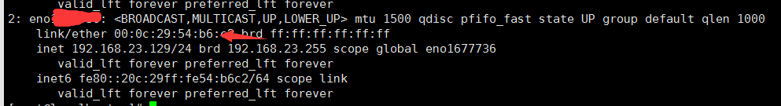

# Linux service network restart 重启网络失败

error 内容

Restarting network (via systemctl): Job for network.service failed because the control process exited with error code.
See “systemctl status network.service” and “journalctl -xe” for details. [失败]

出现这个错误一般都是 mac地址冲突

***\**\*第一检查这些配置ip地址等信息， 如果没有下面的配置则，新增。\*\**\***

1.  在 /etc/sysconfig/network-scripts/ifcfg-eno77文件里做如下配置
   TYPE=Ethernet # 网络类型为以太网
   BOOTPROTO=static # 手动分配ip
   DEVICE=eno77 # 网卡设备名，设备名一定要跟文件名一致
   ONBOOT=yes # 该网卡是否随网络服务启动
   IPADDR=192.168.0.60 # 该网卡ip地址 自己设置的 静态 static IP
   NETMASK=255.255.255.0 # 子网掩码
   GATEWAY=192.168.0.1 # 网关
   DNS1=8.8.8.8 # DNS，8.8.8.8为Google提供的免费DNS服务器的IP地址

2. 使用 ip addr 命令 查看 mac地址， link/ether 00:0c:29:54:b6:c2 红色箭头指定的位置 就是 mac 地址

3. 修改文件 /etc/sysconfig/network-scripts/ifcfg-eno77内容新增

   HWADDR=00:0c:29:54:b6:c2   这个就是 mac地址 ， 修改成自己的 mac地址

   然后执行下面命令

   service network restart 

   这个也需要执行，这个是开机就启动网络服务，如果不开启自己设置的 静态ip 就会发生变化，自己配置 的 /etc/sysconfig/network-scripts/ifcfg-eno77 文件就不会生效。

   Systemctl enable network