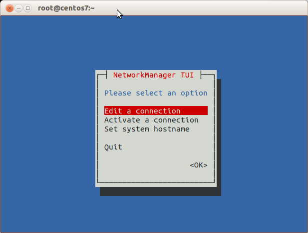
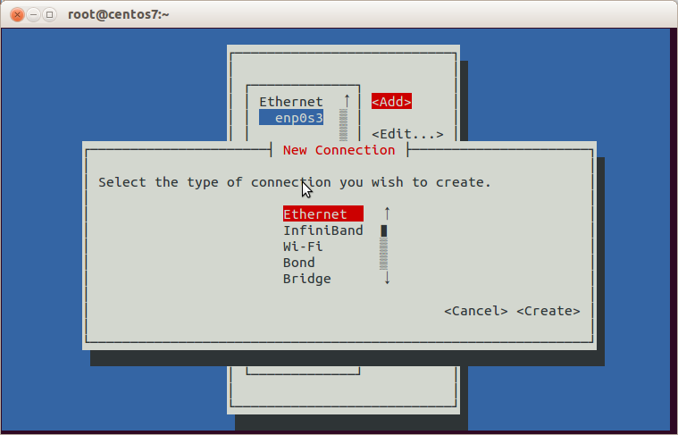
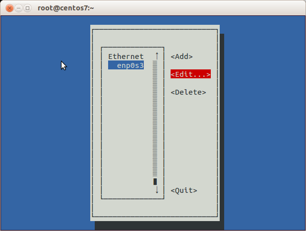
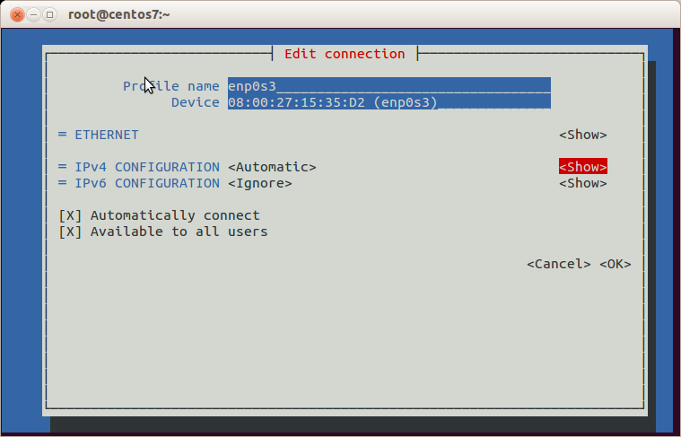
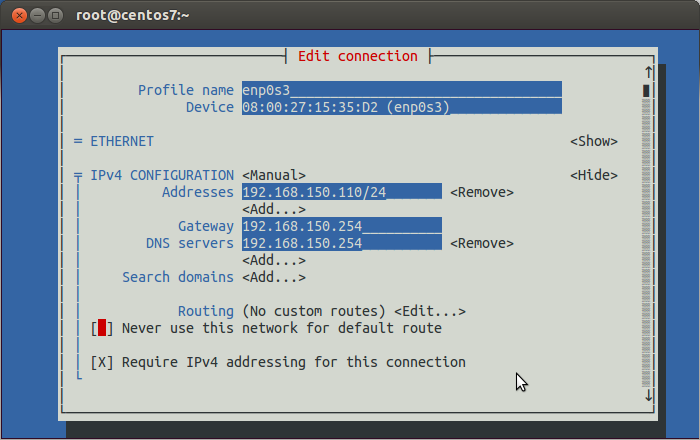
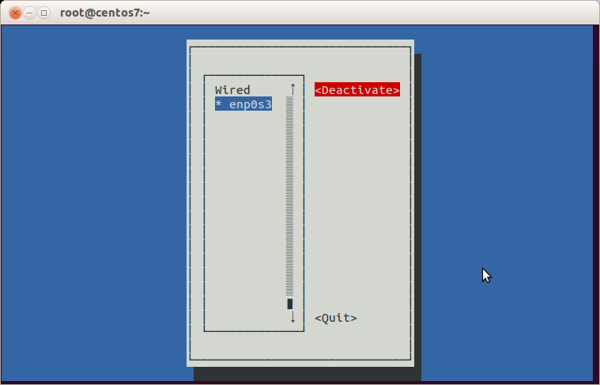
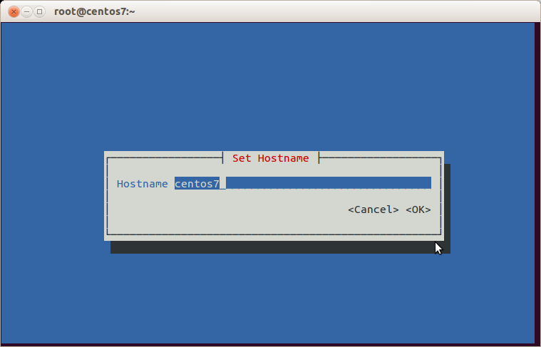
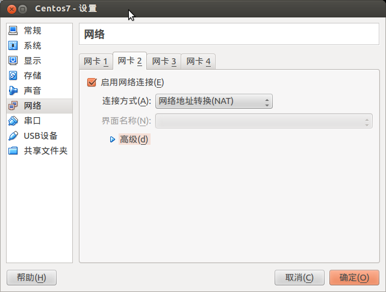
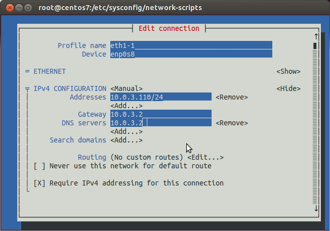

# centos 新的 网络管理命令

[Centos7系统配置上的变化（二）网络管理基础](https://www.cnblogs.com/panblack/p/Centos7-WhatsNew-02-networking.html)

### **一、ip ss指令替代 ifconfig route arp netstat**

#### **1、ip 指令入门**

ip [ OPTIONS ] OBJECT { COMMAND | help }  

OBJECT 和 COMMAND可以简写到一个字母

ip help    　　　　可以查到OBJECT列表和OPTIONS，简写 ip h

ip <OBJECT> help　　　查看针对该OBJECT的帮助，比如 ip addr help，简写 ip a h

ip addr   　　　　　查看网络接口地址，简写 ip a

##### 查看网络接口地址，替代ifconfig：

```
[root@centos7 ~]# ip addr
1: lo: <LOOPBACK,UP,LOWER_UP> mtu 65536 qdisc noqueue state UNKNOWN
    link/loopback 00:00:00:00:00:00 brd 00:00:00:00:00:00
    inet 127.0.0.1/8 scope host lo
       valid_lft forever preferred_lft forever
    inet6 ::1/128 scope host
       valid_lft forever preferred_lft forever
2: enp0s3: <BROADCAST,MULTICAST,UP,LOWER_UP> mtu 1500 qdisc pfifo_fast state UP qlen 1000
    link/ether 08:00:27:15:35:d2 brd ff:ff:ff:ff:ff:ff
    inet 192.168.150.110/24 brd 192.168.150.255 scope global enp0s3
       valid_lft forever preferred_lft forever
    inet6 fe80::a00:27ff:fe15:35d2/64 scope link
       valid_lft forever preferred_lft forever
[root@centos7 ~]# 
```

##### 网络接口统计信息

```
[root@centos7 ~]# ip -s link
1: lo: <LOOPBACK,UP,LOWER_UP> mtu 65536 qdisc noqueue state UNKNOWN mode DEFAULT
    link/loopback 00:00:00:00:00:00 brd 00:00:00:00:00:00
    RX: bytes  packets  errors  dropped overrun mcast   
    0          0        0       0       0       0      
    TX: bytes  packets  errors  dropped carrier collsns
    0          0        0       0       0       0      
2: enp0s3: <BROADCAST,MULTICAST,UP,LOWER_UP> mtu 1500 qdisc pfifo_fast state UP mode DEFAULT qlen 1000
    link/ether 08:00:27:15:35:d2 brd ff:ff:ff:ff:ff:ff
    RX: bytes  packets  errors  dropped overrun mcast   
    8135366    131454   0       0       0       456    
    TX: bytes  packets  errors  dropped carrier collsns
    646297     2441     0       0       0       0    
```


**2、ip route显示和设定路由**

**显示路由表**

```
[root@centos7 ~]# ip route show
default via 192.168.150.254 dev enp0s3  proto static  metric 1024
192.168.150.0/24 dev enp0s3  proto kernel  scope link  src 192.168.150.110 
```

太难看了，格式化一下（显示的是默认网关和局域网路由，两行的内容没有共通性）：

```
[root@centos7 tmp]# ip route show|column -t
default           via  192.168.150.254  dev    enp0s3  proto  static  metric  1024
192.168.150.0/24  dev  enp0s3           proto  kernel  scope  link    src     192.168.150.110
```


**添加静态路由**


```
[root@centos7 ~]# ip route add 10.15.150.0/24 via 192.168.150.253 dev enp0s3
[root@centos7 ~]#
[root@centos7 ~]# ip route show|column -t
default           via  192.168.150.254  dev    enp0s3  proto  static  metric  1024
10.15.150.0/24    via  192.168.150.253  dev    enp0s3  proto  static  metric  1
192.168.150.0/24  dev  enp0s3           proto  kernel  scope  link    src     192.168.150.110
[root@centos7 ~]#
[root@centos7 ~]# ping 10.15.150.1
PING 10.15.150.1 (10.15.150.1) 56(84) bytes of data.
64 bytes from 10.15.150.1: icmp_seq=1 ttl=63 time=1.77 ms
64 bytes from 10.15.150.1: icmp_seq=1 ttl=63 time=1.08 ms
64 bytes from 10.15.150.1: icmp_seq=1 ttl=63 time=1.57 ms
^C
```


删除静态路由只需要把 add 替换成 del，或者更简单的只写目标网络

```
[root@centos7 ~]# ip route del 10.15.150.0/24
```


**3、设置永久的静态路由**

ip route 指令对路由的修改不能保存，重启就没了。把 ip route 指令写到 /etc/rc.local 也是徒劳的。

RHEL7官网文档没有提到 /etc/sysconfig/static-routes，经测试此文件已经无效；

/etc/sysconfig/network 配置文件仅仅可以提供全局默认网关，语法同 Centos6 一样： GATEWAY=*<ip address>* ；

永久静态路由需要写到 /etc/sysconfig/network-scripts/route-*interface* 文件中，比如添加两条静态路由：

```
[root@centos7 ~]#echo "10.15.150.0/24 via 192.168.150.253 dev enp0s3" > /etc/sysconfig/network-scripts/route-enp0s3
[root@centos7 ~]#echo "10.25.250.0/24 via 192.168.150.253 dev enp0s3" >> /etc/sysconfig/network-scripts/route-enp0s3
```

注意第二条指令的重定向符号是 >> 。

重启计算机、或者重新启用设备enp0s3才能生效（指令：nmcli dev connect enp0s3 ）。

如果要清除永久静态路由，可以删除 ifcfg-enp0s3文件或者注释掉文件里的相应静态路由条目，重启计算机。想要让修改后的静态路由立即生效，只能用 **ip route del** 手工删除静态路由条目。

实验的过程中出现两个奇怪的现象：

1）有时候路由生效了但是在 ip route show 却没有显示，重启计算机后是肯定显示的，原因暂时不明。

2）存在多个网卡时，默认路由似乎是随机经由某个网卡设备。检查了所有连接配置文件后发现，第一网卡的默认连接配置文件 ifcfg-eth0 设置了GATEWAY0（此设置会覆盖/etc/sysconfig/network 定义的全局默认网关），第二网卡的连接配置文件 ifcfg-eth1 使用的是dhcp，会在启动时也分配默认网关，两个默认网关让计算机糊涂了。这是在测试系统里经常发生的现象，生产系统一般不会让网卡用dhcp，或者即使是用了也会仔细分配默认网关防止冲突。

其他需要注意的：

1）连接配置文件 ifcfg-* 里可以设置多个GATEWAY，一般第一个是 GATEWAY0，然后GATEWAY1, GATEWAY2... ，尾号最大的有效；

2）如果必须在/etc/sysconfig/network 文件定义全局网关，连接配置文件 ifcfg-* 就不要设置GATEWAY了，dhcp的连接要注意dhcp服务器不要定义默认网关。

3）ifcfg-enp0s3 文件改名为 ifcfg-eth0 后，route-enp0s3 文件也要改名为 route-eth0。

\#修改于2014-10-8 = = = = = = = = = = = = = = = = = = = = = = = = = = = = = = = = = = = = = = = =

 

**4、用 ip neighbour 代替 arp -n**

```
[root@centos7 ~]# ip nei
192.168.150.254 dev enp0s3 lladdr b8:a3:86:37:bd:f8 STALE
192.168.150.100 dev enp0s3 lladdr 90:b1:1c:94:a1:20 DELAY
192.168.150.253 dev enp0s3 lladdr 00:09:0f:85:86:b9 STALE
```

可以用 ip nei add 添加静态 arp 条目，ip nei delete 删除静态arp条目，见 http://www.cnblogs.com/lidp/archive/2009/12/02/1697480.html

 

**5、用ss 代替 netstat**
对应netstat -ant

```
[root@centos7 ~]# ss -ant
State       Recv-Q Send-Q   Local Address:Port     Peer Address:Port
LISTEN      0      100          127.0.0.1:25                  *:*     
LISTEN      0      128                  *:22                  *:*     
ESTAB       0      0      192.168.150.110:22    192.168.150.100:53233
LISTEN      0      100                ::1:25                 :::*     
LISTEN      0      128                 :::22                 :::*   
```

对应netstat -antp

```
[root@centos7 tmp]# ss -antp
State      Recv-Q Send-Q        Local Address:Port          Peer Address:Port
LISTEN     0      100               127.0.0.1:25                       *:*      
users:(("master",1817,13))
LISTEN     0      128                       *:22                       *:*      
users:(("sshd",1288,3))
ESTAB      0      0           192.168.150.110:22         192.168.150.100:59413  
users:(("sshd",2299,3))
LISTEN     0      100                     ::1:25                      :::*      
users:(("master",1817,14))
LISTEN     0      128                      :::22                      :::*      
users:(("sshd",1288,4))
[root@centos7 tmp]#
```


看着真的很别扭，不管多宽的终端屏，users:部分都会折到下一行，其实是在一行的。

格式化一下，内容整齐了，但是标题行串了：


```
[root@centos7 tmp]# ss -antp|column -t
State   Recv-Q  Send-Q  Local               Address:Port           Peer                        Address:Port
LISTEN  0       100     127.0.0.1:25        *:*                    users:(("master",1817,13))
LISTEN  0       128     *:22                *:*                    users:(("sshd",1288,3))
ESTAB   0       0       192.168.150.110:22  192.168.150.100:59413  users:(("sshd",2299,3))
LISTEN  0       100     ::1:25              :::*                   users:(("master",1817,14))
LISTEN  0       128     :::22               :::*                   users:(("sshd",1288,4))
```


**5、****网络配置文件:**
/etc/sysconfig/network  　说是全局设置，默认里面啥也没有，可以添加全局默认网关
/etc/hostname       　用nmtui修改hostname后，主机名保存在这里
/etc/resolv.conf     　　 保存DNS设置，不需要手工改，nmtui里面设置的DNS会出现在这里
/etc/sysconfig/network-scripts/　　　　　　　连接配置信息 ifcfg 文件
/etc/NetworkManager/system-connections/　 VPN、移动宽带、PPPoE连接

**6、旧的network脚本和ifcfg文件**
Centos7 开始，网络由 NetworkManager 服务负责管理，相对于旧的 /etc/init.d/network 脚本，NetworkManager是动态的、事件驱动的网络管理服务。旧的 /etc/init.d/network 以及 ifup，ifdown 等依然存在，但是处于备用状态，即：NetworkManager运行时，多数情况下这些脚本会调用NetworkManager去完成网络配置任务；NetworkManager么有运行时，这些脚本就按照老传统管理网络。这部分我们回头作为专题来搞搞。

```
[root@centos7 ~]# /etc/init.d/network start
Starting network (via systemctl):                          [  OK  ]
```

注意(via systemctl)，它的作用跟 systemctl restart network 一样的。


**二、nmtui配置基本网络连接**
nmtui 属于curses-based text user interface（文本用户界面)， 类似 Centos6 的 setup 工具，但只能编辑连接、启用/禁用连接、更改主机名。系统初装之后可以第一时间用nmtui配置网络，挺方便。
看图吧，功能跳转可以用 tab 键或光标键，用空格或回车执行。每个子功能完成了、退出了或取消了会直接回命令行（觉得不方便就试试 nmtui help，有直达的方法）。

在命令行运行 nmtui



添加连接，支持的连接很丰富啊，还有WiFi呢。但是vpn在哪？呵呵，nmtui目前还不支持。



编辑连接。



想编哪里就跳到哪里，如果不喜欢enp0s3这样的连接名，可以在Profile name处改掉，后面会说改名的好处。



注意，编辑复选框只能用空格



启用/禁用连接，远程连接的时候可以试试执行一下 <Deactivate>，然后以泪洗面吧。。。。



改主机名，改完后重启才有效，不想重启就回命令行执行 hostname <你的主机名> ，注销再登录就好了。



**三、nmcli和其他网络设置**
nmcli的功能要强大、复杂的多


```
[root@centos7 ~]# nmcli help
Usage: nmcli [OPTIONS] OBJECT { COMMAND | help }

OPTIONS
  -t[erse]                                   terse output
  -p[retty]                                  pretty output
  -m[ode] tabular|multiline                  output mode
  -f[ields] <field1,field2,...>|all|common   specify fields to output
  -e[scape] yes|no                           escape columns separators in values
  -n[ocheck]                                 don't check nmcli and NetworkManager versions
  -a[sk]                                     ask for missing parameters
  -w[ait] <seconds>                          set timeout waiting for finishing operations
  -v[ersion]                                 show program version
  -h[elp]                                    print this help

OBJECT
  g[eneral]       NetworkManager's general status and operations
  n[etworking]    overall networking control
  r[adio]         NetworkManager radio switches
  c[onnection]    NetworkManager's connections
  d[evice]        devices managed by NetworkManager
```


OBJECT和COMMAND可以用全称也可以用简称，最少可以只用一个字母，建议用头三个字母。OBJECT里面我们平时用的最多的就是connection和device，这里需要简单区分一下connection和device。

**device叫网络接口，是物理设备**
**connection是连接，偏重于逻辑设置**
**多个connection可以应用到同一个device，但同一时间只能启用其中一个connection。**
**这样的好处是针对一个网络接口，我们可以设置多个网络连接，比如静态IP和动态IP，再根据需要up相应的connection。**


上篇说了，/etc/udev/rules.d/70-persistent-net.rules 文件没有了，新添加的网卡NetworkManager自动识别。我们现在试试，给Virtualbox虚拟机增加第二块网卡，虚拟机启动后直接可以看到并且生效了。


```
[root@centos7 ~]# nmcli con show
NAME                UUID                                  TYPE            DEVICE
Wired connection 1  0c451785-b098-4c5c-994d-9107171b439d  802-3-ethernet  enp0s8
enp0s3              295e1841-0ff3-4db9-8800-4e25fc2944da  802-3-ethernet  enp0s3 
```

“Wired connection 1”是新增的网络连接，对应的网络接口叫enp0s8;
“enp0s3”是最初的网络连接，默认与网络接口同名。

我们可以用nmtui把两个连接改成我们熟悉的名字（nmcli也能，但比较麻烦哦）。改完了看看连接：

```
[root@centos7 ~]# nmcli con show
NAME  UUID                                  TYPE            DEVICE
eth1  0c451785-b098-4c5c-994d-9107171b439d  802-3-ethernet  enp0s8
eth0  295e1841-0ff3-4db9-8800-4e25fc2944da  802-3-ethernet  enp0s3
```

这样就舒服多了！

看看设备：


```
[root@centos7 ~]# nmcli dev show enp0s3
GENERAL.DEVICE:                         enp0s3
GENERAL.TYPE:                           ethernet
GENERAL.HWADDR:                         08:00:27:15:35:D2
GENERAL.MTU:                            1500
GENERAL.STATE:                          100 (connected)
GENERAL.CONNECTION:                     eth0
GENERAL.CON-PATH:                       /org/freedesktop/NetworkManager/ActiveConnection/4
WIRED-PROPERTIES.CARRIER:               on
IP4.ADDRESS[1]:                         ip = 192.168.150.110/24, gw = 192.168.150.254
IP4.DNS[1]:                             192.168.150.254
IP6.ADDRESS[1]:                         ip = fe80::a00:27ff:fe15:35d2/64, gw = ::
[root@centos7 ~]#
[root@centos7 ~]# nmcli dev show enp0s8
GENERAL.DEVICE:                         enp0s8
GENERAL.TYPE:                           ethernet
GENERAL.HWADDR:                         08:00:27:98:D1:B7
GENERAL.MTU:                            1500
GENERAL.STATE:                          100 (connected)
GENERAL.CONNECTION:                     eth1
GENERAL.CON-PATH:                       /org/freedesktop/NetworkManager/ActiveConnection/3
WIRED-PROPERTIES.CARRIER:               on
IP4.ADDRESS[1]:                         ip = 10.0.3.15/24, gw = 10.0.3.2
IP4.DNS[1]:                             10.0.3.2
IP6.ADDRESS[1]:                         ip = fe80::a00:27ff:fe98:d1b7/64, gw = ::
[root@centos7 ~]# 
```


但是试试用连接名查设备呢？

```
[root@centos7 ~]# nmcli dev show eth0
Error: Device 'eth0' not found.
```


用设备名查连接也是一样出错：

```
[root@centos7 ~]# nmcli con show enp0s3
Error: enp0s3 - no such connection profile.
```


这回能看清楚了吧？懂得了连接和设备的区别，在一些指令帮助里面有的参数需要connection，有的需要device，就不会糊涂了。

需要注意的是，enp0s3设备对应的连接名改为eth0，但对应的ifcfg文件并没有改名，我们改改试试，改之前先备份原配置文件到其他目录（注意，不能备份到network-scripts目录！）。


```
[root@centos7 network-scripts]# cat ifcfg-enp0s3
TYPE=Ethernet
BOOTPROTO=none
DEFROUTE=yes
IPV4_FAILURE_FATAL=no
IPV6INIT=no
IPV6_AUTOCONF=yes
IPV6_DEFROUTE=yes
IPV6_PEERDNS=yes
IPV6_PEERROUTES=yes
IPV6_FAILURE_FATAL=no
NAME=eth0
UUID=295e1841-0ff3-4db9-8800-4e25fc2944da
ONBOOT=yes
IPADDR0=192.168.150.110
PREFIX0=24
GATEWAY0=192.168.150.254
DNS1=192.168.150.254
HWADDR=08:00:27:15:35:D2
[root@centos7 network-scripts]#
[root@centos7 network-scripts]# cp ifcfg-enp0s3 /root/
[root@centos7 network-scripts]# mv ifcfg-enp0s3 ifcfg-eth0
[root@centos7 network-scripts]#
[root@centos7 network-scripts]# systemctl restart network
[root@centos7 network-scripts]# 
```


没有问题，配置文件改名成功，强迫症又一次胜利了，耶！
我们还可以看到，ifcfg-eth0里面没有参数指明设备enp0s3，唯一与设备enp0s3相对应的是MAC地址（HWADDR 08:00:27:15:35:D2）。

现在试试增加一个针对新网络接口enp0s8的连接，现有连接是 eth1：


```
[root@centos7 network-scripts]# cat ifcfg-eth1
HWADDR=08:00:27:98:D1:B7
TYPE=Ethernet
BOOTPROTO=dhcp
DEFROUTE=yes
PEERDNS=yes
PEERROUTES=yes
IPV4_FAILURE_FATAL=no
IPV6INIT=yes
IPV6_AUTOCONF=yes
IPV6_DEFROUTE=yes
IPV6_PEERDNS=yes
IPV6_PEERROUTES=yes
IPV6_FAILURE_FATAL=no
NAME=eth1
UUID=0c451785-b098-4c5c-994d-9107171b439d
ONBOOT=yes
```


嗯，是自动获得IP的。

我们新建一个连接eth1-1，分配固定IP，用nmtui可以很容易的建立



```
[root@centos7 ~]# nmcli con show
NAME    UUID                                  TYPE            DEVICE
eth1-1  ef5c3fbc-f07a-4d6e-9f4d-83f239ffc2e9  802-3-ethernet  --     
eth1    0c451785-b098-4c5c-994d-9107171b439d  802-3-ethernet  enp0s8
eth0    295e1841-0ff3-4db9-8800-4e25fc2944da  802-3-ethernet  enp0s3
只是增加了一个连接，其他的没有变化。
我们启动新连接 eth1-1
```


```
[root@centos7 ~]# nmcli con up eth1-1
Connection successfully activated (D-Bus active path: /org/freedesktop/NetworkManager/ActiveConnection/2)
[root@centos7 ~]#
[root@centos7 ~]# nmcli con show
NAME    UUID                                  TYPE            DEVICE
eth1-1  ef5c3fbc-f07a-4d6e-9f4d-83f239ffc2e9  802-3-ethernet  enp0s8
eth1    0c451785-b098-4c5c-994d-9107171b439d  802-3-ethernet  --     
eth0    295e1841-0ff3-4db9-8800-4e25fc2944da  802-3-ethernet  enp0s3
[root@centos7 ~]#
[root@centos7 ~]# nmcli -t -f IP4.ADDRESS dev show enp0s8
IP4.ADDRESS[1]:ip = 10.0.3.110/24, gw = 10.0.3.2
```


“nmcli -t -f IP4.ADDRESS dev show enp0s8” 是以脚本友好的方式显示网络接口信息。

现在可以很明显的看到，将连接eth1-1 up了之后，eth1-1占据了原来由eth1占据的DEVICE enp0s8，并且IP地址已经是指定的10.0.3.110/24 了。


```
[root@centos7 network-scripts]# cat ifcfg-eth1-1
TYPE=Ethernet
BOOTPROTO=none
IPADDR0=10.0.3.110
PREFIX0=24
GATEWAY0=10.0.3.2
DNS1=10.0.3.2
DEFROUTE=yes
IPV4_FAILURE_FATAL=no
IPV6INIT=no
NAME=eth1-1
UUID=ef5c3fbc-f07a-4d6e-9f4d-83f239ffc2e9
DEVICE=enp0s8
ONBOOT=yes
```


ifcfg-eth1-1 文件里没有HWADDR参数，但是多了一个DEVICE参数，等于enp0s8，你可以对比一下 ifcfg-eth1 看看区别在哪。
**连接的配置文件 ifcfg-\*，可以用 DEVICE 指定设备名，也可以用HWADDR指定设备的MAC地址，最终结果都一样的指向某个设备（网络接口）。**

我们再试试用nmcli增加连接:


```
[root@centos7 ~]# nmcli con add con-name eth1-2 ifname enp0s8 type ethernet ip4 10.0.3.120/24 gw4 10.0.3.2
Connection 'eth1-2' (468815f5-ce97-43bd-904a-3078e2e59fec) successfully added.
[root@centos7 ~]#
[root@centos7 ~]# nmcli con show
NAME    UUID                                  TYPE            DEVICE
eth1-1  ef5c3fbc-f07a-4d6e-9f4d-83f239ffc2e9  802-3-ethernet  enp0s8
eth1    0c451785-b098-4c5c-994d-9107171b439d  802-3-ethernet  --     
eth0    295e1841-0ff3-4db9-8800-4e25fc2944da  802-3-ethernet  enp0s3
eth1-2  468815f5-ce97-43bd-904a-3078e2e59fec  802-3-ethernet  --     
[root@centos7 ~]#
[root@centos7 ~]# nmcli con up eth1-2
Connection successfully activated (D-Bus active path: /org/freedesktop/NetworkManager/ActiveConnection/3)
[root@centos7 ~]#
[root@centos7 ~]# nmcli con show
NAME    UUID                                  TYPE            DEVICE
eth1-1  ef5c3fbc-f07a-4d6e-9f4d-83f239ffc2e9  802-3-ethernet  --     
eth1    0c451785-b098-4c5c-994d-9107171b439d  802-3-ethernet  --     
eth0    295e1841-0ff3-4db9-8800-4e25fc2944da  802-3-ethernet  enp0s3
eth1-2  468815f5-ce97-43bd-904a-3078e2e59fec  802-3-ethernet  enp0s8
[root@centos7 ~]#
[root@centos7 ~]# nmcli -t -f IP4.ADDRESS dev show enp0s8
IP4.ADDRESS[1]:ip = 10.0.3.120/24, gw = 10.0.3.2
[root@centos7 ~]# 
```


再看看新的ifcfg文件：


```
[root@centos7 network-scripts]# cat ifcfg-eth1-2
TYPE=Ethernet
BOOTPROTO=none
IPADDR0=10.0.3.120
PREFIX0=24
GATEWAY0=10.0.3.2
DEFROUTE=yes
IPV4_FAILURE_FATAL=no
IPV6INIT=yes
IPV6_AUTOCONF=yes
IPV6_DEFROUTE=yes
IPV6_PEERDNS=yes
IPV6_PEERROUTES=yes
IPV6_FAILURE_FATAL=no
NAME=eth1-2
UUID=468815f5-ce97-43bd-904a-3078e2e59fec
DEVICE=enp0s8
ONBOOT=yes
[root@centos7 network-scripts]# 
```


现在up的连接是eth1-2，网络接口enp0s8的IP是10.0.3.120
如果重新up连接eth1-1，nmcli con up eth1-1，网络接口enp0s8的IP变成了10.0.3.110
如果重新up连接eth1， nmcli con up eth1， 网络接口enp0s8的IP就回到原来自动获得的值10.0.3.15

**所以，对一个网络接口设置不同的连接，可以快速的切换不同的网络配置，这个真的满厉害的。**
**如果希望系统重启后仅up某个特定连接，那么可以把其他连接配置文件的ONBOOT=no，\**ONBOOT=no\**的连接也可以随时up。**　　#添加于2014-10-8

**编辑连接**
用nmtui编辑连接后，ifcfg文件也会有相应的改动；手工修改ifcfg后，nmtui中也能看到。
但是，不论用nmtui还是直接修改ifcfg文件，想让新的配置生效，我们需要load连接配置文件并重新up连接。

举例，我们编辑ifcfg-eth1-1，把IP改为10.0.3.111，然后执行nmcli con reload 或 nmcli con load /etc/sysconfig/network-scripts/ifcfg-eth1-1
结果如下：


```
[root@centos7 ~]# nmcli con load /etc/sysconfig/network-scripts/ifcfg-eth1-1
[root@centos7 ~]# nmcli con up eth1-1
Connection successfully activated (D-Bus active path: /org/freedesktop/NetworkManager/ActiveConnection/2)
[root@centos7 ~]# ip addr show enp0s8
3: enp0s8: <BROADCAST,MULTICAST,UP,LOWER_UP> mtu 1500 qdisc pfifo_fast state UP qlen 1000
    link/ether 08:00:27:98:d1:b7 brd ff:ff:ff:ff:ff:ff
    inet 10.0.3.111/24 brd 10.0.3.255 scope global enp0s8
       valid_lft forever preferred_lft forever
    inet6 fe80::a00:27ff:fe98:d1b7/64 scope link
       valid_lft forever preferred_lft forever
[root@centos7 ~]# 
```


新的IP地址生效了。

 


BONUS：如果有物理WLAN，nmcli能查看wifi，瞅瞅来，好玩吧？（示例来自nmcli-examples(5) man page，指令： man 5 nmcli-examples）


```
$ nmcli device wifi list

           *  SSID               MODE    CHAN  RATE     SIGNAL  BARS  SECURITY
              netdatacomm_local  Infra   6     54 MB/s  37      ▂▄__  WEP
           *  F1                 Infra   11    54 MB/s  98      ▂▄▆█  WPA1
              LoremCorp          Infra   1     54 MB/s  62      ▂▄▆_  WPA2 802.1X
              Internet           Infra   6     54 MB/s  29      ▂___  WPA1
              HPB110a.F2672A     Ad-Hoc  6     54 MB/s  22      ▂___  --
```


鉴于很多基本配置可以用nmtui做，而且往往设置一次就够了，nmcli命令行其他强大功能等用的时候再查吧，这里不多讲了。